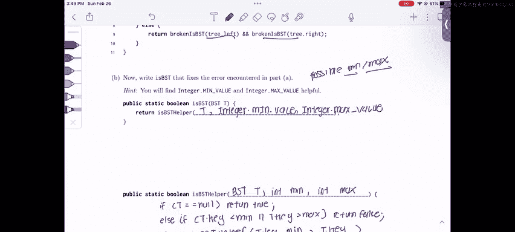

# 数据结构：P34：Spring 2023 考试第7级问题3 - 这是二叉搜索树吗？ 🌳


在本节中，我们将学习如何判断一棵二叉树是否为二叉搜索树。我们将分析一个存在缺陷的验证函数，理解其错误所在，并最终编写一个正确的版本。

## 概述

本节课我们将要学习如何正确验证二叉搜索树。首先，我们会分析一个常见的错误实现，然后学习如何通过追踪最小值和最大值边界来修复它，从而确保整棵树都满足BST的性质。

## 分析有缺陷的函数

上一节我们介绍了BST的基本概念，本节中我们来看看题目中给出的有问题的 `isBST` 函数。

一个二叉搜索树有两个主要性质：
1.  对于任意节点，其**左子树**中的所有节点值都**小于**该节点的值。
2.  对于任意节点，其**右子树**中的所有节点值都**大于**该节点的值。

这些性质赋予了BST高效的搜索能力。

让我们查看这个有缺陷的函数：
```java
public static boolean isBST(TreeNode t) {
    if (t == null) {
        return true;
    }
    if (t.left != null && t.left.val > t.val) {
        return false;
    }
    if (t.right != null && t.right.val < t.val) {
        return false;
    }
    return isBST(t.left) && isBST(t.right);
}
```
这个函数采用递归方式：
*   **基准情况1**：如果树为空（`null`），则返回 `true`。
*   **基准情况2 & 3**：如果当前节点的左子节点值大于当前节点，或右子节点值小于当前节点，则立即返回 `false`。
*   **递归情况**：递归检查左子树和右子树，并返回两者的逻辑与结果。

这个函数看似合理，但它只检查了每个节点与其**直接子节点**的关系。这会导致问题。

## 理解函数的缺陷

为了理解问题所在，我们来看一个具体的例子。

考虑以下二叉树：
```
        10
       /  \
      5    15
     / \
    3   12
```
这**不是**一个有效的BST，因为节点 `12`（在节点 `5` 的右子树中）的值 `12` 大于其祖先节点 `10`。根据BST定义，节点 `10` 左子树中的所有节点都必须小于 `10`。

然而，有缺陷的函数会错误地判断它为BST：
1.  检查根节点 `10`：左子节点 `5` < 10，右子节点 `15` > 10，通过。
2.  递归检查右子树 `15`：无子节点，通过。
3.  递归检查左子树 `5`：左子节点 `3` < 5，右子节点 `12` > 5，通过。

因此，函数返回 `true`。问题的根源在于，函数没有追踪从根节点到当前节点的路径上所允许的**值范围**。

## 编写正确的验证函数

上一节我们指出了原函数的问题在于缺乏全局范围约束，本节中我们来看看如何通过一个辅助函数来追踪最小值和最大值边界。

我们需要一个递归辅助函数，它在遍历时携带当前节点允许的**最小值**和**最大值**边界。

以下是正确的实现思路：
1.  主函数 `isBST` 初始化边界为负无穷（`Integer.MIN_VALUE`）和正无穷（`Integer.MAX_VALUE`），并调用辅助函数。
2.  辅助函数 `isBSTHelper` 接收当前节点 `t`、当前允许的最小值 `min` 和最大值 `max`。
3.  如果节点为 `null`，返回 `true`。
4.  如果当前节点的值 `t.key` 不在 `(min, max)` 区间内，则违反BST规则，返回 `false`。
5.  递归检查左子树时，**最大值**更新为当前节点的值 `t.key`，最小值不变。
6.  递归检查右子树时，**最小值**更新为当前节点的值 `t.key`，最大值不变。

以下是实现代码：
```java
public static boolean isBST(TreeNode t) {
    // 主函数：初始化边界为整型最小和最大值，调用辅助函数
    return isBSTHelper(t, Integer.MIN_VALUE, Integer.MAX_VALUE);
}

private static boolean isBSTHelper(TreeNode t, int min, int max) {
    // 基准情况：空树是有效的BST
    if (t == null) {
        return true;
    }
    // 检查当前节点值是否在允许的(min, max)范围内
    if (t.key <= min || t.key >= max) {
        return false;
    }
    // 递归检查左子树和右子树，并更新边界
    // 左子树的所有节点必须小于当前节点值(t.key)
    // 右子树的所有节点必须大于当前节点值(t.key)
    return isBSTHelper(t.left, min, t.key) && isBSTHelper(t.right, t.key, max);
}
```
**关键点解释**：
*   对于左子树的递归调用 `isBSTHelper(t.left, min, t.key)`：`t.key` 成为了新的**最大值**边界。
*   对于右子树的递归调用 `isBSTHelper(t.right, t.key, max)`：`t.key` 成为了新的**最小值**边界。
*   条件 `t.key <= min || t.key >= max` 使用了 `<=` 和 `>=`，这确保了BST中不允许有重复值（通常定义如此）。如果允许重复值，则需根据具体定义调整。

## 本周考试技巧 💡

在处理需要编写代码的BST问题时，请记住以下模式：
*   你几乎总是会使用一个在左子树和右子树上进行递归的函数。
*   常见的结构是：一个主函数搭配一个真正执行递归操作的辅助函数，辅助函数通常携带额外的状态信息（如本例中的 `min` 和 `max`）。

## 总结



本节课中我们一起学习了如何正确验证二叉搜索树。我们首先分析了一个只检查父子节点关系的常见错误实现，然后通过引入一个递归辅助函数来追踪每个节点允许的值范围（最小值和最大值），从而修复了该错误。掌握这种携带边界信息的递归模式，对于解决许多BST相关问题至关重要。