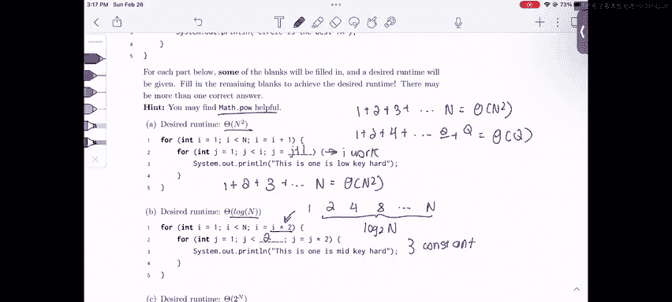

# UCB《数据结构discussion和lab｜CS 61B data structure sp 2024》中英字幕（豆包翻译 - P35：2 - Spring 2023 Exam-Level 07 Problem 1.zh_en - GPT中英字幕课程资源 - BV1i1421x7wC

Everyone， this is Sherry and this is the spring 2023 exam level 7 walkthrough in this video I'll be going over problem one。

 finish the runtimes。In this problem， it's kind of a reversal of our normal asmp productsotics problem because we're given a function that we have to fill in and we're given the runtime so instead of determining the runtime we already have the runtime and we just have to engineer this function to achieve the desired runtime。

And one important thing to know is that we're given that we should probably use MathDoc H more。

 so let's just keep that in mind while we're doing the problem。

And the last thing before we jump in is I just want to remind everyone of the two sums that we should know in this class。

 the first is the arithbetic sum， which just states that if we add all the numbers up until n。

 it is state of n squared so if you have1 plus2 plus all the way up to n。

That's going to be theta n squared。And the other sum that we need to know is the geometric sum。

 which states that if we double each time。All the way up to some number  Q it's going to be theta of  Q and the reason I didn't use n here is because our geometric sum can apply to any last term so for example if the last term is 2 to the n this would be theta of2 to the n and if this was n squared this would be theta of n squared。

So it's just a theta of whatever the last term is。That's all the context that we really need for this problem。

 so let's just start with part A。In this part we're given this theta of n squared and so we know that our arithmetic sum is theta of n squared so is there a way we can engineer this to just do our arithmetic sum well our outer loop goes one。

2，3 all the way up to n and I is incrementing by one each time so。

Let's just figure out how much work the inner loop is doing we have j equals1 and j equals all the way up to I so if we just increment J by1 each time each inner loop will do I work。

And that gives us exactly exactly the sum we want if we sum up all the work across the inner loops。

 the first loop is going to do one work， the next inner loop is going to do two iterations。

 the next inner loop is going to do three iterations。

 all the way up to the last inner loop is going to do about n iterations。

 so this is going to be theta of n squared。And that's exactly our desired runtime。

Cool so that's it for part A， now let's move on to part B and here our desired runtime is log N。

And if we look at this outer loop。Kind of already achieves the log n runtime because we're doubling I each time this I is going to go one and then it's going to go2 and then it's go4 and it's going to go8 and then it's going to go up to n and how many iterations is this this is log2 n iterations because we're doubling I each time So if we just consider the outer loop。

 we've already achieved our desired runtime。That tells us that our inner loop must do constant work because if it doesn't do constant work。

 our runtime is not going to be the same as the runtime of the outer loop。

But if we have constant work in the loop， then our total work is going to be something like C log2 n where C is a constant and this is just going to be theta log n。

So we're just going to pick some arbitrary constant for this inner loop and let's just say two。

And if we do two， then our runtime is going to be2 log to n。

 which is exactly theta of login like we wanted。Okay， now let's move on to C and D。

 which are a little bit harder。 So for part C， we want a runtime of2 to the N。

And this is not like directly any of the sums that we know。

 but if we remember from here our geometric sum it's just theta of the last term。

 so maybe we want something that looks like this。And this would be theta of 2 to the n。

How do we achieve that Well our inner loop is going from I equals 1 all the way up to n so this is going to go I equals 1 to all the way up to n minus1 n and if you look at these this isn't very helpful if we just like incr this isn't very helpful。

Just by looking at directly， if we like sum these up or something。

 but if we use these as exponents in our geometric sum。

 this is actually exactly the pattern that we want right if we have two to the I work in the inner loop each time this gives us two to the zero plus 2 to the1 plus 2 to the two plus2 to the n minus1 plus 2 to the n and we're using I as the exponent instead of the actual sum term itself。

So if we look at this， that's exactly going to be theta of 2 to the n， which is our desired runtime。

So how do we make。I the exponent instead of a sum in the term Well instead of doing maybe like J's less than I like we did here。

 we just put I in the exponent and this is where the math power comes in because we're putting I in the exponent so we need to have I as a power so we're going to do math。

Dot how。Two to the eye。呃。We're going to do Js lesson2 to the I and the code for this would be math。

Pow。To eye。And again， that gives us exactly our desired runtime because each loop we're going to do two to the I work。

 so 2 to the  zero plus2 to the 1 plus dot dot dot2 to the n， and this is theta of2 to the n。

 like our geometric sum says。Okay， now let's move on to the hardest one。

 which is part D here we want an end to the cubed runtime。

And so how do we get an n cubed runtime Well we notice that our inner loop is going up to n times n。

 which is n squared， So let's just write something and let's write that J increments by one each time。

 so this inner loop。Is going to do n squared work per iteration。Of the outer loop。

So now to get theta of N squt and cubed， we want to multiply。Theta of n times n squared。

 right we want our outer loop to do n total iterations so that our total runtime is n cubed And how do we get this to do n iterations。

 though， Because we're multiplying I by a2 each time。 So if those I plus equals one。

 we could just do I' is less than n and they'll do exactly n iterations。

But since I is being doubled each time， in order to get to n iterations。

 we need I to stop at2 to the n because I is going to go one，2， four， eight。

 all the way up to two to the n， and this is going to be n iterations。So again。

 we have to stop at 2 to the n， so we're going to put 2 to the n here and the code for this would be Mada P to n。

And this give us n iterations on the outer loop and n squared iterations per inner loop。

 so this is going to be n cubed total。That's it for this problem and here's my weekly exam tip for any kind of these like nested for loops。

 you always just want to think about the inner loop and the outer loop and remember these two sums。

 the arithmetic and the geometric and as long as you keep those in mind you should be able to do normal asymptotics problems and the reverse engineering type。

