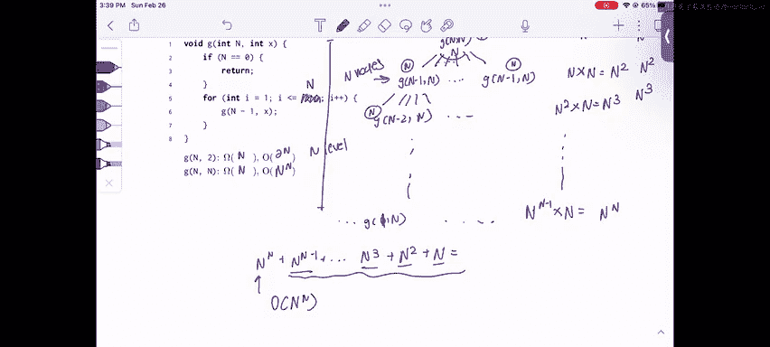

# UCB《数据结构discussion和lab｜CS 61B data structure sp 2024》中英字幕（豆包翻译 - P36：3 - Spring 2023 Exam-Level 07 Problem 2.zh_en - GPT中英字幕课程资源 - BV1i1421x7wC

Hi everyone， this is Sherry and this is the spring 2023 exam level7 walkthrough in this video I'll be going over problem two asymptotics is fun and in this problem we'll just be doing a bunch of recursive asymptotics and we'll be analyzing both the best and worst case runtimes。

So。Before we jump in， I just want to remind everyone of the four main steps for recursive asymptotics。

The first step is that we draw out a recursive tree。And then we write the work per node。

 and then we write the work per level， and then we sum across all the nodes。

 all the levels to get the total work of the recursive function。So。

This might not make a lot of sense now， but if we just do a couple problems。

 I think you'll start to see the workflow。So let's immediately just jump into part A where we're given this function G of Nx and it recursively calls itself in this loop。

 and something important to know is that the first argument just decreases by one each time。

 but the second argument is based on the value of I in this loop。

 so each recursive call is going to have a different value of I。

So the first call that we're given is this G of n1 and what does this look like well we're going to call g of n1 and then we're going to call g of n minus2 sorry n minus11 and this loop is going to run until I is less than or equal to1 so which means it's only going to run once so this is going to call G of n minus21 and all the way at the bottom of the tree we're going to call G equals01 and then we're going to stop because our stopping condition is when equals zero。

So。How let's just go through the steps for our recursion analyzing recursive asymptotics and just figure out how much work this function is doing for this one's a little bit easier because we just have like a straight linear tree down so there's not really any branching but let's still do the steps so now that we've drawn a recursive tree we're going to do the work per node and how much is the work per node the way you analyze the work per node for recursive functions is you kind of block out the recursive coal and analyze how much work the rest of the function is doing。

In this case。X is one， so this loop is going to run ones。

 which is a constant amount of work and of course this if statement is also a constant amount of work。

 so the total work is going to be constant， so I'm just going to write one as a representation that the work is constant and that's the work per note。

And of course， since there's only one node per level， this is also the work per level。

And last thing we need to figure out is just the number of levels。

 so there's n levels because we go n and minus1 all the way down to zero。

 and so the total work is going to be n times1， which is theta of n。So in this case。

 this is just the event。Okay， the next part is a little bit more complicated because now our x is2。

 and so we're going to be making two recursive calls with different eye values each time。

What this looks like is we're going to start with G of N2 again。

But this time we're going to make two recursive calls because we're going to do two iterations of this loop。

So the first recursive call is going to go g of n minus11。

 and the next one is going to go G of n minus12 because our i value is actually the argument to our next recursive call。

And。I'm just going to expand the side the rice branch of the tree。 and we'll see why in a second。

 So if I expand this branch， this is going to go G of n minus21。

 and this is going to go G of n minus。Two two and let's just expand one more level for this。

 this is going to be g of n minus31 and g of n minus32。And if we look at this。

 this might seem really complicated to analyze because for each of these we have like a whole linear branch going down and then we also have an unequaled number of branches on each side。

 so how do we really analyze this？Well， what we're going to do is we're going to use what we learn from part the first part with G of N1。

 we know that this is linear in the first argument， so if we call G of。Q1。

 this is going to do theta of Q work。So if we just start by writing the work per node。

The work for note again， is actually constant。For all of these。

 because there's going to do two iterations and there's going to be a if statement。The work per node。

 if we kind of like coalesce this entire call this like long recursive chain down into one single node。

This is going to be theta of n。Because like we said here， if we call it with the argument access one。

 this whole long thing is just a linear work。So this is going to do n minus1 work。

 this is going to do n minus2 work， this is going to do n minus3 work。And so on。

Now let's do the next step which is the work per level。

 so in the first level we're doing one work that's tend negligible so let's just ignore that in the next layer we're doing n minus1 plus1 work which is n minus which is n total work in the next level we're doing n minus2 plus1 work which is n minus1。

And next level we're going to end up doing n minus3 plus1， which is n minus2。

 and so we start to see a pattern here If we sum up the work across all the levels。

 that's just going to be n plus n minus1 plus n minus2 plus all the way down to the bottom level。

 which is going to do one work。And so what is this sum， well。

 this is our arithmetic sum that we've seen many times in this class。

 and what this sums up to is theta of n squared。So if we do this。😊。

It's just going to be theta of n squared and again。

 the trick for this problem is that instead of writing out this whole long like linear chain of calls all the way down to G of 01。

 we just coalesce this entire thing into one node and use will be learned from the first part。

To say that it does linear work。Okay。😊，Now let's move on to part B。

 where we have to analyze not only the best case， but also not only the worst case。

 but also the best case and in this part， the water than best case might actually differ because we have this function f of x。

 which returns some random number between1 and x。And the other change that we've made here is that instead of calling it with I。

 we just call it with x， so in this case the second argument is actually not going to change。So。诶。

Clearly， the best case is when F of x returns one， right？If we do this。

 we just have our first case here where there's absolutely no branching it's just。

A bunch of linear calls all the way down the tree and since we already analyze this。

 we don't need to reanalyze it， this is just theta of n。

 this is omega of n because it's just a chain of linear calls each with constant work。

So it doesn't matter what the second argument is， whether it's2 or n， because in the best case。

 F of x is just always one， and we're just going to have linear work。Okay， now for the second case。

 this is a little bit harder。 So when the second argument is two in the worst case。

 F of x is always going to return to and this is going to cause us to branch a law and go off in different directions。

 and we won't just have like a linear chain of calls。 So when F of x is2。

Let's just write this so we're going to call G of n2 and this loop is going to go twice。

 so we're going to call G of n minus12 G of n minus12 and then we're going to assume that f of x keeps returning to forever。

 so the next layer each of these is going to make two recursive calls。

And then if we go all the way to the bottom of the tree。

 there's going to be a bunch of calls to G of02 just very spread out at the bottom。

 there's going to be a ton of calls on this bottom layer because every layer it kind of doubles。

So now let's do the next thing and let's figure out the work per node and again the way we do this is we just kind of like ignore the recursive call and analyze the rest of the function and the rest of the function is just doing a loop two times and checking an if statement which is still constant so the work per node is actually still constant which is nice so let me just write that and it's constant constant constant constant constant。

Quote and now the next thing we need to do is we need to figure out the work per level so there's going to be one work on this level because we have one call there's going to be two on this level。

 there's going to be four on this level and then all the way at the bottom there's going to be some amount of work but we don't really know yet because we're not super sure how many nodes are on this bottom level。

 but if we look at this。We can say that the first level。

 we can rewrite this as two to the zero and the next level we can write this as two to the1。

 and the next level we can write this as two squared。

So if we just figure out the number of levels in the tree and we figure out what the pattern is。

 we should be able to figure out how much work is on the bottom level。So for the number of levels。

 there's going to be n levels in this tree， right because it goes from n to n minus1 to n minus 2 all the way down to zero。

And so if we notice that the number of note， the amount of work is doubling per layer。

 and if we have n total layers at the very last layer， there's going to be two to the end work。

So if we look at this and now we just need to sum up the work across all the levels。

 which is two to the0 plus two to the 1 plus two to2 plus2 to3 plus dot dot dot2 to the n。

And this is our geometric sum， and it's just theta of the last term。

 so this is going to be theta of 2 to the n。And so our worst case is 2 to the n because again。

 we have this recursive tree that has n levels and the amount of work doubles per level。Okay。

 now let's move on to the final case， which is when we have G of n and n as so n is both of the arguments。

So we have G of n N and this is going to make a lot of recursive calls in the worst case。

 right because if we assume that f of x always returns n。

 then this loop is going to go n times and it's going to make n recursive calls each time。So。😊。

This is going to make even this first call is going to make a bunch of recursive calls and it's going to make a bunch of recursive calls to G of n minus1 n and g of n minus1 n。

And then each of these nodes， each of these n nodes is going to make a bunch of recursive calls to G of n minus2 n。

And then all the way at the bottom of the tree， again， we have G of。

Z and that's when the recursion terminates because we reach our base case。

So to analyze this tree we can do something similar to what we did for the last case in this case it's actually a little bit more complicated because instead of having constant work per node we actually have N work because we're doing this loop n times so we have N work here。

 we have N work here， we have N work here， we have N work here N work here。

And now we have to figure out the number of levels in this tree and the work per level。

So the work on the first level， if we just sum this up， is going to be n。

The work on the second level is going to be n times the number of nodes on this level and how many nodes are on this level well here we're branching by a factor of n this is making n recursive calls so there's going to be n nodes each of doing n work。

 so this is going to be n squared。And now on the next level， how many nodes are there。

 well there's going to be n squared nodes because each of these n nodes on this level。

It's going to make n recursive calls， so there's going to be a total of n squared nodes and each doing n work。

 so this is going to be n cubed。And then all the way on the bottom， we have。

A certain number of nodes times n work per node。And again。

There's n levels in this tree right because the first argument is decreasing by one each time and since we decrease by one each time。

This is just going to keep decreasing all the way until you reach the bottom of the tree。

 and there's going to be n levels。 And at the very bottom。

Of our tree this let's write the bottom level of a tree as one actually because the n equals zero case doesn't do any work because it won't reach the for loop So if if we consider like last level that actually does work that's going to be the level where n is equal to one and there's going to be a certain number of nodes here how many nodes are there going to be well if we notice the number of nodes is being multiplied by factor of n each time right because every node is going to branch off into n recursive calls so at our very bottom level we're going to have n to the so at the first level there's n to the one nodes。

At the second level， there's n squared at third level。

 there's n to the cube and so at the very bottom level at the n level。

 there's going to be n to the n minus one nodes。And。

If we sum up if we just multiply by end work per node， this is going to do end to the end work total。

And so if we sum this up， we're going to get n to the n plus n to the n minus1 plus dot dot dot n cubed plus n squared plus n work。

And what is this sum well actually？😮，If we just look at this。

 we can kind of ignore the lower order terms because this term is definitely going to dominate when we have exponentials。

 this is kind of like the geometric sum except it's even more extreme each time because we're multiplying by a factor of n。

So if we just ignore these lower order terms， our runtime is actually going to be O of n to the n。

And so our worst case runtime is end to the N。That's it for this problem。

 this is definitely a very hard problem but if you just keep in mind the four kind of steps that I taught you about recursive asymptotics。

 the first step you just find the work per node， then you find the work per level。

 then you find the number of levels and you sum across all the levels and then you have your final result and you should do that for every single recursive asymptotics problem and you should be able to find the runtime of any of them。

Good luck。In the rest of 601B， and if you have any comments or questions。

 please feel free to leave them below。

