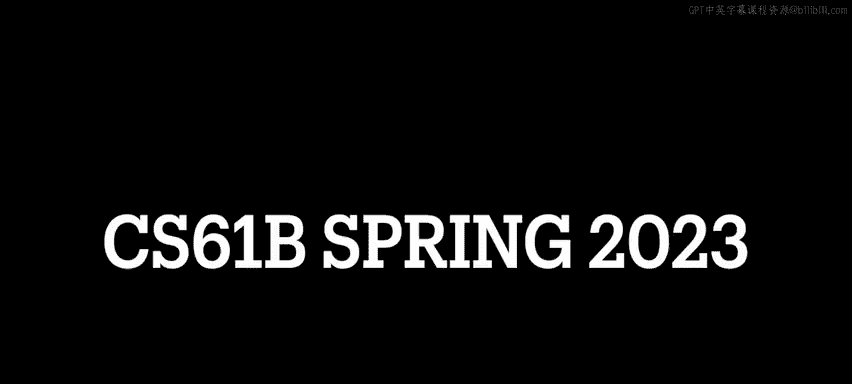
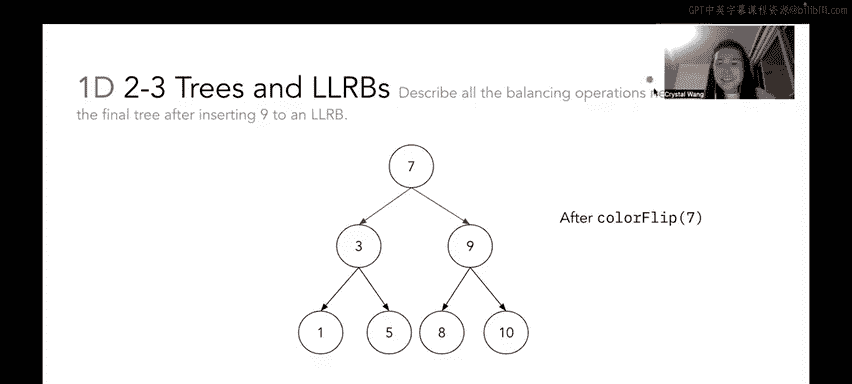

# UCB《数据结构discussion和lab｜CS 61B data structure sp 2024》中英字幕（豆包翻译 - P38：2 - Spring 2023 Discussion 08 Question 1.zh_en - GPT中英字幕课程资源 - BV1i1421x7wC

🎼阿兵阿兵。🎼Oh。

Okay so let's just jump right into the worksheet I've defaulted to using the slides here because I think they're way cleaner than and way faster than you watching me draw some trees like really badly and then erasing them to reflect the changes so hopefully you'd follow along the slides and feel free to pause at any time if you like didn't catch a change to happen but in part A we're given this two。

3 tree and we want to know what it would look like after we insert 18 38。

 1213 and 20 okay so as a friendly reminder when we insert into a 23 tree we always insert elements as leaves or parts of a leaf multinode。

😊，So that means that when we insert 18， we're going go to the root first and then traverse through this two3 tree until we hit a leaf that would preserve like the search structure of the two3 tree so basically we're going to take 18 we're going to look at 8 and see that okay 18 is greater than 8 so I know that if I'm going to insert 18 into my two。

3 tree I'm going to be inserting it into the right subtree and once again I come down here 14 is not a leaf。

 18 is greater than 14 cool so I'm going to come down to the right subchild because I know that if I'm going to add 18 iss going to be in the right subtree of the 14 subtree and then finally I get to 15 I see oh。

 15 is a leaf or it's a leaf node so I'll just tack myself on to this 15 node and' make get a multinode。

So after we insert 18， here's what our multi nodeode looks like and we don't really need to push anything up yet because we are still fulfilling all the invariance of our two。

3 trees AKA we have at most two elements per multi node and three children per multi nodeode， okay。

So next， if we insert 38 we're going to repeat that same process where we compare 38 to 8 and then keep traversing down until we hit the appropriate spot and try to tack on 38 to a leaf node and when that happens we know that 38 is like larger than8 it's larger than 14 and then we hit a leaf node over here so we're going to try to add 38 like right here。

However， we're running into a problem now because we know that because this is a23 tree。

 we can't have more than two elements per node right so what we're going to do here is we're going to push up the 18 it's the middle element right so we're going to push up the 18 to its parent node and basically tack 18 onto the parent node so what that's going to look like after we push it up is we have 18。

As part of the multi node with 14 it's the right part of the multi node。

 and you see that we've rebalanced the children here。 So what we did here is we bumped 18 up to。

This node next to 14 and so the middle child of the 1418 multi node became 15 and the right child of the 1418 multi node became 38 so that's kind of how we delineated the split okay。

And then we stop here because once again we are happy because we are meeting all the criteria for2，3。

3 great so what happens is when we insert 12 Okay， so we're going to do the same thing come to our 8 okay then 12 is greater than 8 so we're going to come down here and I'd like to stop here but I can't because we have to insert elements as a leaf node right so I'm going to see that 12 is less than 14 cool I'm going to come down to the 10 and see okay 10 is。

😊，By itself， it's a leaf， I'm just going to tack 12 on do this 10 node。こol。Great。Okay。

 so now what happens when we insert 13 if we follow the same process and then we traverse the tree down to the leaf again。

 we are going to see that 13 fits in nicely with this multi nodeode over here。

 so we're going to try to talk in 13 but once again we run into an issue where we can't have more than two elements per multinode right so we're going to try to do here is we are going to try to push up the middle node so when we push up the 12 it's going to join this multi nodeode with 14 and 18 but that's going to result in another invariant of 2。

3 trees being broken right so here we have this 121418 it's a node with three elements we can't have that and also we can't have four children per multinode right we have these four separate children down here so once again we need to recursively keep pushing up。

The middle child until we like rebalance our 233 basically so what we're going to do is we're going to look at our node over here with three elements in it and we're going to push up the 14 to join8 up here so after this 14 is going to become part of this 814 multinode and we have to rebalance the children so because 14 now joined 8 as part of this two element multin up here the middle child of the 814 multinode is going to be this 12 subree and then the right child of the 814 multinode is going to be this 18 subree over here so you'll notice that after we pushed up the 14 up to join the eight we split this node in half basically you'll see that 12 and 18 are not connected anymore。

Okay and then once again yay happiness we don't we aren't breaking any invariance right now and then finally we want to know what this tree will look like after we insert 20 so once again we're going follow the process we're going to traverse through this root node over here we're going to see that 20 is greater than 14 so we're going to come down to the right child of the multin and see that 20 is larger than 18 so we're going to come down here to the right child again great 36 is sorry 38 is a leaf node let's tack on 20 to be part of this multin with 38 and that's what that's going to look like and that's our final two3 tree。

😊，对。Okay， now in part B， we want to convert the resulting23 tree that we created in a part A to that should say left leaving a red black tree not a red black tree。

 but like we specifically want an LRB So the way that I like to approach these kinds of questions and you totally like don't have to do it one way I'm just doing it how I would。

Write it on an exam like intuitively is that I like to start by taking all of my multi nodes and drawing those out first in the LRB components。

 so what I mean by that is remember that in a two， three tree in a multi node when we're trying to represent a multi node。

😊，As an LB in an LLRB format， we say that the right element of the multi nodeode is the parent of the left element and the multi nodeode and they are connected by a leftleaing red link so in the example of 8 and 14 up here we see that 14 has a left red link to the child8 and likewise over here in this multi nodeode we'd see that6 is the parent of four and they're connected by a left leaning red link and 38 is the parent of 20 connected by a left leaning red link so I like to draw these out first just because they help me orient myself when I'm trying to make connections to the rest of the tree。

So what that's going to look like is over here I drew out all my red links first right with the multi nodes and because I drew out all of my red links first that means all of the rest of the links in my resulting LLRB should be black links right because red links are only representative of multi nodes in my underlying two3 tree and because we got all the multi nodes out of the way we don't have to worry about what's red and what's block anywhere because it'll just be black right Okay cool so now this we have to build up the rest of our tree with black links。

😊，And。Remember that an LLRB should follow the construct of a BST it should follow the properties of a BST right so everything to the left of a root should have a value lesser than that of the root everything greater to the right of a root should have should have a value greater than that of the root so I like to start here with leaves so let's take this left child sub childild for example。

 we already dealt with six and the four and we know that three is less than four so the three is going to be a left child of four connected by a black link and then five is going to be a right black child of four note that it can't be a left child of six because we already have a left child from six to four right so we know that five has to be a right black child of four。

And then seven has to be a right。Has to be a right。

Black child of six so I remember when I was first learning about LRBs and two，3 tree conversions。

 I was like wait a second hold up， isn't seven technically also like less than8。

 Can we just draw a black left link from eight to seven so。Like in theory。

 that would help us that would help us with our BST constraints， but then you're like wait a second。

 there should be a connection from 8 to 6 so you can't stick 7 in between the8 and the7 right because we know that seven is a right is is a right child of six So the only possible place where we can put seven is as a right blacklink child of six So the seven is going go right here and then we're going to finish off this left subte by adding a black link black left leaning link from8 to6 because this is just a normal link in the tree right It's not a multi node。

Likewise， if we felt the rest of our LORB， we will see that。

When we chop up this when we chop up this multi nodeode this 12 is going to become a this 12 subte is going to become a right subtree of the8 node over here so basically like once again we ran into the same dilemma of like wait a second 12 is technically between 8 and 14 but because8 is the left child of 14 here 12 has to be in the right position of8 so basically we're going to take this subree and then we're going to draw a right black link from 8 to 12 and then 12's left and right children also have black links to 10 and 13 right because these aren't multi nodeodes so we don't really need to worry about that and then lastly we'll deal with this the right subree over here and so we know that the right the right blacklink of 14 is going to lead to this 18 subree。

And then so this is going to be a right black link to 18 and then 18s。😊。

Right yeah 18s right child is going to be this 36 I don't know why I keep saying 36 I mean 38 is going to point to 38 right because it's this multi node with 38 and 20 and its left blacklink is going to point to 15 so what that looks like altogether after we filled industry is an LRB like this。

Okay so on part C this is more of a conceptual check than anything so if a 2。

3 tree has depth H that is the leaves are at distance H from the root。

 what is the maximum number of comparisons done in the corresponding red black tree to find whether a certain key is present in the tree and then when we say corresponding red black tree we really mean corresponding left leaning red black tree because a23 tree has a one to one correspondingence with an LLRB right so。

😊，Let's break this down into two parts。 So first of all。

 we need to talk about the fact that this is special because it's a two3 tree。 So in a2，3 tree。

 each node can be a multi node right it can contain up to two elements。

 So at the very worst we have two elements per node in our two3 tree right So that means at each level of our tree as we traverse from root to leaf we're making maximum we're making maximum two comparisons right so that's the first part of it the second part of it is that this tree has depth H and basically that means that there are h edges from the long in the longest path from the root to the leaf Okay so that means that。

We will get through H levels of our tree plus one comparison。

What I mean by that is you can do like let's think about this in the most trivial case。

 let's say we only have a multi nodeode with two elements okay and that' that's it that's our whole23 tree it's just the root with two elements that technically has depth zero right but we had to make two comparisons anyway to find out if our key was in our tree because at level zero even though the height of our tree was0。

 we still have to make comparisons with the root right so effectively what you're doing here is given that the number of edges aka the depth of the tree is H you have to account for the fact that there are leaf nodes and there are root nodes right so effectively what we're doing is we're making two comparisons times H plus one like levels we have to consider from root and leaf inclusive。

So if you don't believe me， you can draw it out， I promise I promise i'm not spewing lies。

 but I think the example that I just brought up where the depth is zero because the leaves are at a distance zero from the root because if it's just trivially the two。

 three tree is just the root， then we are kind of。Then we only make two comparisons， right。

 we're not making zero comparisons。Okay， cool。U yeah， and that's it for 1C。

And then let's move on to 1 D。In 1 D， we have this nice LLRB and we want to describe all the balancing operations that are necessary to make the final tree an LLRB like an actual balanced LLRB that obeys all of the rules after we insert nine。

😊，If we were to insert nine into this tree， like once again we treat insertion in an LRB much in the same way as we treat insertion in a BST right so we come over here to the root。

 we see that9 is greater than7 so we know that nine is going to end up in the right subree of  seven。

 we go over here to 10，9 is less than 10 so we come down to the left subtree of 10 because we know that we should insert9 and the left subree of 10 and then we see okay9 is greater than eight is a leaf cool so now we want to tack on9 as a leaf to an LRB。

something that's really important to remember I didn't really go through this in detail in in the content slides and then if you're like curious as to why this is。

 you can see Josh's slides， but remember that whenever we insert a leaf into sorry yeah whenever we insert an element as a leaf in an LLRB we connect that leaf to its parent with a red link so that means that when we add nine initially we're going to have a right leaning red link connecting eight to9 okay so now I hope alarm bells are kind of going off in your head because this looks very funky to me this doesn't look like a balanced LRB to me and this's because remember in an LRB all of our red link should be left leaning right so we can't。

We can't have nine be the right redlink child of eight so in order to combat this we need to get this link to straighten now right we need this link to straighten out to the left so that the red link is leaning left so what we're going to do here is an operation called rotate left and we're going to call it on eight and what this is going to do is that it's going to take this eight node and then it's going to shift the eight down to the left and make9 the parent of eight so basically you can kind of think about rotate left as it's going to swap。

It's going to swap the parent the parent child relationship here so that it's on the left instead so now when we rotate left on eight that's going to make nine the node here and nine's left child is eight so let me just like go back so you can see that again previously we had eight was the left red child of 10 and the nine was the right red child of eight but we can't have a right leaning redly so when we call rotate left on eight that's going to put eight as the left。

Left gleaing redly childil of nine， which we have made into the left child of tech。Okay。However。

 once again， this doesn't look quite right to me because we can't have remember in our LLRB invariance。

 we can't have two left leaning consecutive red links right we need to fix this otherwise our tree becomes unbalanced and if you think about it in terms of a two。

3 tree this would be like representative if we had like a temporary node with three elements in it right you can draw this out if you' like I'm not going to get into the nitty gritty details of here。

 but just just keep in mind that two， three trees and LLRBs because they have a one to one correspondence you can kind of think of like all the balancing operations that we need to do to a two3 tree as representative in an LLRB balancing operation or rotation operation and vice versa。

Anyways， so when we come down here we see that we have two consecutive left red links so now what we need to do is we need to rotate right so what do we rotate right on well we should rotate right on 10 because what we want is for 10 to come down to the right and for10's left child become to become the parent of 10 so what that's going to look like after we call rotate right on 10 is that10 is going to become the right child of nine eight is going to stay the left child of nine and then nine is going to come up here to be the right child of seven and what that's going to look like is we are going to get this subree over here。

😊，Where nine is now the right child of seven and then nine has a left red link to eight and a right red link to 10 so I'm going to go back so we can see this again when we call rotate right on 10 that basically rotates the 10 down to the right。

 so we reverse the parent child operation of 10 and8 so that sorry10 and9 so that nine is now the parent of 10 and they're connected by a red link。

Okay。No。One more time there's something a little bit funky here because this still seems to me like it's a temporary three node this this like subte with nine that has a red link to8 and a red link to 10 this seems like it's trying to overtuff a node right because we can't have more than two elements in the same multi node and a two3 tree right so we need to bounce this LRB。

And how we do this is with an operation called color F and color Flip helps us get rid of the fact that a node has two red links to its children。

😊，So what that looks like is when we call color flip on nine that's going to flip the color of all links that touch nine so that means that we're going to flip the color of this link from black to red and we're going to flip the color from these links from nine to its children from red to black so after we call color fliplip on nine that's going to give us a tree that looks like this。

😊，And maybe if you were observing very carefully you'll notice hey wait a second this looks a lot like the case that we just had we're not allowed to have two red children right like seven up here we can't have that so once again we actually do need to call color flip again and we're going to flip the colors of all of the links touching seven so when we call color flip on seven we're going to flip these two red links。

😊，To become black。And this is going to be the final resulting LLRB。

Maybe when I was writing this were maybe this wasn't like the super best example I could have chosen because the resulting LRB and the end actually has no red links but hopefully you can logic out like how we got here and how it might look different in a different tree and see that this is actually a totally legitimate LLRV even though it doesn't have red linkss it just looks like a normal BST to us right and one more thing I wanted to bring up before closing on this question is that you'll notice that when we inserted nine and we needed to do that that initial rotate left that cascaded into a need for us to do a rotate right which cascaded into a need for us to do a color flip which cascaded into a need for us to do another color flip so let's a really really interesting and cool and recursive property of like a balancing operations and the rotation operations that we do on two three trees and LLRBs respectively and that these cases can cascade down into each other we kind of recursively take care of these cases because they kind of like fall down and waterfall effect。

to each other and I that's it for1D， yeah， that's a cool question， I hope you enjoyed that。

