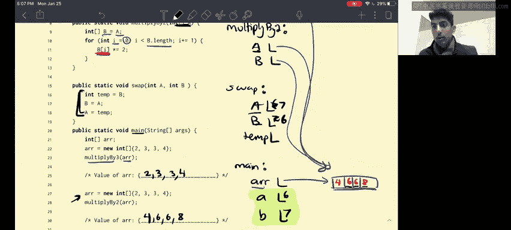

# UCB《数据结构discussion和lab｜CS 61B data structure sp 2024》中英字幕（豆包翻译 - P3：1 - Scope： Quik Maths.zh_en - GPT中英字幕课程资源 - BV1i1421x7wC

Hi everyone， let's give me you a video walkthrough on question two on CS62B Spring 2021 Ex pre worksheet week two。

So quick preface， this question is very similar to the problem before。😊，And what that means is。

If you guys did the question before and you guys felt pretty comfortable about it。

 you guys can feel free to skip this one。 though it is good practice。

 And I'm also going to go a bit quicker on this。😊，Explanation and a little less in depth as I did on the previous one。

 just because it is a bit repetitive。😊，But without further ado， let's dive in。

What would the contents of the array be after being run through these functions in the main method。

 and this has been taken from fall 16 midterm1。Cool， so very similar as the previous problem。

 we have three function calls and we just want to see what happens when we execute them。😊。

So first thing that we do in the main method is we create this array。ok。😊。

So unlike the previous problem， this array is an array， it's not an object right。

 but when we think about in terms of code， we represent arrays in the same manner that we represent objects。

With pointers。So we're going to have a pointer。Okay， so the value of R is the address at which this。

Oh wrong， this。 This already lives in memory。Next thing that we're going to do is when we call multiply by3 or。

We're going to set。This a， the a in the scope of multiply by 3 to be equal to R。Right。

And the value of R is the address at which this array lives in memory。 So we will set the value of。

A up here to be that address pictorially， we will represent that as an arrow。Nice。

So now what we're going to be doing is we're going to iterate。Through each element， in a。

If you guys aren't familiar with this， this is called an enhanced Oil loop。喂。😊。

And what it does is that x will be equal to each element in this array。So what's important here is X。

Is going to be assigned to each value here。Okay， I'll say that maybe in a different light。

 we're basically setting x equal to each element in this array。So when I do x is equal to x times 3。

We're not actually mutating the array。 All that we're doing is changing the value of this x variable。

 Okay， but this x variable isn't actually what's in the array。

 X is just set equal to each element of the array。 It's not actually that specific element of the array。

😊，O。In other words， for the first。Multiply by three， we're not actually changing R at all。

 R is exactly the same。😊，And then the value of R will still be two， three， three， four。Cool。

 so moving on to the next part。We create R or we just reset it now it's still 2334。

 and then we call multiply by2。So when we call multiply by two， we're setting the a。Equal to R。

 So what that's doing is now they both point。To the same array in memory。

 And then we said B equal to a。 So now everyone's pointing here， right。

The next thing that we're going to be doing is we're iterating。Through each index。

In the range from 0 up till， but not including the length。 Okay。

 so what is basically doing through the indices of B。 Then we're accessing the element。

At that given index and we're multiplying it by two。So this indeed changes。This array。

And how does it change， Well， we multiply each element by two。So it becomes four， six， six， eight。

And the reason this time it's different than the previous time is that B of I。

Is the element at index I， right？ On the other hand， from the previous part。

 what x is is x will be equal to B of 0， right， then x will be equal to B of 1。😊。

What we notice here is that x isn't actually B of 1 is just set equal to B of1。

 and a B of1 is a number， X is just a number and has no association with the array。😊，Rightice， so。

We can see here。This will be 4， six，6，8。And for this last part right here。

 I'm going to go through it a little quickly just because I spent a while in the previous question talking about this。

😊，When we execute swap of A B， what we're doing is we're setting。

A and B in the swap method equal to the values of 6 and 7 respectively， right。

 So when we do a swap in this swap method， what's important is that it doesn't impact the scope of the main method。

 right。The swap that we do here， right， doesn't actually impact the values of A And B in the main method。

And what we can deduce is that A and B stay the same。So there'll be six and seven and。Yes。

 that is all for this problem， I hope you guys enjoyed this walkthrough video。

