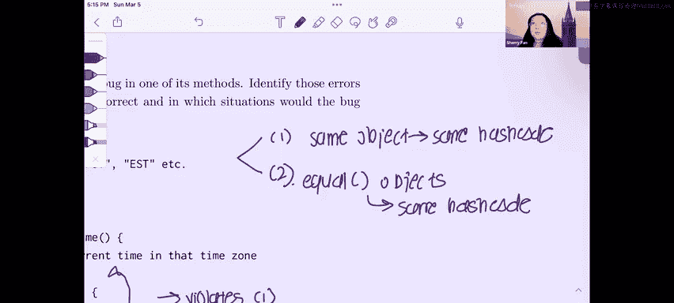

# 数据结构：P41：Spring 2023 考试第8级问题3解析

## 概述
在本节中，我们将学习如何判断哈希码函数是否有效。我们将通过分析两个具体的类及其哈希码实现，来理解有效哈希码必须遵守的两条核心规则。

## 有效哈希码的核心规则
在判断哈希码是否有效时，需要牢记以下两条基本规则：
1.  **一致性**：同一个对象必须始终返回相同的哈希码。
2.  **等值性**：如果两个对象通过 `.equals()` 方法判断为相等，那么它们必须返回相同的哈希码。

## 问题分析：TimeZoneOne 类
上一节我们介绍了有效哈希码的两条核心规则。本节中，我们来看看第一个类 `TimeZoneOne` 的哈希码实现。

`TimeZoneOne` 类的 `hashCode` 方法返回当前时间。具体来说，它调用了 `currentTime()` 方法，该方法返回当前时区的时间。

这个实现违反了**规则一（一致性）**。因为同一个对象在不同时间调用 `hashCode()` 方法，可能会返回不同的值（时间在变化）。哈希码必须基于对象的内部状态，且对于不可变对象，其哈希码在生命周期内应保持不变。

## 问题分析：Course 类
接下来，我们分析第二个类 `Course`。这个例子违反了另一条规则。

`Course` 类的 `hashCode` 是 `yearOffered`（开设年份）和 `courseCode`（课程代码）的组合。然而，它的 `.equals()` 方法**只比较了 `courseCode`**。

以下是导致问题的场景：
*   假设有两个 `Course` 对象：
    *   对象 A：`courseCode = 5`， `yearOffered = 2001`
    *   对象 B：`courseCode = 5`， `yearOffered = 2002`
*   根据 `.equals()` 方法（仅比较 `courseCode`），这两个对象是相等的。
*   但是，它们的哈希码计算如下：
    *   对象 A 的哈希码：`2001 + 5`
    *   对象 B 的哈希码：`2002 + 5`
*   显然，两个哈希码不相等。

这违反了**规则二（等值性）**：通过 `.equals()` 判断相等的两个对象，必须具有相同的哈希码。

## 总结
本节课中，我们一起学习了判断哈希码有效性的方法。我们分析了两个无效的哈希码实现：
1.  `TimeZoneOne` 类因其哈希码随时间变化，违反了**一致性**规则。
2.  `Course` 类因其 `.equals()` 方法与 `hashCode()` 方法所依赖的属性不一致，导致相等对象可能拥有不同哈希码，违反了**等值性**规则。

**核心技巧**：解决此类问题时，只需严格对照上述两条规则，仔细检查 `hashCode()` 方法的实现逻辑以及它与 `.equals()` 方法的关系，即可判断其有效性。