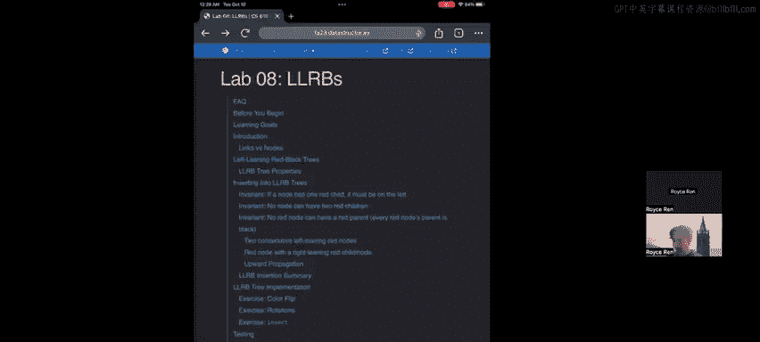
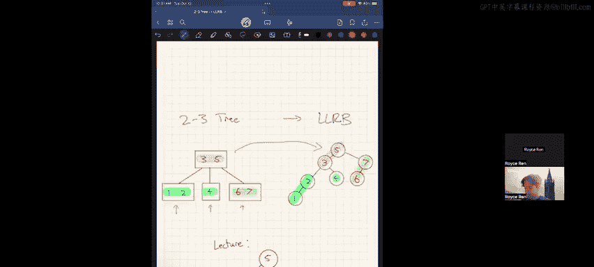
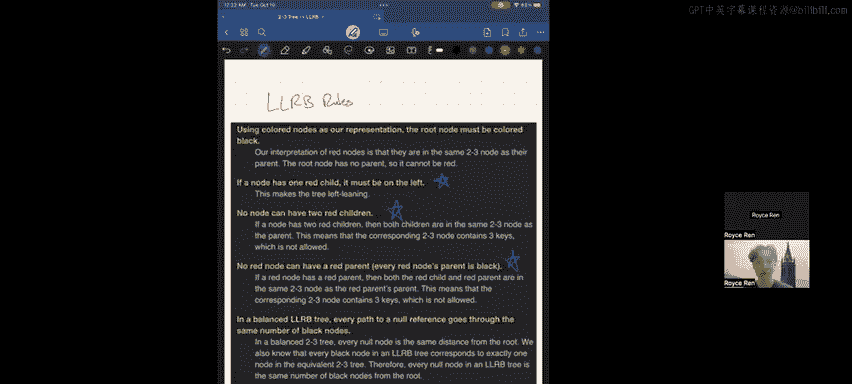
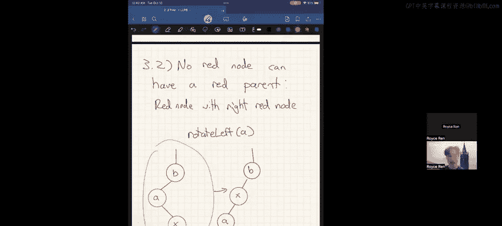

# 数据结构：Lab08：左倾红黑树 (LLRB) 实现指南 🌳

在本教程中，我们将学习如何实现左倾红黑树的核心再平衡操作。我们将从理解其理论基础——2-3树开始，然后详细探讨LLRB必须遵守的规则，以及当插入操作违反这些规则时，如何通过旋转和颜色翻转来修复树的结构。

## 从2-3树到左倾红黑树 🔄

上一节我们介绍了课程概述，本节中我们来看看LLRB的理论基础。左倾红黑树可以看作是2-3树的一种特定表示形式。理解2-3树对于掌握LLRB至关重要。

2-3树是一种B树，其中每个节点可以包含1个或2个值，并相应地拥有2个或3个子节点。其结构遵循二叉搜索树的原则：小于左值的元素进入左子树，介于两个值之间的元素进入中间子树，大于右值的元素进入右子树。2-3树的关键特性是所有叶子节点到根节点的距离相同，这保证了**O(log n)**的搜索和插入性能，避免了普通BST可能退化为**O(n)**的链状结构。

然而，2-3树的实现较为复杂。左倾红黑树提供了一种更易实现的二叉树形式来模拟2-3树。转换规则如下：对于2-3树中的每个3-节点（包含两个值的节点），我们将其拆分为两个二叉节点。较大的值成为一个黑色节点，较小的值则成为该黑色节点的**红色左子节点**。这就是“左倾”名称的由来。

需要说明的是，本实验中使用“红色节点”的概念，而在课程讲座中可能使用“红色链接”。两者本质等价，将红色链接指向的节点视为红色节点更易于代码实现。每个2-3树都唯一对应一个LLRB。

## LLRB的核心规则 📜

上一节我们了解了LLRB的起源，本节中我们来看看维持其平衡性质必须遵守的具体规则。这些规则确保了树近似平衡。

以下是LLRB必须满足的规则，其中标星（*）的规则是我们插入节点时需要重点检查和维护的：
1.  每个节点非红即黑。
2.  根节点始终为黑色。*
3.  红色节点不能有红色父节点（即没有两个连续的红色节点）。*
4.  从任意节点到其所有后代叶子节点的路径包含相同数量的黑色节点。
5.  如果一个节点只有一个红色子节点，那么这个子节点必须是左子节点。*
6.  空叶子节点（null）被视为黑色。

当插入新节点（**新插入的节点总是红色**）导致违反上述标星规则时，我们需要通过一系列局部调整（旋转和颜色翻转）来修复树，使其重新满足所有规则。

## 旋转操作详解 🔁

在深入具体的违规案例之前，我们需要掌握修复工具：旋转操作。旋转是调整二叉树局部结构而不破坏BST性质（左小右大）的基本操作。

主要有两种旋转：右旋和左旋。我们可以通过两个关键步骤来理解旋转：
1.  将当前节点“推”向下方的子节点方向。
2.  将那个子节点“提”到当前节点的位置。

以对节点D进行**右旋**为例：
*   **步骤1**：将D节点向下推至其**左子节点B的右侧**。
*   **步骤2**：将B节点向上提升到原来D的位置。

在旋转过程中，还需要注意B节点原有右子树的处理。它需要被重新连接到新的父节点D上。旋转后，参与旋转的两个节点（本例中的B和D）的颜色需要交换。左旋是对称的操作。

## 规则违反案例及修复方案 🛠️

现在，我们将结合插入过程，逐一分析最常见的规则违反情况及其修复方法。假设我们总是从一个合法的LLRB开始，然后插入一个新的红色节点。

以下是插入后可能遇到的三种主要违规场景及修复策略：

**场景一：红色右子节点（违反规则5）**
当在一个黑色节点A的右侧插入红色节点X时，会形成“红色右子节点”，这违反了左倾原则。
*   **修复方法**：对节点A进行**左旋**。旋转后，原来的子节点X上升，原来的父节点A下降并成为X的左子节点，同时交换A和X的颜色。

**场景二：节点有两个红色子节点（违反规则3的潜在状态）**
当一个黑色节点B已经有一个红色左子节点A，此时又在B的右侧插入红色节点X，则B拥有了两个红色子节点。
*   **修复方法**：对节点B进行**颜色翻转**。将B的颜色由黑变红，同时将其两个子节点A和X的颜色由红变黑。节点位置保持不变。

**场景三：红色节点有红色父节点（违反规则3）**
这是最复杂的情况，有两个子场景。
*   **子场景A（左左红色）**：在红色节点A的左侧插入红色节点X，导致X和A连续为红色。
    1.  首先，对A的父节点（黑色节点B）进行**右旋**。B下降为A的右子节点，A上升。旋转后交换B和A的颜色。
    2.  此时，新上升的节点A（现为黑色）拥有了两个红色子节点（B和X），这回到了**场景二**。因此需要对A进行**颜色翻转**。
*   **子场景B（左右红色）**：在红色节点A的右侧插入红色节点X，导致X和A连续为红色。
    1.  首先，对红色节点A进行**左旋**。A下降为X的左子节点，X上升。颜色不变（因为都是红色）。
    2.  旋转后，形成了**子场景A（左左红色）** 的状态。接着按子场景A的步骤处理：对X的父节点B进行右旋，然后进行颜色翻转。

## 总结 📝

本节课中我们一起学习了左倾红黑树的核心实现逻辑。我们从其对应的2-3树结构出发，理解了LLRB的五条核心规则。重点在于，当插入新节点破坏这些规则时，我们需要通过**左旋**、**右旋**和**颜色翻转**这三种操作来局部调整树结构，使其恢复平衡。整个修复过程是递归或迭代进行的，从插入点向上回溯，直至根节点。掌握这些案例的识别与修复，是完成本次实验的关键。请仔细思考每种情况是如何发生的，以及相应的修复步骤如何将其转化为合法状态。