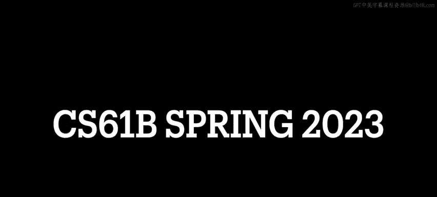
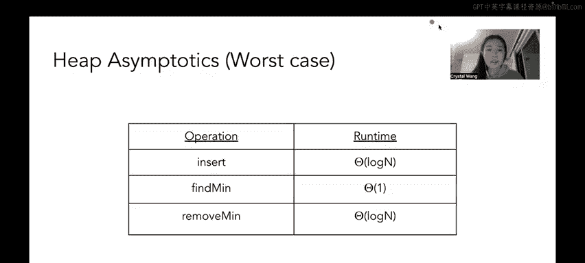

# UCB《数据结构discussion和lab｜CS 61B data structure sp 2024》中英字幕（豆包翻译 - P45：1 - Spring 2023 Discussion 09 Content Review.zh_en - GPT中英字幕课程资源 - BV1i1421x7wC

🎼发明发明。🎼Ba比。

🎼And。🎼Yeah。Hello everyone and welcome to CS6 UN&V Spring 2023's Walkthrough of discussion number nine。

 which is about graphs and Heaps。First off， some quick announcements。

 the week8 survey is due on Monday， March 13th， lab 9 is due on Friday the 17th and lab 9 is not like a real or it's not like a lab with like a typical assignment it's going to be a checkpoint assignment for Project 2 B just to make sure that you understand the spec homework three which is a grade scope assignment that will give you instant feedback when you submit your answers is due on Monday March 13th it is mostly midterm review to help you just get some practice before the exam speaking of the midterm midterm two is on Thursday。

 the 16th from 7 to 9 pm there's a big post about it on Ed you can read more Lo6 there and lastly Project2 B itself is due on Friday March 24th which is the day before spring break starts。

😊，Okay。So let's jump right into some content we have quite a bit to cover today so first off we'd like to talk a little bit about trees so in discussion seven you saw BSTs and at discussion eight you saw LLRVs and two three trees and we never really talked deeply about what trees are but here we're going to formally define them so trees are structures that follow a few basic rules number one。

 if there are end nodes there are n minus one edges and edges are just kind of like arrows or paths kind of between two node。

😊，Number two， there is exactly one path from root to every other node and number three。

 the above two rules means that trees are fully connected and contain no cycles and a cycle is basically just a description of when nodes have more than one path to each other so let's say I have like three nodes and if all of them are connected then I could get from this node to that node to that node back up to this node up here。

 which means that it could go in a cycle forever。So we won't get like too deeply into more about what trees are you can talk like you'll probably be doing proofs in it if you take like 70 or 170 so I'll leave that for them to explain so a parent node points towards its child the root of a tree is a node with no parent nodes and the leaf of a tree is a node with no child node so as an example this node here would be the parent node of this child node over here right we see this arrow that points from the parent to the child the root of a this tree over here would be this this node for example it doesn't have any parent nodes right there's no incoming arrows to this node and lastly an example of leaves in this tree would be like this node this node or this node where theres these node at the bottom of the tree themselves do not have any children okay。

So。Trees are a specific kind of graph which we'll define here so graphs more generally allow cycles simple graphs don't allow parallel edges which is means two or more edges connecting to this connecting the same two nodes or self edges and you won't see like a node have an edge to itself that's in a complex graph like again in 601 B we only deal with simple graphs complex graphs are more the territory of like 17070 and like other passes beyond and lastly in this class we talk about graphs we about yeah we talk about graphs in either a directed or undirected context so either there are arrows or no arrows on their edges okay so the important thing here to know about edges and directedness is that directness tells us if a particular edge is a one way type of situation in the sense that in the example over here you see that this edge has an error。

So this is telling you that there is an edge from this node to this node over here。

 but there is not an edge going from this node to this node back up there the alternative to that would be like in the graph like here。

😊，We' see this node has an undirected edge to this node over here so this node has an edge back to this node so you can kind of think about undirected edges being like a twoway street and directed edges being kind of like a one- way street okay so as a quick check how would we describe each of these graphs in terms of directedness and cycles so is this graph directed well I do see that its edges have arrows so they're pointing in a particular direction so it is directed and I don't see any cycles I don't see any path from which I could take don don't see any like path that I could follow between nodes such that I'd end up in the same spot that I started at right because these edges are connected I can't go to this node and then come back because this node directly goes to this one but this one doesn't necessarily go back to this one up here right？

This one。Is an interesting example because it's directed right Each of the edges has an arrow so they specify a direction in which the edge is going and it's also has cycles we can see a cycle right here right if we go from here to here here to here here to here we can go in this like loop forever right this next one over here is undirected and it also has cycles so the interesting thing you'll see here is that there's no arrows so we can kind of treat these these edges as kind of like a twoway street so we can make a cycle this way or a cycle that way like clockwise or counterclockwise right。

😊，And lastly you'll see here that this graph is also has cycles and it is undirected and this one is interesting because it has a cell loop again we won't talk about graphs like this where like this is an example of a complex graph graph that has parallel edges and a cell loop we don't really talked about those in this class but it's just like an interesting thing to note okay。

😊，So。Next up， let's talk a little bit about graph representation so I just want to like cave out this here with graph representations are not in scope for midterm 2。

 they're in scope for like the larger class like 61 B in general but not specifically for midterm term so I'm going to kind of speed through this section a little bit so when we talk about graph representation we either use adjacency lists or adjacency matrices usually usually so adjacency lists list out all the nodes connected to each node in our graph so you can kind of think about even though they're called adjacency list I like to think of them as a map so let's say we have node a we see that node a has edges to B and C so we'd map a to a list of B and C likewise for example B has an edge to E and no other nodes so it's list the list mapping from B would only contain E likewise C has an edge to F which is represented over here so we map C to a list of only F and so on and so forth。

And secondly we have adjacency matrices and basically it's a 2D array it's like an n by n 2D array where n is the number of nodes in our graph as a whole and it basically marks each intersection in the 2D array as true if there is an edge going from node A to B and false otherwise so in the example over here you'll see that like D has an edge to B so if we come over here and we see D and B will mark a1 down here and say that。

😊，D has an edge going to B Otherwise' the rest of the rows full of zeros right because D doesn't have edges to any other node in this graph and then another thing to note is that because these edges are directed if we go to B and D's intersection you'll see zero There's no edge going from B to D but there is an edge going from D to B that's kind of how we read adjacency matrices and both of them have like their tradeoffs like they' pros and cons I'm not going to get too deep into those right now I know that Professor Hugg talks a little bit about it and I think like lecture 23 so you can like check it out more there but I'm kind of going through this quickly because it's not in scope for midterm2 and I think that it's usually fairly intuitive for students。

ok。😊，So we've talked a lot about graphs but like what even do we do with graphs， right？

I remember when I was taking 6MB as a student， I was like what am I even doing here like what are any of these like search algorithms and like kind of why do we or my big question was like why do we even need graphs right and then when you like take some more operatives you kind of realize that like many。

 many things in the world can be modeled by graphs like for example like the most classic example of this would be like the internet right the internet is like a network of a bunch of different nodes right and those nodes are connected through edges kind of or like a neural net in machine learning right that's just like another graph so since we have these like giant graph structures it's really helpful to us to be able to search through them right like search through the nodes maybe look for something and then find a node through some kind of algorithm right So that's where these search algorithm comes search algorithms come in and the first one we're going discuss is breath first search or BFS for short So breath first search means visiting nodes based off their distance to the source or the starting point for。

This means visiting the nodes of a tree level by level。

Brereadth first search is one way of traversing a graph and BFS is usually done using a queue so in this example tree over here I've given some pseudocode just that like operates generally on a graph but I wanted to kind of run through the pseudocode in the context of a tree and then show you like the hackway to do BFS on a tree because I personally like have a little too lazy to run through like the official way to run BFS on a graph unless I'm running it on an actual graph and not just like a regular binary tree but basically the idea behind BFS is we're going to add the root or that the starting point of the graph that we want to run BFS on to our queue and while the queue isn't empty pop the node from the front of the queue and visit it so remember that a queue is a first and first a fiO data structure right so the first thing that went into or elements that went in earlier to our queue should come out earlier than ones that got put in later right so we're gonna pop that node from the front of the queue and visit it and I'm going to use visit and。

kind of interchangeably here。It just means like I'm marking the node meaning like。

 oh I've already seen it okay so for each immediate neighbor of the node。

 we just popped add the neighbor to the Q if we haven't already visited it Okay so in this example over here let's say we have this graph A A is true and it's rooted at A So what we're gonna to do is're going to add a to the Q and while the Q isn an empty we're going to pop the node from the front of the Q and visited。

 so that means in this context when we first start out we pop a out and we visited it so we mark a as visited so each immediate neighbor of a so B and C。

 let's add B and C to the Q because neither B nor C have been visited right so now what this looks like is our Q contains B and C and we've just visited A So we're going repeat this in a loop right so next we're going to pop out B because B is like the front of the Q and we're going to add B's neighbors that haven't been already visited to the Q So we're going add D and E to the Q because neither of them have been visited So now we visited A then we visited B and our Q looks like C D and。

Yeah。🤢，re one is going to repeat the process we're going to pop out C and we're going visit C so we're going process it and then C doesn't have any neighbors so there's nothing else to put on the Q from C so repeating the process once again we come down to D right our Q only contains D and E so we're going to pop out D because that's the first element in our Q and then when we pop out D we're gonna to look for D's neighbors D doesn't have any neighbors so we're done with that part and finally we pop out E process it we don't have any more neighbors left and so when we run BFS on our tree it's going the order in which we visit nodes would be A BC D and E。

Okay so that's what we mean by visiting the nodes of a tree level by level and now that we've like gone through like the mechanical version of this。

 I want to talk about the hack way of doing this when I get like a little bit too lazy to around BFS with like the Q I just start at the node and I go top to bottom left to right so I'm going to start at this level with a so I'm going to go to a and then I have nothing else in that row so I'm going to come down to this next row and starting from the left I'm going to process B then I'm going to process C and I go down another level I process D and then I process E so I went a to B to C to D to E and I would just follow in this kind of pattern for every level of the tree okay。

So yeah， that's like my hack way of doing BFS， but it's still really good for you to know how to run BFS on a graph generally。

 okay？So next let's talk a little bit about depth first search so depth first search means we visit each subtree or subgraph in some order recursively and DFS is usually done using a stack and note that graphs more generally it doesn't really make sense to do in order traversals I'll talk about this a little bit at the end when we're looking at the general pre-order and post orderder pseudocodes with a stack on a graph but basically the idea is in breath first search we were going like level by level right depth first search is like let's look down a path as deep and as far as we can before we go back up a level。

😊，So the first kind of depth there's three kinds of depth research。

 but the first one is preor traversal， so I actually just like added the pseudocode on the slide because I was teaching discussion earlier today and I realized that my students were really benefiting from the pseudocode so。

😊，The idea behind a pre-order reversal is that you visit the parent node before visiting child nodes and in a binary tree。

 we visit the left child before we visit the right child So what that's going to look like in pseudotocode if we were to call preorder on this tree over here and then this is the base case if T is now we just return Otherwise we visit the root of the tree and then we recursively call pre-order on the left then we recursively call preorder on the right so what that's going to look like when we run it on this tree is we visit the root so that's a and we call pre-order on this left subtree so we're looking at this left subte down here Okay so let's run through preorder again we're going to visit the root of this subree So we're going to visit B and then we're going to call preorder on the left subtree of B。

 which is C。So when we get here in the recursive stack we're going to visit C and then we're going to try to call preorder on left but C doesn't have any left child so we're done we're going to try to call preorder on right and C doesn't have a right child so we're done Okay so then after that we finish execution of preorder on C so we're gonna to pop back up to B right because processing with C was basically when we called preorder of B dot left right so once we finish that that's like finishing this line right we're back up to B and we want to process our right child so I'm gonna to call preorder on my right child which is D when I get to D I'm going to process D or visit D right and I'm going to try to call preorder on D's left child which is nothing and then right child which is also nothing so I'm going to finish up my recursive calls in preorder to D I'm going to pop back up to B and then because I visited myself and both of my children in B I'm going to pop back up to a So by the time I pop back up to a I've already visited a and I've preorder。

vissited my left subre so all that's left is for me to visit the right subre which is E so what I'm going to do here is recurse up onto the right child of a which is E over here and then run the same process right I'm going to visit E I'm going to try to preorder on the left and the right there's nothing to preorder and that's it。

😊，So the idea behind priororder traversal is kind of like go as far left like visit a node and then go as far left as you possibly can visiting the nodes along that path and if you run out of things to go left on。

 then go right。Okay， that's kind of the the process of preor traversal and if you'll notice that I'm when to do preorder traversal in this tree。

 it's going to give us an ordering of A B， C， DE in terms of the order of the nodes visited， okay。

So next we have in order traversals， so in order traversals， visit the left child then the parent。

 then the right child。And as some pseudocode we'd once again。

 let's define in order on a tree if T is null， we return trivialoli， that's the base case。

 right Otherwise we recursively call in order on the left child So we're gonna to be up here at D and we'll notice that our very first step is a recursive call So we're calling in order on the left child Okay so let's go to an order on B。

 but then when we go to in order on B once again our very first step inside of the pseudocode is to call in order on B's left right so we're going to come down here over to a and then we're going to once again try to call in order on a's left。

 there's nothing there。 So we'd come back to the function call to in order A so after we try to visit a's left and there's nothing there we visit a itself and then we try to visit a's right child with this in order t do right call but there's nothing to visit So we're good So we're done with a so that means we pop back up to this subree rooted at B and by the time we pop back up from B sorry from。

A to B， we've already finished the in order traversal on T dot left right so now we have to visit the root。

 which is B。And then we're going to recursively traverse in order on T dot right so we're going to call in order on C so when we got to C we're going to try to go in order on C's left there's nothing then we visit C itself and then we're going to try to in order on C's right which is nothing so we're going to be done there and we're going to pop back up this B and by the time we pop back up to B from C we'll have gone through each of these three steps right we visited B's left we visited B and then we visited B's right so by that time that means we're done processing this subree right so we're going to pop back up from B to D and by the time we pop back from B to D in the call of in order D we've already processed in order of D's left and then now we're going to visit D itself and then we're going to in order traverse on D's right node which is this E subree over here and once again we're going to repeat the same process we're going to try to in order on the left there's nothing then we process E itself and we're try to in order on E dot right there's nothing so we finish and then we pop back up from E to D。

And we're finished overall with the in order toersal on this tree。And once again。

 you'll notice that we made it so that the in order traversal on this tree is ABC D and how I like to generally big overview think of in order traversal so preor traversal was go all the way left until you can't anymore well it was。

😊，Go middle， then go all the way left until you can't anymore taking all of those nodes along the way and then go right In order traversal is more like go all the way down to the left。

 process the left， then process the parent， then go right that's how I kind of like to think about it and then as for the note as to why we don't really do in order traversal So you'll know here that in order traversal we visit the left child and the parent and the right child if。

 for example， we have a graph that has like five children or something like that like how do we pick what the left left and right child are right like how do we how do we determine which side we should go first and in what order we should process。

The graph and like how do we even know when to process the root right like how do we split up our children to left and right parts's kind of awkward so we don't really do in order reversals on on graphs that are not trees okay？

So the last EFS algorithm we're going to talk about is post order traversal and post order traversals visit the child node before visiting the parents and as a reminder in binary trees we visit the left child before the right child and I think as a student post order traversal was the hardest for me to grasp because it is very like。

😊，Heavily recursive and you just have to kind of trust the process。

 but let's walk through an example over here so the pseudocode I gave is post order on TftT is now return and then we call post order on the left post order on the right then we visit the route itself okay。

So let's do that with the example tree over here so let's take this tree rooted at E our first step is to post order on the left Okay so we're being recursive let's post order on the left okay so we get to this tree sub subtree rooted at C and our very first step is to post order on the left so we're going come down to a and our very first step is to post order on the left well there's no child for us to like go left on so we're gonna stop here and then our next step after we post order on the left is post order on the right once again a doesn't really have a right child to post order on so we're going to pop back up and then we're going to visit a itself so a is the first element in our post order traveral right so we're going finish out here and then we pop back up to post order of C and remember when we pop back up to post order of C that means we just finish this line right because A was C's left so now from C we want to post order on the right child so C from C we're going go to B and then B is going to try to post order on。

The left there's nothing there， B' going to try to post order on the right， there's nothing there。

 then we just visit B。Okay， so now that we do that when we pop back up from B to C。

 we'll have finished both of these post order calls right these recursive post order calls and then we're just going to visit the route which is C so the ordering that we saw here was A B then C。

So now when we go further back up the recursive stack when we go back from C to E that means we just finished this line when we're calling post order on E right we already recursively post order traverse the left subtree of the tree rooted E right so now we need to do the same thing but on the right we want to post order on the right so when we come down here and we recur on the right we're going to try to post order on the left of D no child there we're going to try to post order on the right child of D no child there as well then we're going to visit the root of D which is just D and then we pop back up to the tree rooted at E we're pop back up to the recursive call of post order on E and we already post ordered on the left we post order on the right and all that's left is to visit the root which is E and once again hopefully you caught on by now that we set up。

These trees such a way such that these various traversals would always result in ABC DE， okay？

So that's DFS and then over here I have some general graph DFS pseudocode so back here we were talking about DFS on trees here is the more general pseudocode we'll use with a stack and I don't necessarily want you to think too deeply about the pseudocode but like hopefully you can run through it when you're working on when you're working on problem one but the general idea behind pre-order and post order is in a graph is you want to visit this node as soon as it enters the stack itself than all its children and in post order we want to visit the node as soon as it leaves the stack all its children than itself and this big DFS algorithm that kind of combines everything。

I'll run through it a little bit with a given graph here but not too much because we'll do that in the worksheet but basically we're going to start with with a stack that only contains our start node let's say for the sake of this example we're going start on a right remember that DFS always needs to be run starting on some node in a graph and then there's a set of visited nodes that's empty so basically we're going go in a loop while the stack isn't empty let's say n is the top node in the stack so remember that a stack is a last in first out kind of data structure so whatever you put in last should come out first so the top is like whatever you put in last so in this case when we start at a a n is just a right it's a is the top node in the stack so we're going to add a to the visited set and we're also going to add a to be preorder listing okay。

So if A has unvisited neighbors， so A has unvisited neighbors B and C right we haven't seen B or C already。

 then we want to push A's next unvisited neighbor onto the stack so here we either push B or C onto stack let's say for the purposes of this example and on the worksheet later let's break ties alphabetically so we're going to put B next onto this stack because it's the next unvisited neighbor because B is lexographically smaller than C。

😡，And then we're gonna continue on this loop so while the stack isn't empty and is the top node in the stack well we just push B onto the top of the stack so B is the top of the stack right and I'm going to add B to my visited set and my preorder set and then we're asking if B has unvisited neighbors we want to push those neighbors onto or one of those neighbors onto the stack right so lucky for us B does have an unvisited neighbor it's E right so we're going to push E onto the stack so now our stack looks like a B and E where E is the top node in the stack okay once again we're going to run through this while loop and then n is the top node in the stack so we're gonna to say n is E right we just added E to the stack and then we add E to the visited set and the preorder set and if E has unvisited neighbors oh E does not have unvisited neighbors in fact E doesn't even have any neighbors right So what we're going to do is we're going to pop E off of the stack。

And add E to the post order traversal， which means that E got added to the post order traversal first right it' the first element in our post order traveral because remember you want to think about post order traversal as I visit all my children then I visit myself so you can kind of think about。

E or you can kind of think about post order traversal like it processes a node or adds a node to the traversal once it leaves the stack Okay。

 so this is just a bit of pseudocode for you in case you're having a bit of trouble thinking about it。

 but just so we're clear like the implementation of a graph is not。

It's not in scope for midterm two like you don't need to know how to like actually implement a graph from scratch basically okay and then on this slide it's basically the same thing but you can think about it in a recursive way I personally am not a stack person when I run DFS but like I just put both of these implementations on the slide in case like you like to think about it in terms of a stack or you like to think about it recursively yeah。

So that I think is it on graphs yeah so we're going shift gears a little bit and talk about heaps so heaps are special trees so that means that heaps themselves are graphs right anyway so heaps are special trees that follow a few invariants so the first most important thing is that heaps are complete the only empty parts of a heap are in the bottom row to the right so you'll see here that like the only spot that we have open is in the bottom row in the right most spot right as opposed to something like a binary search tree where depending on the order in which we put in keys we could get a really spin a very like linear tree right。

😊，The second invariant of the heap is that in a min heap each node must be smaller than all of its child nodes。

 the opposite is true for max heap so as an example we'll see over here in this min heap zero is the root right and zero is greater than both one and five and five is greater than both seven and2 and one is greater than two right that's just the rule that we need to keep every level should be smaller than everything in the level below it okay。

😡，waitai。No， that is not necessarily true I misspoke i'm sorry that no no no scratch what I just said it's not that every level should be smaller than the level below it it's that every node should be smaller than the nodes below it Okay and the reason why and then actually this this graph this graph is a perfect example of why what I said previously doesn't make sense so if I said that like。

Each node in each level needs to be smaller than every node in the level below it that doesn't work out because a five is not smaller than two right so that's why in the Minhe property it's specific to node each node must be smaller than all of its straw node sorry for mispeaking and as a quick conceptual check I want you to think about what makes a binary minhe different from a binary search tree so。

😡，I remember being a little bit confused about this at first when I was a student until you realize that in a Minheap each node must be smaller than all of its child nodes right but in a binary search tree we have a very specific set of rules that says that the the elements that are smaller than a node must be to its left and the elements that are greater than a node must be to its right right so that's the big difference between a binary Minheap and a binary search tree okay。

So he representation we often represent binary heaps as arrays with the following setup。

 So number one， the root is stored at index one of the array。

 we don't store at index 0 and points2 and3 explain why so the left child of a binary heap node at index I is stored at index2 I and number three the right child of a binary heap node at index I is stored at index 2 I plus1 so going back to this point of here we don't put the root at  zero because two times0 would just be zero right so this just makes our lives easier when we started at one instead and as an example。

 let's say we have this heap over here。And so we would store so I put this dash this hyphen in position zero to represent that there's it's just a null value there's nothing there and then in index one。

 we have0 that's our root right and then if we're trying to look at the left child of the binary sorry if we're trying to look at the left child of zero we just have to do two times one right because zero is at index one right that's our root and the right child is going to be at two times1 plus one which is at index3 so you'll see that it goes from0 to five to1 likewise if we wanted to look at like the left and right children of five for example we'd see that five is at index2 so we would expect7 and8 to be at index two times2 which is four and two times two plus1 which is5 So when we come back to our underlying array over here we'll see that five。

In index two and we do see that seven as the left child five is an index four and eight is an index five of our underlying array okay and as a check what kind of graph traversal does the ordering of the elements in the array look like starting from the root at index one well we see a zero then we see a five and a1 then a seven and eight and a two this looks a lot to me like level order traversal it looks like BFS right because we go top to bottom left to right in a tree。

😊，Yeah， just a little quick tidbit for you there。So when we talk about heaps。

 we really only have a couple of operations and the big first big one is insertion。

 we insert into a men heap。So when we insert elements into a min heap we put them into the next available spot in the heap aka lowest row and as far right as you can and before you encounter an empty spot and we bubble up as necessary so if a note is smaller than its parent they will swap and what changes when this is a max heap is you want to make sure that if a note is larger than its parent then they will swap but here since we're doing min heaps we check that a note smaller than its parameter so as an example we have this heap back here it next missing value was in this spot right so when we insert we want to put it in the next possible missing spot to preserve the completeness invariant of our heap right let's say we're trying to insert negative one so when we insert negative one we have it in this like last spot in the last row。

And we look at its parent we say is negative one smaller than one it is so we're going to swap。

 but this is a recursive process okay because when we get to up here with negative one。

 we might still run into an issue where our parent is still smaller or our parent is still bigger than us right in which case like over here we're negative one it's parent is zero and zero is greater than negative one we want to swap that again recursively until we hit a stopping point like either we hit the root or we don't need to swap up anymore because our parent is no longer larger than。

It's the node okay so over here we sell it negative one got swapped up to zero and we hit the root so we can't do anything else and now we've rebalanced our heat basically。

Okay。😊，Next let's talk a little bit about deletion specifically root deletion and I remember being a student and wondering like why do we only delete from the root right that doesn't really make sense to me but then when you think about what min heaps are used for like min heaps I think Prossor H talked about them in lecture they're often used for things like priority cues in which case like you'd want to sort things by priority and take off the next one that has like the most important priority that's the purpose of min heap so we really only delete from the root because the root represents like the next that should be popped off from our priority queue right so one way do root deletion from a minheaps we swap the last element with the root and we bubble down the new root as necessary if a node is greater than its children swap with the lesser of its children and likewise if it's a math if a node is greater than sorry if a node is lesser than its children swap with the larger of its children but we're gonna to focus on min heaps for now so let's say we want to delete the zero from our heap over here。

Do is we're going to swap the zero with the4 and we're going to delete zero right because it's a lot easier for us to delete from the bottom。

 so we're going to delete zero。And we're going to see over here that I'm running into an issue in which I am greater than one of my children right I'm less than five。

 which is fine for the heap invaris， but I am not less than one so now I need to swap with one and so we're gonna get this heap over here where one got swapped with four so one is the new root but we like insertion where we were bubbling up we now have to bubble down right we had to bubble down recursively until we hit a stopping point either we hit a leaf or we don't need to bubble down anymore right so in this case when we came down to four we'll see that four is still greater than two so we're going swap the four and the two and this is our final heap。

What I would like to point out though， is that here we didn't have to choose between which child to swap with。

 but basically。Let's say like there could be such that this note up here that you swapped the root with is greater than both of its children and what you'd need to pick the lesser of its children and the reason for that is let me give an example of this let's say。

Let's say this number was。Yeah， let's say this number was actually three okay。

 so that means when we have to swap bubble down the four four is greater than both three and one and as an example let's say instead of choosing the smaller of one and three we chose three so we would swap three with floor three would be the new root four would be down here and this side of the heap is fine but this side of the heap is not fine right because three is greater than one so that prevents us a lot of toil and like a lot of messiness when we just choose the lesser of the children to swap with okay。

And then lastly a bit of he antiyntotics in the worst case so I believe that I don't know if Josh talked about I don't know if Professor Hugg talked about like general heap runtimes during lecture I know he talked about the worst case for heaps so let's talk a little bit about that and I'll talk a little bit more about the general runtime so insert。

Insertion into a heap like we just saw in the worst case we'll take log n time right because log n in our binary heap we have maximum two children per node right so that would give us a tree of height log n so at the in the very worst case since the height is log n we have to make log n swaps to get to the root from the bottom right when we insert。

And then likewise remove min is pretty similar because we're swapping the last node with the root right and in the worst case the root has to bubble all the way back down to the leaf so that's kind of the motivation why both of these are log and then find min is just asking like hey what's the minimum in my min heap and lucky for us because we it's literally called the min heap the whole point at these data structure is for us to quickly get the minimum element in this heap we always know that it's going to be at the root right so that takes constant time okay so now that we've gone over that I want to talk a little bit about why we use big theta bounds because it gets really confusing for students so I am talking about heap asymptotics in the worst case and if you remember from like discussion like six and seven the worst case run times and the best case runtime we use big theta to refer to best and worst case run times because best and worst case refer to two very specific kind of inputs are two very specific kinds of scenarios in which the behavior。

Always happens right so in other words best and worst case scenarios are consistent they happen every single time。

 no matter how many times we run a particular function。

 which is why we can say big theta like in the average case or like it consistently runs in log end time or constant time or log end time for remove when we are consistently looking at the worst case。

So if we were talking more generally heat asytotics like not the worst case necessarily。

 but generally if we wanted to describe the runtimes of each of these operations。

 insert and remove would be big o of login and the reason for that is because we can't theta bound the general case of insert or remove right as an example insert let's say we put an element into our he and like like not not including resizing even though resizing would amortize down across calls。

Let's say we put in an element into our heap and it just so happened that it's the largest element in our entire heap like we don't need to bubble up at all and in that case that would give us a constant time insert right but like we just saw in the examples we might have like an annoying worst case in which we have to bubble up all the way up to the root which takes log n time so it's mega bounded by constant and a big O bounded by log n and so we generalize that to say that insert has a big log n time and likewise remove has a big o of log n time in the general case findman I think we can yeah we should be able to theta bound find min to constant because Feynman is consistent it's like there is no best or worst case and Feynman it's always just at the root of our heap all right and I think that that that's it for discussion content review for discussion9。

