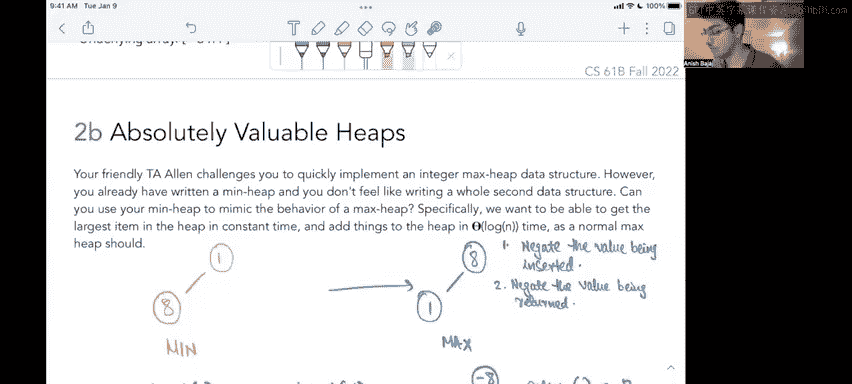

# UCB《数据结构discussion和lab｜CS 61B data structure sp 2024》中英字幕（豆包翻译 - P47：3 - Fall 2022 Discussion 9 Question 2.zh_en - GPT中英字幕课程资源 - BV1i1421x7wC

Okay， hi everyone， this is discussion nine question 2 a。So in this question。

 we're basically given a heap or we're given like a bunch of operations on a heap and we're basically supposed to execute those operations and give like the state of the heap as well as the underlying array after each operation。

 right？So。By default we have like an empty heap in this question right now the first thing we do is into this min heap we would be inserting the character F right now because there's nothing I just like make a node with the character F and that would be hit right and my underlying array in this case would just be like f。

Right so that's basically all I have。Maybe like that。不래。Now I'm done with this operation， right？And。

The next thing I'm going to do is H do insert of the character H so now I have my Minheap right when we insert something new into Minheap that already has some elements。

 we want to go to the bottommost level in the rightmost space available and just insert there first right？

So that's step number one that we do。So here I would go to the first available space。

 which is like the bottommost level and。In the rightmost space available。

 which was like this space itself， I would just insert the character H， right？

Now I want to check if after doing this step， my Minhe property is still satisfied。

 like F should be technically smaller than F than H， right otherwise？

I want to do my bubble up operation after I insert something。

 so basically the note that I currently inserted was H。

And I want to bubble up as long as my condition is true like while parent value is greater than than the current value。

 so is F greater than H it's not so for now I'm good right I don't have to do anything I don't have to swap any values or anything like that my main heat property is still satisfied which is basically like the root value is the minimum value and everything else is also like the minimum value in that subt right。

Okay。So that's basically what I have so far in this case。

 the underlying array again would just be like the min heap but traverse in like。

Level order right so the first the first value in any midheap is always going to be like a blank right that's what we do the zero index is a blank and then we have just a level order traerssal soll first visit f and then i'll visit well then i'll visit h right so that's my underlying array for this operation right here okay。

Cool。Next thing I do is I want to insert D right， so when I insert D。

I will basically create a new space or like the bottom most right most available space so my bottommost level is this level and the right most available space is going to be here。

 right？So。I will just。Make a new note here。And then insert the letter D， right？

Now I want to do the same bubble up operation， so I'll check my current node。Which is D。喂。

Is that smaller than my parent right so the parent is F and F is greater than D right so that means that these two values should be swapamped。

So I will do exactly that。So D will come here and fO go here and now my current becomes here right there is no parent to compare this value with now so I don't have to do anything my Minhe property should be satisfied and if I just do another scan it is satisfied D is the minimum value in this entire heat right and it is at the root now。

Cool， now what I do is I want to insert B sorry， so I'm insert I'm done with inserting D。

 so I want to insert B this time。Again， I'll go to the bottommost level and find the first available space。

 which is this space right here。And I'll just insert B there right I'm not done yet because I have to like compare values until my minhe property is satisfied。

 which is just to say the root value of each subt should be the minimum value in that subt right？

So basically， again， I'll check for B。The parent for B is H H is greater than B， right。

 so I have to swap H and B。Which is basically going to swap these two values so B would come here and H would go here and then。

My current value would be B Ill again do the same comparison with B and its new parent。

 which is D this time， D is still greater than B so they would again have to swap。喂。

So now B would go here and D would go here and now my current also moves up， right？

And now there's no parent to compare to， so we are done， the Minhe property is still satisfied。

 B is indeed the smallest alphabet and it has to be the root of this entire heat。系。

So this step is also done how would what would the array look like in this case。

 so again I'll do a level orversal in this manner basically level zero will have B， then I'll have D。

 then I'll have f and then I'll have H。Right I'll keep track of like。

The underlying arrays that I had here。Just for the final answer。Okay， and this time I have B D。

F and H so now have to finally insert。H definitely do H stop insert C right so again like find the first available space。

Which is going to be this space right here in the bottommost level。

I'll make a new node and I'll insert C right and again， starting from this node。

I have to do my bubble up operation。Right so now D is Cs parent and D is greater than C， right。

 so D is greater than C， so we have to swap these two values。

 which basically means that C would come here and D would go here。

And now my current value work point here。的时。Great， I will again compare。C and B， right now B。

Is not greater than C that is not true so I don't have to swap and my Minhe property is now satisfied and guaranteed because of the way this algorithm works so now I can just。

Be done with this step， but for the array state， I'll again do a level order traveral in this manner。

So I'll have B。平 c乘 f。And H and N D。And that's my state of the。Okay。

Cool finally I'll have two remove min calls right if they' a remove call what we do is step number one is to just get rid of the root value right so when I do that right I will literally just get rid of this B。

Now there is like a void here there's like an empty space that has to be filled but we have to fill up with something and what do we fill it with we basically take the bottommost value in the underlying array or like the last value in the underlying array and we'll just like place that at the top right so what that means is like I remove B and in place a it i'll just put like the last value I had in my。

Right so D is just going to take its place， but now I don't really have like the mini property still so I'll do this thing called a bubble down operation right what a bubble down operation says is basically you compare the current node。

Which is D this time。With its children， so C and F and you'll swap it with the smaller one of its children if there has to be a swap at all right so I'll check D right？

Now D is greater than C， which means it should be below C in the Minhe right because C is smaller so it has to be above D right so these two should definitely swap but when I also compare D and F。

 well F is greater than D and it is below D so that's fine right and the minhe things that are larger has to be below right？

So C and D would swapped， which would give me this。And my current pointer is now here， a D。

Right and again I'll compare D with its child values， which is D and H。

 but H is greater than D and it is below D in the min heap so the min heap property is still satisfied because in this sub D is indeed the minimum value right it's the smallest alphabe so we're done with removing the minimum and my min heap is still indeed a heap right？

So I am done with this as well now for the state of the heap。

 I will again do a level order traversal starting from the first level all the way down from that to okay。

So here this would be like C。As and。Right。Finally， I have another remove call。

 so again I'll do the same thing where I just like literally get rid of the root value Re just gets rid of the root value and does something else。

So we will get rid of a value the something else in this case is just going to be replacing it with the last value in the heat which we know is an H from here or from here right those are both the same values that I will just like put this node up to temporarily take C's position。

Right。Now I'll again do the bubble down operation where I compare H with both of its children and I swap it with the smaller one of its children right so between H and D D is smaller than H。

Right。And between H and F， F is smaller than H， so both of its children are smaller than this value。

Which one do I swap with， I swap with the one that's smaller of these two values。

 so D is smaller than F， so H and D will be the one that better swap。So D would go here。

And each would go here and now I don't have any other children to compare to so i'm done with my bubble down operations as well right so in the bubble up operation you compare the current value with the parent in a bubble down operation you compare the value with the child and you swap with the smaller child okay？

Now again， just to give the state of the array， I will again do a level order traversal。

 so I would do D and then H and I right in that order。

So here I can just put a blank at the front just for the index zero because that's by design。

And I have D，H， and then finally I have a KS， right？So that's the idea behind2 a。Okay。

So moving on a 2 B。We have this new question that says。

 your friend E TA Allen challenges you to quickly implement an integer Max data structure， however。

 you have already written a Minheap and you don't feel like writing a whole second data structure。

Can you use your minHeap to mimic the behavior of a max heap。

 specifically we want to be able to get the largest item in the heap in constant time and add things to the heap and data log in time as a normal max heap shape。

Okay， so basically you have a functioning Minheat but you want to be able to use its existing operations。

So that under the hood it's actually treated as a max right so the idea is like if you have。

 let's say one。And eight。In a max heap。And this is a Min heap scenario。In a max heap。

 it should have been the other way where you have。E is the root because it's the maximum and then you have one。

 so this is the mass case， right？So one way to do this is to basically whenever you want to insert a new element you negate that value and then you insert it right so basically let's say that I wanted to insert a one right？

So in my implementation， I'm going to just insert a one， but what I will do is an insert one。

I will actually be intoing negative one。Right。So what that means is like I will basically just do negative one as its own。

RightAnd now if I insert。8ight。I will actually insert negative range。

Right so the heat property like it will it will insert to the next available space and then like do some bubble up operations to be able to like satisfy the heat property because these are negative numbers negative eight is smaller than one right so the min heap the underlying min heat that we already have will put the negative eight above the negative one right and now if I call like。

Get min or some function so like if I call get min here or get minimum whatever right this would give me negative8 but I would return the negative of that to get8 right so basically the idea is to negate。

The number。Or it the value because it could be any kind of value。Being inserted。And then two。嗯。

Mgate the result。Or negate the value。Being returned。

Whenever you want to return a new value you would just negate that result right so if I called get min here I would actually be getting negative8 but before I actually give it to the end user I would negate it back right so technically it's like basically saying that these two are equivalent except the values are negative so my min heap would order them in basically the same order that I want except the values are negative so whenever I want to retrieve them I will just negate them after after after the priority Q returns that value and then I'm going to use that value right so these are the two ways like these two steps will enable using my minimum heap minheap as a maxheap so that's the idea behind 2b。

RightFor every insert operation， we can negate the number and add it to the Minheap and for the remove max operation。

 call the remove and negate the number being returned， which is basically what we just discussed。

Okay， that is 2 B。