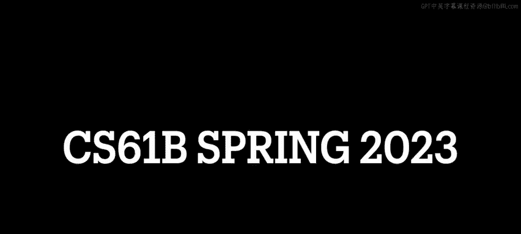
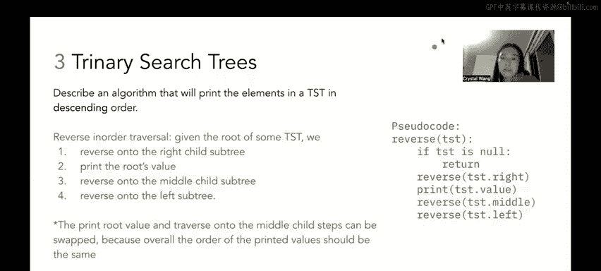

# UCB《数据结构discussion和lab｜CS 61B data structure sp 2024》中英字幕（豆包翻译 - P48：4 - Spring 2023 Discussion 09 Question 3.zh_en - GPT中英字幕课程资源 - BV1i1421x7wC

🎼发明哈明。🎼Oh。

All right， let's move on to last question question three of this worksheet。

 which is called Triary search trees it's a bit of an algorithm design question and suppose we build a binaryary search tree which is a TST which behaves a lot like a BST but it allows duplicate values like remember when we were learning about BSTs we didn't allow duplicate values right so a TST has a following BST like a variance So number one each node in AST is a root of a smaller TST that sounds a lot like the BST rule where we said that each node in a BST is a root of a smaller BT right number two every node to the left of a root has a value lesser than that of the root and number three。

 every node to the right of a root has a value greater than that of the root。😊。

So you'll notice that rules11，2 and 3 seem pretty similar to the BST invariance that we talked about in discussion 7 right the only really new thing that we have here is that every node to the middle of a root has a value equal to that of the root and what we want is we want to describe an algorithm that will print the elements in a TST in descending order and as a hint you might find one of the traversals we used in question one to be a good starting point to your algorithm here so as an example TST if you're having trouble envisioning it。

 think about something that looks like this so this looks almost like a BST except we have duplicates so over here in 10 we see that everything to the left of 10 is smaller and everything to the right of 10 is larger but everything down the middle of 10 is itself 10 so you'll see that 10 chains on 10 which itself has a middle child of 10 likewise over here 7 is the middle child of 712 is the middle child of 12。

And so on and so forth， so the idea is how do we design an algorithm such that when we run it on this tree over here we'll get it to print out the elements of this TST in the order 15。

14， 13，1212，11，10，1010，77，31。Okay。So let's break it down a little bit we want to print the elements in descending order and the hint here is referring to question one in which we did a lot of traversals on aBST and if you remember or maybe you didn't watch it and that's totally fine too but basically the rule of thumb is that when you run in order traversal on a binary search tree。

You're going to get the elements of that binary search tree in ascending sorted order and it makes sense right because when you run in order traversal you visit the left and you visit the middle then you visit the right which follows like the ascending order in which values should be sorted in a binary search tree right so that's a pretty good starting point for us when we think about how to print the elements in a TST and descendending order so we could run like a student did point out to me that we could run in order traversal on our binary search tree and then just like reverse the outcome that the elements got sorted and that would give us ascending order and that's like perfectly fine to but for the spirit of this question let's say you can't make another past to flip over the elements in your in order traversal output but we will want to use inor traversal as inspiration。

So if you'll remember in order toveral， the pseudocode was like。😊，Visit my left。

 visit myself then visit my right。 Well， that gives us acending order。 right Well。

 if we want to descendending order， then can' we just do visit my right， visit myself done。

 visit my left because everything to the right of myself is going be larger than me and everything to the left and myself is going to be smaller than me right So if we go right。

 middle left then that means that we're doing things in descending order。

 right So that's the first part of it。 The second part of it though。

 is that we have a triary search tree right we allow a duplicate。

 It's not just the left and left and right kind of deal anymore， right we also have a middle child。

 So the idea behind that is before when we process the right child before we can process the left child。

 we have to process the middle child。 So the idea behind this algorithm at a high level would be。

Reverse in order traveral given the root of some binaryary search tree。

 we will reverse onto the right child subte and then we will print the roots value then reverse onto the middle child subtree and then reverse onto the left subtree and what that's going to look like in pseudocode is a lot like in order traversal but with the right and the left line swapped so here we see that the base case if TST is not just returned otherwise we want to reverse onto the right subtree。

 then we print the value at root at the root of the TST then we reverse onto the middle subte。

 then we reverse onto the left subtree right it's recursive right so if we think about this pseudocode in the context of what we're seeing here。

Oh no not tell you okay yeah when we see in the context of what we're looking at here first we want to reverse onto the right subre。

 we want to reverse onto the right subt we want to reverse onto the right subt then we print the value of 1515 doesn't have a middle or a left child so we hop back up to the 14。

😊，We print 14 right， 14 doesn't have a middle child so we go down to the left。

 We print 13 because 13 doesn't have any right or left children。

 we've processed this whole right sle tree so when we come back up to the 12 subtree over here。

 we print 12 and then we process the middle so that's what we're kind of doing here in the pseudocode it's like reverse in order traversal with the added caveat that you also need to reverse down the middle column and something to note is that the print root value and the traverse onto the middle child steps aka these two lines they can be swapped because overall the order of the print values should be the same right because if we print this value over here versus going down its middle and printing those values they're the same value in any case。

 but if we wanted to preserve the order like a specific order like oh print the root and then go down the middle then we need to keep a particular order but otherwise the print out should look the same All right and that's it for question three。

