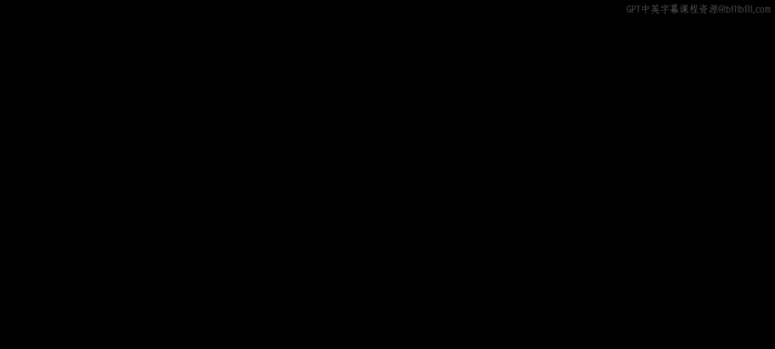
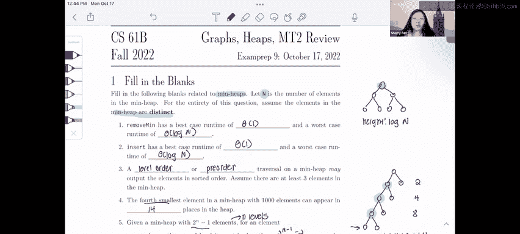

# UCB《数据结构discussion和lab｜CS 61B data structure sp 2024》中英字幕（豆包翻译 - P49：1 - Spring 2023 Exam-Level 09 Problem 2.zh_en - GPT中英字幕课程资源 - BV1i1421x7wC

Hi everyone， this is the CS 61 B Fall 2022 Ex prep 9 walkthrough and I'm Sherry in this part I'll be going over question one I' fill in the Blink's Heap review。

For this question there are two important things to note the first is that our Min heap we're using a Min heap and that the items in this min heap are distinct which will come into play later and the other important thing to know is that we're using the variable n for the number of nodes in the min heap except in part five where we'll use a different variable so let's get started。

For the first problem， remove Min has a best case runtime and a worst case runtime of what？

The answers to these are theta of1 for the best case and theta of log n for the worst case。

 Let's justify these a little。Remember that when we remove in。

 what we're going to do is we're going to swap our bottom rightmost node with the top node。

 and then we're going to sync it down as much as possible until our heap is correct。

So from this we can see that the worst case is going to be log n when we have to sync it all the way down to the bottom and our best case is going to be theta of 1 when we don't have to do any syncing at all。

The answers for insert are the same where we have theta of 1 and theta of login。

 and again this is based on the idea that when we insert。

 we always insert at the bottom rightmost location and then we swap it up as much as possible and so sometimes we have to swap all the way to the top and sometimes we don't have to swap at all。

For part three， we're asked to give two traversals that could output the heap in sorted order。

 and so one important thing to remember about a min heap is that our minimum node is always going to be at the top。

So any traversal that we choose has to always output this top node first。

The only two traversals that would output the root first would be level order because we just go across and down and preorder because we start at the top。

Now let's move on to part four。To start with part four。

 let's think about two properties of any node in a miniheap so if we just choose some random node in this heap we have it has two properties first of all it's larger than its direct ancestors so that would mean this node or this node and it's smaller than any of its children。

So。Given these two properties， we can use these to solve problem four。

And notice that these are direct， these are inequalities and not less than or equal to greater than equal to because there are no equal nodes in this heap。

So moving back to problem four， the fourth smallest element in the heap， where could this appear？

For the fourth smallest element， it definitely can't be at the top because that's a minimum。

 so it's always the smallest。It could appear on the second level。

 a note has no relationship with its siblings， so for example。

 we could have something like this where the fourth smallest is on the second level。

And by similar logic， it could also be on the third level， and it could also be on the fourth level。

 However， if we notice it can only be on the fourth level at most because if it's on the fifth level。

 it has to be larger than all of these four nodes above it。 And so if it's on the fifth level。

 that means it has to be the fifth smallest and it can never be the fourth smallest。So。

We know that it can be on the second， third or fourth level。

 and so we just have to count the number of nodes in each of these levels for the possible locations that it could be。

There's two nodes in the second level， there's four nodes in this。

Third level and there's eight nodes in the fourth level so。Basically。

 we just add these two up  two plus 4 plus 8 equals 14。

 and so there's 14 possible locations for our fourth smallest node。Finally， for part five。

 let's keep in mind the two properties that I stated earlier again。

 where it has to be greater than its direct ancestors and less than its children。

So let's look at this。For a minhe with two to the n -1 elements， we have n levels。

 And so I'm using a small n here to distinguish it from the n that we're using in the rest of the problem。

And so。Let's look at the first part to be on the second level。

 it must be less than a certain number of elements and greater than a certain number of elements。

If we look here at this example that I've drawn here。Let's consider this note on the second level。

 It only has one direct ancestor， which is the root， So it must be greater than exactly one element。

 which is the root。To think about how many nodes it must be less than。

 we just have to count its children， remember a node is always less than its children。To do this。

 remember what I said earlier， with n levels， we have two to the n minus1 elements。And so basically。

 what we want to count is we want to count all of the children in this circle right here。

How do we count that？We know that there are two to them and -1 total elements here。

 And so we can see that the children is just half。The nodes。Minus。The root。And。The node itself。

So what we're going to do is first we're going to subtract off the root so we're going to have2 to the n minus1 minus1 is2 to the n minus2。

And then we're going to divide by half， so we have this part of the tree。

So this is going to be two to the n minus1 minus1。And then we subtract off the note on the second level itself。

 since we're actually not counting that， we only want to count its children。

 so I'm going to end up with two to the n minus one。And then we' going subtract one。

 which is equal to 2 to the n minus1 minus2。And so we figured out that it has two to the n minus1 minus two children。

 so that's how many nodes it has to be less than。For a note of the bottom level。

 we can see that it doesn't have to be smaller than anything。It doesn't have any children。

 so it could be the largest node in the tree， it has to be less than nothing， which is zero。

And it has to be greater than all of its direct ancestors。

 which are just all the nodes on this path from itself to the top of the tree。

 so it has n minus1 direct ancestors， so it must be greater than n minus1 other elements。

That's it for this problem。Here's my weekly exam tip for conceptual he questions which are pretty likely to show up on exams the best way to get better at these is suggest to do lots of practice most of the conceptual questions you see are repeated variations on the same question from past semesters so try to do at least a few exams so you can see the patterns good luck on the midterm and in the rest of 61b。

