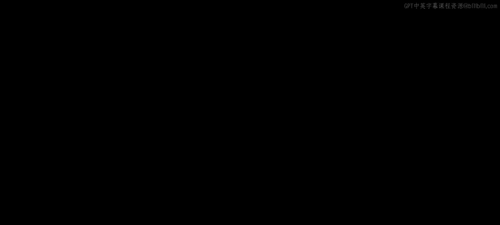
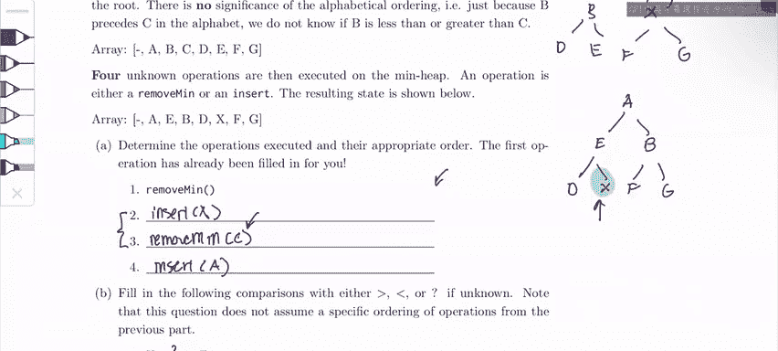

# UCB《数据结构discussion和lab｜CS 61B data structure sp 2024》中英字幕（豆包翻译 - P50：2 - Spring 2023 Exam-Level 09 Problem 3.zh_en - GPT中英字幕课程资源 - BV1i1421x7wC

Hi everyone， this is the CS6 GMMB Fall 2022 exam prep 9 walkthrough and I'm Sherry in this bar I'll be going over question2 heap My。

In this question we're given a inheap where each element is unique so that's important。

 but the values are hidden and represented by these letters and note that the letters don't have any particular meaning and are not ordered like A is greater than B is greater than C it's our job to figure out the relationships and the operations that we're doing on this heatap。

As a note， this problem is super difficult and probably beyond even exam level。

 so if you're studying for the exam right now， come back to this problem but don't worry about it now。

For a quick review， remember that heaps are complete binary trees which means that we fill them in from top to bottom and left to right this means that we can represent heaps easily as an array as I've done here we just fill in the array from left to right and turn it into a heap so for example for our starting heap we would have something that looks like this ABC D E FG and for our ending heap I've already drawn it out here it will look similar we just fill in the array from left to right and make it into a binary tree。

So let's get started with part A in part A， we have to figure out what operations we did on our original heap to turn it into this final heap。

And so if we look at these two heaps， we should just start comparing what differences they have。

We're given that the first operation is a removed min。

 which means that we would remove the top of the heap， which right now is a so。That means字。

Even in our final array， we see that A has been returned into the heap。

 so if we originally removed A， that means at some point we didn't insert a operation。

 so let's just write that down。We can also see two other main differences in our final heap。

 First of all， there's a new number X and also C is missing。 So we also know that at some point。

 we had to insert。X。And we had to do remove men。To get rid of sea。

 because the only way to get rid of o in our heap is to remove men。

Now let's figure out how to order these。We know that at some point remove gets rid of C。

 which means that at some point C was at the top of the heap。

So let's first do our remove operation for a。 remember when we remove in。

 we're going to swap the bottom right most known with the top。

And so we're going to end up with G at the top， but we have to bubble down G to its correct location and we know that at some point C was at the top of the heap。

 so that means we probably did this swap right here where C ends up at the top and G is here。And so。

We know that。C was at the top of the heap at some point。

 And so we must have done remove min on C before we insert A because remember a is the minimum。

 So if we insert a again and then do remove min， we' would just be removing and inserting a over and over again。

 So that gives us an order of remove min。 And then we do remove。Men on sea。And this is C。

 And then we do insert。8。So now we have the ordering of those。

 the only thing that's left is to figure out where this insert X goes and it could go anywhere between these。

So it could go here， sorry it could go here， it could go here， it could go at the end。

So let's try to figure out where insert X goes。Let's look at the final state our heap and let's consider something interesting。

 When we insert X， we always insert at the bottom right most， So it would be here。

 But we noticed that in our final heap， it actually ends up on the left side of the tree。

 How did X end up going from the right side of the tree to the left side of the heap。Remember。

 the only operations that we're allowed to do is to bubble up something into the tree or bubble down something in the tree。

So to travel to the opposite side of the tree， we know that X kind of took like a circuitous path where at some point we bubbled it to the top of the tree。

 and then we bubbled it back down to the left side of the tree。And in order to do that。

 this must have happened during a removal where X ended up at the top of the tree。

 So what this would look like is when we do remove min on C， we would swap X and C up here。

 so X is at the top and then we would bubble it down to its correct location in the heap where it is at the final state。

So that means when we did remove min and we removed C X was already in the tree。

 That means our second remove。That means insert。X must have happened before we removed C。

 So our final order is going to be this。 It's going to be remove min where we get rid of a。

 And then we're going to insert x。And then we're going to remove min on C。

 and then we're going to insert a back into the tree。Okay。

 now let's move on to part B where we figure out the relative ordering of certain nodes。For part one。

 this is unknown because if you look at our operations here。

 we notice that we move X up and down the tree， but we never actually directly compare it with D。

 so this is an unknown。For part two， let's remember our operations from above。

 remember we did remove min and then we did insert X and then we did remove min again。

 which removed C instead of x。That means at this point in the tree。

 C is the minimum of the tree and so C must be less than x， which means x is greater than C。

 otherwise when we did remove min， we would have removed X instead of C。For part three。

 similar logic applies C must be less than B because otherwise if we did remove men。

 we would have removed me B and not C。Finally， for part four。

 let's look at these two operations again， operations  two and three。Remember what we said up here。

 we wanted X to end up at the top of the tree。How would X end up at the top of the tree。

 This would only happen during a remove when we swap the bottom rightmost node with the top of the tree。

And so that means when we inserted X， it stayed at the bottom right most of the tree。

 and we never bubbled it up by swapping it up with G。So that must mean that G is less than x。

 otherwise when we inserted x， we would have done this swap right here where we swap x and G like this。

But remember， we don't want this to happen because we want x to end up at the top of the tree when we remove C。

So that means G must be less than x， otherwise we would have bubbled it up。

That's it for this problem， like I said earlier I wouldn't focus too much on this problem because it's very unlikely you'll see something thats convoluted on an exam come back to this problem later if you want a fun challenge but study the basics first and good luck on this midterm and then the rest of 61b。

