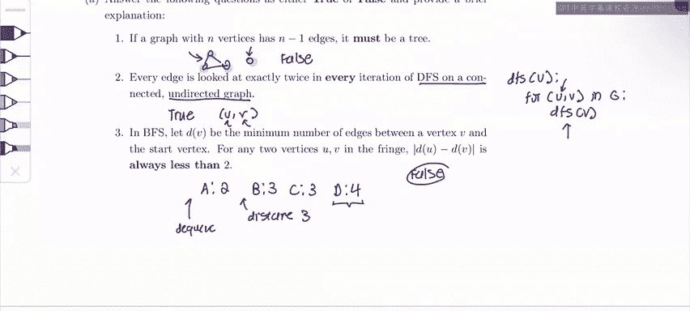

# 数据结构与算法：P51：图论基础概念与算法


在本节课中，我们将学习图论中的一些基础概念，并通过真/假判断题和算法设计题来加深理解。我们将探讨树的性质、深度优先搜索（DFS）和广度优先搜索（BFS）的行为，以及如何检测图中的环。

## 第一部分：真/假判断题

上一节我们介绍了课程概述，本节中我们来看看一系列关于图论基础概念的真/假判断题。

**题目1：** 如果一个具有 `n` 个顶点的图有 `n-1` 条边，那么它一定是一棵树。

**答案：** 错误。

**解释：** 树必须满足两个条件：1. 连通；2. 无环。下图展示了一个反例：该图有4个顶点和3条边，但它包含一个环（A-B-C-A）和一个孤立的节点D，因此它不满足树的条件。

```
A --- B
|     |
C --- D (孤立)
```

**题目2：** 在连通无向图上执行DFS时，每条边是否恰好被查看两次？

**答案：** 正确。

**解释：** 回顾DFS算法，它从一个节点开始，递归地探索其所有邻居。对于任意一条边 `(U, V)`，我们会在从节点 `U` 调用DFS时查看它一次，也会在从节点 `V` 调用DFS时查看它一次。

**题目3：** 在BFS的执行过程中，队列中是否可能同时存在距离起点为2和距离起点为4的节点？

**答案：** 错误。

**解释：** BFS使用队列，并且严格按照节点到起点的距离顺序进行处理。队列始终按距离排序，并且从队首（距离最小的节点）出队。因此，在距离为2的节点全部处理完毕之前，不可能有距离为4的节点进入队列。这违反了BFS按层遍历的基本原则。

## 第二部分：算法设计题

在理解了图的基本性质后，本节我们将探讨一个具体的算法问题：如何在图中检测环。

**问题：** 设计一个算法来检测图中是否存在环。

**解决方案：** 使用深度优先搜索（DFS）。

**算法描述：**
1.  从任意一个未访问的节点开始进行DFS。
2.  在遍历过程中，记录已访问过的节点。
3.  如果在探索某个节点的邻居时，发现该邻居**已经**在当前的DFS路径中被访问过（而不仅仅是全局访问过），则说明图中存在环。
4.  如果DFS遍历完所有节点都未发现此类“回边”，则图中无环。

以下是该算法的核心思路演示：

**情况一：有环图**
```
A --- B
|     |
C --- D
```
假设从A开始DFS：`A -> B -> C -> D`。当从D探索邻居时，发现A已被访问（且在当前路径中），因此检测到环（A-B-C-D-A）。

**情况二：无环图（树）**
```
A --- B
|
C
|
D
```
从A开始DFS：`A -> B`， `A -> C -> D`。在整个过程中，从未遇到一个已存在于当前路径中的邻居，因此判定无环。

**算法复杂度：** 该算法的时间复杂度为 **O(V + E)**，其中V是顶点数，E是边数。在最坏情况下（即图是一棵树或无环图），我们需要访问所有的顶点和边才能得出结论。

## 总结与考试技巧

本节课中我们一起学习了：
1.  树的确切定义（连通且无环），仅凭边数 `n-1` 无法断定是树。
2.  DFS遍历无向图时，每条边会被访问两次。
3.  BFS队列严格按节点到起点的距离顺序维护。
4.  利用DFS通过检测“回边”来高效判断图中是否存在环。

**每周考试小贴士：** 对于图论问题，最有效的策略是**动手画图**。正如我们在这里所做的一样，一个具体的例子虽然不能证明一个普遍性质，但它能帮助你思考反例，或者在小型图上测试你的算法逻辑。善用图表可以极大地帮助理解和解题。



祝大家在期中考试和CS61B的后续学习中一切顺利！