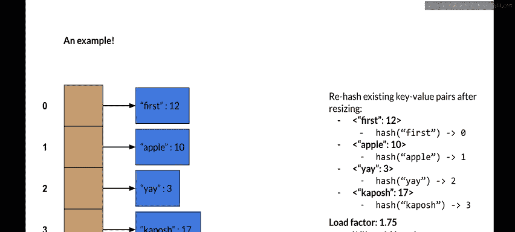
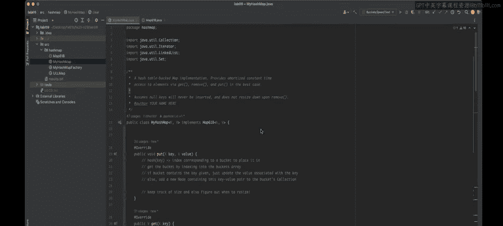

# UCB《数据结构discussion和lab｜CS 61B data structure sp 2024》中英字幕（豆包翻译 - P52：Lab 9： HashMap.zh_en - GPT中英字幕课程资源 - BV1i1421x7wC

Okay， this is going to be the lab9 instruction video on the hashmap lab。

 so this video we kind of two parts， the first part will be a conceptual overview and the second part will be going over some pseudo code to help you actually get started on the implementation。

Okay， so some definitions， an item just represents an object containing a key value pair we work with in our hash map so remember that the whole idea about maps right is that we have some key and they have some associated value and this allows us to have a mapping between the two。

Then we have buckets and this just refers to the underlying array backing or hashmap。

 so in order to have these super fast amortized constant time operations。

 we're going to use an array to kind of do that and every time we talk about buckets we're basically going to be referring to that underlying array。

next is hash or a hash function， what this does is just takes in a key and returns an integer corresponding to a bucket index。

 so order know which like objects go to which buckets we're going to use the hash also known as hash function。

Then we have load factor， so a load factor which represents the average number of items per bucket。

 so if we let N be the number of items in the hashmap and M be the number of buckets。

 which is correspondent to the length of the underlying array。

 then we can calculate the load factor by doing n divided by M。

And this is really important because once the load factor is exceeded， right。

 this kind of tells us to resize the underlying array and resizing is basically the whole kind of like great operation allowing us to have amortized constant time hashmap operations。

All， so here's a quick visualization， so in this case。

 each of the tan boxes represent an index or bucket in the underlying array。

And what's really special about this is that in order to kind of deal with collisions。

 we're going to do something called external chaining。

 which means that each of the buckets are going to hold some sort of collection and a collection is basically just some way to store a bunch of items together and this is kind of like something that a lot of data structures actually implement and use。

So in this case we have the blue box representing nodes right。

 so a node might contain a key value pairing， this is also referred to as like an item right or entry。

 you might be hearing me use these words interchangeably。So in this case。

 we have like a bucket and this bucket has two items in it。

 and each of these correspond to some unique key value parent。Okay， so now let's do an example。

 so in this case I have a very， very small underlying array， so my buckets are only size two。

 and I want to put in the following key value pairs。

And one thing to note is that I'm also going to be keeping track of the load factor。

 so in this case the threshold to resize is going to be 1。75。

 so as soon as I exceed that threshold I want to basically resize the underlying array。

Okay so before we get to the first pull operation you'll notice that I have these hash and I put in the key to the hash so whenever you hash an object you always hash the key to figure out where it goes to and in this case I'm going to abstract away what the hash function is actually doing so we'll only know basically which of the indices is basically mapping the object to。

Okay， so let's put the following first key value pair， which has key first and value5。

 so if I hash first which is the key of this pair， I'll get back zero and this corresponds to index zero in my under longer way。

So I'm going to put it there and get this。Now let's just repeat this process for all of the following key value pairs。

 so I have Apple， right， so if have a hash apple， I'll get back one and I'll go into index one of our underliner。

 right。Next we'll have first again right so one thing to remember is that we don't allow actually duplicate keys in this。

 so that means that anytime you have a key that's already been inserted into the hash table you actually just want to update the value if it already exists within there so we're going to see first and we're going hash first and we're going to say that okay we're going look at index zero of the underlying array。

If I look in there， I'm going to traverse the collection that it's storing to first see if the key first exists in that collection or not。

And if it does， all I'm going to do is I'm going to simply just update the value to what the new value is。

 so in this case it's12， so I'm going to go ahead and do that right now。

So you can see first had its value changed from  five to 12。

 simply because it was already existing within the underlying array already。Okay。

 now let's see the rest and if I am basically hasier， I'll get back one。

 which corresponds to index one。Like this。And you'll see that as I'm doing all these operations my load factor right。

 the threshold is still 1。75， but as I'm calculating my average of how many items I have per bucket。

 this is slowly increasing towards that threshold so right now I have three divided by two because I have three items in my bucket or in my underlying array and I have two buckets to kind of like spread them across。

So now I'm going to add the last key value pair， which is capache。And7。So if I has cop posh。

 I'll get back zero， which means that it goes back into the collection， that bucket zero is storing。

So now you'll finally see that my load factor has finally been exceeded。

 if I calculate the number of items divided by the number of buckets， I'll get four divided by two。

 which is equal to two， and this exceeds my load factor threshold。😊。

What this means is that we need to resize， so resizing gazeo work very similarly to how he did it in Project 1 B。

 the array deck， you're going to want to multiply the underlying array sized by a geometric factor and in this case I'm going to multiply by T。

So now Ive multiplied the underlying array length by two。

 so now we have four buckets to kind of distribute our pairs among。

 and I'm going to have to now rehash all of the existing key value pairs after I did this resize。

So let's say now my hash function right if it's dependent on the length of the buckets and now my length of the buckets has changed。

 then now everything might have a different hash value so if I hash first I'm still going to get zero if I hash Apple I'm going to get one if I hash ya and now I'm going to get two and if I hash the posh I'm going to get three so the values here I've changed which means they're going to go into different buckets than what they went into before。

So after rehashing， this is pretty much all you have to do after resizing is just rehash all the existing key value pairs and you continue on as normal with whatever operations you want to do。

And you'll notice that after we've done this resize。

 our load factor threshold is not exceeded anymore because now we have four items around over four buckets and this results in the current load factor being one。

 so we're no longer kind of violating this condition where we're not exceed the threshold。

 which means that we can continue with our operations as normal before resizing again。Okay。

 and that's the end of the conceptual overview， so now we're going to jump into the practical overview。

Okay， so this is going to be the implementation focus part of this guide。

 where I'll kind of give you a foundation on how to start this lab。As a preface。

 please make sure to read the spec in its entirety as well as take a look at the skeleton before you continue watching this video because I won't be going over those in too much detail。

Okay， so hopefully if you you about a chance to read the spec and look at the skeleton。

 the one thing or two things I want to emphasize in the skeleton are the instance variable buckets as well as this method createate bucket down here。

So for buckets， this is the underlying array that's going to be backing your whole data structure。

 and this means that it's an array of collections and all of these collections are going to be storing node instances。

So this kind of ties in now to the create bucket method。

So the create bucket method is specific because we want you to actually use this method anytime you instantiate one of these collections。

😊，The reason being is because we're want to be testing your data structure with a bunch of different types of collections。

 ranging from BSTs to stacks to linked lists and a bunch more。

So the whole idea about this is that we want to use the create bucket method so that we can overwride this method and pass in our own data structures to test your own code of it。

One thing to note is that we actually do tell you for the sake of your own code。

 you can actually directly just say return new link list here and it'll work fine on your end。

But just remember that anytime you want to instantiate one of these internal collections stored in the buckets array。

 you want to start doing so by using Create bucket。Okay。

 so I' was actually talking about the methods you're going to implement for this class。

 so here I'm going to implement the methods as required by the interface。😊。

And now let's look at what's given to us。So I'm going to talk about put get and contains key as well as clear and then talk about some helper methods that might help you in your implementationation。

So the first thing to know about put is what we covered basically in the conceptual overview so what you're going to do here is pretty much you're given some key and some value and its the key value pair so the first thing you want to do is hash the key and this will give you back some index corresponding to a bucket to place it in。

Then right， you're going to want to get the bucket corresponding to the index by indexing into the buckets array。

And remember that the bucket here is a collection， right。

 and it's going to be storing node instances。Right。Now， all right。

 you actually have like an if else case to take care of。 So if look at the interface the。

Jovadc method says that if the map already contains a specified key。

 replace the keys mapping with the value specified。

 so this is important because it tells us that we don't want to have any duplicate keys if we're kind of trying to insert or put a new key or a duplicate key。

 we just want to update the old keys mapping in terms of the value。

S is we going to have some if else check here， right？If the bucket contains the key giving， oops。

Just replace the value。Oops， update the value associated with the key。And we have an else case。

 right？And the else case is that if that doesn't contain the value or the key， right。

 otherwise we just want to insert or add。A new node containing this key value pair to the bucket。

Coection。All right， so this is the general ideal put。

 you're going to have to also take care of something things such as like the size and resizing right because those are both things you have to kind of like keep track of while you're doing pull operations。

So I'm going to put something down here says like keep track of size and also figure out when to resize。

All right， so now let's talk about get get is going to be very。

 very similar to put in the first couple of stages。

So let's talk about how you could possibly do this。

So I'm just going to copy over the first kind of like two and a half steps from put。

Which means that basically what I'm doing is hashing the key， getting the bucket it associated with。

 looking at its collection and checking if the bucket contains the key given it。So forget right。

 we're saying that given some key， we want to return the value associated of that key。

So if the bucket contains the key given， then we want to return the value。Associ with duck。

And otherwise， right， that means that the key doesn't exist。And by the Java Doc method。

 it tells us to return noll if the map contains a mapping for this key。Okay。

 so get is pretty simple right， we basically reuse code that we kind of wrote already or kind of thought of already from put。

So specifically， these kind of like like first two and a half steps here are the exact same for put and get。

Now let's see what happens when do contains key。So if for contains key we're given some key and we just want to see if our hash map contains this key or not right and the whole idea about this is that we're actually going to repeat the exact same like two and a half steps again so in this case I'm going to take over this。

And it's going to be the same kind of procedure， we're going to hash the key。

 we're going to add some index corresponding some bucket to place it in。

 and then we're going to get the bucket by indexing into the buckets array。

 and then we're going to check to see if the bucket contains that key。So if it does。

 we want to return true and then else。Return false。Okay。

 so now that we looked at these first three methods。

We've been kind of saying the same thing over and over again。

 and one way we could kind of fix this is by reducing our code and simplifying like all this things we're doing by making the helper function。

So lets you think about which helper functions you might need and how you might write them to help simplify the code we've talked about so far。

So now I'm going to talk about the remaining methods which are size， clear， keys。

 remove and itererate。For this lab， keyset remove and iterator are all optional。

 so if you don't want to do those ones， you can just simply throw new unsupported operation exception。

And you can copy this line for each of those data options。

Now let's talk about size so remember that for this data structure right keeping track of the number of elements we have is really important because that tells us when to also resize right we want to keep track of the load factor and if we ever exceed a certain threshold that tells us when to resize so we can maintain our amortized constant time operations。

So you're going to be keeping the track of the size every single time you add or put into the hashmap。

And you're going to probably want to do that using some sort of instance variable。

 so keeping some sort of instance variable called size maybe will be really helpful for both determining resizing time as well asre just returning the size of your data structure。

Now for clear， this is the kind of like last method I'll talk about all this is doing is pretty much just resetting your entire data structure to its initial empty state。

 So what this might look like is you might reset the buckets to initial empty state that contains no key value pairs。

 so all of them are completely empty collections。And you might also consider resetting any corresponding instance variables。

I can answer quite。So that's the pretty much idea behind it clear。

 you're just kind of resetting the hash map to just be like completely empty and as if you're just instanting the object for the first time。

Okay， and that kind of concludes the overall kind of idea of how to go about this lab in terms of pseudocode and getting started。

 good luck on completing it。

