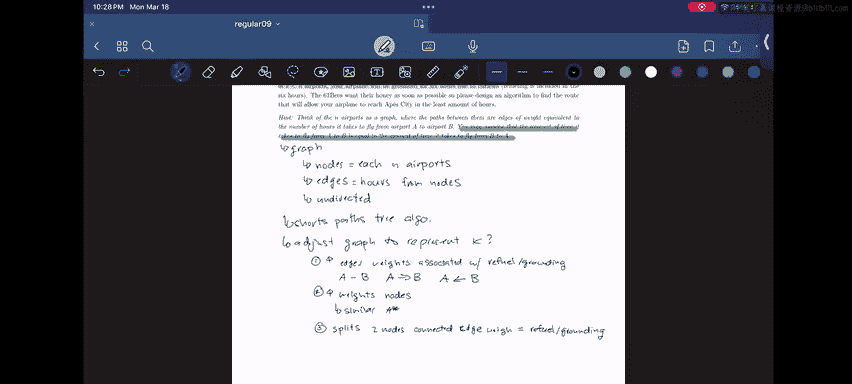

# 数据结构讨论与实验：CS 61B SP24 常规讨论 09 问题 3 解析 🛫

在本教程中，我们将学习如何为一个算法设计问题构建解决方案。我们将把实际问题抽象成一个图论问题，并探讨如何调整图的结构以纳入特定约束条件，最终使用最短路径算法找到最优解。

---

## 问题概述与抽象

上一节我们介绍了本教程的目标。本节中，我们来看看具体的问题描述。

你的航空公司需要将一批蜂蜜从 Honeysville 运送到 Op City。飞机燃料不足以直飞，因此必须在沿途的 **n** 个机场中至少选择一个进行加油。加油本身耗时 1 小时。然而，如果降落的机场属于 **K** 个特定机场（K < n），飞机将因宵禁而被扣留总共 **6** 小时（加油时间包含在内）。目标是设计一个算法，找到一条能让飞机在**总小时数最少**的路径到达 Op City。

以下是帮助我们理解问题的关键提示：
*   将 **n** 个机场视为一个**图**，机场之间的航线是**边**，其**权重**等于从机场 A 飞到机场 B 所需的小时数。
*   可以假设从 A 飞到 B 的时间等于从 B 飞到 A 的时间。

---

## 构建基础图模型

上一节我们明确了问题目标。本节中，我们来构建基础的图模型。

根据提示，我们首先将问题建模为一个图（Graph）。

*   **节点（Nodes）**：代表每一个机场，包括起点 Honeysville、终点 Op City 和沿途的 n 个机场。
*   **边（Edges）**：连接两个机场的航线。每条边有一个权重，代表飞行时间。
*   **无向图（Undirected Graph）**：由于飞行时间双向相等，这意味着图是无向的，边没有方向性。

此时，我们的图只包含了飞行时间。但问题中还有额外的约束：在 K 个特定机场停留会带来额外的 6 小时滞留。我们需要在图中表示这个成本。

---

## 整合额外约束的解决方案

上一节我们建立了只包含飞行时间的基础图。本节中，我们探讨如何将机场的滞留时间整合进图模型，以便应用最短路径算法。

核心挑战在于，滞留时间是附加在**节点**（机场）上的，而 Dijkstra 等经典最短路径算法通常只处理**边**的权重。因此，我们需要对图进行改造。以下是几种可行的解决方案：

### 方案一：调整边权重

此方案的核心思想是将节点的成本转移到与之相连的边上。
*   对于每个属于 K 集合的机场（即有宵禁的机场），增加所有**进入**该机场的边的权重。具体来说，在原有飞行时间上增加 6 小时（宵禁时间）或 5 小时（如果加油的 1 小时已单独计算，则增加额外的 5 小时）。
*   由于原图是无向的，我们需要先将其视为有向图来处理“进入”的概念，或者统一增加连接该节点的所有边的权重。

### 方案二：引入节点权重

此方案允许图同时拥有边权重和节点权重。
*   为每个节点分配一个权重：普通机场权重为 1（加油时间），K 类机场权重为 6（总滞留时间）。
*   当算法遍历图时，路径的总成本 = 经过的所有边的权重之和 + 途径的所有节点的权重之和（起点节点的权重通常不计入，因为尚未加油）。
*   这种方法类似于我们学过的 **A\* 算法** 中处理启发式函数和实际成本的方式。

### 方案三：拆分节点

此方案通过增加节点和边来显式地表示滞留过程。
*   对于每一个属于 K 集合的机场，将其拆分成两个节点：“到达”节点和“离开”节点。
*   在这两个节点之间创建一条有向边，其权重等于 6 小时的滞留时间。
*   原图中所有指向该机场的边，现在指向其“到达”节点；所有从该机场出发的边，现在从其“离开”节点出发。
*   这样，任何需要在此机场停留的路径都必须经过这条代表滞留的高权重边，成本自然被计入。

---

## 应用最短路径算法

上一节我们讨论了如何将节点成本融入图结构。本节中，我们来看看如何使用改造后的图来找到最终答案。

无论采用上述哪种方案对图进行调整，我们最终都得到了一个所有成本（飞行时间和滞留时间）都体现在边权重上的图。此时，我们就可以运行标准的最短路径算法。

1.  **选择算法**：由于所有权重均为正数，我们可以使用 **Dijkstra 算法**。
2.  **设置起点与终点**：起点设置为代表 Honeysville 的节点，终点设置为代表 Op City 的节点。
3.  **执行算法**：运行 Dijkstra 算法。我们持续运行算法，直到代表 Op City 的节点从优先队列（fringe）中被弹出。这是因为当其被弹出时，算法保证我们找到了到达它的最短距离。
4.  **获取路径与时间**：算法结束后，从 Op City 节点回溯到 Honeysville 节点，即可得到耗时最短的路径。到达 Op City 的最短距离值就是所需的最少总小时数。

---

## 总结与回顾

本节课中，我们一起学习了解答一个算法设计问题的完整流程。

我们从具体的物流问题出发，将其抽象为**图论**中的最短路径问题。我们识别出核心难点在于处理附加在节点上的成本（滞留时间），并探讨了三种主要的图模型调整方案：**调整边权重**、**引入节点权重**以及**拆分节点**。最后，我们说明了如何在改造后的图上应用 **Dijkstra 最短路径算法** 来求得最终的最优路线和最少时间。

通过这个问题，我们掌握了如何将复杂约束条件编码到图数据结构中，这是解决许多实际算法问题的关键一步。