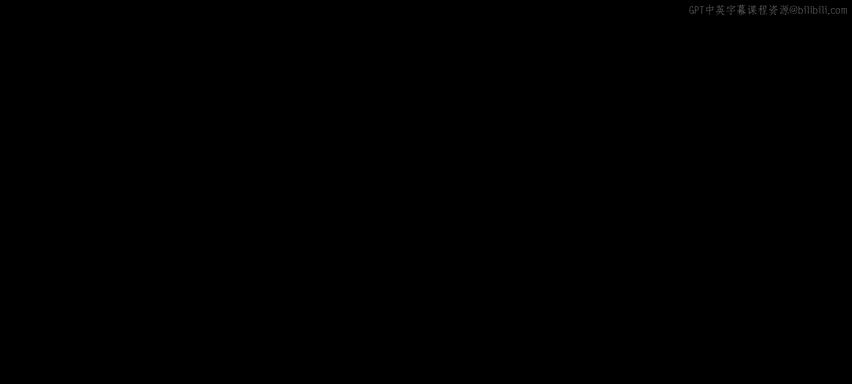
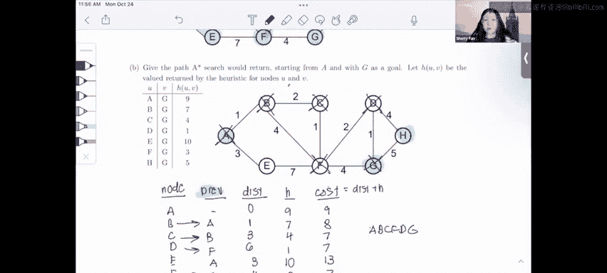

# UCB《数据结构discussion和lab｜CS 61B data structure sp 2024》中英字幕（豆包翻译 - P58：2 - Spring 2023 Exam-Level 10 Problem 1.zh_en - GPT中英字幕课程资源 - BV1i1421x7wC

可南家。If one Russia。

Everyonei everyone， this is Sherry and this is the spring 2023 exam level walkthrough in this video we'll be going over Pro one DFS BFS Dyke Schz an A starR and just as a note since a lot of this problem is repeated from last semester。

 I will just cover the first few parts of this problem and then we'll cut to the video from the last semester so there'll be a little bit of back and forth there。

So just to jump straight in， there's kind of three traversals that we know that deal with unweighted graphs so they don't care about the weights on the edges and that's DFS preor。

 DFS post order。And B FS。So DFS preorder is the order of DFS calls you remember we call DFS on a node and then we call it on every single one of its neighbors and we keep doing that until every node has been visited so in DFS preorder we write down the order of calls and DFS post orderder we write the order of returns and then DFS is completely different it's not a recursive algorithm it's iterative and it's in the order of increasing。

Number of edges from the star， so we first visit all the nodes that are one edge away。

 then two edges away， then three edges away， etctera， etc cetera。So with that idea in mind。

 let's start with these two DFS calls together and we're told that we're start from A and so I'm just going to do pre and post order together because as I call DFS on this graph I'm going to be making calls and I'm also going to be returning from those calls and so for DFS what I recommend you do is you literally just write out the order of calls put like a star or a mark next to a node that's visited and then cross it out when it's returned。

And again， we're told we' start from a， so let's just do that。 So first we're going to call DFS on a。

And then we're going to examine its two neighbors， B and E。あ。

We could visit either B or E both would be correct。

 but in this case we break ties alphabetically so we're going to visit B first so then we're going to go to B。

And then B has two neighbors C and F， but since we're breaking ties alphabetically。

 we're going to visit C。And then again， we go to see's neighbor。

And we break ties alphabetically and visit D。And we break ties alphabetically and visit G。

And then we visit the only neighbor， which is age。And at this point H has no neighbors。

 so this is when the interesting stuff actually happen。

 which is that we're going to return from H because there's no more visit neighbors to visit so that gives us the first node in our post order because remember post order is the order of returns so return from H we go back to G G else has no more neighbors so we're going to return from G。

And then D also has no more neighbors， so we're also going to return from D。And then we go back to F。

 but we actually can't return from F yet because we still have one more neighbor of F， which is E。

 and that has not been visited yet， so we're going to make another DFS call。And that's to eat。

And again， E has no more neighbors， so we're going to return from E。And now we get back to F again。

 and F again， now has no more neighbors so we can safely return from F。

And then we just return up the call stack none of these have any more neighbors because every single node has been visited。

 so that's going to be C BA and so that's our post order and for our preorder of weaknessness look at this order from top to bottom and see what we call things in so that's going to be ABC FDGH E。

Okay and the last thing you need to do is the BFS call so BFS visits an increasing number of edges from the start like I said。

 so you could draw out the whole queue and do like you know Dq pop off the friend add to the back but I find that it's just easier to group notes by distance from the start and then break ties however the problem tells you to break ties so obviously you start off at a because that's what we're given。

Be an ear。 both distance 1。C and f are both distance two D and G are both distance three and H is distance four so it's going to visit in order of these groups。

 but how do we break ties within the groups well like the problem says alphabetically so we're going to visit A then B and then E and then C and then f and then D and then G and then H。

And that's it for these first three and the rest of this worksheet is the same from the previous semester。

 so again I'm going to cut to that previous video and give you a walkthrough from there。Everyone。

 this is the CS61 B fall 2022 exam prep 10 walkthrough and I'm Sherry in this part I'll be going over question one diykestros and A star。

In this problem， we're mechanically doing diytro and A star in this graph and then writing down the order in which each algorithm visits the nodes。

You notice that this worksheet gives us a lot of pseudocode for this problem。

 but I'm not going to focus too much on the pseudocode， look over it on your own time。

 I'm going to focus on how to actually run the algorithms and understand them。

So part A asks us in what ordered diers would visit each node and what the resulting shortest path tree is。

 and just as a reminder the shortest path tree is basically all the shortest paths from the start node to every other node。

One property of distras that I've written down here is that it's like BFS it always visits nodes in increasing distance from the start so instead of drawing out the whole queue and doing the algorithm we can kind of just eyeball this for distras the problem that tells us that we start a so i'm going to highlight like this so obviously the first note that we visit is going to be a。

And then we're just going to visit nodes in order of increasing distance from the start。

So the next closest node is B with distance1， so we just visited B。

 and then the next closest node are C and E with distance 3。

 but the question tells us to break ties alphabetically， so I'm going to visit C first and then E。

And then I'm going to visit the next closest node， which is F at distance 4。Then。😊。

We have D with distance6， so I'm going to visit that。And then the only node is that G and H。

 and G is the closer one， so we're going to visit that first and then H。So our final ordering is A B。

 C， E， F， DGH， and we also have our shortest pasttry， which is just all the highlighted nodes。U。

And you notice that the shortest path from a to every other node actually forms a tree。

 so this is why it's called a shortest path tree。And finally we're going to fill in the table with all the with kind of the paths that we just eyeballed and so I'm going to reveal these and Pa that is our graph and that is our shortest paths you can confirm that these dis two and edge are correct。

 but I'm going to move on to the next part。Now for part B。

 we're going to be doing a star and unfortunately this isn't as simple because we can't just eyeball it like I did with distras。

I'll show you my favorite approach for Astar which I used as a student on exams and which I still use to teach to Susans today。

 I'd like to draw a table with five columns so I'm going have my node。

 I'm going to have the previous node so that's the edge that's going to it。

 I'm going to have disk which is the physical distance of the node H the heuristic value and then cost the actual cost which is distance plus H。

And so you can see that already filled out the node and H columns。

 and that's because those are given to us at the start of the problem。

My shorthand for keeping track of what's on the queue is just using the table itself。

 so when something is not on the queue at all， it's going to have an empty disc column and when something is crossed off the queue I'm just going to cross it out like this。

So right now at the start we just have a with no crreE and this0 because we started at a and the cost of a is going to be0 plus 9 equals9。

 so I'm just going to write nine for the cost。And since we only have a on the Q。

 obviously the first thing to pop off is going to be A。And once we popped off a。

 we're going to add both its neighbors to the Q， so we're going to add B and E。And so。

What are their distances， their distances are just whatever disk A was plus the edge going from a to them。

 so B is going to have disk1 and E is going to have disk3。

And to compute the costs and they both have pre A and to compute the costs。

 we're just going to add this plus H again， so B has cost8 and E has cost 13。

Now we see that B has the lowest cost， so we're going to pop B off the Q strong color we're going to pop B off the Q and we're going to check the neighbors of B B has three neighbors it has CF and A。

 but we already de a and so we never add stuff back on the Q if we've ded it so we're not going to worry about a at all。

So what we're going to do is we're going to add the two neighbors C and F。And C has distance three。

 and this is because B has distance one and we're going to add this edge BCc to it。

 which has weight two， so C is going to have distance three。

And we can do a similar calculation for F and F is going to have distance five。

And we're just going to compute the cost skin， which are seven and eight。Now， if we look at our Q。

 we have three items， we have C， E and F， and the lowest cost item is C。

 so we're going to deque that。And。Let's just consider what neighbors sea has。

 so if we look at the neighbors of sea。It has one neighbor F that hasn't been deed yet and if we look at the path that we currently have。

 if we go actually through this path ABC F， this is actually shorter than our path current path to F which is A B F so we're going to update F so that it goes through C and what that looks like is we're going to make the pre C。

We're going to make the disk for。And we're going to recalculate its cost。

 which is now going to be seven instead of eight。Now， if we look at our Q， the lowest cost item is F。

 so I'm going to pop that off。And now F has been popped off and F actually has two neighbors E and D we can see that right now we have a path to E from A and obviously this is shorter than going this like super circuitous route all the way to E。

 so we're not going to update E， but we do have to update D because it isn't even on the queue yet。

🤧So what we're going to do is we're going to add this edge 2 to four。

 and so it's going to have disk6， it's going to have pre of F and its cost is going to be7。

Now our lowest cost item is D， so we're going to pop that off the queue。

And so what are these's neighbors？It has two neighbors， G and H。

And so what we're going to do is again， we're going to add both those to the Q。

 they're going to have Pv D and their distances are going to be， let's see。

Their distances are going to be seven and 10， and if we add these up， we get 7 and 15 for the costs。

So now again， we find the lowest cost item， which is G， and so we're going to pop that off the queue。

And this is our goal， so we actually don't continue anymore。

 even though we haven't visited or found the shortest path to all the nodes。

And just to recap our order was AB CF FDG and to find the shortest path to G。

 which is the goal of A star， we just backtrack through this column prev so we're going to use this column prev and find our shortest path so we notice that the prev of G is D so we ended at G the prev of that is D the prev of D is F the pre of F is C the prev of C is B and the prev of B is a which is our starting node so our final path is AB CF FDG right here。

That's it for this problem and here's my weekly exam tip for shortest path problems try not to draw out like this entire pseudocode and like all the cues and everything for diytras you can just eyeball it like I did earlier and for Astar you can use this table to keep track of everything good luck in the rest of 61b。

