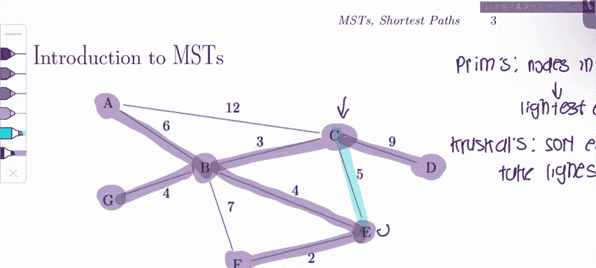

# 数据结构：P59：3 - 最小生成树算法与概念

在本节课中，我们将学习最小生成树（MST）的两种基本算法——普里姆算法和克鲁斯卡尔算法，并通过一个具体问题来实践。随后，我们将探讨几个关于MST的重要概念判断题。

## 算法回顾

上一节我们提到了MST，本节中我们来看看两种构建MST的经典算法。

### 普里姆算法

普里姆算法基于**切分定理**。其核心思想是：在每一步，算法维护一个已包含在MST中的顶点集合。通过一个“切分”将该集合与图中其余顶点分开，然后选择连接这两个部分的最小权重边加入MST。

**算法步骤简述**：
1.  从任意一个顶点开始，将其加入MST集合。
2.  在所有连接“MST集合内顶点”与“集合外顶点”的边中，选择权重最小的边。
3.  将该边及其连接的集合外顶点加入MST集合。
4.  重复步骤2和3，直到所有顶点都被包含。

### 克鲁斯卡尔算法

与普里姆算法不同，克鲁斯卡尔算法直接对边进行操作。它按权重对所有边进行排序，然后依次考虑每条边，如果加入该边不会在已形成的子图中构成环，则将其加入MST。

**算法步骤简述**：
1.  将图中所有边按权重从小到大排序。
2.  初始化一个空的边集合作为MST。
3.  按顺序检查每条边，如果将其加入当前MST边集合不会形成环，则加入。
4.  重复步骤3，直到MST包含 `V-1` 条边（`V`为顶点数）。

## 问题演练

现在，我们应用这两种算法来解决一个具体问题。给定一个带权无向图，我们将分别使用普里姆算法（从顶点A开始）和克鲁斯卡尔算法找出其MST。

以下是使用普里姆算法的步骤：

1.  **起始**：从顶点A开始。当前MST集合为 `{A}`。跨越切分（集合内 vs 集合外）的边是 `A-B(6)` 和 `A-G(12)`。选择权重最小的边 `A-B`。
2.  **第二步**：MST集合更新为 `{A, B}`。候选边为 `B-C(4)`, `B-E(5)`, `B-F(8)`, `B-G(5)`, `A-G(12)`。选择最小边 `B-C`。
3.  **第三步**：MST集合更新为 `{A, B, C}`。候选边为 `C-D(7)`, `C-E(10)`, `B-E(5)`, `B-F(8)`, `B-G(5)`, `A-G(12)`。选择最小边 `B-E`（与`B-G`权重相同，按字母顺序`B-E`优先）。
4.  **第四步**：MST集合更新为 `{A, B, C, E}`。候选边为 `E-F(2)`, `C-D(7)`, `C-E(10)`, `B-F(8)`, `B-G(5)`, `A-G(12)`。选择最小边 `E-F`。
5.  **第五步**：MST集合更新为 `{A, B, C, E, F}`。候选边为 `C-D(7)`, `B-G(5)`, `A-G(12)`。选择最小边 `B-G`。
6.  **第六步**：MST集合更新为 `{A, B, C, E, F, G}`。剩余唯一候选边为 `C-D(7)`，将其加入。
7.  **完成**：所有顶点 `{A, B, C, D, E, F, G}` 均被包含。最终MST包含的边及其顺序为：`A-B`, `B-C`, `B-E`, `E-F`, `B-G`, `C-D`。

接下来，我们使用克鲁斯卡尔算法。以下是按权重排序后的边列表（括号内为权重），我们将依次判断是否加入：

1.  `E-F (2)`：加入，不形成环。
2.  `B-C (4)`：加入，不形成环。
3.  `B-E (5)`：加入，不形成环。
4.  `B-G (5)`：加入，不形成环。
5.  `C-E (10)`：检查。此时顶点 `B, C, E, G, F` 已连通，加入 `C-E` 会在 `B-C-E-B` 路径上形成环，因此**跳过**。
6.  `A-B (6)`：加入，不形成环。
7.  `C-D (7)`：加入，不形成环。此时已加入6条边 (`V-1`)，算法终止。
8.  `B-F (8)`, `A-G (12)` 等边不再考虑。

最终，克鲁斯卡尔算法得到的MST与普里姆算法结果相同，但边的加入顺序不同。

## 概念判断题

在实践了算法之后，我们来探讨几个关于MST性质的理论问题。

以下是三个判断题及其解析：

1.  **命题**：在一个所有边权均唯一的图中，将最小权重的边的权重加1，一定会改变该图最小生成树的总权重。
    *   **判断**：**正确**。
    *   **解析**：设原最小权重边为 `e`，原MST为 `T`，新MST为 `T*`。分两种情况讨论：
        *   情况一：`e` 在 `T*` 中。那么 `T*` 的总权重比 `T` 增加了1。
        *   情况二：`e` 不在 `T*` 中。由于MST必须包含 `V-1` 条边，且边权唯一，`T*` 中必然有一条不同于 `e` 的边 `e‘` 替换了它。因此 `T*` 的总权重不等于 `T`。
        无论哪种情况，新MST的总权重都发生了变化。

2.  **命题**：如果图中所有边的权重都不同（唯一），那么该图只有唯一一棵最小生成树。
    *   **判断**：**正确**。
    *   **解析**：这基于**切分定理**。对于图的任何一个切分，跨越该切分的最小权重边**必须**包含在任意MST中。由于所有权重唯一，对于每个切分，“最小权重边”有且仅有一条。因此，在构建MST的每一步，要加入的边都是唯一确定的，最终只会得到一棵MST。

3.  **命题**：图中任意两顶点 `u` 和 `v` 之间的最短路径，一定包含在该图的最小生成树中。
    *   **判断**：**错误**。
    *   **解析**：MST的目标是连接所有顶点的总权重最小，而非保证任意两点间的路径权重最小（即最短路径）。反例很容易找到。考虑本课例题中的顶点 `C` 和 `E`。在MST中，`C` 到 `E` 的路径是 `C-B-E`，总权重为 `4+5=9`。然而，图中存在直接边 `C-E`，权重为 `10`。虽然此例中MST路径更短，但可以构造其他图，使得直接边（或非MST路径）比MST中的路径更短，从而证明最短路径不一定在MST中。更一般地说，**最短路径树**和**最小生成树**是解决不同问题的两种结构，通常不相等。

## 总结

本节课中我们一起学习了最小生成树的核心内容。我们首先实践了普里姆算法和克鲁斯卡尔算法这两种构建MST的方法，普里姆算法基于顶点和切分定理逐步扩展，而克鲁斯卡尔算法则通过对边排序并避免环来构建。随后，我们通过三个理论问题深化了对MST性质的理解：边权唯一时MST的唯一性、特定边权变化对MST的影响，以及MST与最短路径树的区别。掌握这些算法和概念是理解和应用图论中最小生成树的基础。