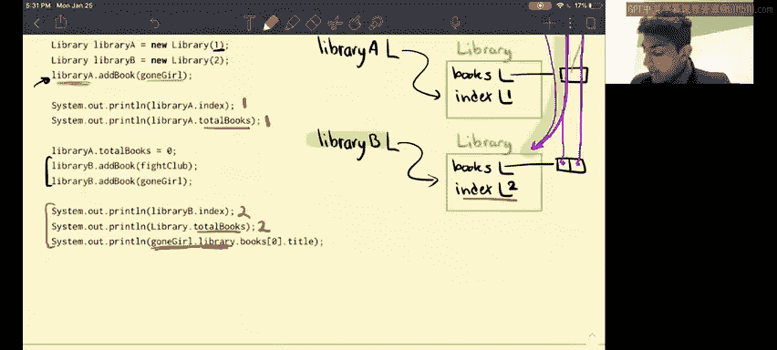

# CS 61B：数据结构讨论与实验：第3章：静态书籍 📚


## 概述
在本节课中，我们将深入学习Java中的`static`关键字。我们将通过分析一个关于`Book`和`Library`类的练习题，来理解静态变量、静态方法与实例变量、实例方法之间的核心区别。课程分为两部分：第一部分探讨修改代码中`static`关键字的影响；第二部分则通过执行一段主程序来观察静态成员在程序运行时的具体行为。

---

## 第一部分：理解静态成员 🧠

在深入具体问题之前，让我们先花几分钟时间理解静态方法和静态变量。

### 静态变量 vs. 实例变量
请看以下代码片段：
```java
public class Book {
    private String title; // 实例变量
    private static Book last; // 静态变量
}
```
*   **实例变量**（如`title`）属于类的**每个实例**。每创建一个`Book`对象，该对象都有自己独立的`title`。
*   **静态变量**（如`last`）属于**类本身**。类的所有实例**共享**同一个静态变量。如果一个实例修改了`last`，其他所有实例访问到的`last`都会是这个修改后的值。

### 静态方法 vs. 实例方法
```java
public class Book {
    public static String lastBookTitle() { // 静态方法
        return last.title;
    }
    public String getTitle() { // 实例方法
        return title;
    }
}
```
*   **实例方法**属于类的实例。
*   **静态方法**属于类本身。

这里有几个关键点：
1.  一个**类的实例**可以访问**所有内容**：实例变量/方法和静态变量/方法。
2.  但是，**类名本身**（如`Book`）**只能**访问静态变量和静态方法。尝试用类名访问实例变量或方法会导致编译错误。
3.  当一个方法与特定实例无关，而是与整个类相关时，通常将其声明为静态方法。

以上是对静态成员的基本介绍。接下来，我们将在具体问题中探索更多细节。

---

## 第二部分：代码修改分析 🔍

现在，我们开始分析练习题的第一部分。我们将考虑对原始代码进行一系列修改，并判断每项修改是否会导致编译错误。

以下是需要判断的修改项：

### 1. 将 `totalBooks` 变量改为非静态
**修改内容**：移除`Library`类中`totalBooks`变量的`static`修饰符。
**分析**：我们需要检查`totalBooks`变量在何处被调用。它只在实例方法`addABook`中被访问。实例方法允许访问实例变量。因此，这项修改是允许的，代码可以编译。

### 2. 将 `lastBookTitle` 方法改为非静态
**修改内容**：移除`Book`类中`lastBookTitle`方法的`static`修饰符，使其成为实例方法。
**分析**：我们需要判断在实例方法`lastBookTitle`中访问的内容是否合法。该方法内部只访问了静态变量`last`。实例可以访问静态变量。因此，这项修改是允许的，代码可以编译。

### 3. 将 `addABook` 方法改为静态
**修改内容**：为`Library`类中的`addABook`方法添加`static`关键字。
**分析**：这项修改**不允许**。静态方法中不能访问实例变量。`addABook`方法内部访问了实例变量`index`。直观上理解，我们可以通过类名（如`Library.addABook`）调用静态方法，但类本身并不知道任何特定实例的`index`值。因此，这会导致编译错误。

### 4. 将 `last` 变量改为非静态
**修改内容**：移除`Book`类中`last`变量的`static`修饰符，使其成为实例变量。
**分析**：`last`变量在两个地方被访问：
*   在构造函数中：构造函数中访问实例变量是允许的。
*   在静态方法`lastBookTitle`中：**这里会出现问题**。静态方法不能访问实例变量。因此，这项修改会导致编译错误。

### 5. 将 `library` 变量改为静态
**修改内容**：为`Book`类中的`library`变量添加`static`关键字。
**分析**：这是一个有趣的情况。
*   在构造函数中设置`library = null`是允许的，因为构造函数中可以访问静态变量。
*   在`addABook`方法中，通过一个`Book`实例（`b.library = this;`）来访问静态变量`library`，这在语法上是**允许的**，代码可以编译。
*   然而，这**不是良好的编程实践**。为了代码清晰，访问静态变量时应该使用类名（如`Book.library`），而不是通过实例。

第一部分内容具有一定挑战性，恭喜你完成！接下来，让我们进入第二部分。

---

## 第三部分：程序执行与输出 📝

在第二部分，我们将使用之前的`Book`和`Library`类，分析下面主方法的输出。如果某行代码导致错误，请写出具体的错误原因，然后继续执行后续代码。

为了清晰地分析，我们可以画出对象和静态变量的状态图。以下是代码执行的逐步分析：

**初始状态**：`Book.last` 被初始化为 `null`，`Library.totalBooks` 被初始化为 `0`。

1.  `System.out.println(Library.totalBooks);`
    *   通过类名访问静态变量`totalBooks`，其值为`0`。
    *   **输出：`0`**

2.  `System.out.println(Book.lastBookTitle());`
    *   通过类名调用静态方法`lastBookTitle()`。该方法尝试返回`last.title`。
    *   此时`last`为`null`，尝试访问`null`对象的属性（`title`）会抛出 **`NullPointerException`**。
    *   **输出：错误（运行时错误）**

3.  `System.out.println(Book.getTitle());`
    *   尝试通过类名`Book`调用实例方法`getTitle()`。这是不允许的。
    *   **输出：错误（编译错误）**

**创建两个Book对象**：
*   `Book goneGirl = new Book(“Gone Girl”);`
    *   设置`goneGirl.title = “Gone Girl”`。
    *   设置静态变量`last = this`（即指向`goneGirl`对象）。
    *   设置`goneGirl.library = null`。
*   `Book fightClub = new Book(“Fight Club”);`
    *   设置`fightClub.title = “Fight Club”`。
    *   设置静态变量`last = this`（现在`last`指向`fightClub`对象，覆盖了之前指向`goneGirl`的引用）。
    *   设置`fightClub.library = null`。

4.  `System.out.println(goneGirl.getTitle());`
    *   访问`goneGirl`实例的`title`。
    *   **输出：`Gone Girl`**

5.  `System.out.println(Book.lastBookTitle());`
    *   调用静态方法`lastBookTitle()`，它返回`last.title`。
    *   此时`last`指向`fightClub`，所以返回`fightClub.title`。
    *   **输出：`Fight Club`**

6.  `System.out.println(fightClub.lastBookTitle());`
    *   通过实例`fightClub`调用静态方法`lastBookTitle()`。这与通过类名调用效果相同，返回`last.title`（即`Fight Club`）。
    *   **输出：`Fight Club`**

7.  `System.out.println(goneGirl.last.title);`
    *   `goneGirl.last` 访问的是静态变量 `last`，该变量目前指向 `fightClub` 对象。
    *   因此，这相当于访问 `fightClub.title`。
    *   **输出：`Fight Club`**

**创建两个Library对象并添加书籍**：
*   `Library a = new Library(1);` 创建长度为1的数组，`a.index = 0`。
*   `Library b = new Library(2);` 创建长度为2的数组，`b.index = 0`。

8.  `a.addABook(goneGirl);`
    *   将`goneGirl`加入数组`a.books[0]`。
    *   `a.index` 自增为 `1`。
    *   静态变量 `Library.totalBooks` 自增为 `1`。
    *   设置 `goneGirl.library = a`（指向图书馆A）。

9.  `System.out.println(a.index + ” ” + a.totalBooks);`
    *   `a.index` 是实例变量，值为 `1`。
    *   `a.totalBooks` 通过实例访问静态变量（允许但不推荐），值为 `1`。
    *   **输出：`1 1`**

10. `a.totalBooks = 0;`
    *   通过实例`a`将静态变量`totalBooks`设置为`0`。

11. `b.addABook(fightClub);`
    *   将`fightClub`加入数组`b.books[0]`。
    *   `b.index` 自增为 `1`。
    *   静态变量 `Library.totalBooks` 自增为 `1`（从0变为1）。
    *   设置 `fightClub.library = b`。

12. `b.addABook(goneGirl);`
    *   将`goneGirl`加入数组`b.books[1]`。
    *   `b.index` 自增为 `2`。
    *   静态变量 `Library.totalBooks` 自增为 `2`。
    *   设置 `goneGirl.library = b`（现在`goneGirl`的图书馆从`a`变成了`b`）。

13. `System.out.println(b.index + ” ” + b.totalBooks);`
    *   `b.index` 是实例变量，值为 `2`。
    *   `b.totalBooks` 是静态变量，当前值为 `2`。
    *   **输出：`2 2`**

14. `System.out.println(goneGirl.library.books[0].getTitle());`
    *   `goneGirl.library` 是 `b`。
    *   `b.books[0]` 是 `fightClub`。
    *   `fightClub.getTitle()` 返回 `”Fight Club”`。
    *   **输出：`Fight Club`**



---

## 总结 🎯
本节课我们一起深入学习了Java中`static`关键字的核心概念。我们通过分析代码修改，明确了静态成员与实例成员在访问权限上的根本区别：类名只能访问静态成员，而实例可以访问所有成员。随后，我们通过跟踪一段复杂程序的执行过程，观察了静态变量被所有实例共享的特性如何影响程序状态，并练习了如何预测包含静态成员的代码的输出结果。掌握这些概念对于理解面向对象程序的设计与行为至关重要。