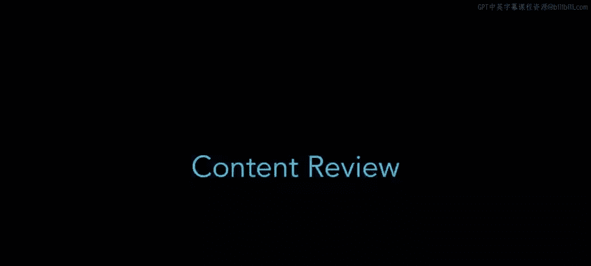
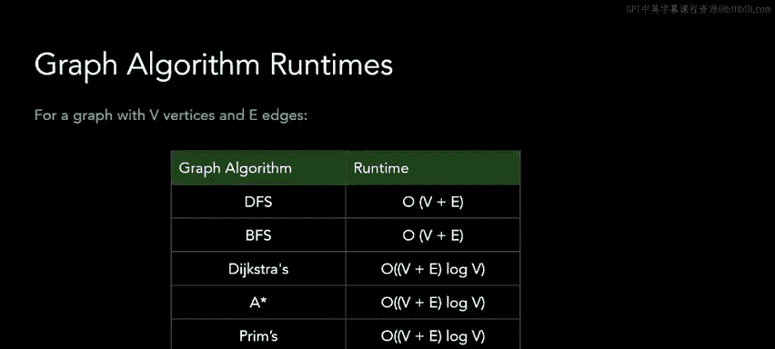

# UCB《数据结构discussion和lab｜CS 61B data structure sp 2024》中英字幕（豆包翻译 - P61：1 - Fall 2022 Discussion 11 Content Review.zh_en - GPT中英字幕课程资源 - BV1i1421x7wC

Hi， welcome to discussionion the 11。 We're going be talking about graphs and tries in this discussion。

So we're going to start with triess。 triess are a special type of data structure。

 a special type of tree to be more specific that are meant to be storing words。

 and these trees in particular are very good at doing operations based on the prefixes of words。

So in a try， each word is going to be stored letter by letter instead of the whole word as one string。

And each letter is going to point to the next letter in the word， as its child。

We're going to mark each word with a word ending node to denote that a certain letter ends a certain word。

 So， for instance， in this try， the orange node represents the end of a word。 So the word cat C。

 A T is in this try。 And so is the word catch C， A T， C， H。

Because cat and Cat share the common prefix of CA A T。

 note that we don't have to store that prefix two times， thus making us more efficient。

We can also see that this try contains the word dog D O G， and the wordD D IG。Again。

 because these two share the letter D as a prefix， we don't store it multiple times。

Now this try does not contain the word do D O， and we can see this because the O under the D letter does not have the orange marking。

 which means that it's not the end of a word that's within our try。

Will do more operations on a try later in the first problem on this worksheet。

Topological sorting is a graph algorithm that only works on directed acyclic graphs。

So this means graphs that have direction on each of their edges， and it does not have any cycles。

In a topological sort， our goal is to sort the vertic in a certain order。

 where each vertex should come before all of its neighbors。So for example。

 because three has an ongoinggoing edge to1， three should come before one in our topological sort。

 and because two has an ongoinggo edge to three， two should come before three。

Note that for any given directed acyclic graph or dag。

 we might have multiple possible topological sorts。

 So this topological sort that's on this slide is different from the one shown in the previous slide。

 but you can see that two still comes before3 and three still comes before one。

 so it's still a valid topological sort and you can verify that all the other nodes are in the correct order as well。

We're going be using some language when we talk about dags。

A source node is a node that has no incoming edges， so it only has outgoing edges。

 and a sync node is a node that has no outgoing edges。

 So it's kind of like the opposite of a source node。Finally。

 let's go over some graph algorithm runtime。Here are the runtime for all the common graph algorithms that we've discussed so far。

These might be worth putting down on your cheat sheet。

 And it's good to try to reason about why each of these algorithms have the runtime that we've written on the screen here。

