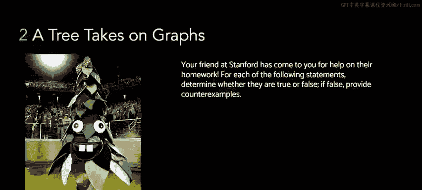
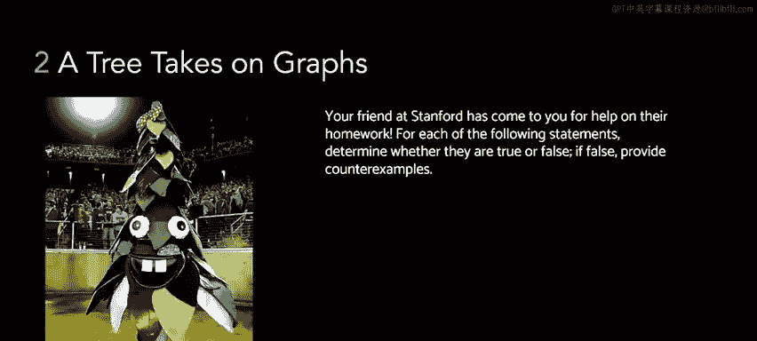
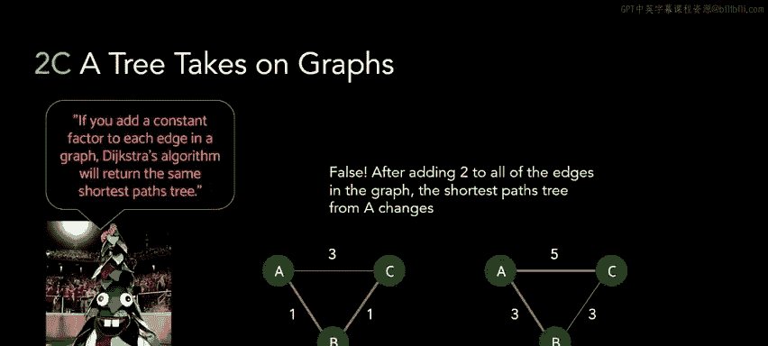

# UCB《数据结构discussion和lab｜CS 61B data structure sp 2024》中英字幕（豆包翻译 - P63：3 - Fall 2022 Discussion 11 Question 2.zh_en - GPT中英字幕课程资源 - BV1i1421x7wC

In this problem， we have a tree who's trying to tell us certain statements about graphs。

 and it's our job to tell this tree whether their statements are true or they false。

This first statement is a graph with edges that all have the same edge weight will always have multiple MSTs。

Take a moment to try and think of a counterex for this statement。All right。

 if you thought of a counterexample， it probably looked something like this。

So if I graph in question。Has no cycles， in other words it's a tree。

 then the only possible spanning tree we can make for this graph is the graph itself， in other words。

 there's only one way to connect all these nodes together because there's no cycles。

If the graph had to have cycles， then it's possible that we might have multiple MSTs for a graph with the same edge weights。

But because this statement is regarding all graphs in general， it's not necessarily true。

This second statement says， no matter which heuristic you use。

 A star search will always return the correct shortest path。So， again。

Try to think of a counter examplele and come up with a heuristic and a graph where using A star with that heuristic on that graph doesn't return the corrector path。

So here's one such counter example。Remember that in lecture。

 we discussed that the heuristic needs to have certain properties earned to be considered correct。

In particular， the heuristic needs to be consistent and misible。

We won't be quizzing you on the specific properties of correct A star heuristics。

 but just know that we can't pick any random heuristic and that our heuristic will impact whether or not A star gives us the correct path。

So in this counter example， you can see that the heuristic， which is written in the parentheses。

 makes C a very high priority。 In other words， we're going to visit it very late。Because of this。

 our A star path returns the wrong path from A to D。

It goes from A to B to D instead of from A to C to D， which is the correct shortest path。

 but because our heuristic told Aar to look away from C， we ended up getting the wrong path。

This third statement says。If you add a constant factor to each edge in a graph。

 the extra algorithm will return the same shortest path tree。So just like the previous problems。

 try to think of a graph where if you added a constant amount to all the adoids。

You would get a different short of past tree。And if it's not possible。

 try to reason about why it might not be possible。So one simple counter example is this triangle graph。

Where we have three nodes all connected to each other。You can see that on the left hand side。

 if we've added two to all the edge weights， we get their graph on the right hand side。

 and all of a sudden， the path from A to C becomes different because on the left。

 the shortest path was to go from A to B then to C with a length of 2。

But after adding2 to every edge， now the shortest path becomes to go from a directly to C with a length of5。

In general， adding some amount to every edge is going to make the paths with a lot of edges cost more。

