# 数据结构：11：课程依赖关系与拓扑排序 📚

在本节课中，我们将学习如何分析课程之间的先修关系，并使用图算法来找到一个满足所有先修条件的课程学习顺序。我们将通过一个具体的例子，介绍如何构建依赖图，以及如何使用拓扑排序算法来解决课程安排问题。

---

## 构建课程依赖图 🗺️

上一节我们介绍了问题的背景。本节中，我们来看看如何将课程和先修条件表示为一个有向图。

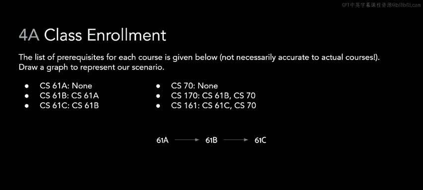

每个课程被表示为一个节点。如果一门课程是另一门课程的先修课，我们就从先修课程节点画一条有向边指向后续课程节点。

以下是初始的课程先修关系：
*   CS 61A 是 CS 61B 的先修课。
*   CS 61B 是 CS 61C 的先修课。
*   CS 70 没有先修课。
*   CS 70 和 CS 61B 都是 CS 170 的先修课。
*   CS 61C 和 CS 70 都是 CS 161 的先修课。

根据这些关系，我们可以绘制出对应的依赖图。

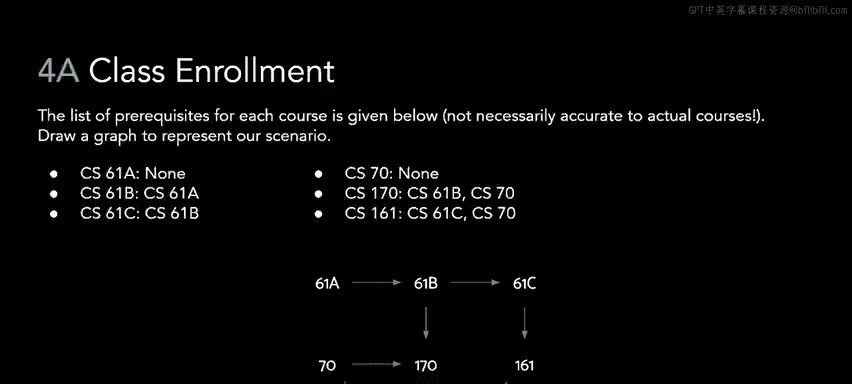

---

## 处理新的依赖关系与循环依赖 ⚠️

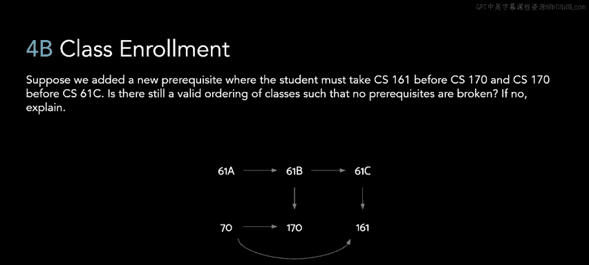

现在，假设引入了一些新的先修条件。

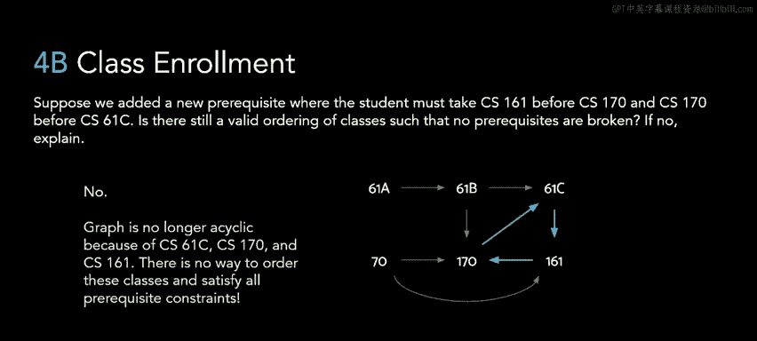

新的依赖关系是：
*   必须先修 CS 161，才能修 CS 170。
*   必须先修 CS 170，才能修 CS 61C。

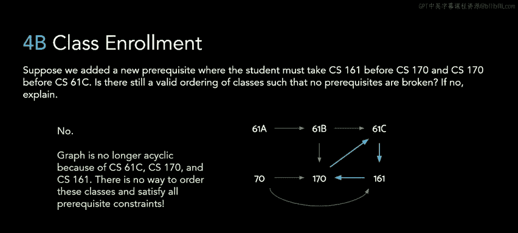

如果我们像之前一样，将这些新依赖关系表示为图中的有向边，会发现这些新边与原有边共同形成了一个循环。

因为图中存在循环，我们无法找到一个满足所有先修条件的学习顺序。例如，要修 CS 61C，必须先修 CS 170；要修 CS 170，必须先修 CS 161；而要修 CS 161，又必须先修 CS 61C。这就形成了一个无法打破的闭环。

---

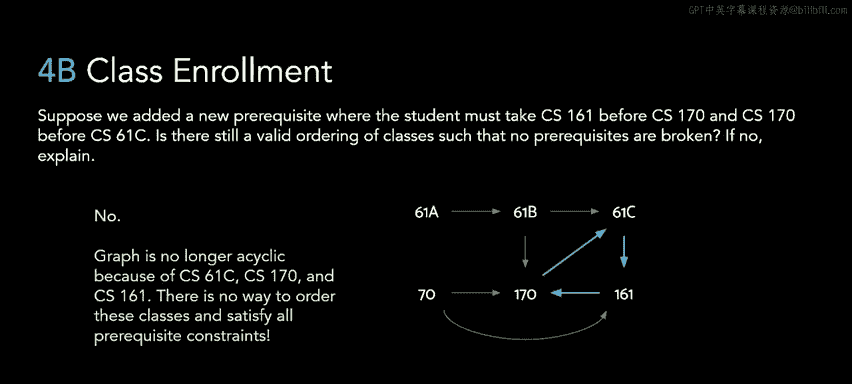

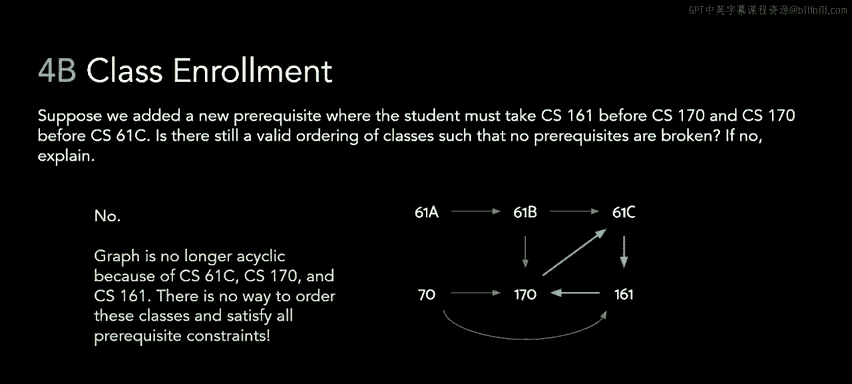

## 应用拓扑排序算法 🔄

上一节我们看到循环依赖会导致问题。本节中，我们回到最初的先修关系图，看看如何找到一个有效的学习顺序。我们可以通过执行一个叫做**拓扑排序**的算法来实现。

拓扑排序的工作原理是进行深度优先遍历（DFS），并在完成访问一个节点的所有后继节点后，将该节点放入一个列表中。注意，我们不是在首次访问节点时放入，而是在其所有邻居节点都被访问完毕后放入。

算法结束时，我们将得到的列表反转，即可得到拓扑排序的结果。

让我们通过一个例子来演示这个算法的执行过程。

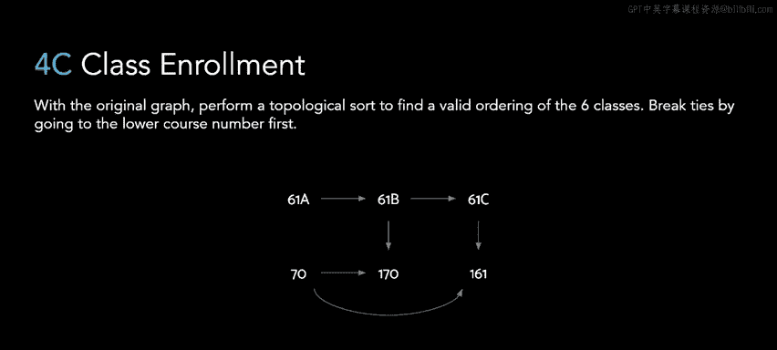

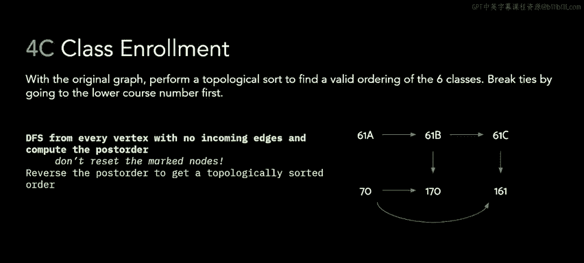

我们从节点 CS 61A 开始深度优先搜索，将其放入栈中。DFS 会访问 CS 61A 的邻居，首先是 CS 61B。

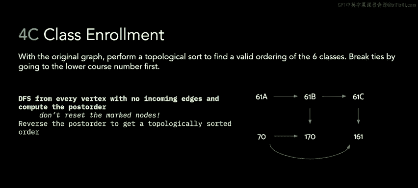

接着，DFS 访问 CS 61B 的所有邻居。我们选择先访问 CS 61C。

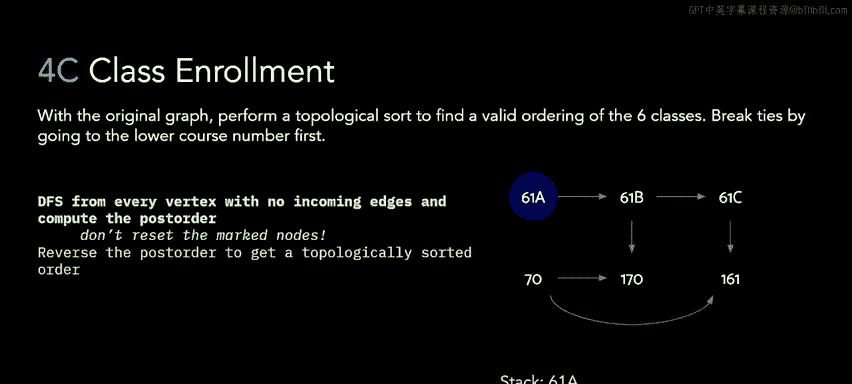

然后，访问 CS 61C 的邻居，即 CS 161。

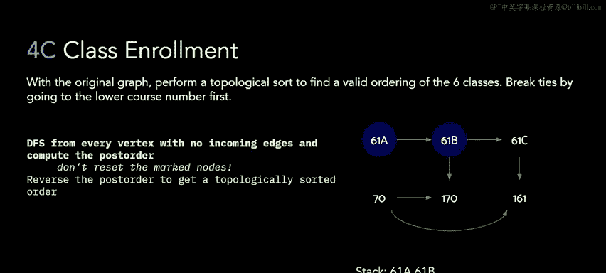

由于 CS 161 没有邻居，访问完成，我们将其放入结果列表。

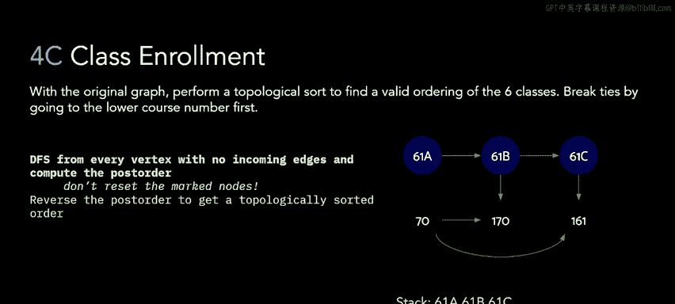

现在我们回到 CS 61C。CS 61C 没有更多未访问的邻居，因此访问完成，我们将其放入结果列表。

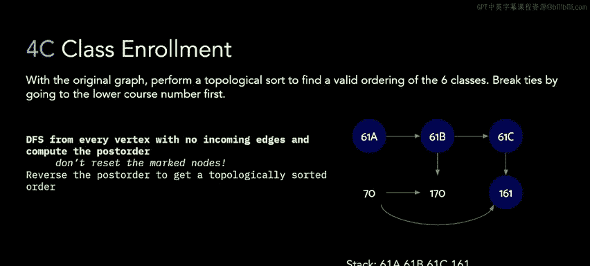

现在我们回到 CS 61B。CS 61B 还有一个邻居 CS 170 未访问，我们去访问它。

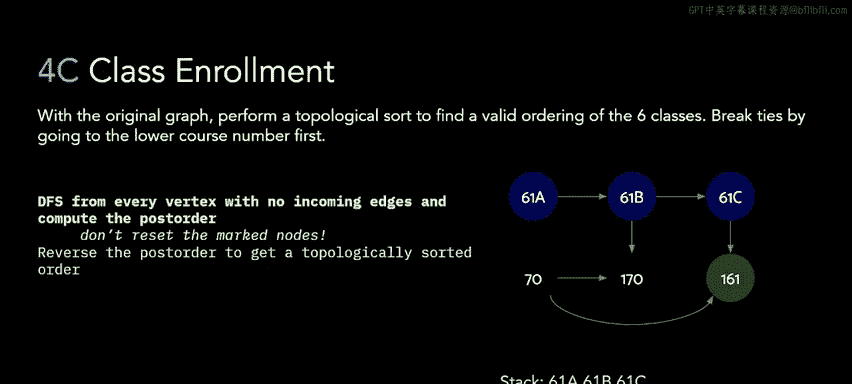

CS 170 没有邻居，访问完成，将其放入结果列表。

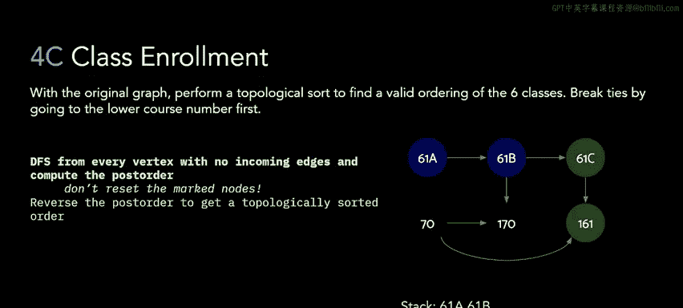

现在我们回到 CS 61B。CS 61B 的所有邻居都已访问完毕，因此将其放入结果列表。

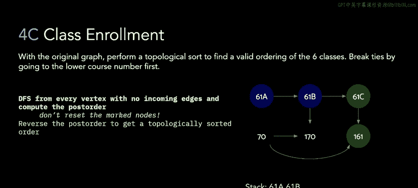

最后回到 CS 61A，其所有邻居也已访问完毕，将其放入结果列表。

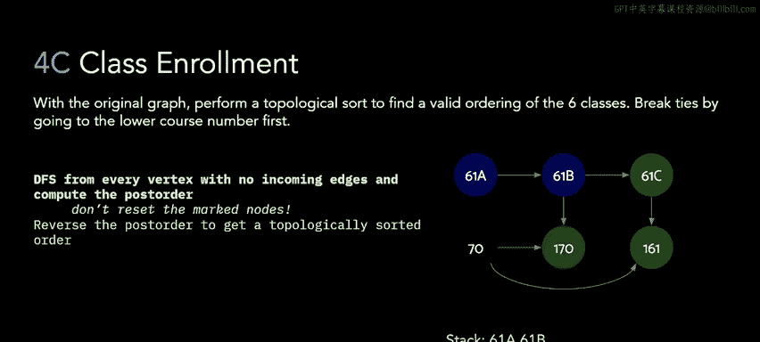

至此，我们从 CS 61A 出发可到达的所有节点都已访问，但图中还有节点 CS 70 未探索。我们继续从 CS 70 开始 DFS。

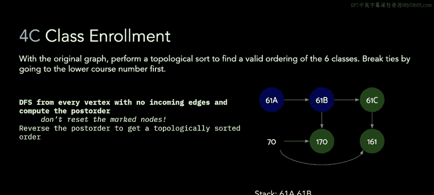

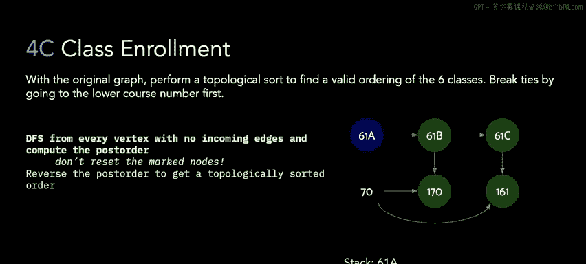

CS 70 的所有邻居（CS 170 和 CS 161）都已被访问过，因此直接将其放入结果列表。

现在，我们得到了一个后序访问列表。将其反转，就得到了一个有效的拓扑排序顺序。

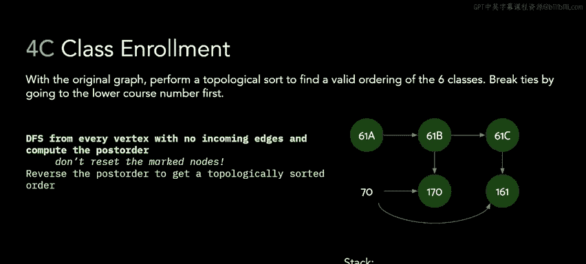

在这个例子中，反转后的顺序是：CS 70, CS 61A, CS 61B, CS 170, CS 61C, CS 161。

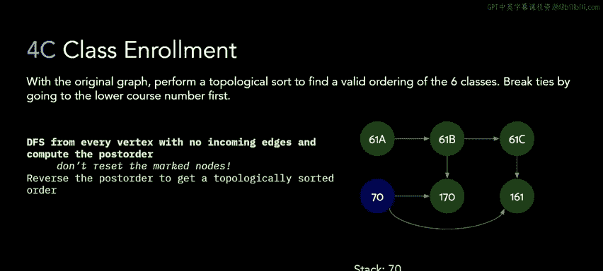

你可以自行验证，按照这个顺序学习课程，不会违反任何先修条件。

---

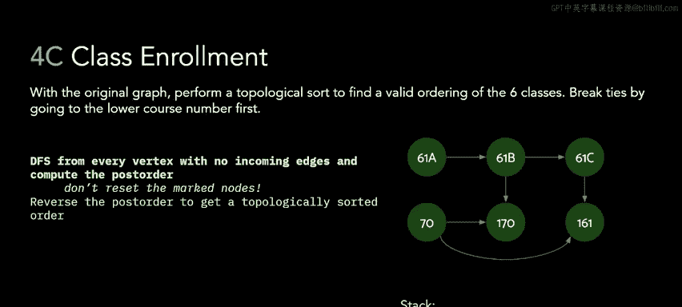

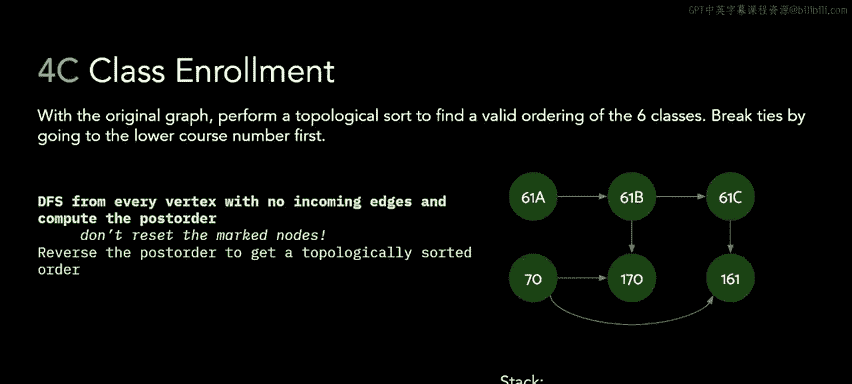

## 总结 📝

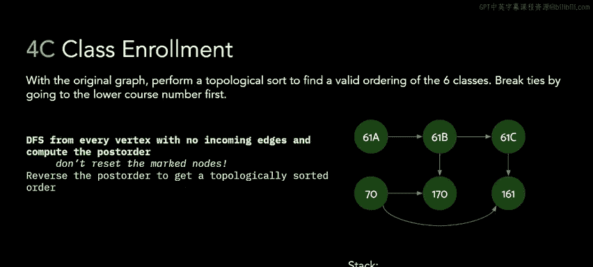

本节课中，我们一起学习了如何将课程依赖关系建模为有向图。我们看到了循环依赖会导致无法找到合法的学习顺序。最后，我们详细演示了如何使用深度优先搜索和拓扑排序算法，在一个无环的依赖图中找到一个满足所有先修条件的课程学习序列。掌握这一方法对于解决任务调度、依赖管理等实际问题非常有帮助。