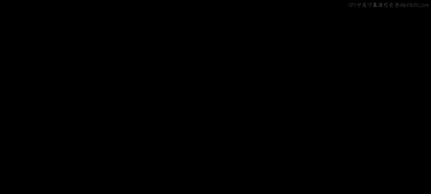
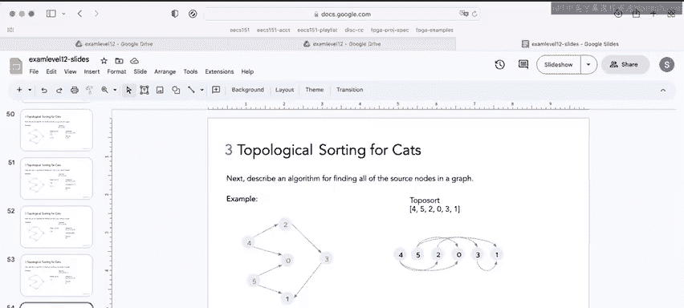

# UCB《数据结构discussion和lab｜CS 61B data structure sp 2024》中英字幕（豆包翻译 - P67：2 - Spring 2023 Exam-Level 12 Problem 3.zh_en - GPT中英字幕课程资源 - BV1i1421x7wC

Everyone， this is Sherry and this is the spring 2023 exam levell 12 walkthrough in this video I'll be going over Pro three topological sorting for cats。

This problem is kind of a guided algorithm design question。

 so on exams you'll probably see some kind of question that asks you to design an algorithm for doing something particular this question kind of takes you step by step through the proof and how to come up with an algorithm。

So this question kind of has two parts， the first part is just recapping what we learned in class about topological sort already and the second part is the actual guided proof towards the algorithm。

Let's start with the first part， which just asks us to describe at a high level how to perform a topological sort using an algorithm we already know and provide the time complexity。

So as you might remember from lecture， the way we do topological sort is we just reverse the edges and then we perform post order traversal and whatever order the post order traversal outputs is our topological sort。

And the runtime of this， of course， is just the runtime of DFS， which is0 of V plus E。

The next part of this problem takes us through the proof and algorithm for a new way to do topological sort。

First， we want to prove this fact that every DAg has at least one source node and one single。

And if we think about this， this must。This kind of must be true。

 right because if we topological sort， there's kind of like an order to the vertices and there must be one vertex kind of at the beginning and one vertex at the end。

And just to remind you， a source node is a node with no incoming edges and a sync node is a node with no outgoing edges。

So one way that you might want to prove things in general is approved by contradiction。

 which means that you assume the opposite of what you're trying to prove。

 and then you show that if you assume the opposite there's a contradiction。

 which means a statement must be true。So we're going to do that here。

 since we want to prove that every DAG has at least one source node。

 we can start by assuming there's a DAG that exists with no sync。

 so we're assuming the opposite of what we want to prove。

 which is that every DAg has at least one sync node。嗯。So if there's a dad that exists with no sinks。

 that means。Every single node has an outgoing edge right。

 because a sync node is a node that has no outgoing edges。

That means we can just kind of do a traversal of this graph by continuously taking the outgoing edge of every vertex and again since we assume that。

There's no sinks every node has an outgoing edge so what that looks like is something like this right again we assume that there's no sinks so every node has an outgoing edge。

 which means that if we traverse all V vertices of this graph，Every node has an outgoing edge。

And that means when we get to the Vve vertex， when we get to the very last vertex that's visited。

 that also has an outgoing edge， but it must have an outgoing edge out to one of the vertices that we already visited right because we visited every single other vertex in this graph。

Which means that there's a cycle， if you look here， there's a cycle from four to five。

To some other vertices， to V the very last vertex that we visit and since every node has an outgoing edge。

 V must also have an outgoing edge and this edge must be to something that we already visited。

This is a contradiction note because we said that this is a dag with no sync notes。

 we said that suppose a dag exists with no syncs but this is clearly not a dag which is a contradiction。

 so that means that every dag must have at least one sink。

And we can do a similar proof for the source nodes by just reversing the edges because if we reverse the edges。

 every sink becomes a source and every source becomes a sink。So again。

 here we used a proof by contradiction and what we proved is that every dag must have at least one source and one sink。

Okay， now the next thing that we have to figure out is an algorithm for finding all the source nodes of a graph。

And again， just to remind you， a source node has no incoming edges。

 so in this case one would be a source。So there's a couple different ways to do this。

 but the algorithm I'm going to describe is basically we count the incoming edges for each node。

And how the way we do that is we create an array of counts for each vertex。

 and then we just process the adjacency list and keep track of the incoming edges for each node。

 and then we go over our list and find any vertices of zero incoming edges。So for example。

 if we use this graph， we can see that we have exactly what two source nodes which are for and five。

 so what we're going to do is we're going to iterate over this adjacency list and then every time we see an incoming edge we're going to add to this list of incoming edges。

So for example first we look at zero there's there's no edges there at all so we just skip over that one has also the same issue where it has no edges。

 so we skip over that， but now we get to two and we see that two has an edge to three which means three has one incoming edge。

 so we're going to add one to the number of incoming edges for three。

And let's just do one more as an example， we see that three has an edge to one。

 which means that one has an incoming edge from three。

 so we increase the number of incoming edges for one。And if we keep doing this。

 we end up with this list of incoming edges and we see that vertices four and five have zero incoming edges。

 which means that they are source nodes， so we figure out an algorithm to find all the source nodes in a graph。

Okay， finally， we kind of put all these together to make our algorithm so。

The question ask us make the following observation。 If we remove all the source node from a dag。

 we are guaranteed to have at least one new source node since the new graph is still a dag inspired by this fact and using the previous parts。

 come up with an algorithm to topological sort， and it also ask us if it's more efficient。

So this is the full algorithm and we'll go over an example as well。

 so don't worry if this seems confusing。😊，So first we create the indiege array that we just went over in this part and we find all the source nodes and then while the set of source nodes is not empty。

 we remove a source node and then we just decrement the indes as appropriate and then we add it to the set of source nodes if it becomes a source node so basically what we're doing is we'refining all the source nodes we're moving the source node and all its edges which creates new source nodes and then we continuously remove all the source nodes until all the vertices are gone and that's our topological sort。

So what that looks like here is currently。If we're using the same graph as before。

 we have two source notes， four and five。And what we're going to do is we're going to remove four and five from the graph。

 so we're going to kind of add it to this Q。And if we look at here four has two outgoing edges to zero and2 if we remove four。

 that means their in degrees both decrease by one right because if we remove four they no longer have an incoming edge from four so we do this and then we see that two is now a source node if we remove four which means that we need to add two to our sources。

 so now our sources are five and2。And the next thing we do is we pop off the very first source in our list。

 which is five， and we're going to remove this from the graph。

And we notice that five has two outgoing edges to0 and1 and again， if we remove five。

 the in degree of both of these is going to decrease and so if we remove pretend like we remove 5。

 we notice that now zero also has zero incoming edges。

 which means that it's a source after we remove five and you can kind of see in this graph here if we remove5。

 zero would not have any more incoming edges because we also remove four earlier。And again。

 since we've removed four and five so far， our toposaure is four and five。

And so if we continue doing this， just continuously removing the source nodes and then adding any new source nodes to our sources set。

We'll end up with a topological sort， which is 452031 and if we want to just make sure that this is actually a topological sort。

 we can see here that if we put the vertices in this order。

 all of the arrows are pointing to the right and there's no arrows pointing backwards。

 which means that it is a valid topological sort。So the main thing I want you to take away from this problem is not that not the specific algorithm for topological sort。

 it's more so that we want to。It's more so like the process of algorithm design。

 so we started off with like just doing what we already know about algorithm design。

About topological sort which is the algorithm that we know in class and then we kind of worked with these definitions of source and sync nodes to prove that a DAG must have source and sync nodes and then we use that fact to come up with this algorithm of continuously removing the source nodes in order to topologically sort the graph。

And so this is kind of like a gradual like process of algorithm design using like basic proofs。

 for example proof by contradiction along the way， and so this is something that you might see on exam and if you do you just have to really take a step by step and make sure you're proving anything that you do along the way informally at least that's it for this problem good luck this week and in the rest of 61b。

😊。

