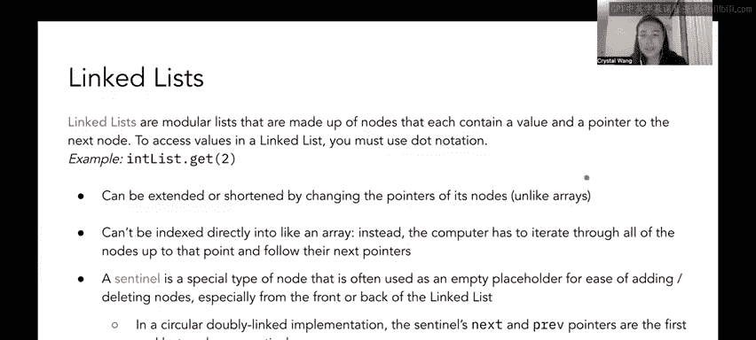

# UCB《数据结构discussion和lab｜CS 61B data structure sp 2024》中英字幕（豆包翻译 - P6：1 - Spring 2023 Discussion 03 Content Review.zh_en - GPT中英字幕课程资源 - BV1i1421x7wC

Hello everyone and welcome to CS6 UNMB Spring 2023's walkthrough of discussion number three。

 which is about scope， static， link list， and arrayse。First up。

 some quick announcements that may or may not be relevant by the time that you watch this video weekly be surveyed two is due on Monday。

 January 30th， Project  zero， which got extended is also due on Monday 30th， labb 3。

 which is on timing is due on Friday， February 3rd Project 18， just got released DX。

 it's due next Monday on February 6 and please carefully read the Office Out guidelines if you attend so we can keep the course respectful and civil。

Okay， answer some content。So let's talk a little bit about something that Josh dubbbs the GROE or the golden rule of equals and it's this quote that I ripped straight from his slides that say given variables y and x y equals x copies all the bits from X into Y so you don't need to pick that apart too deeply because bits are more of 601Cs territory。

 all you really need to know is that Java is passed by value when you call a function and you give it some arguments。

 the function called receives an exact copy of those arguments tied to its own local variables so how I like to think about variables in Java is like given the examples variables like x and Y I kind of think of these variables as being like little boxes okay and inside these boxes there's some kind of value and what is inside that。

😊，Box and like what the value is depends on what kind of variable y and x are right。

 so we're going to go into a little bit of that when we talk about primitive versus reference types。

 okay。So in Java we have two kinds of or two categories of variables the first type is primitives and primitive types are represented by a certain number of bytes stored at the location of the variable in memory there are only eight of these in Java so some these examples may seem familiar like int float Boole and char that you probably worked with in past assignments in 6 U and B some others like maybe like double long byte don't seem as similar that's totally okay you just need to know that there are only eight primitive types in Java okay and everything else that is not one of these eight types of variables in Java is a reference type and a reference type is represented by a memory address stored at the location of the variable which points to where the full object is so all objects are stored at addresses in memory and this memory address is often referred to as a pointer and it's referred to as a pointer because usually like when we draw in like a box and pointer diagram or maybe you've。

In the Java visualizer when you were debugging it's like this like the variable is represented by a box and you see like an arrow pointing to something else in memory Okay。

 so I think the analogy that Dan Garcia made in 61C when I was taking it that really helps me understand it is that reference types are like。

嗯。Reference types are kind of like。Addresses so like remember like。

 you know how if you're like writing like an address book or in an address book or I don't know if people still do that or like you're adding contact info to like your new friend and there's like the section where you put their home address So that section where you put their home address that tells you where their house is。

 but it's like not their house directly right it's more of like。

The location of where there house is so that if you punch that into Google Maps。

 you'll know where to go same idea with reference types。

 it's just a pointer to a location in memory It's just pointer to an address Okay。

 but it's not the actual like object it's in memory itself。

 It's not the your friend's actual house when you put that into your address but right I don't know if that like made a whole lot of sense。

 but it was really helpful for me when I was like。Like visualizing the difference between primitive and reference types okay。

 and some examples of some reference types would be strings， arrays， link list， dogs， et cetera。

 anything that is not one of these eight primitive types， okay？😊。

So what that means in the context of the golden rule of equals is that the value of a primitive type gets copied directly upon variable assignment。

 so for example， if we have int x equals5 that means variable x stores the value of five so if we envision our little box for variable x again that means inside of this box is the value5 okay。

😊，On the other hand， the value of a reference type is a shallow copy upon variable assignment the pointer akaAV memory address is copied and the object itself in memory is not there's a small exception to this which is not this very special kind of pointer I'm not gonna get too deeply into it right now but we will talk a little bit more about like comparing reference types and primitive types in a future week maybe like four or five but don't worry about this for now but all you really need to know is that inside of our box for a reference type is a pointer it's not the actual object itself right it's not actually your friend's house in there just the address to your friend's house just the memory address okay so in a very teeny tiny example。

😊，Let's take a look at what this means for the difference between a primitive and a reference type so over here we have int x equals5 and we have an int array R which is an integer array containing one2。

 three and5 and you'll notice over here that x is an int right so it's primitive so inside of its box the value5 is directly put in there。

😊，On the other hand， R is an in array， right， and we know that arrays。

Are not primitive They're reference types， so we see here that there is this array in memory 1，2，3。

5 and this arrow points to this array right but the array itself is not directly inside of the box okay now let's say we have a function and we passed these two variables in as parameters so let's say there's this function do something that takes in an int y and an int array other so remember how earlier we were talking about how when we make a function called with some variables that function is going to receive its own like local copy of its local variables same thing here so we see that y we copied over the value of5 directly from x right because we passed x in as the first argument to do something so we'll see here that Y's box contains the number5 and that's the extent of how x and y related they're totally independent of each other now right。

😊，However， you'll notice that when we copied over array R into the other variable we copied over exactly what was in this box right and exactly what was in this box was a pointer to this array and memory but not the array itself right so that means that when we made our local variable copy with other other is also pointing to the memory address that array or I keep saying array but I mean R R was pointing to right so they're both point to the same array and memory one。

2，3，5 you'll notice that other did not get an arrow pointing to an entirely separate one2。

 three5 array and memory right？So this has implications for how objects get updated in memory so you'll see in the function body we have y equal9 and other at index2 get set to4 what that looks like when these lines get executed is that y value inside the box changes to9 but that doesn't change what x's value is right x is still five because after these this number was copied over into y's box x and y became like completely independent of each other right on the other hand because R and other were're pointing to the exact same object in memory when we set other at index2 to be equal to4 you'll notice that it also changed index 2 for R because they were pointing to the same thing so R used to point to an array that was 1。

235 but because we ran this line other other at index 2 aka R at index2 is now4 all right。Okay。

 so shifting gears a little bit， I know we talked about like static versus instance last week。

 but it tends to be a really confusing topic for students so we're revisiting it again and like honestly don't worry if you don't totally get it right now like I。

I remember being a student and I don't really think I fully grasped this concept until I was like 100% done with the course but as a quick refresher static variables and functions belong to the whole class so every6 U and B student shares the same professor and if the professor were to change it would change for everyone so currently everyone's professor is hug the other instructor for the course is Justin Justin Yokota so let's say like every students instructor is hug right now and。

😊，Let's say there's a student named Crystal and Crystal's instructor changes to Justin that means that everyone's instructor also changes to Justin as well okay that doesn't make a whole lot of sense right now it's okay we'll do question one and then that will cover exactly this case。

On the other hand instance variables and functions belong to each individual instance so the example here is that each 61 B student has their own ID number and changing a student's ID number doesn't change anything for any other student so as an example let's let's say like crystal the 61 B student has an ID number of12。

3 and Jety the other 61 B student has an ID number of 456 if I changed my ID number to or crystal changed her ID number to 789 that does not change Jety's ID number for456 okay we all have our own instance variables okay。

😊，So there's also a lot of confusion sometimes about the this keyword because it is a little bit abstract it's supposed to be like the equivalent of self in Python right like self is is self is Python's equivalent of Javas this keyword and this is。

A keyword that non static methods can be called wait， oh my goodness。

 I need to backtrack a little bit。 I didn't mean。I don't even know what I was about to say anyways this is a special keyword and nonstatic methods can only be called using an instance of that object so during evaluation of that function you will always have access to this instance in the object referred to as like this the literal this keyword something that helps me conceptualize this and visualize it is like sometimes when you're inside when you're like working with a Java class right like you're filling out project zero or like project one or whatever and then use like this dot whatever to refer to instance variables or instance methods and how I think about that is oh I am working on this particular instance of whatever class this is right and that helps me kind of reframe。

😊，How I understand the this keyword， if that makes sense， it's like super abstract。

If that didn't make sense for you， it's totally fine， but I like to think about it like， oh。

 I am in this specific instance of the class when I write it。

Anyways static methods on the other hand do not require an instance of that object in order to be called so during evaluation of that function you cannot rely on access to this instance of the object Similarlyly static variables are shared by all instances of the class so it also does not require an instance of an object to be called it can be called from the it can be referred to with just the class name directly so each instance does not get its own copy but they can access a static variable okay and as a quick check for understanding can you reference this static methods and can you reference static variables in instance methods why or why not。

😊，You can pause the video here if you'd like to think about it a little bit。

 but I'm going go ahead and talk about the answers to these questions so first question is can you reference this in static methods and the answer is no because static methods have to be able to be called from the entire class right and if you call it from the entire class then Java is like wait who's this right like this refers to a particular instance of this class but I don't know which instance you're talking about so you cannot reference the this keyword and static methods。

😊，On the other hand， can we reference static variables and instance methods we can。

 I think it's like not the greatest practice though， but you can because all instances。😊。

Kind of access the shared class variable they just don't get their own copy Yeah I think it's just kind of bad practice though so it's better to like if you want to edit a static variable keep it separate in like a separate static method okay。

Awesome。嗯。Okay sorry， little bit of lag shifting gears once again to talk a little bit about some data structures that we'll be using in this discussion so array our data structures that can only hold elements of the same primitive or reference type of value so we use this notation over here like R subi or like R at index I holds a value in the I position of the array and remember that Java arrays are zero index and like honestly pretty much any data structure you'll learn in this class is also zero index we can also have n dimensional arrays so for example this is a2D array so we have int array like an int array of int arrays。

😊，An array of inters yeah， an array of inters a and then here we're saying that it's going to be a three by two array because how I like to think about it is like rows by columns when we're doing like a two D where the first。

😊，Dimenssion tells us how many rows there are and the second dimension tells us how many columns there are。

 so there would be like three rows and two columns here and you can index into 2D arrays or n dimensional arrays。

 And in this case， a 2D array like a sub2 sub 1。 So this is going to get row two of the。😊。

Grid basically and then within row two we have two columns right and so that would get us the second column aka column one of our grid so that's going to get us one specific int in our2D array okay so over here we see an example of an array containing primitives so this is an int array there's a41 and a and like previously we discussed because these are primitives the values go directly inside of these boxes right they go directly inside of like the containers in the array。

On the other hand， we have this array of cats you'll notice that once again there's pointers to the cat objects they're not directly inside of the array itself rather they're pointers to the cat objects in memory and one more thing that I'd like to point out is that we cannot do something where like one in our array is a cat and then the next element in our array is a string and the next element of our array is we can't do that arrays have to be of the same type unfortunately everything in the array needs to get the same type okay one more thing arrays have a set length within in so it can't be extended or shorten with pointers like a linked list to resize we need to copy over all elements to a new array so I think this might be like a little bit difficult to grasp from like a python background if you came from like 61 a for example。

So in6 Q andA or like if you did Python， you know that you can kind of just like append to a list like or like an array right I mean。

 I guess like a raise and list are like kind of interchangeable in Python but in Python you can kind of easily append to an array or just like add on like a new element of the array。

 you can't do that in Java if we say that hey Java I want a length three array。

 Java can be like okay you have this link through array and you can't add anything else onto it。

 but if you want a bigger array or a smaller array。

 you need to copy your elements into a smaller array if you want to preserve the original。

Elements in your array， okay。Cool and finally linked lists in contrast to link in contrast to array linked lists are modular lists that are made up of nodes that each contain a value and a pointer to the next node to get values in a linked list you must use dot notation so whereas in an array we were indexing with the square brackets right here we have to do something like inlist dot get and then you pass the index of the elements that you want and unlike as。

Link list can be extended or shortened by changing the pointers of its nodes which you will very shortly find out in Project1 a if you haven't already started that and they also can't be indexed directly into like an array instead the computer has to iterate through all the nodes up to that point and follow their next pointers so what we mean by this is like let's say we have like an array that is of length a00 if we say hey Java I want to get the element at the 500th index of the array Java is like ba okay here's the 500th index of the array here's the element that's in it。

And it's very very fast on the other hand， if you have a link list with like a0 elements in it and you're like。

 hey Java I want to get the 500th index element of this link list Javas will be like okay let me start at the front of this list and I have to go one node at a time until I reach index 500 so why does that matter like for the purpose of the discussion it doesn't but it will matter in future weeks when we start talking about asymptotics which is basically a measure of how quickly things run and honestly you'll even talk about it this week in lab3 with timing and then you'll get like your first taste of like the importance of like keeping things fast and。

😊，Asymptotics as a whole okay and then one last note about linked list Sentinel is a special type of node that's often used as an empty placeholder for ease of adding or deleting nodes。

 especially from the back or the front of the linked list and。😊。

Aentinel implementation is the preferred implementation for Project 1A。

 which I'm sure Josh talks about in great detail in the lectures。

And in a circular doubly linked implementation， the Sentinel's next and previous pointers are the first and last nodes respectively in that linked list if that doesn't make a whole lot of sense right now。

 don't worry about it， we will get to a problem in question four where you will get lots of practice like with Sentinels okay and I believe that is it for content review。

😊。

