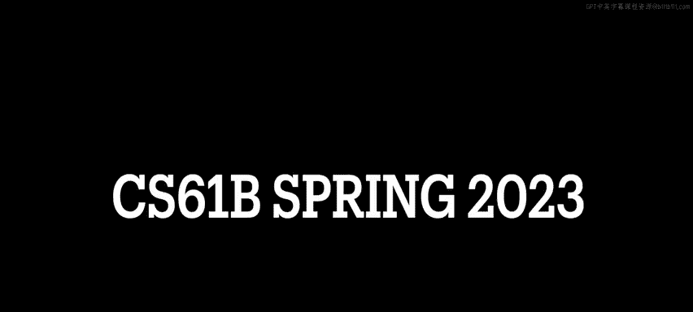
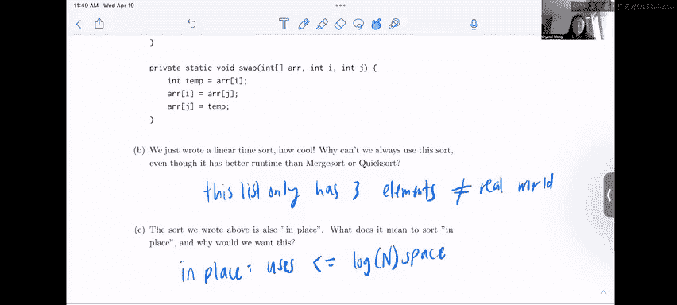

# 数据结构：P72：4 - 荷兰国旗问题排序算法




在本节课中，我们将学习一个非常酷的排序问题：如何在线性时间内原地排序一个仅包含0、1、2的数组。这是一种常见的设计模式，尤其在面试中。

## 问题描述与思路

我们有一个仅包含0、1、2的数组，目标是设计一个线性时间复杂度的算法对其进行排序，且不使用额外数组（原地排序）。我们可以使用提供的 `swap` 辅助方法。

以下是算法骨架代码：
```java
public void specialSort(int[] arr) {
    int front = 0;
    int back = arr.length - 1;
    int cur = 0;
    while (cur <= back) {
        if (arr[cur] < 1) {
            // 处理0的情况
        } else if (arr[cur] > 1) {
            // 处理2的情况
        } else {
            // 处理1的情况
        }
    }
}
```

上一节我们介绍了问题背景和代码框架，本节中我们来看看具体的算法直觉。

这个算法的灵感来源于快速排序中的霍尔分区法。在霍尔分区中，我们选取一个基准值，将小于基准的元素移到左边，大于基准的移到右边。由于数组中只有0、1、2三种元素，我们可以选择 **1** 作为基准值。这样，所有 **0** 都应该在 **1** 的左边，所有 **2** 都应该在 **1** 的右边。

我们使用三个指针：
*   **`front`**：指向下一个应该放置 **0** 的位置。
*   **`back`**：指向下一个应该放置 **2** 的位置。
*   **`cur`**：当前正在检查的元素索引。

初始时，`front` 和 `cur` 都指向数组开头，`back` 指向数组末尾。算法会逐步移动 `cur` 指针，根据遇到的元素值，与 `front` 或 `back` 指针位置的元素进行交换，直到 `cur` 指针超过 `back` 指针。

## 算法步骤详解

现在，让我们深入算法的三个核心分支，看看如何处理不同的元素值。

以下是处理三种情况的逻辑：

1.  **如果 `arr[cur] < 1` (即元素为0)**：
    *   这意味着这个 **0** 应该被放到数组的前部。
    *   执行 `swap(arr, cur, front)`，将当前的 **0** 与 `front` 指针位置的元素交换。
    *   交换后，`front` 位置已放置好一个 **0**，因此将 `front` 指针向后移动一位：`front++`。
    *   同时，`cur` 指针也向后移动一位：`cur++`。因为交换到 `cur` 位置的新元素（来自原 `front` 位置）只可能是 **0** 或 **1**，且其左侧区域已处理完毕。

2.  **如果 `arr[cur] > 1` (即元素为2)**：
    *   这意味着这个 **2** 应该被放到数组的后部。
    *   执行 `swap(arr, cur, back)`，将当前的 **2** 与 `back` 指针位置的元素交换。
    *   交换后，`back` 位置已放置好一个 **2**，因此将 `back` 指针向前移动一位：`back--`。
    *   **关键点**：此时 **`cur` 指针不移动**。因为从 `back` 位置交换过来的元素可能是 **0**、**1** 或 **2**，我们需要在下一轮循环中重新检查这个新元素，以确保它被放到正确的位置。

3.  **否则 (即元素为1)**：
    *   元素 **1** 本身就是基准值，它应该留在中间区域。
    *   我们不需要进行交换，只需简单地将 `cur` 指针向后移动一位：`cur++`，继续检查下一个元素。

## 算法局限性与原地排序

我们刚刚编写了一个线性时间的排序算法，非常高效。但为什么我们不能总是使用这种排序，即使它的时间复杂度比归并排序或快速排序更好？

答案在于其适用条件的特殊性。这种算法之所以高效，是因为它利用了数组中**只有三种特定元素**这一强约束条件。在现实世界中，我们面对的数据通常是任意数字，无法预先确定一个完美的“中间”基准值来如此简洁地分区。因此，该算法无法推广到通用排序场景。

最后一个问题是，我们编写的排序算法是“原地”的。什么是原地排序？我们为什么需要它？

原地排序是指算法在排序过程中**只占用常数或对数级别的额外空间**，而不需要创建与输入数据规模成比例的额外数组（如归并排序通常需要）。在我们的算法中，只使用了 `front`、`back`、`cur` 等几个固定变量，无论输入数组多大，额外空间消耗都是恒定的，因此它是原地排序。

在61B课程中，我们通常重点关注时间复杂度，但必须记住，**空间复杂度同样重要**。一个占用大量内存的程序会降低效率，并限制同时运行其他任务的能力。这就是我们希望算法是原地排序的原因。像选择排序、插入排序、堆排序和快速排序都可以实现为原地排序。

## 总结



本节课中我们一起学习了“荷兰国旗问题”的排序算法。我们掌握了如何利用三个指针（`front`， `back`， `cur`）在线性时间内原地对一个仅包含0、1、2的数组进行排序。我们分析了算法的三个核心分支，理解了为何在处理元素 **2** 后 `cur` 指针不能立即前进。最后，我们探讨了该算法的局限性（仅适用于有限种类的元素），并复习了原地排序的概念及其重要性（节省内存，提升效率）。这是一个将分区思想应用于特殊约束条件的经典范例。