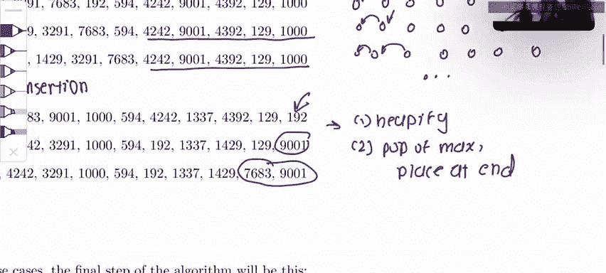

# 数据结构与算法：P73：排序算法识别实战 🧩

在本节课中，我们将学习如何通过观察排序算法的中间步骤，来识别具体使用的是哪种排序算法。这是一个常见的考试题型，掌握识别技巧对理解算法运行过程至关重要。

我们将要分析的算法包括：**插入排序**、**选择排序**、**归并排序**、**快速排序**和**堆排序**。

---

## 问题A：识别归并排序 🧩

首先，我们来看问题A。观察中间步骤时，一个非常清晰的模式是：如果将列表从中间分开，可以看到两半在最终合并之前，彼此基本不交互。

在最后一步，虽然整体趋于有序，但元素仍大致保留在各自的一半中。这是**归并排序**的典型特征。

归并排序分为两个主要阶段：**递归分割**和**合并**。在递归阶段，数组被不断对半分割，元素停留在各自子数组中，直到最后才开始合并操作。

因此，问题A的答案是 **归并排序**。

---

## 问题B：识别快速排序 🧩

上一节我们介绍了有明显模式的归并排序，本节中我们来看看问题B。它的模式不那么直观。当遇到这种情况时，一个有效的技巧是快速验证它是否为**快速排序**。

题目提示快速排序以第一个元素为**基准（pivot）**。初始数组的第一个元素是 `1429`。

以下是验证步骤：

1.  第一步：所有小于 `1429` 的元素被移到了其左侧，大于 `1429` 的元素移到了右侧。这与快速排序的**分区（partition）**操作一致。
2.  第二步：以 `1337` 为基准，其左右两侧的分区同样正确。
3.  第三步：以 `192` 为基准，分区结果也正确。

通过逐步验证基准元素的位置，可以确认问题B使用的是 **快速排序**。

---

## 问题C：识别插入排序 🧩

问题C的模式非常明显。观察发现，数组的**后半部分**在多个步骤中完全没有变化，只有**前半部分**的元素在发生交换和移动。

具体来说，将每一步与初始数组对比，末尾部分始终保持原样，仅开头的少数元素在调整位置。

这符合**插入排序**的特点：算法从前往后处理，将当前元素**向前交换**到合适位置。因此，数组前部会不断变化，而后部则要等到处理的后期才会被触及。

所以，问题C的答案是 **插入排序**。

---

## 问题D：识别堆排序 🧩

最后，我们来看问题D。观察第二和第三步，会发现一个清晰的模式：**最大元素被依次放置到数组末尾**。这强烈暗示了**堆排序**。

但第一步似乎不符合这个规律，因为此时最大元素并未在末尾。这需要我们更深入地理解堆排序的两个阶段：

1.  **建堆（Heapify）**：将无序数组调整成一个有效的**堆（Heap）**数据结构。
2.  **排序**：重复从堆顶取出最大元素，并将其放到数组末尾。

因此，第一步实际上是**建堆阶段**，此时堆尚未开始输出最大值。随后的步骤才进入排序阶段，将最大值依次放到末尾。

所以，问题D的答案是 **堆排序**。

---

## 总结与识别技巧 📝

本节课中我们一起学习了如何通过中间步骤识别五种经典排序算法。

以下是快速识别的小技巧：

*   **归并排序**：观察是否先对半分割、各自排序，最后合并。
*   **堆排序**：观察后期是否将最大元素依次交换到末尾（前期可能是建堆）。
*   **插入排序**：观察数组末尾是否长期保持不变，仅前端在调整。
*   **快速排序**：当模式不清晰时，可以尝试验证第一个元素（或指定基准）是否完成了正确的分区操作。

掌握这些模式特征，将帮助你更轻松地应对相关考题。祝你在数据结构的学习中一切顺利！