# 数据结构与算法：P74：2 - 熊与床的匹配问题 🐻🛏️

在本节课中，我们将学习如何解决一个名为“熊与床”的匹配问题。我们的目标是将一组熊与一组床进行配对，并确保它们的相对顺序保持一致。同时，算法需要在平均情况下以 **O(n log n)** 的时间复杂度运行。

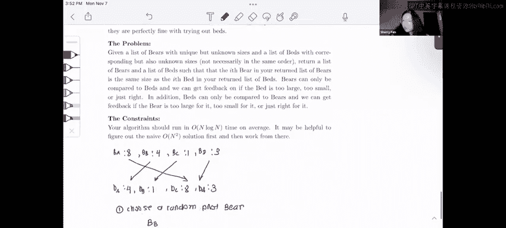

## 问题概述与约束

上一节我们介绍了问题的基本目标，本节中我们来看看具体的约束条件。

我们有两个数组：一个代表熊（Bears），用大写字母B表示；另一个代表床（Beds），用小写字母b表示。每个熊和床都有一个特定的“尺寸”，但这个尺寸本身没有具体含义，我们只关心它们之间的相对大小顺序。核心约束是：**我们不能直接比较两只熊之间或两张床之间的大小**，只能比较一只熊和一张床的大小。

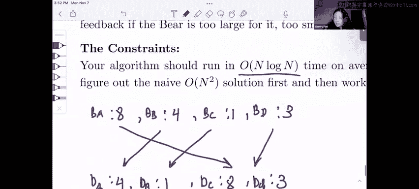

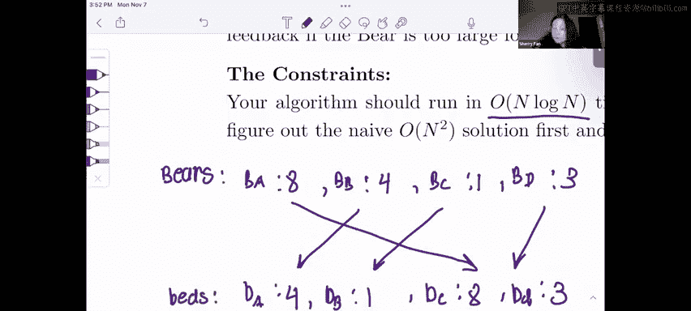

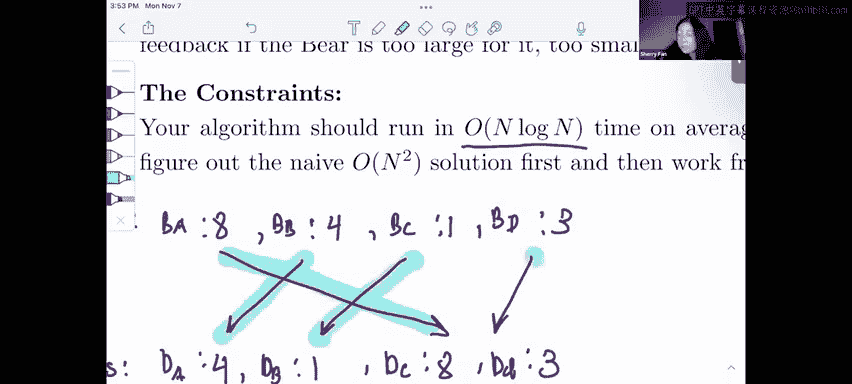

例如，给定熊数组 `[A, B, C, D]` 和床数组 `[a, b, c, d]`，我们需要找到正确的配对，使得配对后的熊和床具有相同的“尺寸”顺序。

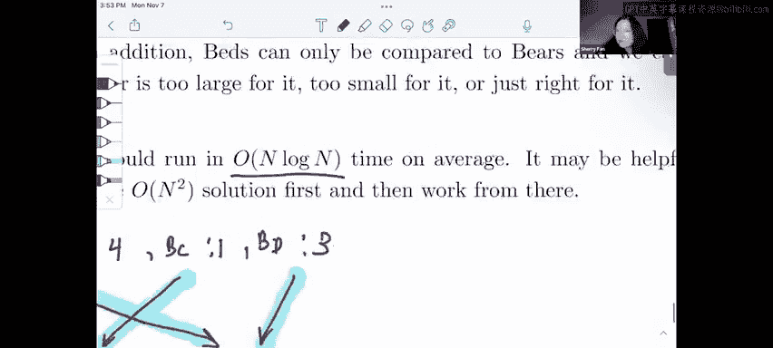

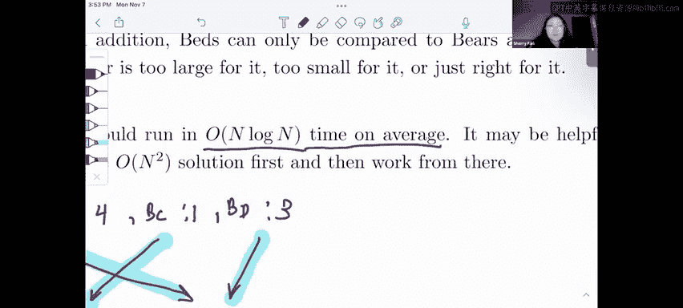

## 算法设计思路

一个重要的提示是算法要求平均 **O(n log n)** 的复杂度。我们熟知的、平均复杂度为 **O(n log n)** 的排序算法是**快速排序**。这强烈暗示我们应该对快速排序进行一些修改来解决此问题。

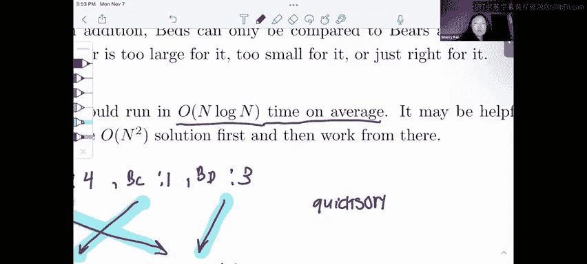

我们不能简单地分别对熊数组和床数组排序，因为规则禁止直接比较同类物品。因此，我们需要一种方法，在排序过程中利用熊和床之间的比较来同时确定两个数组的顺序。

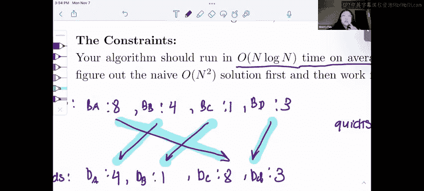

## 核心算法步骤

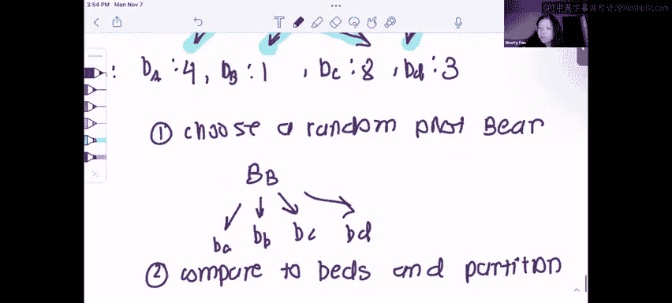

以下是解决该问题的“互枢轴”快速排序算法步骤。

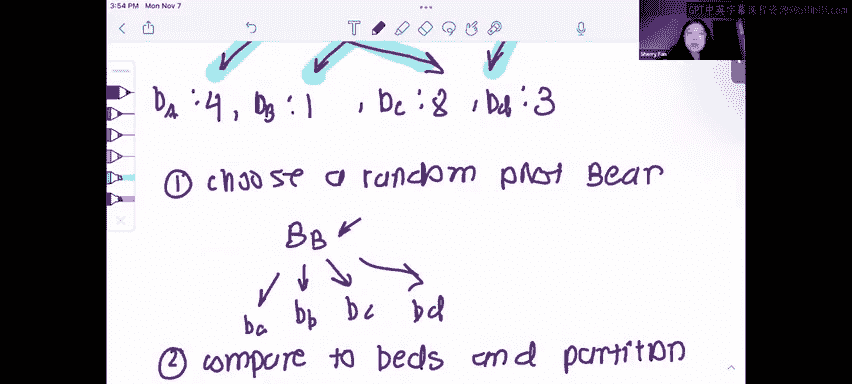

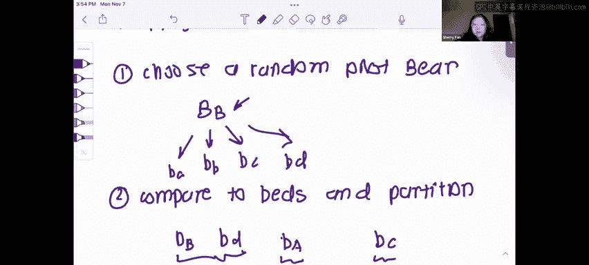

**第一步：选取枢轴熊**
从熊数组中随机选取一只熊作为枢轴（Pivot Bear）。假设我们选择了熊 `B`。

**第二步：用熊枢轴划分床数组**
使用选中的枢轴熊 `B` 来划分床数组。我们将床分为三部分：
*   小于熊 `B` 的床
*   等于熊 `B` 的床
*   大于熊 `B` 的床

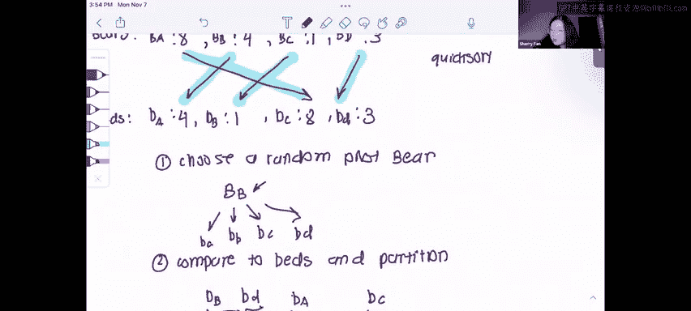

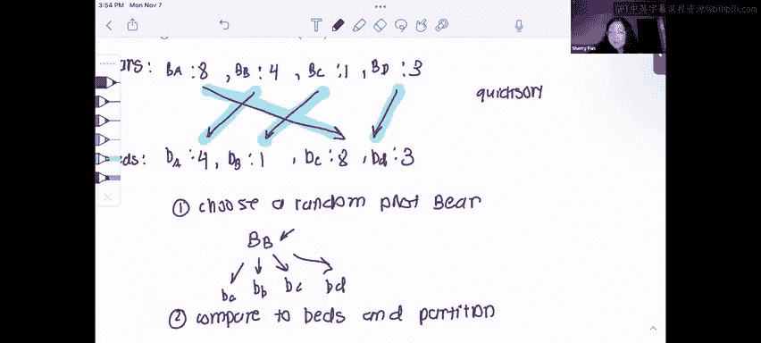

通过这一步，我们找到了与枢轴熊 `B` 相匹配的那张床（即“等于”部分中的那张床）。记这张床为床 `a`。

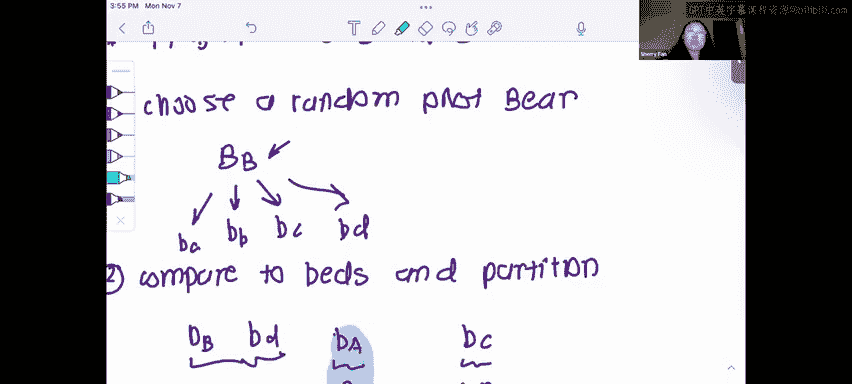

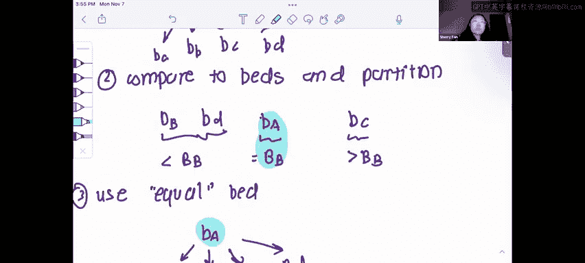

**第三步：用床枢轴划分熊数组**
现在，我们使用找到的枢轴床 `a` 来划分熊数组。同样，将熊分为三部分：
*   小于床 `a` 的熊
*   等于床 `a` 的熊
*   大于床 `a` 的熊

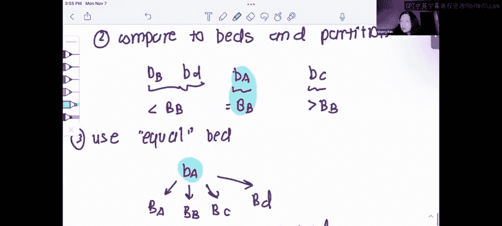

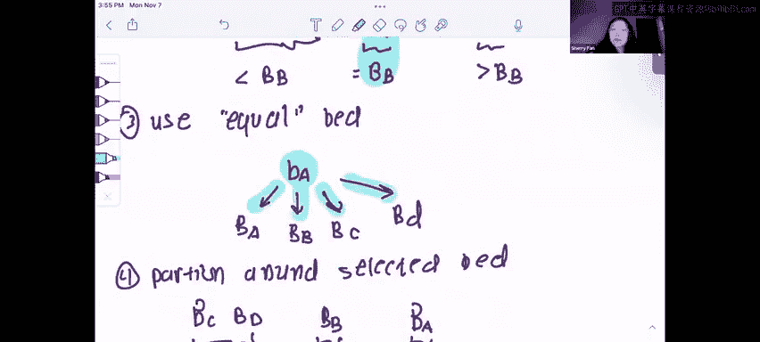

此时，枢轴熊 `B` 和枢轴床 `a` 已经正确配对，并且它们将各自数组划分成了对应的“较小”和“较大”部分。

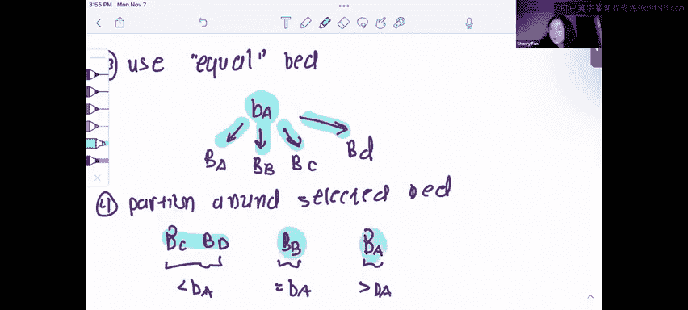

**第四步：递归处理**
对“较小”部分的熊子数组和床子数组递归地应用上述算法。同样地，对“较大”部分的熊子数组和床子数组也进行递归处理。“等于”部分的单个配对已经完成，无需进一步处理。

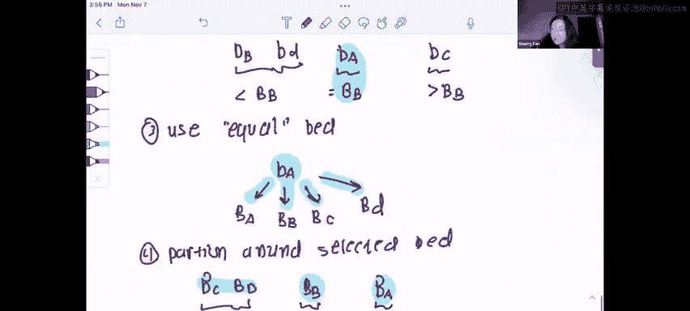

这个过程与快速排序完全类似，只是我们同时在两个数组上操作，并用一个数组的枢轴来划分另一个数组。

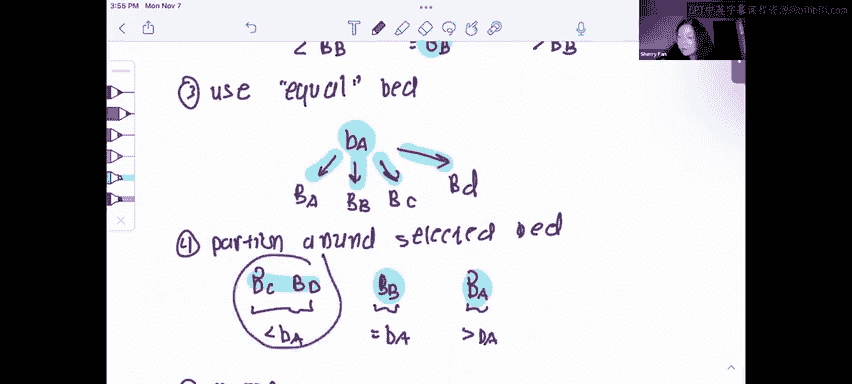

## 复杂度分析

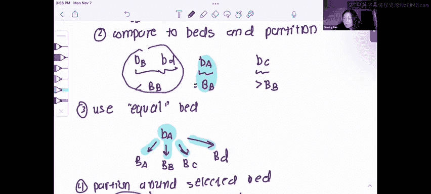

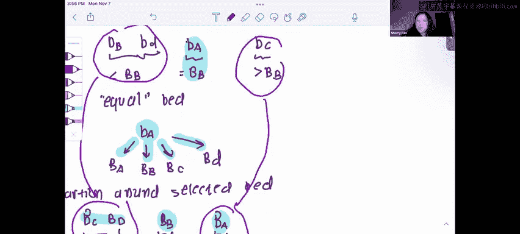

该算法本质上是快速排序的一个变体。每次递归调用平均将问题规模减半，并且划分操作需要线性时间 **O(n)**。因此，其平均时间复杂度与快速排序相同，为 **O(n log n)**，满足题目要求。

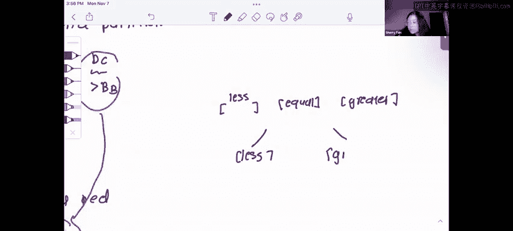

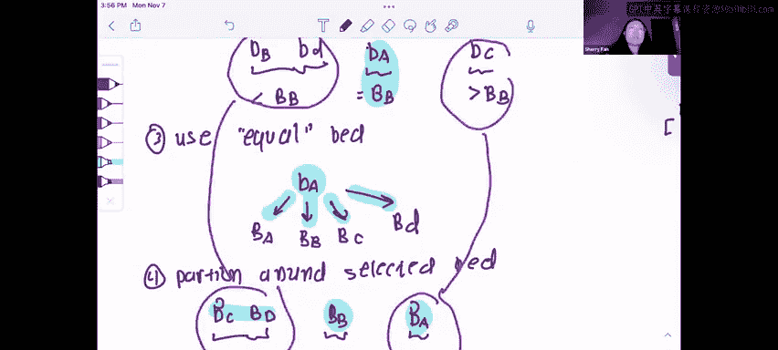

## 总结与技巧

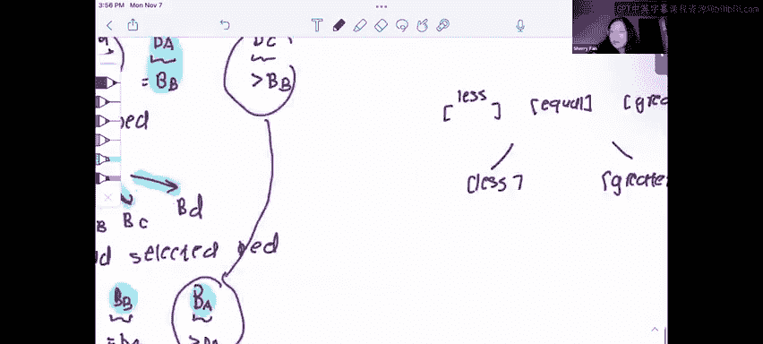

本节课中我们一起学习了如何利用修改后的快速排序算法解决“熊与床”的匹配问题。关键点在于使用“互枢轴”技术，通过交叉比较来同时排序两个数组。

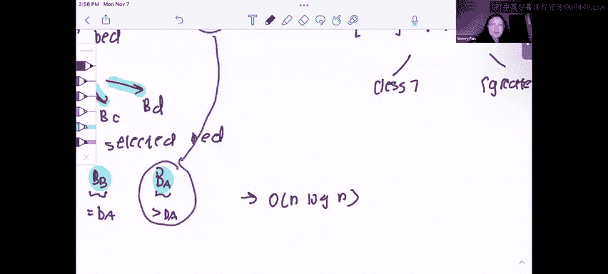

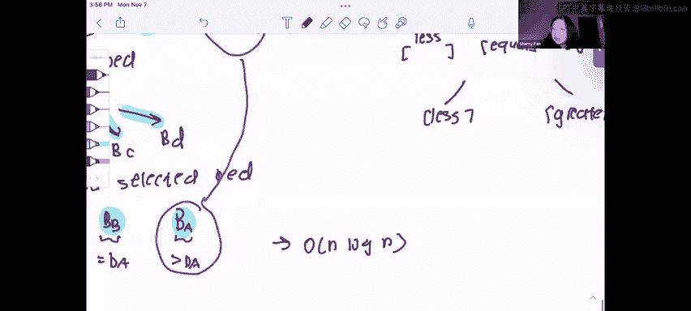

对于算法设计问题，题目给出的运行时复杂度通常是重要的线索。例如，本题中 **O(n log n)** 的平均复杂度直接指向了快速排序或其变体的使用。在解决类似问题时，请务必关注这一提示。