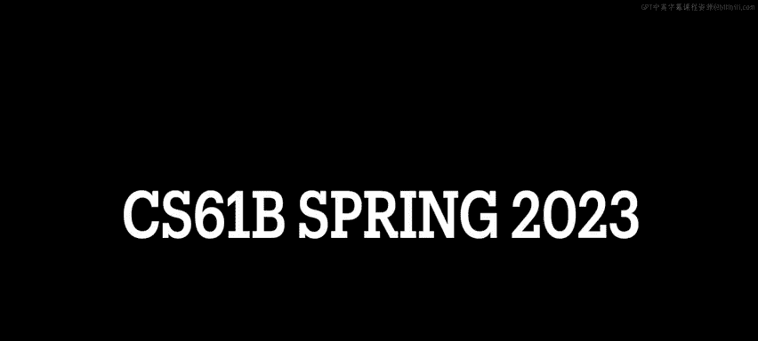
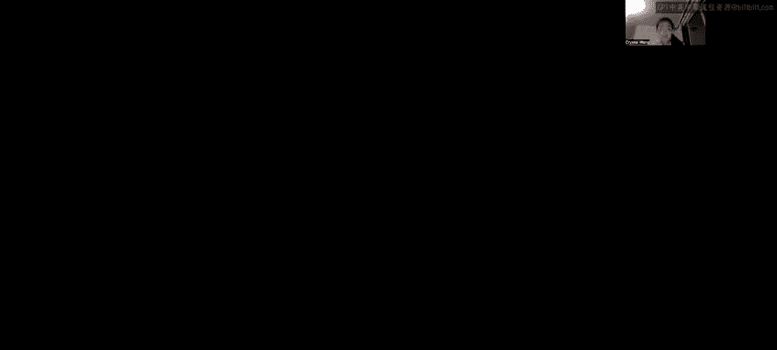
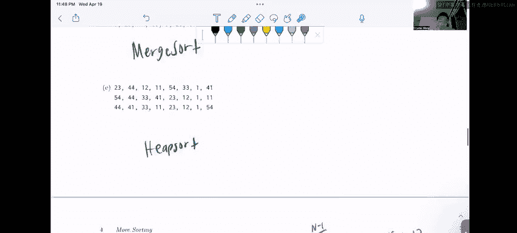

# UCB《数据结构discussion和lab｜CS 61B data structure sp 2024》中英字幕（豆包翻译 - P79：4 - Spring 2023 Discussion 14 Question 3.zh_en - GPT中英字幕课程资源 - BV1i1421x7wC

🎼发明哈明。🎼Oh。

Alright， let's do question three sort identification and here we want to match the sorting algorithms to the sequences each of which represents several intermediate steps in the sorting of an array of integers assume that for quicksort the pivot is always the first item in the sublis being sorted note that these steps are not necessarily the first few intermediate steps and there may be steps which are skipped Okay so the algorithms that we want to look at our Quicksort merge sort Hes MSD rating sort and insertion sort So let's just kind of go through each of these and kind of go through a process of elimination so in quickSo we're told that let's use the pivot as the first item。

So if we use 12 to be the pivot， we would expect in the next line to see that everything to the left of 12 is going to be smaller than 12 and everything to the right of 12 is going to be greater than 12。

 So let's take a look at that。 And the next line we see that。Everything to the left of 12，7，8，4。

102 and 5 are actually less than 12 and everything to the right of 12 is indeed greater than 12。

 Okay， this is great we have 34 and 14 to the right and now let's actually recur on quicks so if we are considering these sublists over here where we already established that the pivot was 12 from the previous iteration of quicksort we would expect to see that 7 and 34 are in their respective lists in the next line so that means that 34 is like the pivot and everything less than 34 in this list will be left of 34 everything greater than 34 will be to the right of 34 in the list likewise over here when we're trying to run quicks on this sub array we would expect everything to the left of 7 to be。

😊，Smaller than seven and everything to the right of seven from this summary to be greater than seven so when we come down here。

 we actually do indeed see that this checks out with what we thought it was going to be。

 so this could feasibly be quick sort。Right everything to the left of seven。

 the4 two and five those are less than 7，8 and 10 are larger than 7 and 14 is less than 34 so we could say I'm going to say quick sort with a question mark。

😊，Because we know it could be possible， but we don't know for sure right what if it's it better fits another one so let's take a look at merge sort so if we saw merge sort。

In this in this sequence of lines and assuming like no lines are skipped what we would expect to see is sort of like a zipper kind of fashion right so we'd split the list in half and then keep recursively merged during the half so maybe what we would expect between these two lines is to see that say we split it down the middle like this。

😊，We would expect to see that this half has been sorted already and the next half has been sorted already when we get to the next line in the merge sort unfortunately we don't see that right we don't see that the 12。

7，8，4 and 10 are in their proper sorted order over here so it doesn't really seem like merge sort to us。

Then what about heap so so we know that in heap so the very first step we want to take is the underlying array that we want to sort we want to heappl fire into a max heap right so if we were trying to heap aify。

😊，Then between these two lines all we would expect to see is the formation of a max heap right so what we would expect is that after this heapplification line the max the first element in the list would be the maximum value。

 but it's not the maximum value right there's a seven here when we would expect at 34 so this is not heap sort。

😊，What about MSD rate sort okay， if we did MSD rating sort。

 we'd only be considering the most significant digit of each of these numbers and here we could actually left pad with zeros if we really wanted to do that。

😊，Um。But this doesn't seem quite right to me because when we go down to this line。

 we see that it's starting with。嗯。So we see that the line over here starts with effectively like the most significant digit in the7 was a0 if we were left padding right and then we see a 08 is04 and then all of a sudden there's a most significant digit of one and then there's the most significant digit of zero that doesn't really seem like MSD rating sort to us because if we were doing MSD ratingd sort we would expect to see all of the zeros at the beginning then the ones then the twos right and so on and so forth so this doesn't seem like MSD rating sort。

Okay， so。Now let's move on to what if it was insertion sort so if it was insertion sort even if we skipped a couple of steps here。

 we would expect that after like maybe like n iterations or like actually n is not a good number。

 let's say like X iterations of insertion sort we'd see the first X elements sorted with respect to each other right so。

What this might look like is maybe after we see that the only possibility in which we could have seven end up in the position zero when we're running insertion sort is after like one or two rounds of insertion sort right we' move we'd start at 12 nothing to move over we'd start at seven move over to the 12 so we'd swap the seven and the 12 and then we'd scoot eight over and at this point we would expect to see that like7。

8 and 12 right in this next line if we were really at that point in insertion sort but instead we see a four which is pretty interesting because。

We're not like when we say intermediate steps in sorting the array we don't mean like halfway through an iteration of insertion sort which was what this might imply right so it's not going to be insertion sort either so let's just settle for the first one that we tried which was quick sort that worked out for us okay。

So now on to Part B， we have。This list over here and let's once again run through all of our potential algorithms with。

嗯。That we see up here so first up we have quick sort so if we want to use the pivot as the first element in the list。

 we would expect that between these two lines everything to the left of 23 should be smaller than 23 and everything to the right of 23 should be larger than 23 so when we come down here we look at the 23 everything to the left of 23 is smaller than 23 but not everything to the right of 23 is larger than 23 like there's this random 20 over here right this can't be quicksort all right let's move on and try something else what about merge sort So if we were looking at lines between merge sort we would expect like haves to be sorted with respect to each other right well over here。

😊，We do see that。 well， okay， this left half of this array actually has been sorted。

 It's been ziped up nicely。 So we could say that this might be merge sort。嗯。On left half。

 already sorted。But let's move on to see if there's a better answer Okay。

 so what about heap sort so again with the idea with heap sort is we'd expect to see between lines that。

If this is an immediate step immediately afterwards， after the hepoification process。

 the most the largest value in our heap should end up in position 0 of our underlying array right because we we want to max hepaify our underlying array that we want to sort so that's not an instance of this because we don't see the maximum value 65 end up in position zero so it's not that maybe if we skip a couple of steps so maybe it's possible that heap sort got to the point where the maximum value is a 4 well if that were true if the maximum value is a 4 that everything else after this would have to be already sorted in ascending order right but it's not it seems like you know the 65 34 or 20 this doesn't seem to be in ascending order properly so we know that this isn't he sort。

Now what about MSD rating sort likewise let's do the same thing as we did before so we can left padder numbers。

 let's pad over zero and here and what' going to see between these lines is that it's pretty strange because。

嗯。We see a more significant digit of0 then of one then of two then of four then of6 then of three。

 Like that doesn't really make sense， right because if we were going by MSD rating sort。

 it should be that the three comes before the four right So this is not MSD rating sort。

 Now what about insertion sort。 Well， if we are looking for insertion sort。

 we would expect that the first X elements are already sorted with respect to each other and this was kind of what we were going for or not going for。

 but this was like kind of like the target answer merge sort on the left half would have been valid。

 but I would say that we're not gonna like make you think that deeply about it because of the fact that like merge sort on the left half is not the full run through of an entire algorithm of the entire merge sort algorithm on a list。

 So I think it's a little means to say merge sort on the left half。

 The answer here we were more looking for was insertion sort。

And the reason for that is you'll see that over here。

 even though we skipped a couple of steps right there wasn't like an immediate way that we got from the first line to the second line because you had to have shifted the swap the 12 left and then after that we shifted keeps saying shifted but I mean swap swapped the four left so that it was in position zero we'll see that these four numbers have already been sorted with respect to each other so this means that the first four numbers have already gone through a swapping process and they've been sorted。

Or the first four numbers in the underlying array have already been sorted in insertion sort。

So moving on to Part C， we only have two lines to go off of here。😊，And。Once again。

 let's run through each of our possibilities。 So let's say we choose Quicksort。

If we choose 12 as our pivot， we would expect everything in the next line。

To that is left of 12 to be less than 12 and everything that is the right of 12 to be larger than 12。

 but clearly that's not happening here。 So it's not quicksort What about merge store Well。

 in merge store， once again， we want to look for like bits and pieces that get sorted that are right next to each other right because we know that merge store only zippers numbers together like。

2 at a time once we hit the one the length one array based case right so we zipper these two numbers together and then we zipper pairs of two together and so on and so forth this doesn't really seem like the case because over here you'll notice that。

If we were to zipper these numbers together， we're expecting something like 11 and 14。

 but instead of we see 12，14 and 11 so it seems like there was some kind of crossover or the point is the order is not being preserved very nicely here。

 so it's probably not me or。What about heap sort again。

 if we were looking between these lines either in the next line， if it was an immediate next step。

 we would expect the maximum value to end up in position zero of the array。

 we don't see that okay what if we skipped a couple of lines and we see that 12 is now like the maximum value remaining in our heap in that case we'd expect everything after or a lot of elements after 12 to be in a direct sorted order right as in we skipped a couple of lines we popped off the max a couple of times we appended it to the back but we don't see that back here so these numbers are not sorted so it's not gonna to be heap sort what about MSD ratingd sort well in MSD rating sort we would expect that all of the numbers with lower most significant digits would appear before all of the numbers with larger most significant digits do we see that well if we take a look at this we see a one a1 a1 a12 a3 a3 and a3 yeah and we also can double check this by seeing that MSD ratingdic sort。

This class we teach as stable and so you see that where we break ties we're preserving the order in which these numbers appeared right for the one the one and the one it's 12。

 14 and 11 because that's the order in which those numbers appeared so yeah this could totally be MSU explore。

And just for good measure， let's check that it's not insertion sort So it's not gonna be insertion sort because once again we're gonna not be evil and ask you to look at this list halfway through like an insertion swap or something like that And in fact I don't even think it's possible here I guess let me see if you swap the 14 over you'd stop swapping there and let's say you swap the7 yeah。

 it's not gonna to be insertion sort because we would expect that if we swap the 11 we swap the 14 here the 32 should be right here。

 not a 17 right so that's not even like a complete iteration of insertion sort So if that didn't make a whole lot of sense to you。

 don't worry about it， I was just like going through the possibility of an insertion sort in my head and I realize that it's not actually possible so moving on to part D。

We have。3 lines this time to look at。 And we see a kind of interesting pattern over here， where。

Between these three lines， it looks like the there's a bit of like a sense of like locality between the lines where the locations of the numbers that are getting sorted are relatively similar to their starting positions so I have a good idea of which one this might be let's just run through all of our possible algorithms again so quick sort once again if we consider this to be the pivot for quicksort we'd want everything in the left of 45 in our next line to be less than 45 and everything to the right of 45 to be greater than yeah everything to the right of 45 should be greater than 45 in the next line but of course we don't see that here so it's not going be quick sort can it merge sort well remember that we were talking a little bit about like the locality of these numbers and how they seem to mostly stay in the same like one or two spots right if we take a look at our starting array。

You'll notice that if we split it down the middle。嗯。And we split it again like this。

 so we split it down the middle and then we split it into forts。

 you'll notice that each of these forts， these two element merge sort blocks are sorted with respect to each other。

Right and then when you come back up and you zipper them all back together。

 these four elements like the 23， the 45 the 5 and6 65， they're in the same four spots。

 but they've just been swapped around a little bit。

 or maybe swap is not the correct word because his merge sort doesn't use swaps but they've been zippered together right you'll see that these like groups of four these groups of two。

 they they stay in the same four or same two spots with respect to each other。

 So this looks a lot to me like merge sort。So we merge or sorry we sorted the left half and we sorted the right half and now we want to zipper together the the two halves right but let's just continue anyway and disprove why it can be other kinds of sorts so heap sort once again we're looking for something to tell us that the maximum value。

😊，Is at the first element in our list So over here if we treat this as a starting array。

 if we try to heapify in the next line， yeah， 23 is definitely not the largest number that could come out of our max heap and also the rest of this array doesn't really look sorted so it doesn't really seem like an intermediate step with several step skips with heap sort so I don't think it's heap sort but about MSD radic sort So if we do MSD ra sort and we pad with zeros。

Once again， in the next line， I don't really see evidence。

Now it's going to be MSD rating sort because the MSDs here are all over the place。 right。

 There's a two， a4， a0， a0。And so on and so forth and even if we look at the like if we pretended like。

 okay， maybe MSE rating source skipped over a couple of liness， if we look at like the。

The ones place it's also not really indicative of MSD rating sort doesn't seem to be ordered with respect to each digit at each place。

 so it doesn't seem like MSD ratingd sort and lastly we'll think about insertion sort。So。

Unlike to be where it was like merge sort or insertion sort。

 this one definitely cannot be insertion sort because I guess you could argue like oh yeah。

 at this point in time， all the numbers have been sorted with respect to each other in like the first half or something like。

I guess you could say like I move the 23 over， but then how do you explain that you also move the three over right because we make a linear pass over and over the array during insertion sort so it wouldn't be like normal for us to do insertion sort wherere like we swap 23 back and then before we even swap five backwards。

 we swap three backwards that's a little bit strange so it's not insertion sort。

Now moving on to part E， we have three lines to go off of once again。

So one final time we'll ask ourselves， is this quick sort？

So we're going to treat the 23 as a pivot and in the next slide we would expect that everything to the left of 23 is going to be smaller than 23 and everything to the right of 23 is going to be greater than 23 and clearly we don't see that here so this is not going to be quick sort。

😊，Now what about merge sort so again with merge sort we' kind of expect like locality of each of these elements right we'd expect like the same two elements the same approximately the same two indices maybe maybe like zippered around a little bit or we'd expect like them to be in the same like four areas definitely not happening here like for example。

 we see like the 54 and this half and 54 and like the first half where it was in the second half in the first line。

 so that doesn't really seem like merge sort to me。Heap so maybe okay。

 so in heap so if we treat this as the first line over here， if we try and heapify over here。

 we'll see that。The maximum value in this list will end up in position  zero。 Okay， indeed。

 we do have the maximum value in position  zero。 it's 54。 Okay， let's just check our hunches。 Okay。

 so let's say， you know， after one iteration of heaps or we're going to pop out the 54 it's the max value rate and we want to tack it onto the end of our underlying array and then reheapify the rest of the array into a max heat。

 do we see that well we see that 54 if we pop it off， oh。

 it does end up at the back of our underlying array， this is great And in fact， when it reheapified。

😊，44， which was the next largest value is now in the max heap root position this looks a lot of heap sort to me。

But just for good measure， let's run through the rest of the potential sorts so we could have MSD rating sort。

 let's take a look at that。 let's pad with zeros again。If we look at the first os。

 actually if we look at the most significant digit of each of these once again。

 there doesn't really seem to be like a real rhyme or reason there's a 5。

4 a3 and then a 4 again doesn't really make sense to me and so it's not going to be MSD rating sort maybe it could be insertion sort let's take a look so if we saw insertion sort over here that doesn't seem right because the maximum value of 54 ended up in position 0 in the very next line that's like not normal with insertion sort insertion sort sorts in a sending order from left to right right there's no possibility in which the maximum value would get swapped in here unless。

嗯。Yeah I don't think there's an actual possibility of the maximum value getting swapped in here within these like two lines yeah so this answer is going to be heap sort and that's it for question three。

😊。

