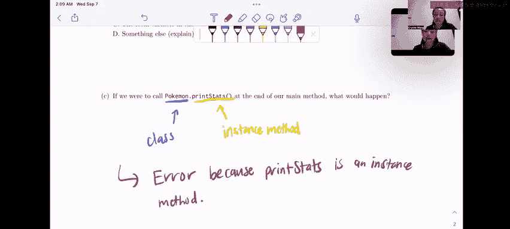

# UCB《数据结构discussion和lab｜CS 61B data structure sp 2024》中英字幕（豆包翻译 - P7：2 - Fall 2022 Discussion 3 Question 1.zh_en - GPT中英字幕课程资源 - BV1i1421x7wC

Okay， so let's just get right into the worksheet in question one static electricity。

 we see this class Pokemon being defined with a couple of instance variables。

 a couple of static variables， a main method that's going to be run and a static method and an instance method okay so for part A it asks us to write what will be printed after the main method is executed so let's jump right into that but before that just to talk a little bit about the style that I'm doing here I'm going to be drawing like a little bit of like an environment diagram if you're familiar with that from maybe 6q1A with Python or like Python tutor but basically what this is is inside of the main function I'm just going to draw out all the variables that are created so we can better visualize what's going on with our instance variables and static variables okay and I've just taken the liberty of drawing this big Pokemon box over here and the reason I did that is because。

I want to be able to keep track of what like Pokemon instances have been created because I know I want to have a good distinction between the instance variables of each Pokemon as well as the static variables of the Pokemon class as a whole。

 so I'm actually just going to go ahead and put the static variables oops。Right up here in this box。

So we know that the static variable trainer is ash and the static party size starts at zero。

And remember， trainer and party size because their static means they're shared across all instances of Pokemon class。

All right。Let's get right into it。In line 14。We declare a variable P and we set it equal to a new Pokemon。

Whose name is Pikachu and whose level is 17？So， Pikachu。Level。17。

And we see that also in the constructor besides setting the name and the level it also increases the party size。

 so remember that instances all have access to static variables right but they are shared across the entire class so changing a static variable from an instance would change the value of the static variable for all instances of that class。

So we're going to go up here into our little static variables section。

And we're going to change the party size to one because we now have one points one。And。

We know we have a pointer。So the box for P is now pointing to this newly created Pokemon object in that game。

Next， in line 15， we have something really similar with the variable J。

 we're going to create a new Pokemon whose name is Joltion， level is 99。嗰个。90。and once again。

 we're going to run through the constructor where we set the name， we set the level。

 and we also increase the party size。So now we have our very first print statement which asks for party size and it's going to concatenate party size with Pokemon。

 party size， so party size remember it's a static variable so it can be accessed directly from the Pokemon class so we're going to look in the Pokemon class this big old box and we're going to see that the static variable party size is two so this is just going to print。

Let's do green。This is just going to print party size。就。All right， so now。😊，We get a call to P。

print stats， let's take a look at that instance method， it's just going to print out the name。

 the level and the trainer of the Pokemon that it got called on。Actually。

 I'm going to label this as line one。But in this print line。

Print stats line I mean we're going to print the name level and trainer of P so let's take a look at P over here。

 we see that P is name。Is Piachu， so let's print that。Peace level is 17。

And piece trainer trainer is not an instance variable。

 it's actually a static variable of the Pokemon class。

 but remember that instances can access static variables and so we'll see that the trainer is ash and we're going to print。

Ash。All right。Moving on in line 18， we see that in level equals 18。So。Inside of the main method。

 we have this variable level， which is 18。And now things get start to get interesting here where we're calling an entirely different method that passes in some parameters。

 so what i'm going to do now is I'm going to draw。A new diagram。

That accounts for the local variables of change right because remember job is passed by value so anytime we pass in a variable to a function the function gets it gets its own local copy of those variables so change takes in。

A Pokemon poke。And。An integer level， so what we see happened here is that we passed in a P to be the Pokemon。

So remember that Pokemon is not a primitive， which means that when we pass a Pokemon instance in to a function。

 we're really just passing in a copy of the pointer right so we're really just giving change。

 the function， a pointer to like the Pikachu Pokemon in memory so what that's going to look like when we open up change。

Is that pokeke is going to point to。The same object and memory that P is pointing into。And level。

 because level is an integer and it's a primitive， remember that we copy the bits of a primitive over directly as and we take it at its face value。

 so level is just going to be 18。All right， so now let's take a look。嗯。

Over here as to what change actually does。And we see that in line 27 Po dot level equals level。

 so this is going to actually modify the Pikachu。The Pikachu Pokemon in memory because we have a pointer to it right that's what we got。

 we got a copy to the pointer in memory。😊，And we set poke dot level equal to level so now。

We're going to change Piachuch' level。To 18。And then over here we see level equals 50 so this is where things get interesting because we're seeing level this level that there's instance variables named level。

 there's a level up here in the main method， but what we care about when we're in the scope of the change method is the local variable first and foremost so what we're going to do here is when we see that level gets set to 50 we're talking about this level over here。

😊，Right。So。This 18 gets swapped out 450。Alright， and now。We've decided that we want to change oops。

 we've decided that we want to change what Poke is pointing to。

 so let's create a new Pokemon named Deluxe ray level one。嗱。Draw it up here。你。Fuck ray。Level。We。

And we want pokeke to point to that now。So poke， oops。Pooke is now pointing to this new。

Luxury Pokemon that we just made。The other thing that we have to remember is that every time we create a Pokemon we run through this constructor。

 which means that the party size increases， so we're going to increase the party size to three。😊，Now。

 after we've gone through line 29， we're going to go to line 30。

 which is Poke dot trainer equals team rocket， okay。

So Poke is pointing to this luxuryx Pokemon in memory right and it doesn't have a trainer instance variable。

 but it has a trainer static variable， which is shared by everyone in the class so what we're going to do is edit that static variable and change the trainer to be。

Team。Rocket。And after that， we're done with change。

And we no longer have to really worry about the variables of change， so I'm just going to erase it。

And bam。Back into main so now you'll notice that there is nothing pointing to this object in memory right There's nothing pointing to the luxury po modern memory。

 And what Java is going to do is actually garbage collect it。 So what that means is that。

Essentially for like the purposes of visualization， we can just kind of ignore this and it goes away。

Okay。So back to this like nice clean page。嗯。We just did a change of Pokemon and now we want to print P stats again。

 okay。So this is going to be line three and just as a reminder。

 print stats is going to print the name， the level and the trainer of the particular Pokemon it got called on。

 so the name let's take a look at P。The name of P is Pikachu。The level of P is now 18 right。

 if we follow this over here， remember that we changed it in Po dot change and Pokemon dot change。

And it also wants to print the trainer， so we're going to take a look at the trainer over here。

 that's team rocket。So it's going to print team。Bocket。Alright。Now， back to Maine in line 21。

 we set Pokemon。trainer equal to ash。So we're going to go up here and change the static variable directly。

And then we set J dot trainer equal to Cynthia okay。

 so this is new so we're going to follow J over to where it's pointing in memory。

 we see okay we have this Pokemon object， we don't have a trainer instance variable but we do have a trainer static variable。

 so I'm going to change that。So even though we just changed the trainer to Ashsh。

 we're now going to change Jay's trainer， AkaA， all Pokemon's Traer to Cynthia。Okay。

 and for one last time。We want to print the stats of P。Alright。So we print the name。

Has P's name changed， no， it's still Pikachu。Has its level changed， nope， it's still 18。

And has its trainer changed， let's take a look at the trainer and the trainer got changed to Cynthia。

So we're going to print Cynthia。So this means that overall。

The answer to write what would be printed after the main method is executed。

We have party size to Pikachu 17 ash， Pikachu 18 tea rocket。Pachu 18， Cynthia。All right。

So for part B， we already talked about this a little bit when we were actually drawing out the environment diagram for Pokemon dot change。

 but on line 28 we set level equal to 50 right here inside of the change function。😊。

What level do we mean and we talked about it already so I'm just going to like say the answer。

 but it was the local variable containing the parameter to the change method right because when we were referring to level we were referring directly to the level variable that was in the scope of the function that we had just opened up in like the environment diagram that we' had just drawn out okay？

And finally， for part C。If we were to call Pokemon。print debts at the end of our main method。

 what would happen？All right， so let's break this down into two parts。

We have Pokemon dot print stats。So Pokemon。It's the class as a whole， right？And print stats up here。

It says public void print stats， so we know that this print stats method is an instance method。Well。

 if you recall correctly， we can call static methods just fine from the class so we could do like Pokemon。

change right because change is a static method， however。

 the issue with print stats though is that it has to be called on a particular instance of the Pokemon class。

And to visualize as to why this wouldn't make sense to call Pokemon。 print stats。

Let's go actually look at the body of print stats if we try to do something like Pokemon。

 print stats and we're asking for the name and the level and the trainer。

 even though trainer is static， we have no clue what name and level are referring to right is name and level are referring to the name and level of a particular instance of the Pokemon class but if we call print stats on Pokemon the class directly which instance are we referring to like the Pokemon classes doesn't have a name or a level right which is why it doesn't make sense to call print stats on the class。

So what this is going to do is it's going to error。Because。Prince stats。Is an instance。Methd。

All right， and that's it for question one。

