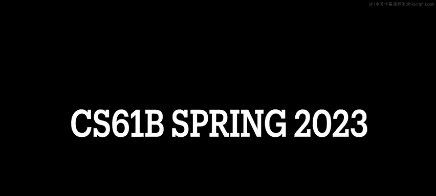
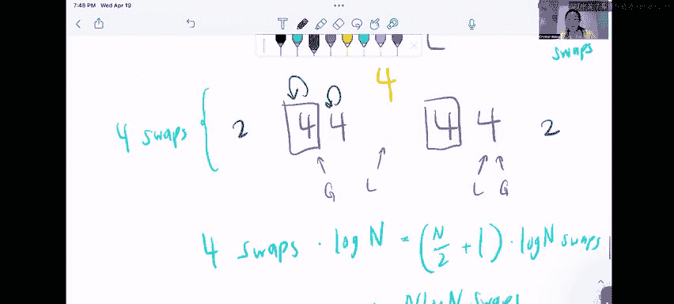

# 数据结构讨论与实验：CS 61B 数据结构 sp 2024：P80：5 - 排序算法概念比较

在本节课中，我们将学习并比较几种经典的排序算法。我们将探讨它们的最佳、最坏情况时间复杂度，分析其空间复杂度与稳定性，并通过具体问题来加深理解。课程内容基于对插入排序、快速排序、归并排序、选择排序和堆排序的讨论。

## 插入排序的最坏情况

上一节我们介绍了本课程的目标，本节中我们来看看第一个具体问题：如何构造一个能引发插入排序最坏情况运行的5个整数的数组。

插入排序的工作原理是，从数组起始位置开始，尝试将当前元素与左侧元素比较并交换，直到它到达正确位置。其最佳情况时间复杂度是 **O(n)**，发生在数组已完全排序时，因为无需任何交换。

因此，最坏情况（时间复杂度为 **O(n²)**）发生在需要进行最多交换时。这意味着数组应处于完全逆序状态。

以下是能引发最坏情况的5整数数组示例：
*   5, 4, 3, 2, 1

在这种情况下，算法需要进行 **n(n-1)/2** 次交换，这是可能的最大交换次数。

## 选择归并排序而非快速排序的原因

了解了插入排序的特性后，我们来看看在不同场景下如何选择排序算法。本节中我们探讨为何有时会选择归并排序而非快速排序。

我们可以从运行时性能、空间复杂度和稳定性几个方面来比较。

以下是选择归并排序的一些关键原因：
*   **最坏情况运行时性能更优**：归并排序的最坏情况时间复杂度是 **O(n log n)**，而快速排序（使用Hoare分区法）的最坏情况是 **O(n²)**。
*   **稳定性**：归并排序是稳定的排序算法（即相等元素的相对顺序在排序后保持不变）。而快速排序通常是不稳定的（尽管使用三路扫描分区法可以实现稳定，但这会占用额外空间，并不常用）。
*   **易于并行化**：归并排序可以轻松地分割成独立的子问题并行处理，因为其左右两半在合并前互不干扰。
*   **链表排序**：归并排序更适用于对链表进行排序，这与内存访问和缓存局部性有关。

## 排序算法特性辨析

在比较了归并排序和快速排序之后，本节我们将通过一系列选择题，更全面地辨析各种排序算法的特性。题目涉及时间复杂度下界、最坏情况性能比较以及交换次数。

题目提供了一个答案选项池（A. 快速排序, B. 归并排序, C. 选择排序, D. 插入排序, E. 堆排序, F. 以上都不是），每个陈述可能有多个正确答案。

**1. 时间复杂度下界为 Ω(n log n) 的排序算法**

这里讨论的是算法运行时间的**下界**（即最佳情况）。虽然比较排序的平均情况下界是 Ω(n log n)，但某些算法在特定输入下的最佳情况可以更好。
*   插入排序在已排序数组上的最佳情况是 **O(n)**。
*   堆排序在包含大量重复元素的数组上，最佳情况也可能是 **O(n)**。
*   快速排序、归并排序和选择排序的最佳情况分别是 **O(n log n)**、**O(n log n)** 和 **O(n²)**。选择排序的 **O(n²)** 仍然满足 Ω(n log n) 的下界。

因此，满足该条件的算法是：**A, B, C**。

**2. 最坏情况时间复杂度渐近优于快速排序最坏情况的排序算法**

快速排序的最坏情况时间复杂度是 **O(n²)**。我们需要找出最坏情况比这更好的算法。
*   归并排序的最坏情况是 **O(n log n)**。
*   选择排序的最坏情况是 **O(n²)**，并非更好。
*   插入排序的最坏情况是 **O(n²)**，并非更好。
*   堆排序的最坏情况是 **O(n log n)**。

因此，满足该条件的算法是：**B, E**。

**3. 在最坏情况下执行 Θ(n) 次元素两两交换的排序算法**

这个问题关注的是算法执行过程中**元素交换的次数**，而非运行时间。我们需要逐一分析。
*   **归并排序**：在合并过程中并不交换元素，而是将元素追加到新列表，交换次数为0。
*   **选择排序**：每一轮迭代找到剩余未排序部分的最小值，并将其交换到正确位置。对于n个元素，正好需要进行 **n-1** 次交换，即 **Θ(n)** 次。
*   **插入排序**：在最坏情况（逆序数组）下，交换次数约为 **n²/2**，即 **Θ(n²)** 次。
*   **堆排序**：其操作涉及多次“堆化”，最坏情况下的交换次数为 **Θ(n log n)**。
*   **快速排序**：这有些反直觉。使用Hoare分区法时，**最佳情况运行时间 (O(n log n))** 反而会导致大约 **Θ(n log n)** 次交换。而**最坏情况运行时间 (O(n²))** 却只导致大约 **Θ(n)** 次交换。因此，快速排序的交换次数不是线性的。

因此，满足该条件的算法只有：**C**。

## 总结

本节课中我们一起学习了多种排序算法的深入比较。我们明确了插入排序最坏情况的输入形式，分析了选择归并排序而非快速排序的若干场景（包括最坏情况性能、稳定性和并行化），并通过辨析题巩固了对各算法时间复杂度下界、最坏情况相对性能以及元素交换次数特性的理解。理解这些细微差别对于在实际问题中选择合适的排序算法至关重要。