# 数据结构与算法：P82：MSD基数排序实现教程 🧮

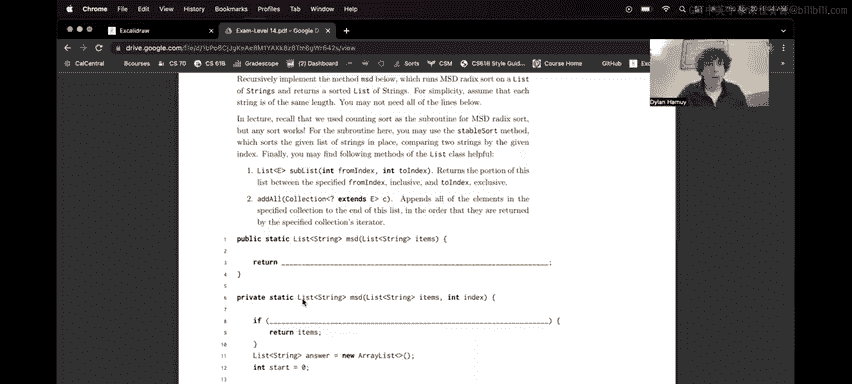

在本节课中，我们将学习如何实现**最高有效位优先基数排序**。这是一种非比较型排序算法，通过逐位比较数字来排序。我们将从算法原理开始，逐步深入到具体的代码实现。

## 算法原理概述

上一节我们介绍了基数排序的基本概念，本节中我们来看看MSD基数排序的具体工作流程。

基数排序不直接比较数值大小，而是比较每个数字的**每一位**。MSD基数排序从**最高有效位**开始比较，并逐步向右移动索引，直到最低有效位。

以下是MSD基数排序的核心步骤：
1.  从最高有效位开始，根据该位的值对数组进行排序。
2.  将当前位值相同的元素**分组**。
3.  对每个分组**递归地**调用MSD基数排序，但比较的索引向右移动一位。
4.  当分组大小为1或索引超出数字长度时，达到**基准情况**，直接返回。

## 代码实现详解

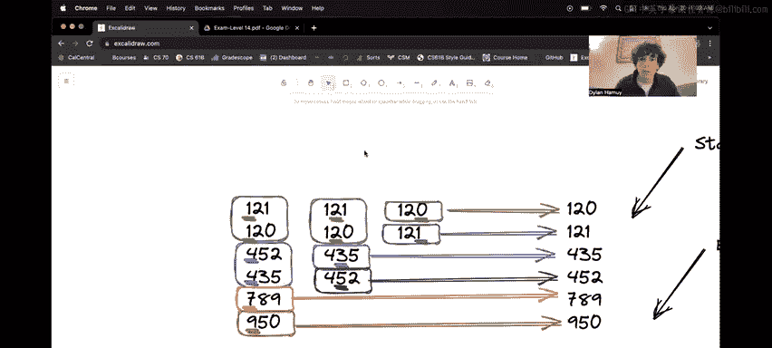

理解了算法原理后，现在我们来探讨如何用代码实现它。我们被提供了一个骨架代码，包含两个名为`MSD`的方法，区别在于其中一个多了一个索引参数。

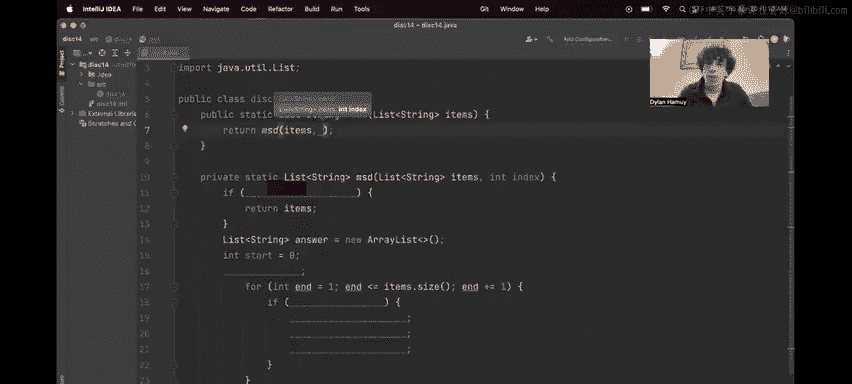

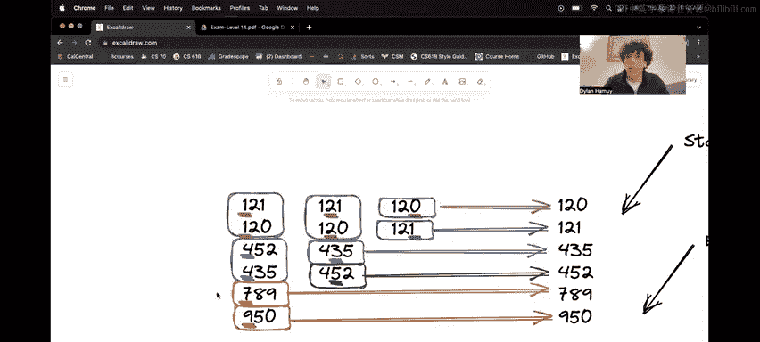

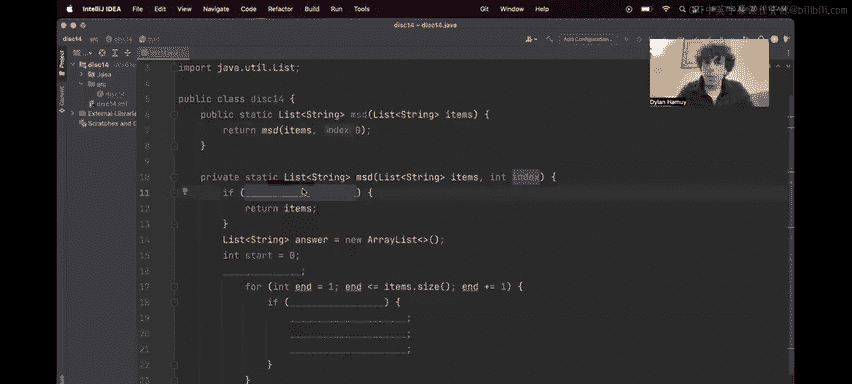

### 1. 初始调用与基准情况

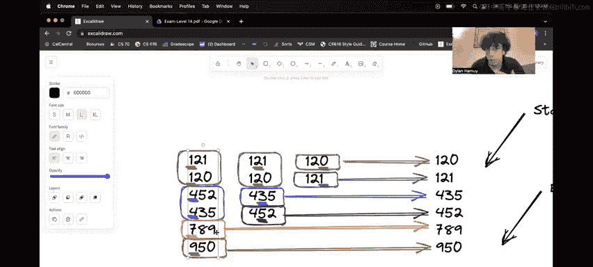

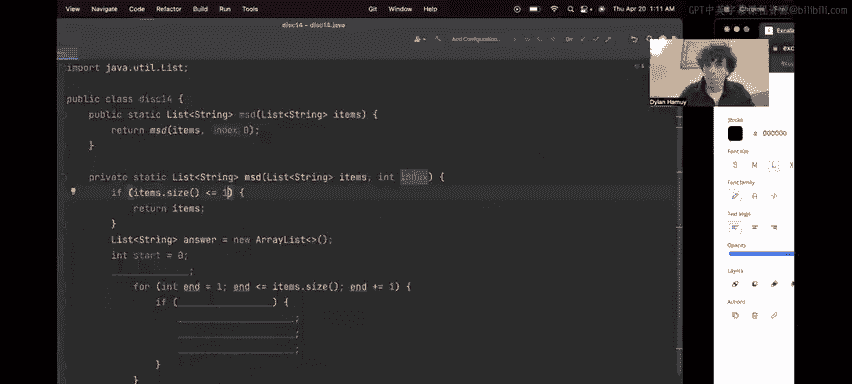

我们首先需要确定初始索引。对于MSD排序，我们从最高有效位开始，因此初始索引为0。

```java
public static List<String> MSD(List<String> items) {
    return MSD(items, 0); // 从最高位（索引0）开始
}
```

接下来，我们需要定义递归的**基准情况**。在两种情况下我们可以直接返回：
*   当列表大小为0或1时，无需排序。
*   当比较的索引**超过**所有字符串的长度时，意味着当前分组内的所有字符串都完全相同。

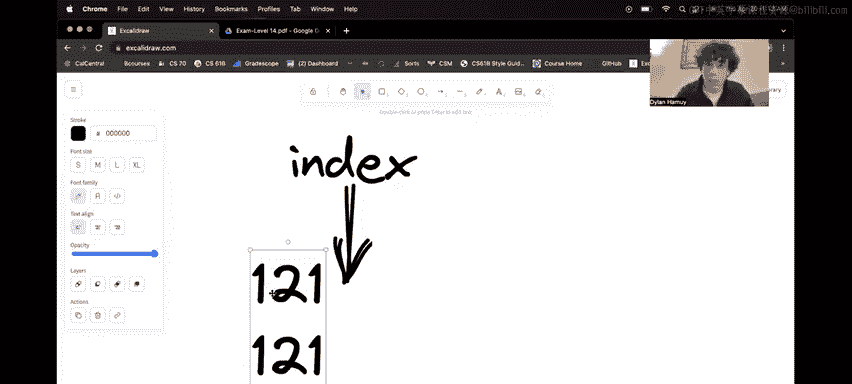

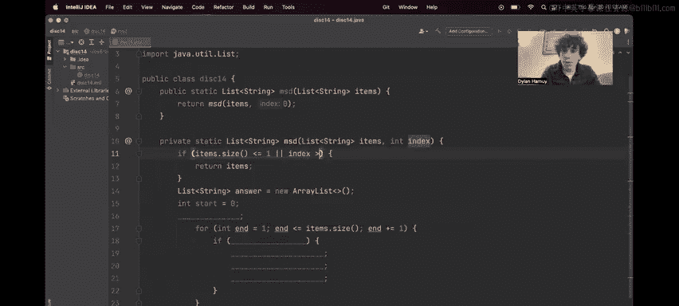

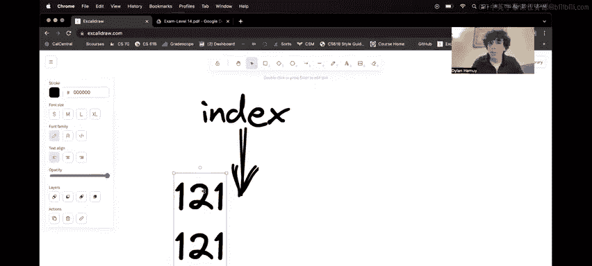

```java
private static List<String> MSD(List<String> items, int index) {
    // 基准情况 1: 列表已自然有序
    if (items.size() <= 1) {
        return new ArrayList<>(items);
    }
    // 基准情况 2: 索引超出所有字符串长度（处理重复项）
    if (index >= items.get(0).length()) {
        return new ArrayList<>(items);
    }
    // ... 后续排序逻辑
}
```

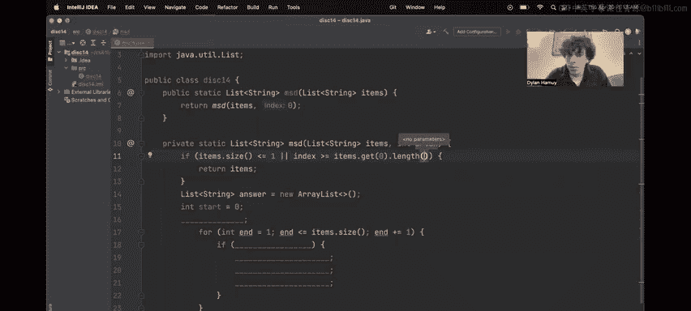

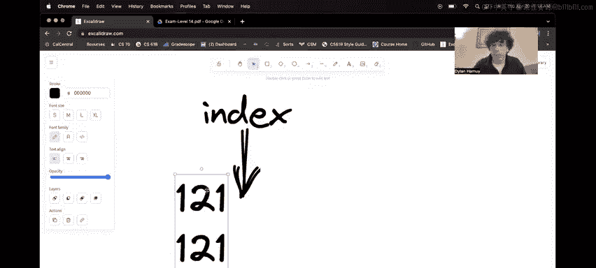

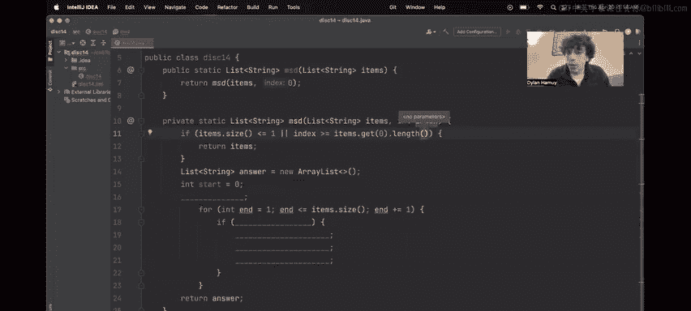

### 2. 按当前位排序

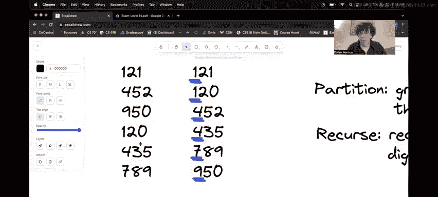

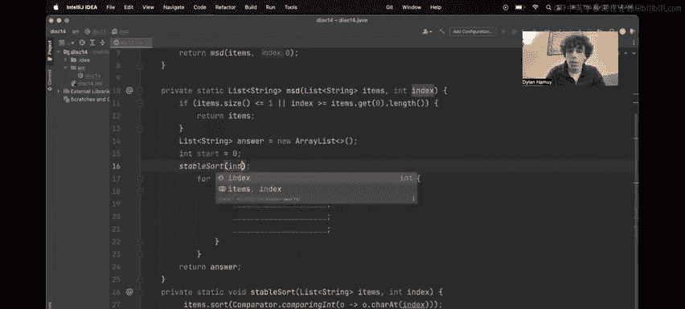

处理完基准情况后，首要任务是根据当前索引位置的字符对列表进行**稳定排序**。这确保了在后续分组时顺序的正确性。

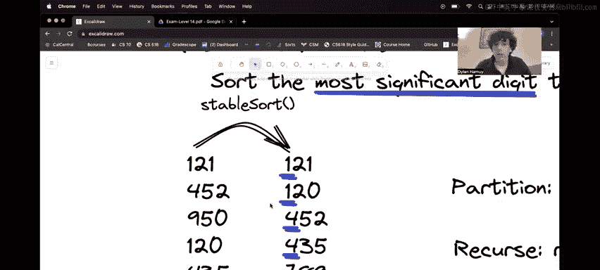

```java
// 根据给定索引位置的字符进行稳定排序
stableSort(items, index);
```

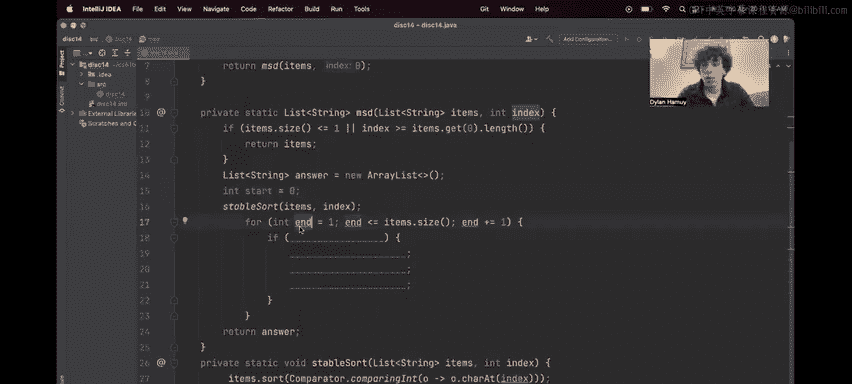

### 3. 分组与递归

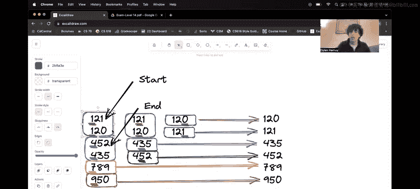

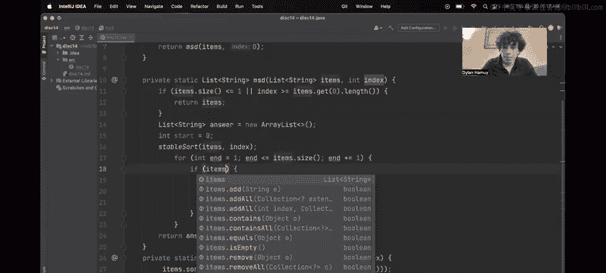

排序后，我们需要找出在当前位具有相同字符的连续元素，将它们分为一组，并进行递归排序。以下是实现这一过程的关键步骤：

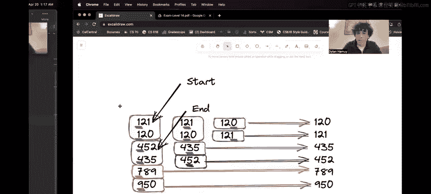

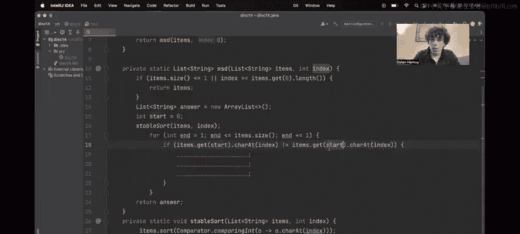

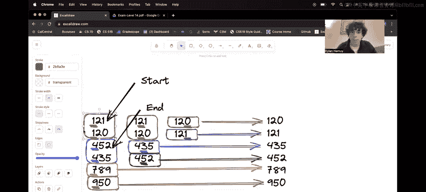

我们使用两个指针`start`和`end`来标记一个分组的范围。
*   `start`指向当前分组的开始。
*   `end`从`start+1`开始向后遍历。

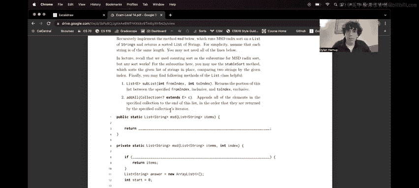

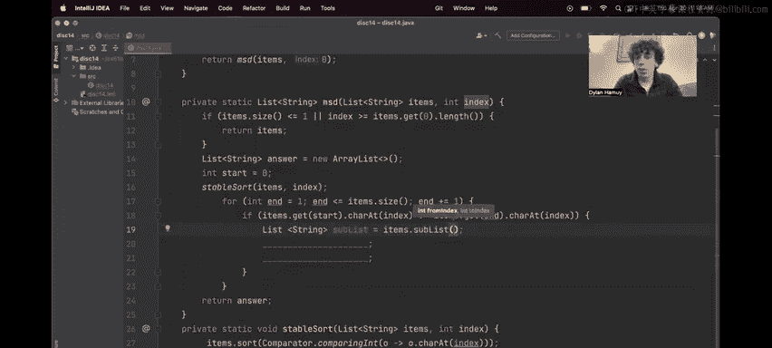

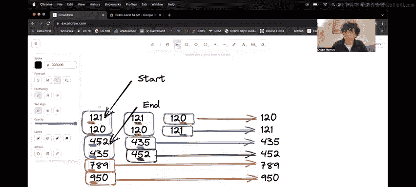

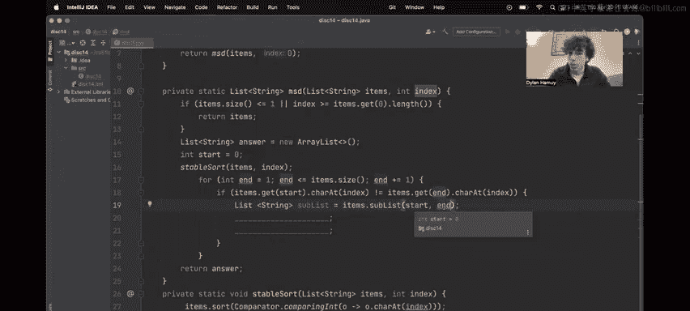

核心逻辑是：当`end`指向的元素与`start`指向的元素在`index`位的字符**不同**时，说明从`start`到`end-1`的所有元素构成了一个完整的分组。

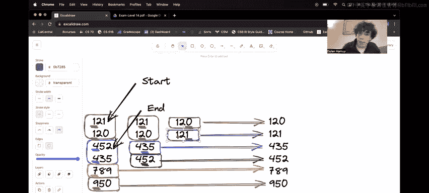

```java
List<String> answer = new ArrayList<>();
int start = 0;
int n = items.size();

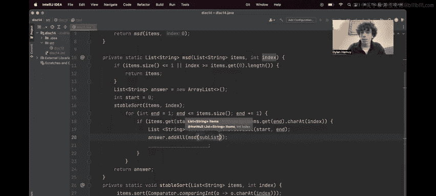

while (start < n) {
    int end = start + 1;
    // 寻找当前分组的结束位置
    while (end < n && items.get(start).charAt(index) == items.get(end).charAt(index)) {
        end++;
    }
    // 获取当前分组 [start, end)
    List<String> sublist = items.subList(start, end);
    // 递归排序下一低位，并将结果加入最终列表
    answer.addAll(MSD(sublist, index + 1));
    // 移动start指针，处理下一个分组
    start = end;
}
return answer;
```

**需要注意的边界情况**：当`end`指针到达列表末尾时，`while`循环会终止，此时`start = end`，外层的`while (start < n)`循环也会结束，算法正确完成。

## 总结

本节课中我们一起学习了MSD基数排序的实现。我们首先明确了算法从最高位开始、分组、递归的核心思想。接着，我们逐步实现了代码：
1.  设置了从索引0开始的初始调用。
2.  定义了列表大小≤1和索引越界两种基准情况。
3.  使用`stableSort`根据当前位排序。
4.  利用双指针法找出相同字符的连续分组。
5.  对每个分组递归调用`MSD`，并递增索引。
6.  合并所有递归结果作为最终排序列表。

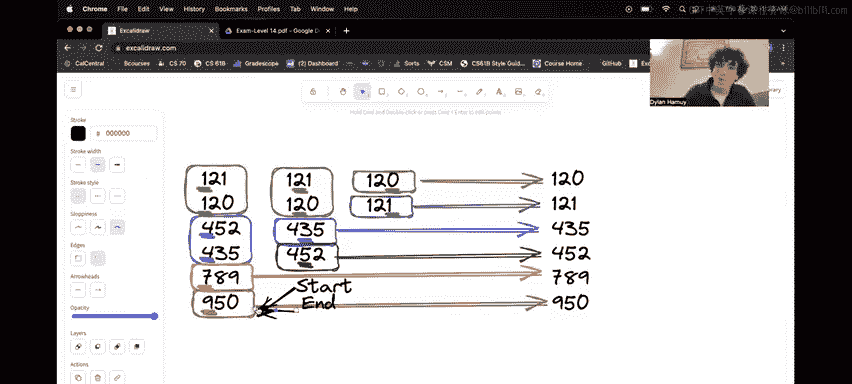

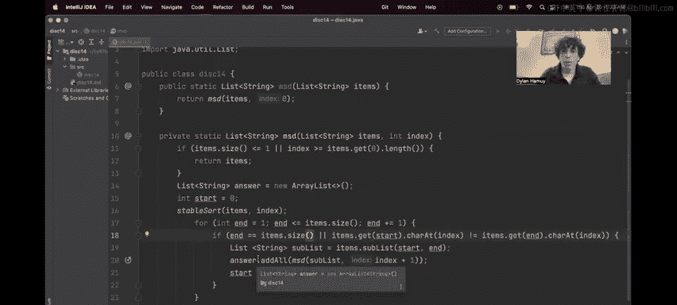

这个实现的关键在于理解**分组**的逻辑和**递归索引递增**的过程，它优雅地解决了按位排序的问题。