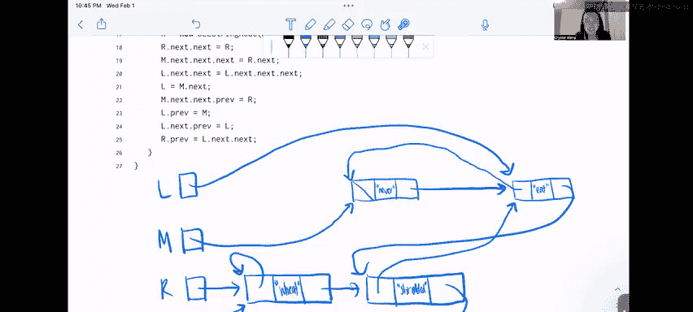

# 数据结构讨论与实验：P9：4：Spring 2023 讨论 03 问题 3


在本节中，我们将一起分析问题三“基本方向”。我们将逐步执行给定的代码，并绘制出对应的盒指针图。我们将使用一个自定义的双向链表节点类 `DLLStringNode`，它包含三个实例变量：`prev`、`s` 和 `next`。

## 概述

我们将分析一段操作 `DLLStringNode` 对象的 Java 代码。`DLLStringNode` 是一个双向链表节点，其构造函数接收三个参数：`prev`（前驱节点）、`s`（字符串数据）和 `next`（后继节点）。我们的目标是理解代码执行后，内存中各个对象之间的引用关系，并绘制出最终的盒指针图。过程中会涉及引用赋值、节点插入以及垃圾回收的概念。

## 节点结构与绘图约定

首先，我们明确 `DLLStringNode` 的结构。为了方便绘图，我们将一个节点表示为包含三个部分的盒子：`prev`、`s` 和 `next`。`prev` 和 `next` 是指向其他 `DLLStringNode` 对象的引用，我们用箭头表示。字符串 `s` 是基本数据类型（或不可变对象），为节省空间，我们直接将其值写在 `s` 的框内，但请理解在概念上它也是一个独立的对象。

节点图示例如下：
```
     +-------+
prev |   •---+--->
     +-------+
  s  | "Hi"  |
     +-------+
next |   •---+--->
     +-------+
```
箭头 `•--->` 表示指向另一个节点对象，而 `null` 引用则用穿过框的斜线 `/` 表示。

## 逐步执行与绘图

现在，让我们开始逐行执行 `main` 方法中的代码，并绘制相应的盒指针图。

**第10行：创建第一个节点**
```java
DLLStringNode L = new DLLStringNode(null, "eat", null);
```
这行代码创建了第一个节点，其 `prev` 和 `next` 均为 `null`，`s` 为 `"eat"`。变量 `L` 指向这个新节点。
```
L
 •
 |
 v
+-------+       +-------+
| prev  | null  |  s    | "eat"
|   •---+------>|       |
+-------+       +-------+
| next  | null  |       |
|   •---+------>|       |
+-------+       +-------+
```

**第11行：在链表头部插入节点**
```java
L = new DLLStringNode(null, "bananas", L);
```
这行代码创建了一个新节点（`s="bananas"`, `prev=null`），并将其 `next` 指向当前 `L` 所指向的节点（即 `"eat"` 节点）。然后，更新 `L` 使其指向这个新节点。这相当于在链表头部插入。
```
L（更新后）
 •
 |
 v
+-------+       +-------+       +-------+
| prev  | null  |  s    |"bananas"      | prev  | null  |  s    | "eat"
|   •---+------>|       |       |   •---+------>|       |
+-------+       +-------+       +-------+
| next  |   •---+------>| next  | null  |       |
|   •---+------>|   •---+------>|       |
+-------+       +-------+       +-------+
```

**第12行：再次在头部插入**
```java
L = new DLLStringNode(null, "never", L);
```
同理，创建新节点（`s="never"`），其 `next` 指向当前链表头（`"bananas"` 节点），然后 `L` 指向新节点。
```
L（更新后）
 •
 |
 v
+-------+       +-------+       +-------+       +-------+
| prev  | null  |  s    |"never"        | prev  | null  |  s    |"bananas"       | prev  | null  |  s    | "eat"
|   •---+------>|       |       |   •---+------>|       |       |   •---+------>|       |
+-------+       +-------+       +-------+       +-------+
| next  |   •---+------>| next  |   •---+------>| next  | null  |       |
|   •---+------>|   •---+------>|   •---+------>|       |
+-------+       +-------+       +-------+       +-------+
```

**第13行：继续在头部插入**
```java
L = new DLLStringNode(null, "sometimes", L);
```
再次执行相同操作，插入 `"sometimes"` 节点。
```
L（更新后）
 •
 |
 v
["sometimes"] -> ["never"] -> ["bananas"] -> ["eat"]
 (prev=null)     (prev=null)  (prev=null)   (prev=null)
```

**第14行：创建变量 M**
```java
DLLStringNode M = L.next;
```
`L` 当前指向 `"sometimes"` 节点。`L.next` 是 `"never"` 节点。因此，变量 `M` 也指向 `"never"` 节点。
```
M
 •
 |
 v
["never"]
```

**第15-16行：创建另一个链表 R**
```java
DLLStringNode R = new DLLStringNode(null, "shredded", null);
R = new DLLStringNode(null, "wheat", R);
```
这两行代码创建了另一个以 `R` 为头指针的链表。首先创建 `"shredded"` 节点，然后在其头部插入 `"wheat"` 节点。执行后结构如下：
```
R
 •
 |
 v
["wheat"] -> ["shredded"]
(prev=null)  (prev=null)
```

**第17行：操作 R 的 next 指针**
```java
R.next.next = R;
```
让我们分解这个操作：
1.  `R` 指向 `"wheat"` 节点。
2.  `R.next` 是 `"wheat"` 节点的 `next`，指向 `"shredded"` 节点。
3.  `R.next.next` 是 `"shredded"` 节点的 `next`。我们将其赋值为 `R`，即指向 `"wheat"` 节点。

这形成了一个从 `"shredded"` 指回 `"wheat"` 的环。
```
R
 •
 |
 v
+-------+       +-------+
| prev  | null  |  s    |"wheat" <---+
|   •---+------>|       |            |
+-------+       +-------+            |
| next  |   •---+------>|            |
|   •---+------>|       |            |
+-------+       +-------+            |
                | prev  | null  |  s    |"shredded"|
                |   •---+------>|       |          |
                +-------+       +-------+          |
                | next  |   •----------------------+
                |   •---+------>|
                +-------+       +-------+
```

**第18行：连接两个链表**
```java
M.next.next.next = R.next;
```
分解操作：
1.  `M` 指向 `"never"` 节点。
2.  `M.next` 是 `"never"` 节点的 `next`，指向 `"bananas"` 节点。
3.  `M.next.next` 是 `"bananas"` 节点的 `next`，指向 `"eat"` 节点。
4.  `M.next.next.next` 是 `"eat"` 节点的 `next`。我们将其赋值为 `R.next`。
5.  `R.next` 是 `"wheat"` 节点的 `next`，指向 `"shredded"` 节点。

因此，这行代码将 `"eat"` 节点的 `next` 指向了 `"shredded"` 节点，将两个链表连接起来。同时，`"bananas"` 节点现在没有任何变量引用它（`L` 指向 `"sometimes"`，`"never"` 的 `next` 指向 `"bananas"`，但 `"bananas"` 的 `next` 指向的 `"eat"` 被重新赋值，`"bananas"` 本身未被任何变量直接引用，在图中成为孤岛）。Java 的垃圾回收器会回收它。我们在图中将其移除。
```
["sometimes"] -> ["never"] -> ["eat"] -> ["shredded"]
                                     ^         |
                                     |         |
                                     +----["wheat"]
```

**第19行：调整链表结构**
```java
L.next.next = L.next.next.next;
```
分解操作：
1.  `L` 指向 `"sometimes"` 节点。
2.  `L.next` 是 `"sometimes"` 节点的 `next`，指向 `"never"` 节点。
3.  `L.next.next` 是 `"never"` 节点的 `next`。我们将其赋值为 `L.next.next.next`。
4.  `L.next.next.next` 需要计算：从 `"never"` 节点开始，`next` 目前指向 `"eat"`（上一步之后），`next.next` 是 `"eat"` 的 `next`，指向 `"shredded"`。

所以，这行代码将 `"never"` 节点的 `next` 直接指向了 `"shredded"` 节点。这使得 `"eat"` 节点暂时失去引用（但后面还会被引用）。同时，`"sometimes"` 节点现在也失去了引用（`L` 即将改变，`M` 指向 `"never"`）。`"sometimes"` 节点将被垃圾回收。
```
L
 •
 |
 v
["sometimes"]  (将被回收)
["never"] -> ["shredded"]
         ^         |
         |         |
         +----["wheat"]
["eat"] (暂时失去引用)
```

**第20行：更新 L**
```java
L = M.next;
```
`M` 指向 `"never"` 节点。`M.next` 现在指向 `"shredded"` 节点（根据上一步）。因此，`L` 现在指向 `"shredded"` 节点。
```
L
 •
 |
 v
["shredded"]
```

**第21行：操作 prev 指针**
```java
M.next.next.prev = R;
```
这是代码中第一次操作 `prev` 指针。分解操作：
1.  `M` 指向 `"never"` 节点。
2.  `M.next` 是 `"never"` 节点的 `next`，指向 `"shredded"` 节点。
3.  `M.next.next` 是 `"shredded"` 节点的 `next`，指向 `"wheat"` 节点（见第17行形成的环）。
4.  `M.next.next.prev` 是 `"wheat"` 节点的 `prev`。我们将其赋值为 `R`。
5.  `R` 指向 `"wheat"` 节点。

因此，这行代码将 `"wheat"` 节点的 `prev` 指向它自己。
```
["never"] -> ["shredded"] -> ["wheat"] <-+
      ^         |              ^         |
      |         |              |         |
      +---------+--------------+---------+
```

**第22行：设置 L 的 prev**
```java
L.prev = M;
```
`L` 指向 `"shredded"` 节点。将其 `prev` 指向 `M` 所指向的节点，即 `"never"` 节点。
```
["never"] <-> ["shredded"] -> ["wheat"] <-+
      ^         |              ^         |
      |         |              |         |
      +---------+--------------+---------+
```

**第23行：设置 L.next 的 prev**
```java
L.next.prev = L;
```
`L` 指向 `"shredded"` 节点。`L.next` 是 `"shredded"` 节点的 `next`，指向 `"wheat"` 节点。因此，这行代码将 `"wheat"` 节点的 `prev` 指向 `"shredded"` 节点（覆盖了第21行的自指赋值）。
```
["never"] <-> ["shredded"] <-> ["wheat"] <-+
      ^         |              ^         |
      |         |              |         |
      +---------+--------------+---------+
```

**第24行：设置 R 的 prev**
```java
R.prev = L.next.next;
```
分解操作：
1.  `R` 指向 `"wheat"` 节点。
2.  `L` 指向 `"shredded"` 节点。
3.  `L.next` 是 `"shredded"` 节点的 `next`，指向 `"wheat"` 节点。
4.  `L.next.next` 是 `"wheat"` 节点的 `next`，指向 `"shredded"` 节点（见第17行的环）。

因此，这行代码将 `"wheat"` 节点的 `prev` 指向 `"shredded"` 节点。这与上一步的结果一致，是冗余操作。
最终，`"wheat"` 节点的 `prev` 指向 `"shredded"`。

## 最终结构与总结

执行完所有代码后，内存中存活的对象及其引用关系如下（忽略被垃圾回收的 `"bananas"` 和 `"sometimes"` 节点）：

```
变量引用：
L -> ["shredded"]
M -> ["never"]
R -> ["wheat"]

节点关系：
["never"] <-> ["shredded"] <-> ["wheat"]
      ^                           |
      |                           |
      +---------------------------+
```
从 `M`（`"never"`）开始，跟随 `next` 指针：`"never"` -> `"shredded"` -> `"wheat"` -> `"shredded"`... 形成了一个包含三个节点的循环链表。

本节课中，我们一起学习了如何通过盒指针图来分析复杂的链表操作。我们逐步跟踪了引用变量的赋值和节点字段的修改，观察了链表结构的动态变化，包括节点的插入、链表的连接、循环结构的形成以及垃圾回收的影响。理解这些操作对于掌握链表数据结构和调试相关代码至关重要。本题的趣味之处在于，从 `M` 开始遍历 `next` 指针得到的字符串序列 `"never"` -> `"shredded"` -> `"wheat"`，正好是英语中记忆基本方向（北、东、南、西）的常用口诀 “Never Eat Shredded Wheat” 的一部分。



