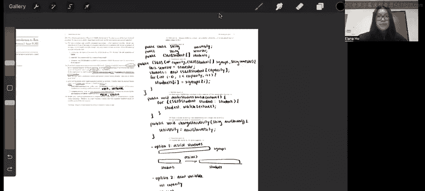

# 1：Java入门与类设计 🚀


在本节课中，我们将学习如何设计一个表示课程的Java类。我们将从定义一个简单的学生类开始，逐步构建一个更复杂的课程类，并在这个过程中理解静态变量、实例变量、构造函数以及方法的设计。

---

## 概述 📋

本节课基于UCB CS61B课程第二周的讨论内容。我们将创建一个名为 `CS61B` 的类，它代表一个学期的课程。这个类需要管理学生信息、课程容量以及大学名称等属性。我们将学习如何声明变量、编写构造函数以及实现方法，并最终考虑如何扩展课程容量。

---

## 第一部分：变量声明 🧱

首先，我们需要为 `CS61B` 类声明三个变量：大学名称、学期和学生列表。

以下是需要声明的三个变量及其考虑因素：
*   **university**：大学名称。对于所有 `CS61B` 课程实例，这个值都是 “UC Berkeley”。因此，它应该是一个**静态变量**，类型为 `String`。
*   **semester**：课程开设的学期，例如 “Fall 2023”。每个课程实例的学期可能不同，因此它是一个**实例变量**，类型为 `String`。
*   **students**：注册该学期课程的学生列表。课程有固定容量，因此我们可以使用一个大小固定的数组来存储。它是一个**实例变量**，类型为 `CS61BStudent[]`。

根据以上分析，变量声明如下：
```java
public static String university;
public String semester;
public CS61BStudent[] students;
```

---

## 第二部分：构造函数 🏗️

上一节我们声明了类的变量，本节中我们来看看如何初始化它们。我们需要编写一个构造函数，它接收三个参数：课程容量 `capacity`、报名学生数组 `signups` 和学期名称 `semester`。

构造函数需要完成以下任务：
1.  将传入的 `semester` 参数赋值给实例变量 `this.semester`。
2.  根据 `capacity` 初始化 `students` 数组。
3.  从 `signups` 数组中按顺序录取前 `capacity` 个学生到 `students` 数组中。

假设 `signups` 数组的长度至少为 `capacity`，构造函数的实现如下：
```java
public CS61B(int capacity, CS61BStudent[] signups, String semester) {
    this.semester = semester;
    this.students = new CS61BStudent[capacity];
    for (int i = 0; i < capacity; i++) {
        this.students[i] = signups[i];
    }
}
```

---

## 第三部分：方法实现 ⚙️

现在我们已经构建了课程的基本框架，本节中我们将为它添加行为。我们需要实现两个方法。

以下是需要实现的两个方法及其设计思路：

*   **makeStudentsWatchLecture()**：让所有注册本课程的学生“观看讲座”。
    *   **返回类型**：`void`（无返回值）。
    *   **参数**：无。
    *   **静态/实例**：这是一个实例方法，因为它操作的是特定课程实例的学生列表 (`this.students`)。
    *   **实现**：遍历 `students` 数组，对每个学生调用其 `watchLecture()` 方法。
    ```java
    public void makeStudentsWatchLecture() {
        for (CS61BStudent student : this.students) {
            student.watchLecture();
        }
    }
    ```

*   **changeUniversity(String newUniversity)**：更改所有 `CS61B` 课程实例的大学名称。
    *   **返回类型**：`void`。
    *   **参数**：`String newUniversity`。
    *   **静态/实例**：这是一个静态方法，因为它修改的是所有实例共享的静态变量 `university`。
    *   **实现**：将静态变量 `university` 重新赋值为 `newUniversity`。
    ```java
    public static void changeUniversity(String newUniversity) {
        university = newUniversity;
    }
    ```

---

## 第四部分：扩展课程容量 💡

最后，我们来思考如何修改现有的设计，以支持课程容量的扩展。核心需求是：当课程扩容后，应从原始的报名列表 (`signups`) 中录取更多学生，直到达到新的容量。

有两种主要的思路可以实现扩容：

1.  **数组扩容法**：这是后续项目中会深入实践的方法。我们可以创建一个 `resize()` 辅助方法。当需要扩容时，该方法会创建一个新的、容量更大的 `students` 数组，将原有学生复制进去，然后再从 `signups` 数组中录取新的学生加入末尾。

2.  **容量追踪法**：在类中新增一个实例变量 `capacity` 来记录当前允许的最大学生数。同时，保留完整的 `signups` 数组。我们只将 `signups` 中前 `capacity` 个学生视为已注册。当容量扩大时，我们只需增加 `capacity` 的值，逻辑上就有更多学生被“纳入”课程，而无需立即移动数组中的元素。

---

## 总结 🎯



本节课中我们一起学习了如何设计一个Java类来模拟大学课程。我们从变量声明开始，区分了静态变量和实例变量的使用场景。然后，我们编写了构造函数来初始化对象的状态。接着，我们实现了实例方法和静态方法，为类添加了特定的行为。最后，我们探讨了如何设计数据结构以支持未来“课程扩容”的功能，为更复杂的数据管理打下了基础。