# 2：讨论课1更新版（c部分）解析 🧩

在本节课中，我们将学习CS 61B课程中讨论课1更新版的核心内容，重点关注`Student`类中的`watchLecture`方法和`CS61B`类中的`makeStudentsWatchLecture`方法。我们将理解如何利用方法的返回值，并编写代码来统计实际观看讲座的学生人数。

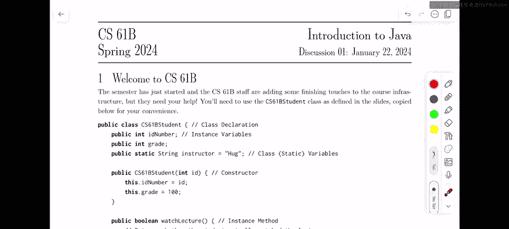

---

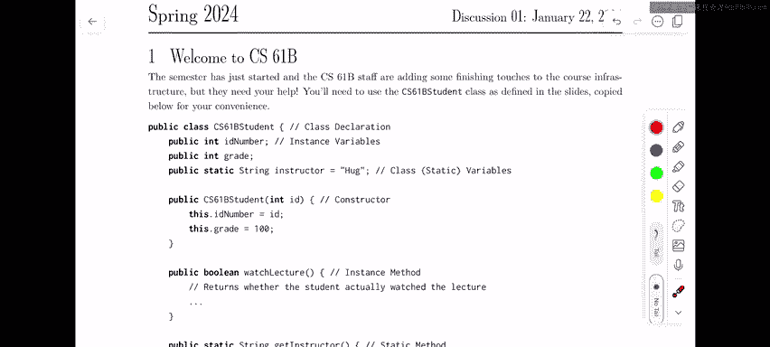

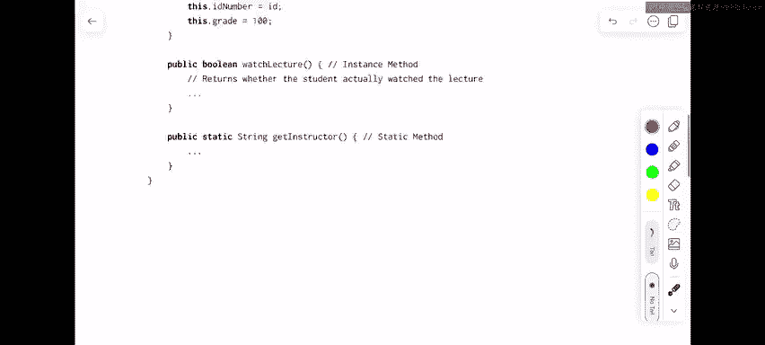

## 方法概述与设计思路

上一节我们介绍了讨论课的基本背景，本节中我们来看看具体更新的两个方法。主要变化在于`watchLecture`方法现在会返回一个布尔值（`boolean`），用于表示学生是否实际观看了讲座。这样设计是为了更好地演示如何利用其他方法的返回值。

在`CS61B`类的`makeStudentsWatchLecture`方法中，我们需要让本学期所有注册的CS61B学生观看讲座，并返回实际观看了讲座的学生总数。

## 方法头设计与实现

以下是`makeStudentsWatchLecture`方法的设计步骤：

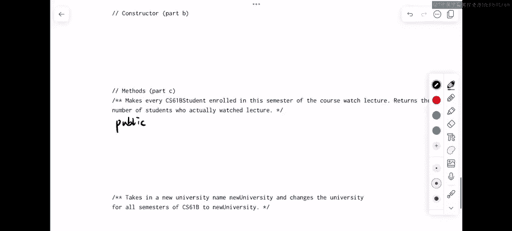

1.  **访问权限与类型**：该方法需要被其他类的用户访问，因此应设置为`public`。它应该是一个实例方法，因为它与特定的`CS61B`课程对象相关联，并且需要使用实例变量`students`。
    ```java
    public int makeStudentsWatchLecture()
    ```

2.  **返回值**：该方法需要返回一个整数，即实际观看讲座的学生数量。

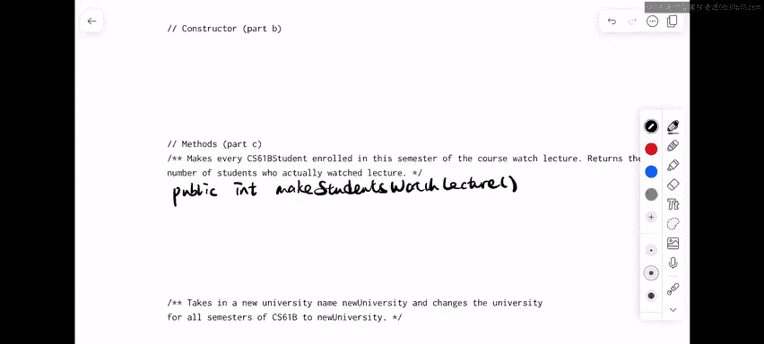

3.  **实现逻辑**：我们需要一个计数器变量来跟踪数量。然后，遍历`students`数组，为每个学生调用`watchLecture`方法，并根据其返回值更新计数器。

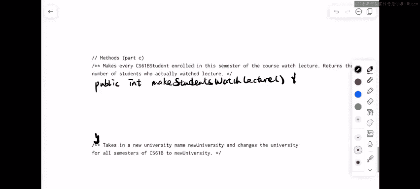

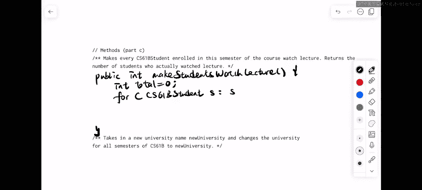

以下是完整的代码实现：

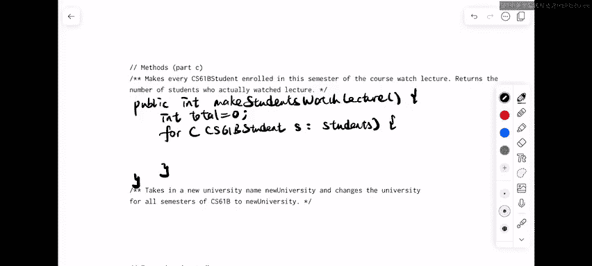

```java
public int makeStudentsWatchLecture() {
    int totalWatched = 0; // 初始化计数器
    for (Student s : students) { // 遍历所有学生
        if (s.watchLecture()) { // 调用方法并检查返回值
            totalWatched++; // 如果返回true，计数器加1
        }
    }
    return totalWatched; // 返回最终计数
}
```

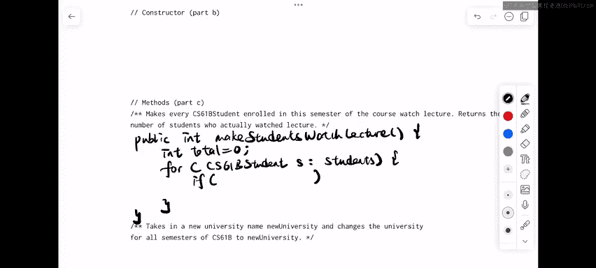

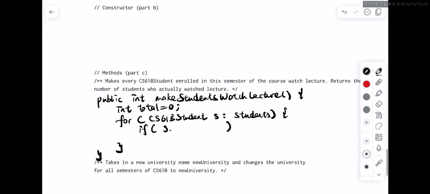

**代码说明**：
*   `int totalWatched = 0;`：创建并初始化一个整数变量用于计数。
*   `for (Student s : students)`：使用增强型for循环遍历`students`数组中的每个`Student`对象。
*   `if (s.watchLecture())`：调用每个学生对象的`watchLecture`方法。如果该方法返回`true`，则执行`if`语句块内的代码。
*   `totalWatched++`：将计数器`totalWatched`的值增加1。
*   `return totalWatched;`：循环结束后，返回计数器的值。

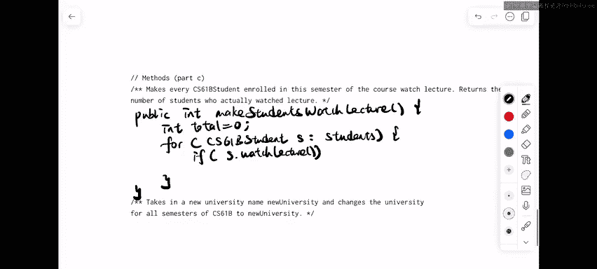


**替代方案**：你也可以先将`watchLecture`的返回值存储在一个布尔变量中，再判断该变量。但直接放在`if`条件中使用可以使代码更简洁。两种方式是等效的。

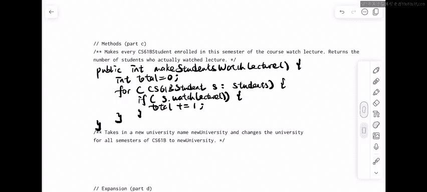

---

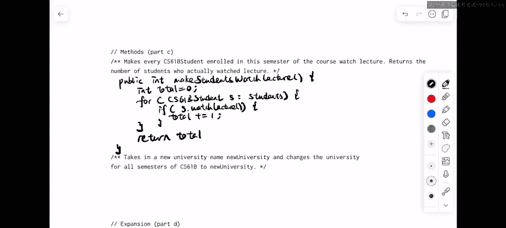

本节课中我们一起学习了CS 61B讨论课1更新版中`makeStudentsWatchLecture`方法的实现。我们掌握了如何设计一个实例方法来遍历对象数组、调用其他对象的方法，并利用其返回值（本例中是布尔值）来执行逻辑（计数）并最终返回一个结果（整数）。理解如何组合运用这些基本编程构件是学习面向对象编程和数据结构的重要一步。