# 4：2：使用包装类交换整数值 🔄

在本节课中，我们将学习如何通过创建一个简单的包装类来解决Java中无法直接交换基本类型变量值的问题。我们将通过一个具体的例子，演示如何交换两个整数变量的值。

上一节我们介绍了基本类型在Java中按值传递的特性，这导致无法通过简单的函数调用来交换两个基本类型变量的值。本节中，我们来看看如何通过创建一个包装类来巧妙地解决这个问题。

## 问题背景与思路

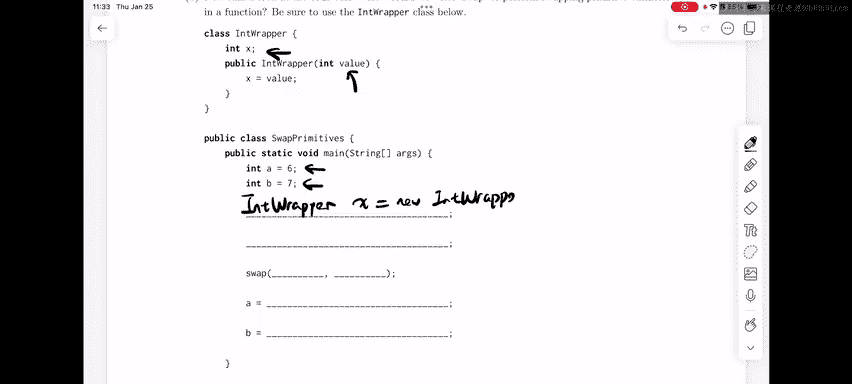

我们有两个整数变量 `a` 和 `b`，其值分别为6和7。由于Java是按值传递的，直接调用一个 `swap` 函数无法改变 `main` 函数中 `a` 和 `b` 的值。为了解决这个问题，我们引入一个名为 `IntWrapper` 的包装类。

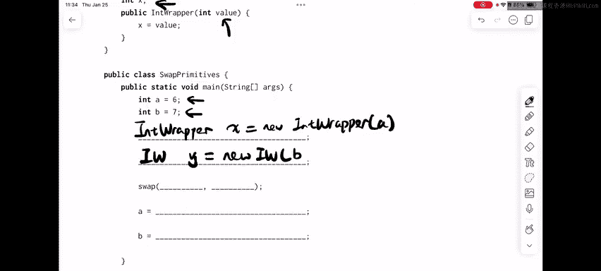

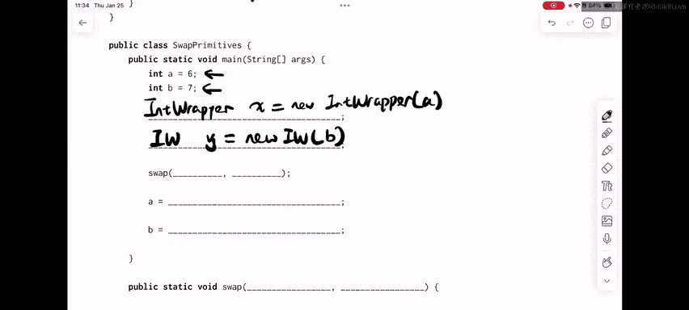

`IntWrapper` 类非常简单，它只包含一个实例变量 `x` 来存储整数值。其构造函数接收一个值并将其赋给 `x`。

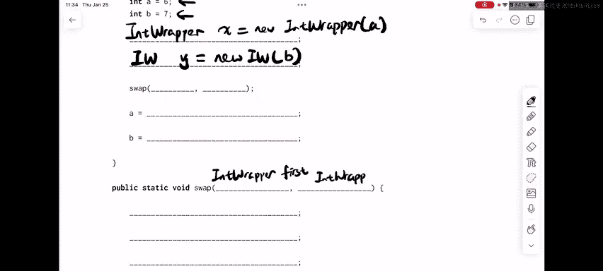

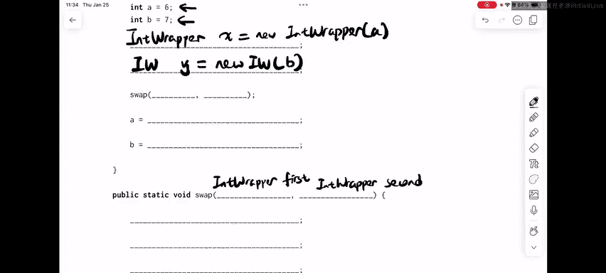

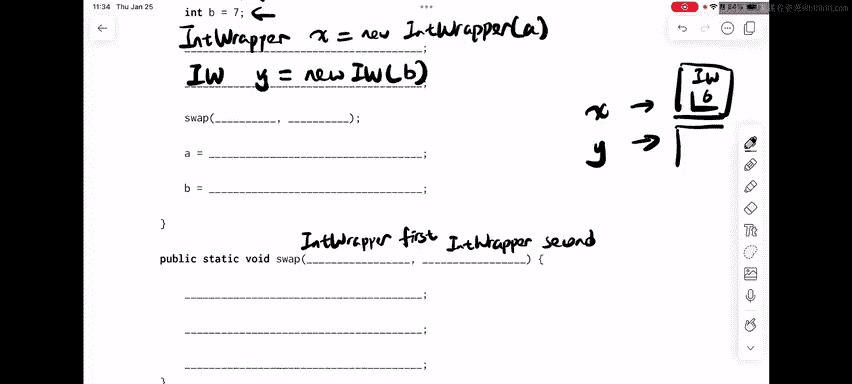

以下是 `IntWrapper` 类的代码定义：
```java
class IntWrapper {
    int x;
    public IntWrapper(int value) {
        this.x = value;
    }
}
```

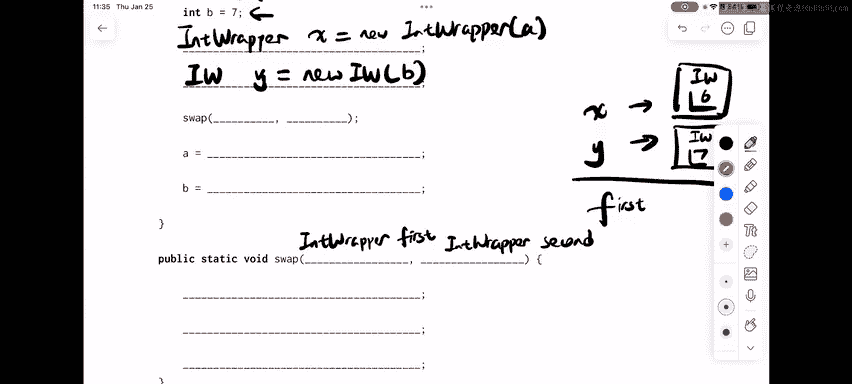

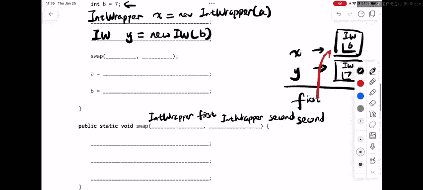

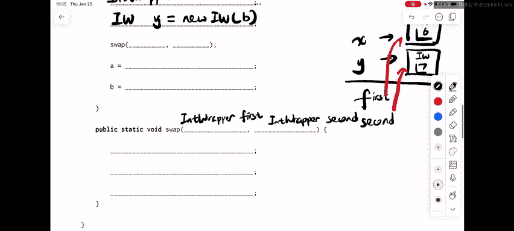

## 实现步骤

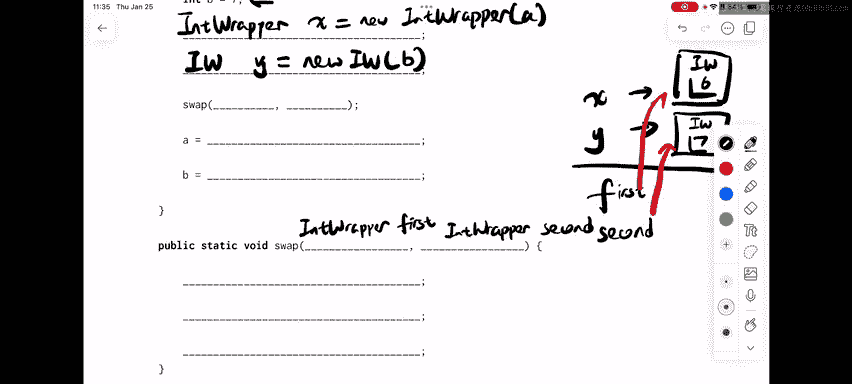

以下是实现交换功能的具体步骤。

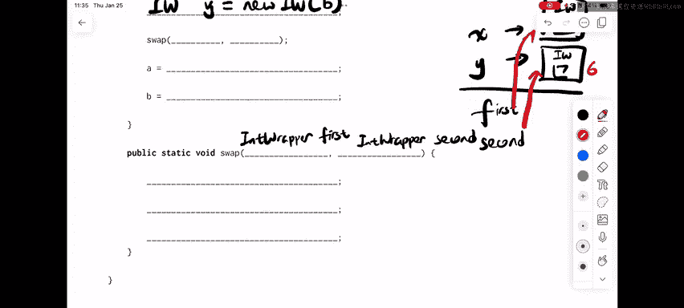

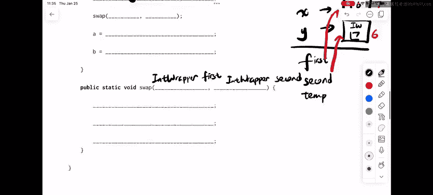

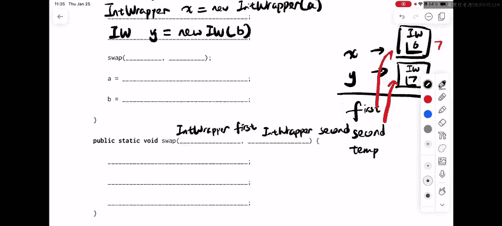

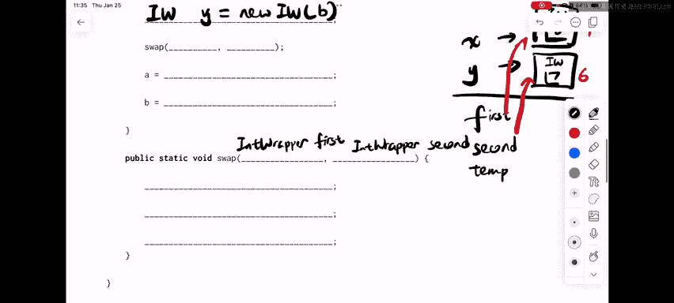

首先，在 `main` 方法中，我们创建两个 `IntWrapper` 对象来“包装”我们的整数 `a` 和 `b`。
```java
IntWrapper x = new IntWrapper(a);
IntWrapper y = new IntWrapper(b);
```

接着，我们需要编写一个 `swap` 方法，它接收两个 `IntWrapper` 类型的参数。在Java中，对象引用也是按值传递的，这意味着传递给 `swap` 方法的是指向这些对象的指针的副本。

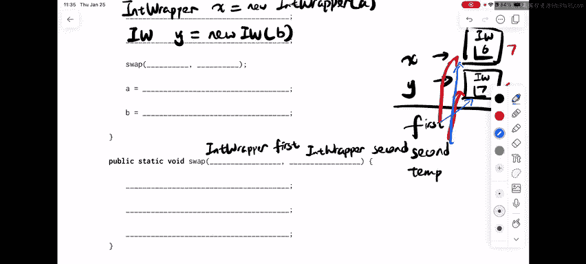

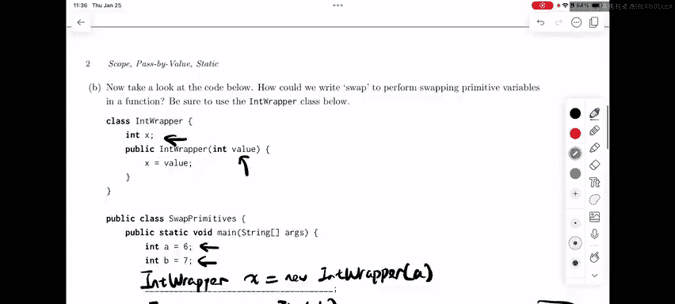

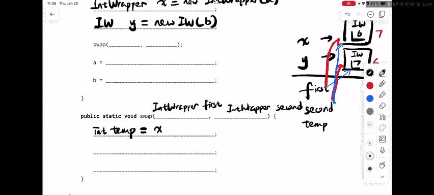

`swap` 方法的核心逻辑是交换两个 `IntWrapper` 对象内部 `x` 的值，而不是交换引用本身。以下是 `swap` 方法的实现代码：
```java
public static void swap(IntWrapper first, IntWrapper second) {
    int temp = first.x;      // 保存 first.x 的值
    first.x = second.x;      // 将 second.x 的值赋给 first.x
    second.x = temp;         // 将保存的原始 first.x 值赋给 second.x
}
```


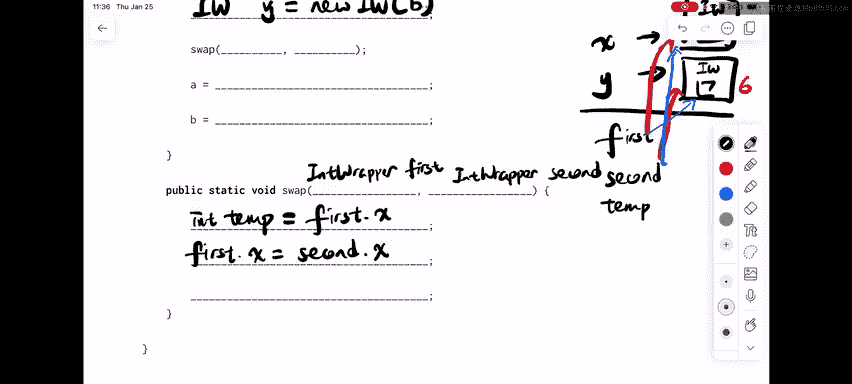

然后，在 `main` 方法中调用这个 `swap` 方法，传入我们创建的两个包装对象。
```java
swap(x, y);
```

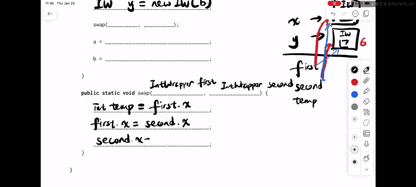

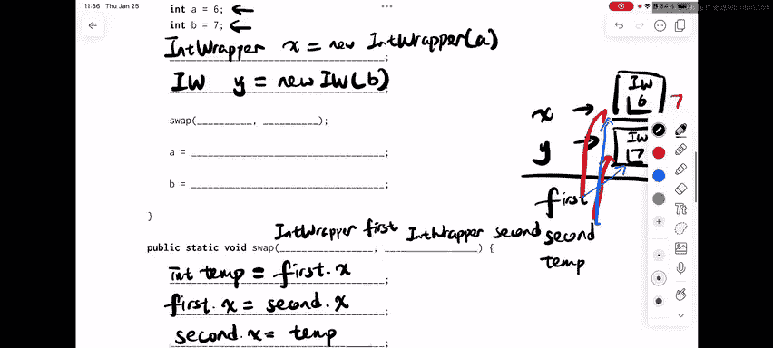

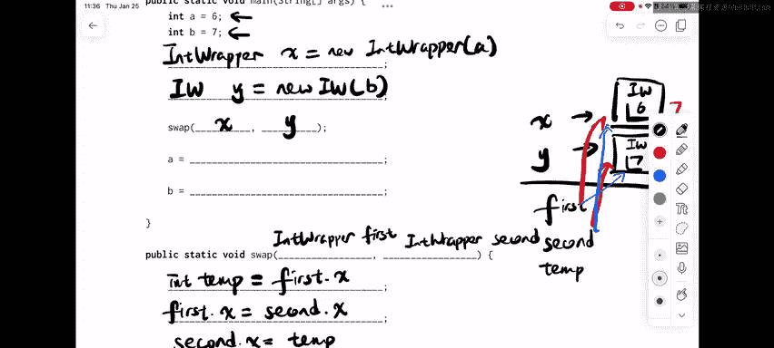

调用 `swap` 方法后，对象 `x` 和 `y` 内部的 `x` 值已经成功交换。最后一步是将交换后的值重新赋给原始的 `a` 和 `b` 变量，以反映交换结果。
```java
a = x.x;
b = y.x;
```

## 核心概念总结

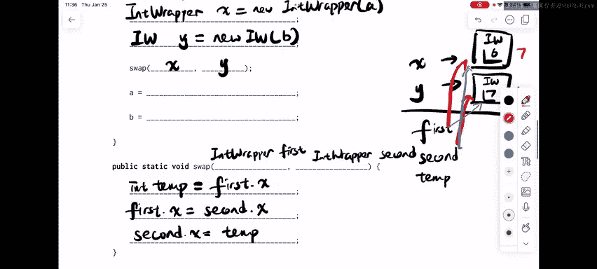

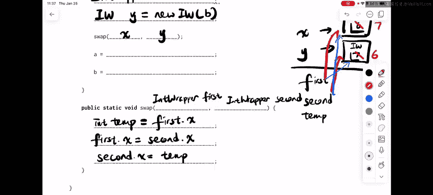

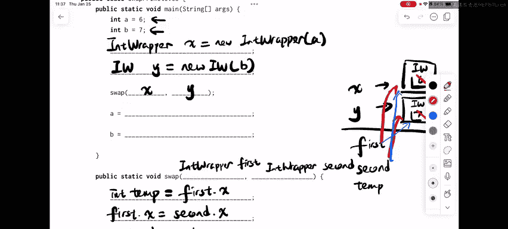

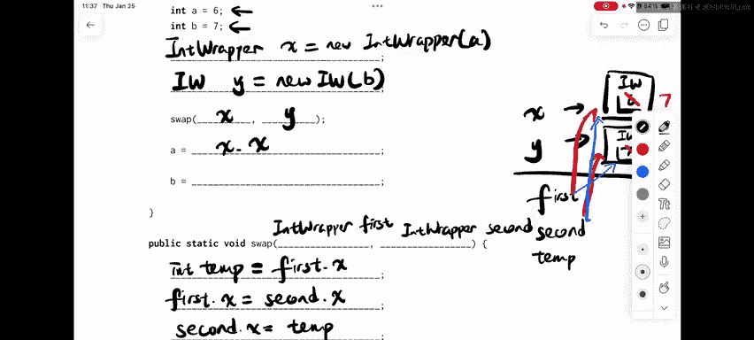

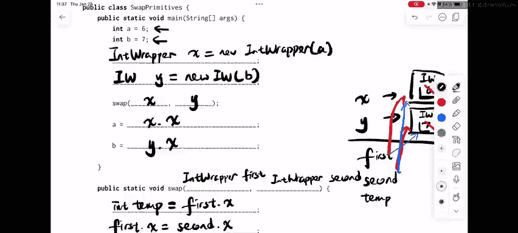

本节课中我们一起学习了如何利用包装类在Java中实现基本类型变量的交换。关键在于理解Java的按值传递机制，并通过操作包装类对象的内部字段来间接改变原始变量的值。我们定义了一个简单的 `IntWrapper` 类，并在 `swap` 方法中交换了其内部字段的值，最终成功交换了 `a` 和 `b` 的值。