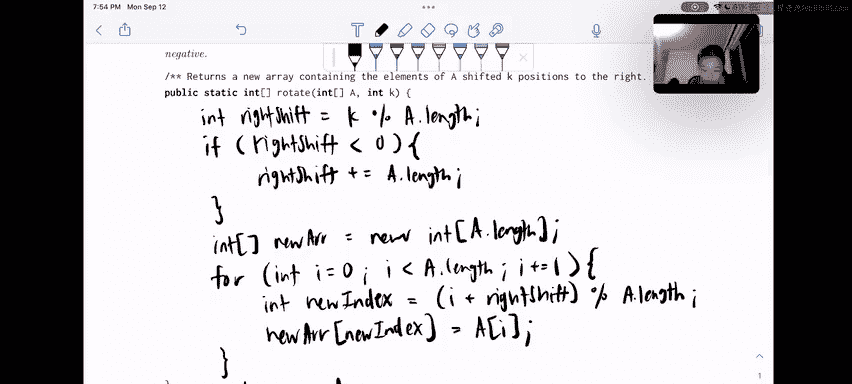

# 8：数组旋转问题详解 🔄


在本节课中，我们将学习如何实现一个数组旋转函数。该函数接收一个数组和一个整数 `k`，返回一个新数组，其内容相对于原数组向右循环移动了 `k` 个位置。如果 `k` 为负数，则向左移动。我们将逐步解析问题，并使用模运算来简化处理过程。

---

## 问题描述与示例

我们需要编写一个函数 `rotate`。给定一个数组 `A` 和一个整数 `k`，函数返回一个新数组。新数组的内容是原数组元素向右移动 `k` 个位置后的结果，必要时元素会从数组末尾循环回到开头。

例如，如果数组 `a` 包含值 `[0, 1, 2, 3, 4, 5, 6, 7]`，且 `k = 12`，那么调用 `rotate(a, k)` 后返回的数组如下所示：

**原数组：** `[0, 1, 2, 3, 4, 5, 6, 7]`

**旋转后数组：** `[4, 5, 6, 7, 0, 1, 2, 3]`

让我们以元素 `0` 为例。我们希望将 `0` 向右移动 12 个位置。由于数组长度为 8，移动 12 次后，`0` 最终会落在索引 4 的位置上。这个过程对所有元素都适用：每个元素都向右移动，并根据 `k` 值计算其最终位置，必要时进行回绕。

---

## 核心挑战与思路

上一节我们明确了问题目标，本节中我们来看看实现时需要解决的核心挑战。

参数 `k` 可以是任意大或任意小的正负数。如果 `k` 为负，则向左移动 `|k|` 个位置。调用 `rotate` 后，原数组 `a` 应保持不变。

一个关键的提示是：模运算符 `%` 会很有用。需要注意的是，在 Java 中，负数的模运算结果仍然是负数。

---

### 处理正数 `k` 与模运算

当 `k` 为正数且大于数组长度时，直接移动 `k` 位没有意义，因为元素会移出数组边界。这时就需要“回绕”。

观察示例，`k = 12`，数组长度 `n = 8`。元素 `0` 从索引 0 出发，移动 12 位后到达索引 4。实际上，移动 12 位等价于移动 `12 % 8 = 4` 位。模运算帮助我们得到了一个在 `[0, n)` 范围内的有效位移量。

因此，我们可以定义一个**有效右移量**：
`int rightShift = k % a.length;`

这个公式将任意大的 `k` 值转换为一个在 `0` 到 `n-1` 之间的数，代表了等效的循环右移步数。

---

### 处理负数 `k`

上一节我们利用模运算处理了正数位移，本节中我们需要解决负数位移的情况。

根据提示，负数的模运算结果仍为负数。例如，若 `k = -1`，则 `rightShift = -1 % 8` 在 Java 中结果为 `-1`。

但向左移动 1 位，在效果上等价于向右移动 `n - 1` 位。以数组 `[0,1,2,3,4,5,6,7]` 为例，左移1位（`k=-1`）后得到 `[1,2,3,4,5,6,7,0]`。观察元素 `0`，它从开头移动到了末尾，相当于向右移动了 7 位。

因此，当计算出的 `rightShift` 为负数时，我们可以通过加上数组长度 `n` 来将其转换为一个等效的正向右移量：
`if (rightShift < 0) { rightShift += a.length; }`

这样，对于 `k = -1`，我们先得到 `rightShift = -1`，然后加上 `8`，得到 `rightShift = 7`。这正确地表示了等效的右移步数。

---

## 算法实现步骤

明确了位移量的计算方法后，现在我们可以开始构建新数组了。

我们将创建一个与原数组 `a` 长度相同的新数组 `newArr`。然后，遍历原数组的每个元素，计算它在新数组中的目标位置，并放入。

以下是填充新数组的具体步骤：

1.  **计算有效右移量**：
    `int rightShift = k % a.length;`
    `if (rightShift < 0) { rightShift += a.length; }`

2.  **创建新数组**：
    `int[] newArr = new int[a.length];`

3.  **遍历并放置元素**：
    对于原数组 `a` 中的每一个索引 `i`（`0 <= i < a.length`）：
    *   计算目标索引：`(i + rightShift) % a.length`
    *   将 `a[i]` 的值赋给 `newArr[目标索引]`

**代码描述**：
```java
public static int[] rotate(int[] a, int k) {
    int n = a.length;
    int rightShift = k % n;
    if (rightShift < 0) {
        rightShift += n;
    }
    int[] newArr = new int[n];
    for (int i = 0; i < n; i++) {
        int newIndex = (i + rightShift) % n;
        newArr[newIndex] = a[i];
    }
    return newArr;
}
```

---

## 总结



本节课中我们一起学习了数组旋转算法的实现。我们首先理解了问题要求：根据给定的位移量 `k` 循环移动数组元素。然后，我们利用**模运算** `%` 来处理超出数组长度的位移，并通过判断和修正将**负数位移**统一转换为等效的正数右移量。最后，我们通过遍历原数组，使用公式 `(i + rightShift) % n` 计算每个元素在新数组中的正确位置，从而完成了新数组的构建。整个算法保证了原数组不被修改，同时高效地实现了循环旋转功能。