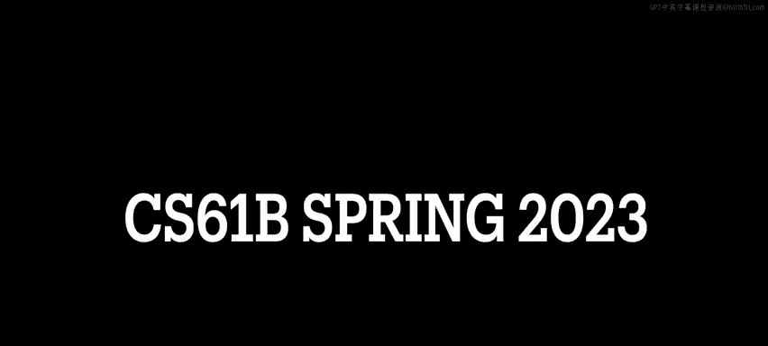
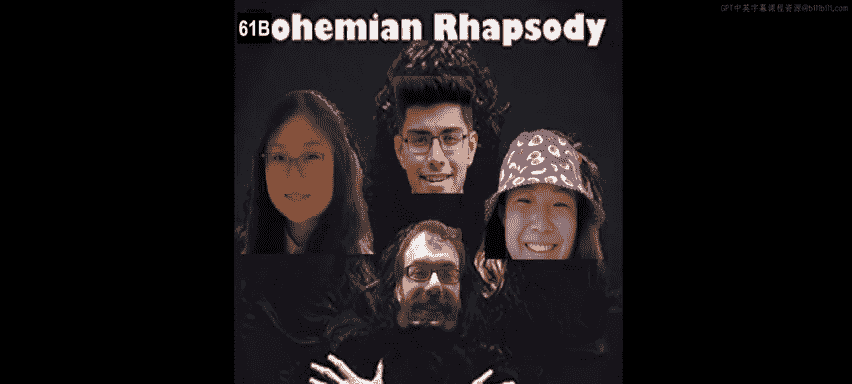
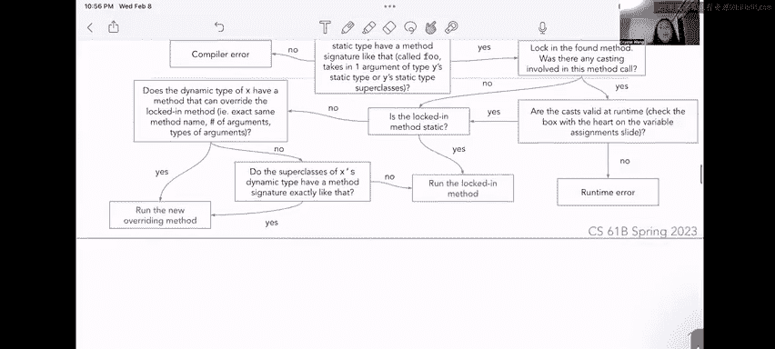

# 14：1 - 继承与接口内容回顾






## 概述
在本节课中，我们将要学习面向对象编程中的核心概念：继承与接口。我们将了解类如何通过继承建立关系，以及接口如何定义行为契约。同时，我们将深入探讨静态类型与动态类型的区别，以及动态方法选择的工作原理。这些概念是理解Java多态性的基础。

## 类：子类与超类
上一节我们概述了课程内容，本节中我们来看看类的继承关系。

子类（或称为子类/派生类）是继承自另一个类的类。这意味着子类可以访问其父类（超类）的所有函数和变量，同时还可以定义自己的函数和变量。这里有一个微小的注意事项：子类**不继承**父类的私有变量或函数。目前我们尚未深入学习访问修饰符，因此暂时无需担心这一点。目前可以理解为，子类拥有访问其父类函数和变量的能力（私有成员除外）。

在示例中，`Dog` 类有两个箭头指向 `Corgi` 和 `PitBull`。在这个例子中，`Corgi` 和 `PitBull` 就是 `Dog` 类的子类。

反之，超类（或称为父类/基类）是被其他类继承的类。在上图中，`Dog` 是超类，`Corgi` 和 `PitBull` 是继承自 `Dog` 的子类。

## 方法重载与方法重写
在类中，我们经常会看到不同类型的方法，有时会看到签名相似的方法。

### 方法重载
方法重载发生在同一个类中存在多个同名但参数不同的方法时。

以下是方法重载的示例：
```java
public void barkAt(Dog otherDog) {
    System.out.println("Woof!");
}

public void barkAt(CS61BStaff staff) {
    System.out.println("Woof! What is this?");
```
这两个方法都叫 `barkAt`，但接收不同类型的参数。

我们通常在**同一个类**的上下文中考虑方法重载。例如，假设这些 `barkAt` 方法属于 `Dog` 类，那么 `Dog` 类可能还有一个对 `CS61BStaff` 对象吠叫的 `barkAt` 方法。

思考一下，为什么我们需要方法重载？它的用途是什么？一个很好的例子是 `System.out.print`。你可能已经注意到，调用 `print` 时，我们通常传入一个字符串，但如果你传入一个整数，`System.out.print` 也会为你打印这个整数。在Python中，打印整数需要先将其转换为字符串，例如 `print(str(integer))`。但在Java中，`print` 方法可以打印整数、字符串、浮点数、双精度数等。其背后的思想是，并不存在一个能接收所有类型变量的“神奇”的 `System.out.print` 方法。实际上，`System.out.print` 是Java中的一个重载方法。存在一个接收整数的 `print` 方法，一个接收字符串的，一个接收字符的，一个接收双精度数的，等等。Java根据传入变量的类型来决定调用哪个函数。当我们想要像 `print` 这样常用的函数能够通用化地处理多种不同类型的变量时，这非常有用。

### 方法重写
方法重写发生在子类拥有一个与超类方法**函数签名完全相同**的方法时，并且通常用 `@Override` 标签标记。

记住，方法重载通常在同一类的上下文中考虑，而方法重写则通常涉及超类和子类拥有两个签名相同的方法。

例如，回想之前的幻灯片，我们有一个 `Dog` 类，`Corgi` 是 `Dog` 的子类。如果在 `Dog` 类中有 `public void speak()`，在继承自 `Dog` 的 `Corgi` 类中也可能有一个 `public void speak()`。你会注意到它们具有完全相同的函数签名：都叫 `speak`，且不接受参数。

关于 `@Override` 标签，本周讨论中有一位学生提出了一个很好的问题，我认为值得与大家分享。他问 `@Override` 标签的目的是什么。Java中 `@Override` 标签的目的基本上是告诉Java：在这个 `@Override` 标签下面，我们期望在父类中找到与此处方法签名完全匹配的方法。这意味着，如果你在 `Corgi` 类中放置了一个 `@Override` 标签，Java会期望你在此处定义的函数能在父类中找到完全匹配的函数签名。

例如，如果我们在编写 `Corgi` 类，而 `Corgi` 继承自 `Dog`，我们写了 `@Override public void bark()`，但 `Dog` 类中并没有 `bark` 方法，Java就会说：“等等，这说不通。你告诉我你要直接重写一个叫 `bark` 的函数，但我在 `Dog` 类里没看到 `bark` 方法。” 这基本上是一个为你设置的安全机制，确保你确切地知道在重写什么。话虽如此，`@Override` 标签只是一个安全机制，并非重写方法时的强制要求。实际上重写方法时并不需要 `@Override` 标签，但这是良好的实践，无论如何你都应该使用它。

## 接口
接口与类有些不同。接口由类来实现。当从接口继承时，我们使用 `implements` 关键字。

接口描述了一种可以应用于许多可能相关也可能不相关的类的**狭窄能力**。接口通常**不实现**它们所指定的方法（稍后会讨论这意味着什么），但可以使用 `default` 关键字来实现。接口方法本质上是 `public` 的，这必须在实现它们的子类中指明。记住，子类必须重写并实现非默认的接口方法。最后一件重要的事情是：**接口不能被实例化**。如果我们写 `Friendly f = new Friendly()`，而 `Friendly` 是一个接口，这行代码将无法编译，因为Java会认为：“这是一个接口。我知道一个对象可以是 `Friendly` 的，但实例化一个 `Friendly` 对象是什么意思？这说不通。” 所以Java会说：你不能实例化一个接口。

在下面的示例中，我们看到有两个类 `CS61BStaff` 和 `Dog`，以及两个用虚线框表示的接口 `Friendly` 和 `Cute`。`CS61BStaff` 实现了 `Friendly` 接口，而 `Dog` 同时实现了 `Friendly` 和 `Cute` 接口。这就是我们所说的“描述一种可以应用于许多可能相关也可能不相关的类的狭窄能力”。`CS61BStaff` 和 `Dog` 表面上彼此无关，但它们都是 `Friendly` 的，所以我们说这是一种可能属于多个看似没有其他实际关系的类的能力。

我可以就接口设计、在接口和类之间选择、何时从类或抽象类继承等问题展开讨论，但这里不打算深入。你现在真正需要知道的是，接口只是定义某种行为。一个你已经见过的很好的例子是抽象数据类型，你在第二次讨论和作业零中见过。例如 `List` 接口，有许多不同类型的列表，如 `ArrayList`、`LinkedList` 等等。它们都具有相同的行为，只是实现方式不同。你知道在 `ArrayList` 上可以调用 `get`、`add`，在 `LinkedList` 上也可以调用 `get`、`add`，因为我们知道这些是列表应该具备的行为类型。这就是我们所说的“能力”。接口告诉我们想要做什么，但不告诉我们如何做。

## 接口与类的区别
我认为这个区别有时会有点模糊。

一个类可以实现多个接口，但只能扩展一个类。在上面我们看到，`Dog` 类实现了 `Friendly` 和 `Cute` 两个接口。我认为Java设计者背后的考虑是：我们可以让一个类附加任意多个接口，因为接口描述的是非常狭窄的能力；而扩展一个类则是直接继承，例如 `Corgi` 是一种 `Dog`，让 `Corgi` 扩展另一个类是没有意义的。

如前所述，接口告诉我们想要做什么，但不告诉我们如何做；而类告诉我们如何做。类实际上实现方法，而接口可以有必须由子类填充的空方法体，或者不需要子类重写的默认方法。我们将在工作表的问题一中看到这一点。

使用 `extends` 关键字时，子类继承其父类的实例变量和静态变量（不包括私有变量，如前所述，但你现在不需要知道细节）。它们也继承其方法（这些方法可以被重写）以及嵌套类，但它们**不继承其构造函数**。如果我们想引用父类中的任何东西，可以使用 `super` 关键字。我们将在工作表的问题二中看到这一点。

我的意思是，我们不继承构造函数。假设我们有：
```java
public class Corgi extends Dog {
```
假设 `Dog` 的构造函数接收一个字符串，比如名字。如果 `Dog` 的构造函数已经做了我们希望在实例化 `Corgi` 时做的一切，那么我们就没有必要重复自己，没有必要重写 `Dog` 构造函数的主体。我们可以这样做：
```java
public Corgi(String name) {
    super(name);
```
这里 `super` 指的是 `Corgi` 的父类。这基本上是在说：“嘿，为我调用父类在 `name` 上的构造函数。” 这就是你本周关于 `super` 真正需要知道的全部内容，虽然本周你不会确切地使用它，但当你看到工作表上的问题二时，这只是一点术语。

## 实现关系图
如果我们有这张图，我们会看到一个叫 `Cute` 的接口和一个叫 `Friendly` 的接口（用虚线框表示）。我们会说 `class CS61BStaff implements Friendly`，因为 `Friendly` 是一个接口，我们想要实现一个接口。然后 `class Dog implements Cute, Friendly`。我们看到 `Dog` 这里有来自接口 `Friendly` 和 `Cute` 的箭头，因为接口可以被类实现多个，但类只能扩展一个其他类，这就是我们在下面看到的：`class Corgi extends Dog` 和 `class PitBull extends Dog`。

快速提醒一下，当我们实现一个接口时，实现该接口的类必须填充该接口中任何非默认的方法。我的意思是，假设 `Friendly` 定义了一个函数叫 `isFriendly`（我知道这很傻，但只是一个简单的例子）。假设这个函数在 `Friendly` 接口体内声明，你会看到它以分号结尾，没有大括号，方法体内没有任何内容（它没有方法体）。这意味着，因为 `CS61BStaff` 和 `Dog` 都实现了 `Friendly`，它们必须定义并实现自己的 `isFriendly` 版本。也许在 `CS61BStaff` 中我们会看到这样的东西：
```java
@Override
public boolean isFriendly() {
    // ... 实现内容
```
这就是我们所说的“实现接口的类需要填充那些空的接口方法体”。

## 静态类型与动态类型
既然我们已经学习了一点关于继承、接口和类的知识，当我们考虑静态类型与动态类型时，事情开始变得有趣起来。

在课程开始时（可能在第二次讨论中），我们谈到Java是一种静态类型语言，也是一种编译型语言。基本上，这意味着当我们在Java中编写代码时，我们必须告诉编译器每个变量的确切类型、每个方法的返回类型等等。这就是为什么我们有这些带有类型声明的变量声明。

我们考虑的**静态类型**（在编译时相关）和变量的**动态类型**（在运行时或代码实际执行时相关）之间存在区别。变量的静态类型在声明时指定（如我们在这里看到的），而其动态类型在实例化时指定（例如，使用 `new` 时）。我喜欢这样想：变量的静态类型是等号左边的任何东西，而变量的动态类型是等号右边的任何东西。

在这里我们看到，变量 `d` 的静态类型是 `Dog`（等号左边），而等号右边我们看到它的动态类型是 `Corgi`。变量的静态和动态类型必须相互兼容，否则代码会出错。我们的意思是，在这里我们想用一个经验法则来概括：给定“左边 = 右边”，右边是否保证是左边？如果你遵循上面的例子或者凭直觉知道，你会看到右边是一个 `Corgi`，我们会问自己：`Corgi` 是否保证是一个 `Dog`？是的，如果你知道 `Corgi` 是一种 `Dog`，也因为我们在上面明确说过 `Corgi` 是 `Dog` 的子类。所以 `Corgi` 是一个 `Dog`，正如Josh可能在讲座中说的那样，或者它们处于超类/子类、父类/子类的关系中。

回到这里，我过去和学生们讨论过的另一种思考方式是：假设我在这里重新绘制继承层次结构。我喜欢这样想：在你的继承树的最顶端，你有一个非常大的盒子，每次你沿着继承树往下走，一切都用一个更小的盒子来表示。假设我们有这个变量 `d`，我们说它的类型是 `Dog`，所以它是这里的这个大盒子。当你问自己：我能把一个 `Corgi` 放进我的 `Dog` 盒子里吗？如果 `Corgi` 在我的变量右边，而左边是 `Dog`，它能放进去吗？我喜欢这样想：我知道 `Corgi` 在继承树中更靠下，所以我有一个更小的盒子，因此我可以把更小的 `Corgi` 盒子放进更大的 `Dog` 盒子里。我对 `PitBull` 也可以做同样的事情，我可以把更小的 `PitBull` 盒子放进更大的 `Dog` 盒子里。

然而，我不能做的是：假设我们有 `Corgi c = new Dog()`。例如，下面这行代码。如果我们有这样的东西，我们会有这个小 `Corgi` 变量，我们会问自己：`Dog` 是否保证是一个 `Corgi`？我能把我非常大的 `Dog` 盒子放进这个 `Corgi` 盒子里吗？然后你会意识到，实际上我的 `Corgi` 盒子比我的 `Dog` 盒子小，`Corgi` 比 `Dog` 更具体，因此我不能这样做，这行代码将无法编译。

还有一个注意事项：虽然接口不能被实例化，但它们可以作为静态类型。例如，你可以说 `Cute c = new Corgi()`。记住，在之前的例子中，我们定义 `Cute` 是一个接口。这就是我们在这里的意思，接口是静态类型（等号左边的类型），它只是不能是等号右边的类型（不能是动态类型），因为我们不能实例化一个接口。这是可行的，因为 `Corgi` 继承自 `Cute`（`Corgi` 实现了 `Cute`），所以我们知道 `Corgi` 是可爱的东西，这就是为什么这行得通。

## 类型转换
接下来我们稍微谈谈类型转换。这不属于期中考试一的范围，但我在这次讨论中涵盖它，因为不幸的是，这是我们唯一能正式学习类型转换的一周，而它有点重要。

类型转换允许我们告诉编译器，将某个变量的静态类型视为我们想要的任何类型。重要的是，转换类型必须具有超类或子类关系（当我们通过这个例子时，我会稍微谈谈这一点）。如果转换对该变量有效，我们就会将被转换变量的静态类型视为我们转换成的类型。

让我们稍微画一下。在这个例子中，我有变量 `a`、`d` 和 `c`。然后我要画一个小层次结构，所以在这里做层次结构：`Animal` 是这个父类，它的子类是 `Dog` 和 `Cat`。然后我要说 `Animal a`、`Dog d` 和 `Cat c`。这个 `Animal` 指向某个地方的某个 `Dog`。`Dog d` 指向 `a` 指向的任何东西（实际上我不画那个箭头，因为它会乱，但我会谈谈为什么），然后 `Cat c` 指向某个地方的 `new Cat()`。

首先，在这行代码中，我们有 `Animal a = new Dog()`。如果我们问：给定这里的层次结构，右边是否保证是左边？`Dog` 是 `Animal` 吗？是的，它是。所以我们没问题。哦，我刚刚意识到我的缩放方块可能挡住了这个，让我稍微移一下。好了，我想这样好多了。

我们可以说，即使 `a` 的静态类型是 `Animal`，因为 `Dog` 是一种 `Animal`，我们可以让 `a` 指向内存中的一个 `Dog`。

然而，如果我们看到这行代码 `Dog d = a`，我们会得到一个编译错误。原因是，在编译时，我们只关心变量的静态类型。我的意思是，在这里我们知道 `a` 的静态类型是 `Animal`。即使它的动态类型是 `Dog`，在编译时，我们只看变量的静态类型。所以这里我们试图将这个 `Dog d` 设置为内存中的某个 `Animal`，在编译时我们不知道它是 `Dog`，我们只知道 `a` 的静态类型是 `Animal`。所以这实际上是在说：右边有一个 `Animal`，左边有一个 `Dog`，我们要问自己：一个 `Animal` 是否保证是一个 `Dog`？答案将是否定的。所以我们会得到一个编译错误。基本上，这行代码不起作用。

但是，如果我们这样做：`Dog d = (Dog) a`，我们是在告诉Java：仅针对这一行，我希望你把 `a` 当作一个 `Dog` 来对待。这看起来会是：它会看到 `a` 的静态类型是 `Animal`，它会看到转换类型是 `Dog`，编译器会问自己：一个 `Animal` 有可能是一个 `Dog` 吗？一个 `Animal` 可能是 `Dog` 吗？我所说的超类/子类关系是指，转换类型和你试图转换的变量的静态类型只需要存在某种层次上的祖先关系。所以我们问自己：这个 `Animal` 可能是 `Dog` 吗？它不一定是 `Dog`，但它可能是 `Dog` 吗？所以在编译时，我们让这个转换通过。

然后，在代码编译后的运行时，我们很幸运，因为我们发现：哦，很酷，即使在编译时你告诉我把 `a` 当作 `Dog` 对待，但事实证明 `a` 实际上指向内存中的一个 `Dog`。所以我们没问题，一个 `Dog` 被转换成 `Dog`，对我来说听起来很好。

在下一张幻灯片中，如果我们做 `d = new Dog()`，所以这指向内存中另一个不同的 `Dog`。如果我们做下一行 `a = (Animal) d`，我们会看到 `d` 在编译时的静态类型是 `Dog`。如果我们试图将一个 `Dog` 转换成 `Animal`，这绝对可行，因为 `Animal` 和 `Dog` 处于层次上的父类/子类关系中。我们知道 `Dog` 是 `Animal`，所以这个转换在编译时对我们来说是好的，在运行时它也有效，因为我们发现：嘿，很酷，这里我们有一个 `Animal`，`a` 的静态类型是 `Animal`，你告诉我 `d` 在编译时是一个 `Animal`，这对我来说没问题，`Animal` 是 `Animal`。然后在运行时，一切顺利，因为即使 `d` 实际上是一个 `Dog`，`Dog` 是 `Animal`，很酷。

然后在这行，我们设置 `Cat c = new Cat()`。现在，当我们到达这行 `d = (Dog) c` 时，我们遇到了问题，因为 `c` 的静态类型是 `Cat`，而我们试图将一个 `Cat` 转换成 `Dog`。但 `Dog` 和 `Cat` 是兄弟关系，即使它们都是 `Animal` 类型，它们也不在超类/子类关系中。所以这个转换无法编译，我们会得到一个编译错误。

在下一张幻灯片中，如果我们做 `a = c`，让我们检查一下它的有效性。`a` 的静态类型是 `Animal`，`c` 的静态类型是 `Cat`。如果我们设置 `a` 等于 `c`，这对我们来说是可行的，因为我们知道 `Cat` 是一种 `Animal`，所以我们完全可以这样做。

最后，当我们到达最后一张幻灯片时，我们会遇到一些非常有趣的东西，叫做**运行时错误**，这只有在进行这种变量匹配的类型转换时才可能发生。

这个转换在编译时通过，因为一个 `Animal` 可能合理地是一个 `Dog`。我的意思是，在这里我们知道静态类型是 `Dog`。然后在这里，我们有这个变量 `a`，它的静态类型是 `Animal`，我们试图告诉编译器把它当作 `Dog` 来对待。所以当编译器遇到这个时，它看到 `a` 是一个 `Animal`，我们试图把它转换成 `Dog`，我们问：是否存在超类/子类关系？一个 `Animal` 可能是一个 `Dog` 吗？我们说，是的，一个 `Animal` 可能是一个 `Dog`，这不一定是保证，但它是可能的。所以在编译时，Java说：好吧，我让你通过，我们以后再解决这个问题，但现在你通过了，你可以编译。

然而，在运行时，当我们查看变量的动态类型时，我们会重新审视这个转换，并说：嘿，我有这个变量 `a`，我知道它通过了编译时检查（编译器说你现在没问题），但在运行时，当我们关心 `a` 的动态类型时，`a` 的动态类型实际上是一个 `Cat`（它指向内存中的一个 `Cat`），而我们试图将一个 `Cat` 转换成 `Dog`，这行不通，就像我们在上面做的那样，因为 `Dog` 和 `Cat` 是兄弟关系。所以那个转换在运行时不起作用。这就是区别：它通过了编译时检查，但没有通过运行时检查。我喜欢这样想：在编译时，我们问自己：这个转换可能吗？然后在运行时，我们问自己：这个转换是真的吗？这就是我对类型转换的思考方式。

## 动态方法选择
我们讨论的静态和动态类型的匹配相当复杂，但当我们进行所谓的**动态方法选择**时，它基本上可以总结为一套规则。这往往是61B学生觉得最困难的话题之一，因为它真的很令人困惑。老实说，这主要源于Java和静态类型语言的事实，以及随之而来的限制。

在编译时，你的计算机只关心调用实例的静态类型。我的意思是，假设我们有 `Animal a = new Animal()`。当我们进行动态方法选择时，我们关心的是像 `a.greet()` 这样的东西。假设 `c` 是 `new Cat()`（我知道语法很糟糕，但这只是一个例子）。

在动态方法选择的编译时，我们只关心调用实例的静态类型。所以我们只关心这里 `a` 的静态类型，也就是 `Animal`。实际上，我要加点料，让它变成 `Dog` 之类的。

在编译时，我们首先检查有效的变量赋值（这有点像我们上面用类型转换做的：右边是否保证是左边？），然后我们只考虑静态类型和静态类型的超类来检查有效的方法调用。这一点非常重要，因为我认为这是学生们有时会迷失的地方。他们会想：等等，那动态类型呢？不，在编译时，我们只关心变量的静态类型。

然后，一旦我们找到足够的方法签名（必要时遍历父类），我们就想锁定确切的方法签名。我们需要否认的是，如果我们在调用变量的静态类型中没有找到合适的方法，那么我们会转到该变量的父类，直到找到我们想要的方法。如果我们没有找到想要的方法，就会抛出编译错误。

然后在运行时，我们关心调用实例的动态类型。如果我们在编译时锁定的方法是静态的，我们将跳过以下步骤，直接运行编译时锁定的方法。如果它不是静态的，那么我们要检查调用实例的动态类型中是否有被重写的方法。在这个例子中，我们会查看 `Dog` 类内部。

当我们检查被重写的方法时，我们的意思是：锁定的方法签名在动态类或动态类的父类中是否有完全相同的方法签名？如果我们确实找到了一个，那么我们希望根据运行时的动态类型运行我们找到的新方法。如果我们没有找到，那完全没问题，我们就运行编译时锁定的那个方法。

最后，我们还要确保转换后的对象可以赋值给它们的变量，这基本上又是我们上面用这些类型转换所做的。

动态方法选择非常令人困惑。上学期我做了一个关于变量赋值规则和方法调用规则的巨大流程图。这需要消化很多，而且其中一些规则对于我们本学期学习DMS的方式来说有点过度。我可能会在做实际的动态方法选择问题（工作表上的问题二）时拿出这个图表，这样我们就可以按照流程工作，熟悉我们在这里寻找的东西。我相信，这就是内容回顾的结束。



## 总结
本节课中我们一起学习了面向对象编程中的继承与接口。我们明确了子类与超类的关系，区分了方法重载与重写，理解了接口定义行为契约的方式。我们深入探讨了静态类型与动态类型的关键区别，以及类型转换的规则和潜在风险。最后，我们概述了动态方法选择的复杂过程，这是理解Java运行时多态性的核心。掌握这些概念对于构建灵活、可维护的面向对象程序至关重要。