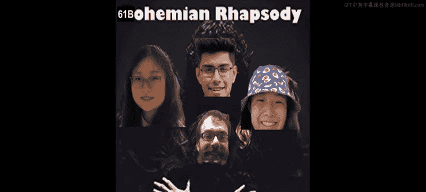
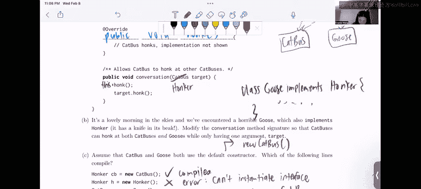

# 04：接口与继承实战





在本节课中，我们将通过一个具体的编程问题，学习如何实现接口、理解继承关系，并掌握静态类型与动态类型在Java中的运用。我们将分析一个关于“猫巴士”和“鹅”的示例，逐步完成代码的填充与修改。

## 概述

我们将处理一个包含`Vehicle`和`Honker`接口的编程问题。目标是让`CatBus`类能够同时表现出车辆和鸣笛者的行为，并使其能与另一个同样会鸣笛的`Goose`类进行交互。我们将分步完成类的实现、方法签名的修改以及类型兼容性的判断。

## 第一部分：实现CatBus类 🚌

上一节我们介绍了问题的背景，本节中我们来看看如何让`CatBus`类实现指定的接口。

给定`Vehicle`和`Honker`接口，我们需要填写`CatBus`类，使其能够像车辆一样发动引擎，并像鸣笛者一样鸣笛。

我们知道，当一个类需要具备某个接口定义的行为时，需要使用`implements`关键字。一个类可以实现多个接口，但只能继承一个父类。

以下是实现`CatBus`类的关键步骤：
*   在类声明中使用`implements Vehicle, Honker`。
*   由于接口中的方法（`revEngine`和`honk`）没有默认实现（即没有方法体），`CatBus`类必须提供这两个方法的具体实现。
*   接口方法默认是`public`的，因此在实现时也需要显式声明为`public`。

核心实现代码如下：
```java
public class CatBus implements Vehicle, Honker {
    @Override
    public void revEngine() {
        // CatBus revs its engine (implementation not shown)
    }

    @Override
    public void honk() {
        // CatBus honks (implementation not shown)
    }
}
```

## 第二部分：修改对话方法 🗣️

在上一节我们实现了`CatBus`的基本功能，本节中我们来看看如何扩展其交互能力。

现在，我们遇到了一只同样实现了`Honker`接口的`Goose`。我们需要修改`CatBus`的`conversation`方法签名，使其参数`target`既能接受`CatBus`对象，也能接受`Goose`对象。

分析类之间的关系：`CatBus`和`Goose`没有直接的继承关系，但它们都实现了`Honker`接口。这意味着它们都是`Honker`类型，并且都拥有`honk`方法。

因此，解决方案是将方法参数的类型从具体的`CatBus`改为其共同的接口类型`Honker`。这样，任何实现了`Honker`接口的对象都可以作为参数传入。

修改后的方法签名如下：
```java
public void conversation(Honker target) {
    this.honk();
    target.honk();
}
```

## 第三部分：判断代码可编译性 ✅

在上一节我们修改了方法以支持多态，本节中我们通过几个赋值语句来巩固对类型系统的理解。

假设`CatBus`和`Goose`都使用默认构造函数，我们需要判断以下三行代码能否通过编译。

以下是各代码行的分析：
1.  `Honker cb = new CatBus();`
    *   **分析**：静态类型是`Honker`，动态类型是`CatBus`。由于`CatBus`实现了`Honker`接口，一个`CatBus`对象保证是一个`Honker`。因此，右侧对象可以安全赋值给左侧变量。
    *   **结论**：**可以编译**。
2.  `Honker h = new Honker();`
    *   **分析**：尝试使用`new`关键字实例化一个接口。接口定义了一组能力规范，本身不能被直接实例化。接口只能作为静态类型，不能作为动态类型。
    *   **结论**：**无法编译**。
3.  `CatBus g = new Goose();`
    *   **分析**：静态类型是`CatBus`，动态类型是`Goose`。虽然`Goose`和`CatBus`都实现了`Honker`接口，但它们是两个独立的类，彼此之间没有继承关系。一个`Goose`对象不保证是一个`CatBus`对象。
    *   **结论**：**无法编译**。

## 总结



本节课中我们一起学习了接口实现与多态的应用。我们首先让`CatBus`类实现了`Vehicle`和`Honker`接口，并提供了必要的方法实现。接着，我们通过将方法参数类型改为公共接口`Honker`，使得方法能够接受多种不同类型的对象，体现了“面向接口编程”的灵活性。最后，我们通过分析赋值语句，加深了对Java静态类型、动态类型以及接口实例化规则的理解。记住：接口不能被`new`实例化，但可以作为引用类型指向实现了该接口的类的对象。