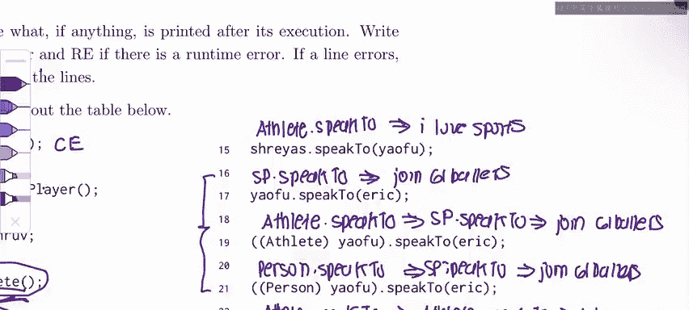

# 18：Spring 2023 考试第4级问题1解析

在本节课程中，我们将一起学习继承和多态的核心概念，并通过分析Spring 2023考试中的一个具体问题来加深理解。我们将重点关注接口实现、类继承、编译时与运行时类型，以及类型转换。

## 问题概述与类结构

首先，我们来了解问题的背景和涉及的类结构。这个问题主要围绕三个部分展开：`Person`接口、`Athlete`类和`SoccerPlayer`类。

*   `Person` 是一个接口。
*   `Athlete` 类实现了 `Person` 接口。
*   `SoccerPlayer` 类继承了 `Athlete` 类。

以下是它们的关键方法定义：
*   `Person` 接口声明了 `speakTo(Person p)` 和 `watch()` 方法。
*   `Athlete` 类实现了这些方法：`speakTo(Person p)` 打印 `"I love sports"`，`watch()` 打印 `"Ball is life"`。
*   `SoccerPlayer` 类重写了 `speakTo(Person p)` 方法，打印 `"Join 61B ballers"`。

## 变量声明与类型分析

现在，我们开始逐行分析代码，判断每行代码的编译时类型、运行时类型以及输出结果。

以下是第一组变量声明的分析：

1.  `Person AyI = new Person();`
    *   **分析**：左侧声明 `AyI` 的编译时类型为 `Person`。右侧试图实例化一个 `Person` 接口。**接口不能被实例化**。
    *   **结果**：编译错误。

2.  `Athlete Drev = new SoccerPlayer();`
    *   **分析**：左侧声明 `Drev` 的编译时类型为 `Athlete`。右侧实例化了一个 `SoccerPlayer` 对象，因此其运行时类型为 `SoccerPlayer`。
    *   **结果**：声明成功。编译时类型为 `Athlete`，运行时类型为 `SoccerPlayer`。

3.  `SoccerPlayer V = Drev;`
    *   **分析**：编译器只知道 `Drev` 的编译时类型是 `Athlete`。不能将一个父类 (`Athlete`) 类型的变量直接赋值给子类 (`SoccerPlayer`) 类型的变量，因为 `Drev` 可能并不是 `SoccerPlayer`。
    *   **结果**：编译错误。

4.  `Person Eric = new Athlete();`
    *   **分析**：左侧编译时类型为 `Person`。右侧运行时类型为 `Athlete`。这是有效的向上转型。
    *   **结果**：声明成功。编译时类型为 `Person`，运行时类型为 `Athlete`。

5.  `Athlete Surya = new Athlete();`
    *   **分析**：编译时类型和运行时类型都是 `Athlete`。
    *   **结果**：声明成功。两者均为 `Athlete`。

6.  `SoccerPlayer YaoFu = new SoccerPlayer();`
    *   **分析**：编译时类型和运行时类型都是 `SoccerPlayer`。
    *   **结果**：声明成功。两者均为 `SoccerPlayer`。

## 方法调用与多态行为

上一节我们分析了变量的声明和类型。本节中，我们来看看方法调用，这是理解多态的关键。

以下是具体的方法调用分析：

7.  `Eric.watch();`
    *   **编译时**：`Eric` 的编译时类型是 `Person`，因此选择 `Person.watch()` 方法声明。
    *   **运行时**：`Eric` 的运行时类型是 `Athlete`，因此执行 `Athlete.watch()` 方法。
    *   **输出**：`"Ball is life"`。

8.  `Surya.speakTo(YaoFu);`
    *   **编译时/运行时**：`Surya` 的编译时和运行时类型都是 `Athlete`，因此始终选择 `Athlete.speakTo(Person p)` 方法。
    *   **输出**：`"I love sports"`。

9.  `YaoFu.speakTo(Surya);`
    *   **编译时/运行时**：`YaoFu` 的编译时和运行时类型都是 `SoccerPlayer`，因此始终选择 `SoccerPlayer.speakTo(Person p)` 方法。
    *   **输出**：`"Join 61B ballers"`。

## 类型转换详解

理解了基本的方法调用后，我们引入类型转换。类型转换可以“欺骗”编译器，临时改变变量在**某一行代码**中的编译时类型。

以下是涉及类型转换的代码分析：

19. `((Athlete) YaoFu).speakTo(Eric);`
    *   **编译时**：通过强制转换，编译器将 `YaoFu` 在此行的编译时类型视为 `Athlete`，因此选择 `Athlete.speakTo(Person p)` 方法。
    *   **运行时**：`YaoFu` 的运行时类型始终是 `SoccerPlayer`，未改变。因此执行 `SoccerPlayer.speakTo(Person p)` 方法。
    *   **输出**：`"Join 61B ballers"`。

21. `((Person) YaoFu).speakTo(Eric);`
    *   **编译时**：编译器将 `YaoFu` 视为 `Person` 类型，选择 `Person.speakTo(Person p)` 方法声明。
    *   **运行时**：`YaoFu` 的运行时类型是 `SoccerPlayer`，执行 `SoccerPlayer.speakTo(Person p)` 方法。
    *   **输出**：`"Join 61B ballers"`。

23. `((Athlete) Eric).speakTo(YaoFu);`
    *   **编译时**：编译器将 `Eric` 视为 `Athlete` 类型，选择 `Athlete.speakTo(Person p)` 方法。
    *   **运行时**：`Eric` 的运行时类型本就是 `Athlete`，转换合法，因此执行 `Athlete.speakTo(Person p)` 方法。
    *   **输出**：`"I love sports"`。

25. `((SoccerPlayer) Eric).speakTo(YaoFu);`
    *   **分析**：`Eric` 的运行时类型是 `Athlete`。尝试将其向下转型为子类 `SoccerPlayer`。由于一个 `Athlete` 对象不一定是 `SoccerPlayer`，这种转换在运行时无法安全进行。
    *   **结果**：运行时错误 (`ClassCastException`)。

**核心要点**：类型转换**只改变编译时类型的判断**，用于通过编译检查。它**永远不会改变**对象的实际运行时类型。如果试图将一个对象转换为它运行时类型不兼容的类型，就会引发运行时错误。

## 总结与考试技巧

本节课中，我们一起学习了继承体系下的方法调用规则和类型转换。

我们来总结一下核心步骤：
1.  **确定类型**：明确变量的编译时类型和运行时类型。
2.  **编译时选择**：根据编译时类型确定要调用的方法签名。
3.  **运行时执行**：根据运行时类型，找到实际要执行的方法体（遵循重写规则）。
4.  **谨慎转换**：使用强制转换时，需确保运行时类型兼容，否则会导致运行时错误。

一个实用的考试技巧是：在解题时，像本教程一样，清晰地标注出每一行代码涉及的变量的编译时和运行时类型。这能帮助你系统地推理，避免混淆，准确判断输出或错误类型。

祝你在CS 61B后续的学习和考试中一切顺利！