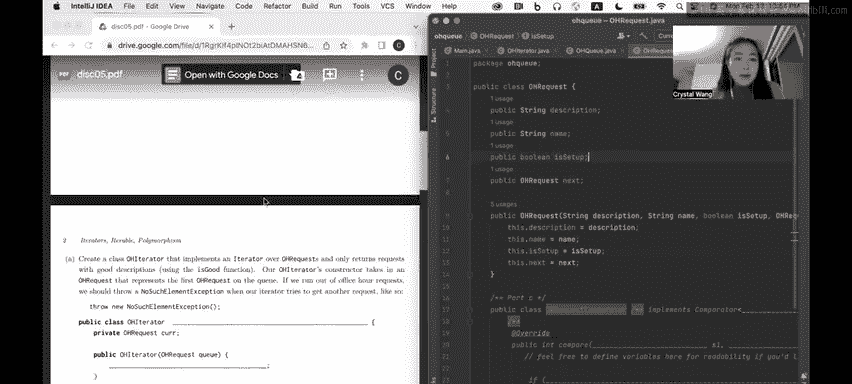
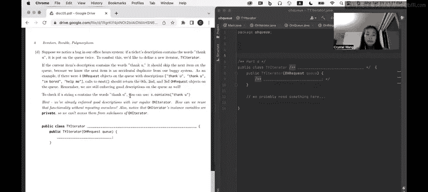

# 20：2 - Spring 2023 Discussion 05 问题 1


## 概述 📋
在本节课中，我们将学习如何实现一个自定义的迭代器（Iterator）和可迭代对象（Iterable），用于处理办公时间（Office Hours）队列中的请求。我们将从基础迭代器开始，逐步构建更复杂的功能，包括处理重复请求和自定义比较器。通过这个过程，你将理解迭代器模式、继承、方法重写以及接口实现的核心概念。



---


## 第一部分：实现 OHIterator 🛠️
上一节我们介绍了问题背景，本节中我们来看看如何实现一个基础的迭代器 `OHIterator`。这个迭代器需要遍历 `OHRequest` 对象，但只返回那些描述（description）符合“良好”标准的请求。

### 核心概念
`OHIterator` 类需要实现 Java 的 `Iterator<OHRequest>` 接口。这意味着它必须提供 `hasNext()` 和 `next()` 方法的具体实现。

### 代码实现
以下是 `OHIterator` 类的骨架和构造函数：

```java
import java.util.Iterator;
import java.util.NoSuchElementException;

public class OHIterator implements Iterator<OHRequest> {
    private OHRequest cur;

    public OHIterator(OHRequest q) {
        this.cur = q;
    }
}
```

### 实现 hasNext() 方法
`hasNext()` 方法需要判断是否还有下一个“良好”的请求。我们需要跳过描述不符合要求的请求。

以下是 `hasNext()` 方法的实现逻辑：
1.  使用 `while` 循环跳过描述“不好”的请求。
2.  如果遍历完所有请求仍未找到“良好”请求，则返回 `false`。
3.  否则，返回 `true`。

```java
@Override
public boolean hasNext() {
    while (cur != null && !isGood(cur.description)) {
        cur = cur.next;
    }
    return cur != null;
}
```

### 实现 next() 方法
`next()` 方法返回下一个“良好”请求。如果已经没有下一个元素，则抛出异常。此外，在返回当前请求后，需要将内部指针 `cur` 移动到下一个位置，为下一次调用做准备。

以下是 `next()` 方法的实现步骤：
1.  检查是否还有下一个元素（可调用 `hasNext()`）。
2.  如果没有，抛出 `NoSuchElementException`。
3.  保存当前请求。
4.  将内部指针 `cur` 移动到下一个请求。
5.  返回保存的请求。

```java
@Override
public OHRequest next() {
    if (!hasNext()) {
        throw new NoSuchElementException();
    }
    OHRequest req = cur;
    cur = cur.next;
    return req;
}
```

---

## 第二部分：实现可迭代的 OHQueue 🔄
上一节我们成功创建了迭代器，本节中我们来看看如何创建一个可迭代的队列类 `OHQueue`。这个类将使用我们刚刚实现的迭代器。

### 核心概念
`OHQueue` 类需要实现 `Iterable<OHRequest>` 接口。这要求它提供一个返回 `Iterator<OHRequest>` 的 `iterator()` 方法。



### 代码实现
以下是 `OHQueue` 类的完整实现：

```java
import java.util.Iterator;

public class OHQueue implements Iterable<OHRequest> {
    private OHRequest queue;

    public OHQueue(OHRequest q) {
        this.queue = q;
    }

    @Override
    public Iterator<OHRequest> iterator() {
        return new OHIterator(this.queue);
    }
}
```

---

## 第三部分：处理重复请求的 TYIterator 🔄➡️➡️
假设系统存在一个漏洞：如果请求描述包含“thank you”，它会被重复放入队列一次。我们需要创建一个新的迭代器 `TYIterator` 来跳过这些重复项。

### 核心概念
`TYIterator` 应该继承自 `OHIterator`，以复用其“筛选良好描述”的逻辑。然后，我们通过重写 `next()` 方法，在返回请求前检查并跳过重复的“thank you”请求。

### 代码实现
以下是 `TYIterator` 类的实现：

```java
public class TYIterator extends OHIterator {
    public TYIterator(OHRequest q) {
        super(q); // 调用父类构造函数
    }

    @Override
    public OHRequest next() {
        OHRequest result = super.next(); // 获取父类认为的下一个“良好”请求
        if (result != null && result.description.contains("thank you")) {
            // 如果描述包含“thank you”，则跳过它，取下一个
            result = super.next();
        }
        return result;
    }
}
```

为了使 `OHQueue` 使用新的 `TYIterator`，只需修改其 `iterator()` 方法：

```java
@Override
public Iterator<OHRequest> iterator() {
    return new TYIterator(this.queue); // 替换为 TYIterator
}
```

---

## 第四部分：使用迭代器遍历队列 🚶‍♂️
现在，我们可以像遍历标准集合一样，使用 for-each 循环来遍历我们的 `OHQueue` 对象。

### 使用示例
以下是如何创建队列并打印所有符合条件（良好描述且处理了重复项）的请求者姓名：

```java
public static void main(String[] args) {
    // 假设 s1, s2, s3... 是已连接的 OHRequest 对象，s1 是队首
    OHQueue q = new OHQueue(s1);

    for (OHRequest o : q) {
        System.out.println(o.name);
    }
}
```
这段代码会隐式调用 `q.iterator()`（返回 `TYIterator`），然后循环调用迭代器的 `hasNext()` 和 `next()` 方法，打印出每个请求的名字。

---

## 第五部分：实现请求比较器 ⚖️
（注：此部分与主迭代器逻辑相对独立，是关于如何为 `OHRequest` 定义排序规则。）

`OHRequestComparator` 类实现了 `Comparator<OHRequest>` 接口，用于根据 `isSetup` 字段和描述内容来比较两个请求的优先级。

### 比较规则
1.  如果只有一个请求的 `isSetup` 为 `true`，则该请求优先级更高（应排在队列更前面）。
2.  如果两个请求的 `isSetup` 状态相同（都为 `true` 或都为 `false`），则检查描述是否完全等于字符串 `"setup"`。
3.  描述匹配 `"setup"` 的请求优先级更高。
4.  如果上述条件均无法区分优先级，则返回 `0`（表示平局）。

### 代码实现
以下是 `OHRequestComparator` 的实现：

```java
import java.util.Comparator;

public class OHRequestComparator implements Comparator<OHRequest> {
    @Override
    public int compare(OHRequest o1, OHRequest o2) {
        // 规则1：比较 isSetup
        if (o1.isSetup && !o2.isSetup) {
            return -1; // o1 优先级高
        } else if (!o1.isSetup && o2.isSetup) {
            return 1;  // o2 优先级高
        }

        // 规则2：isSetup 状态相同，比较描述
        boolean o1DescIsSetup = o1.description.equals("setup");
        boolean o2DescIsSetup = o2.description.equals("setup");

        if (o1DescIsSetup && !o2DescIsSetup) {
            return -1;
        } else if (!o1DescIsSetup && o2DescIsSetup) {
            return 1;
        }

        // 规则3：无法区分
        return 0;
    }
}
```
**注意**：比较字符串内容时，应使用 `.equals()` 方法，而不是 `==` 操作符。

---

## 总结 🎉
本节课中我们一起学习了迭代器模式的完整实现流程：
1.  我们首先创建了一个基础的 `OHIterator`，它能够遍历链表结构并筛选出符合特定条件（良好描述）的元素。
2.  接着，我们创建了 `OHQueue` 类，通过实现 `Iterable` 接口，使其可以使用 Java 的 for-each 循环语法进行遍历。
3.  然后，我们通过继承创建了 `TYIterator`，演示了如何在复用父类逻辑的基础上，通过重写方法添加新的功能（跳过重复请求）。
4.  最后，我们实践了如何使用这个自定义的可迭代对象。
5.  此外，我们还了解了如何实现一个 `Comparator` 来定义对象的自定义排序规则。

通过这个练习，你掌握了实现自定义迭代器、利用继承扩展功能以及使自定义类可迭代的核心技能，这些都是构建复杂数据结构的重要基础。