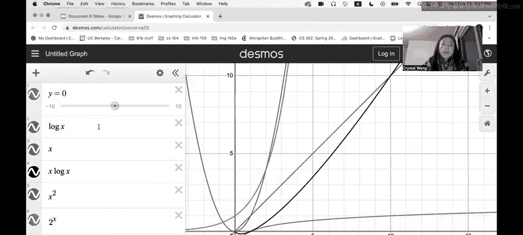

# 23：渐进分析与并查集内容回顾


在本节课中，我们将学习两个核心概念：**渐进分析**和**并查集**。渐进分析帮助我们评估算法的性能，特别是当输入规模变得非常大时。并查集是一种高效的数据结构，用于处理元素的分组与连通性问题。我们将逐一探讨这些主题，并通过示例加深理解。

## 渐进分析

上一节我们介绍了本节课的两个主题。本节中，我们来看看第一个主题：渐进分析。

渐进分析允许我们使用数学方法评估程序的性能。当我们谈论性能时，通常指的是程序运行所需的时间量。我们也可以讨论内存使用，这被称为空间复杂度，但在CS 61B中我们主要关注时间复杂度。

在渐进分析中，我们忽略所有常数，只关心随着输入规模（通常定义为 **n**）变得非常大时完成的总工作量。有三个重要的符号需要关注。

以下是三个核心的渐进符号：

1.  **大O符号 (Big O)**：这是输入的上界。如果一个函数是 **O(f(n))**，我们说它**至多**增长得像 **f(n)** 一样快，但也可能增长得更慢。例如，线性函数是 **O(n²)**，因为线性函数增长得不会比二次函数快。
2.  **大Ω符号 (Big Omega)**：这是输入的下界。如果一个函数是 **Ω(f(n))**，我们说它**至少**增长得像 **f(n)** 一样慢，但也可能增长得更快。例如，二次函数是 **Ω(n)**，因为二次函数增长得不会比线性函数慢。
3.  **大Θ符号 (Big Theta)**：这是紧确界。当最紧的上界和最紧的下界收敛到同一个值时存在。如果一个函数既是 **O(f(n))** 又是 **Ω(f(n))**，并且 **f(n)** 是可能的最紧边界，那么我们可以说该函数是 **Θ(f(n))**。

我们经常在编程中看到一些常见的增长阶数。

以下是常见的增长阶数，从慢到快排列：

*   **常数阶**：**O(1)**
*   **对数阶**：**O(log n)**
*   **线性阶**：**O(n)**
*   **线性对数阶**：**O(n log n)**
*   **二次方阶**：**O(n²)**
*   **指数阶**：**O(cⁿ)** (c为常数)

常数在长期运行中无关紧要。例如，**n log n + 1,000,000** 在 **n** 非常大时，其增长仍然比 **n²** 慢。

一些有用的求和公式可以帮助你分析循环等结构的运行时间。



以下是一些常见的求和及其渐进结果：


*   **1 + 2 + 3 + ... + n** 的和是 **Θ(n²)**。
*   **1 + 2 + 4 + 8 + ... + n** 的和是 **Θ(n)**。

关于紧确界，它指的是最具体的可能边界。举例来说，给定函数 **f(n) = 2n + 5**，我们可以说它是 **O(nⁿ)**，但这没有提供太多信息。一个更好、更紧的边界是 **Θ(n)**，因为这是一个线性函数。

有时我们会讨论**最好情况**与**最坏情况**。需要注意的是，最好与最坏情况不一定基于输入的大小，而是基于导致特定行为的输入。我们用紧确界 **Θ** 来表示它们，因为最好和最坏情况下的运行时间在各自特定的输入范围内是确定的。

识别函数是否具有不同的最好和最坏情况的一个简单方法是留意**分支语句、循环条件和break语句**。

用一个类比来区分最好/最坏情况与上/下界：考虑“在一家餐厅吃饭要花多少钱？”最好/最坏情况的思路是：菜单上最便宜的菜是5美元，最贵的是50美元。而下界和上界则说：我们至少会花5美元，最多不会超过50美元。下界和上界更像一个范围，而最好和最坏情况是该范围的具体端点。

为了说明这一点，请看下面的例子。

```java
void example(int n) {
    while (n > 0) {
        if (func(n)) {
            break;
        }
        n--;
    }
}
```

*   **最好情况**：如果 `func(n)` 在第一次循环时就为真，我们立即跳出循环。这需要常数时间 **Θ(1)**。
*   **最坏情况**：如果 `func(n)` 对于 `n, n-1, ..., 1` 都为假，循环将运行 `n` 次直到结束。这需要线性时间 **Θ(n)**。

## 并查集

上一节我们深入探讨了渐进分析。本节中，我们将注意力转向第二个核心并查集。

并查集，也称为Union-Find，是一个支持两种操作的接口。

以下是并查集支持的两个主要操作：

1.  **`connect(x, y)`**：连接节点 **x** 和 **y**（也称为 `union`）。
2.  **`isConnected(x, y)`**：如果 **x** 和 **y** 是连通的（即在同一个集合中），则返回 `true`。

有几种实现方式。Quick Find使用一个整数数组来跟踪每个元素属于哪个集合。Quick Union存储每个节点的父节点（而不是所属集合），并通过将一个集合的根节点的父节点设置为另一个集合的根节点来合并集合。然而，我们主要关注更高效的两种实现。

以下是两种更高效的并查集实现：

1.  **加权Quick Union**：与Quick Union类似，但它根据集合的大小决定哪个集合合并到哪个集合中。我们总是将**较小的集合合并到较大的集合**中。这有助于减少结构的“高度”，避免形成类似链表的瘦长结构，从而降低查找操作的运行时间。
2.  **带路径压缩的加权Quick Union**：在加权Quick Union的基础上，每当对某个节点调用 `find` 操作时，就将该节点的父节点直接设置为所在集合的根节点。这能进一步扁平化结构。

`find` 是一个辅助操作，用于查找给定输入节点的（最终）父节点（即根节点）。

从渐进分析的角度看，不同实现的性能对比如下。

以下是不同并查集实现的操作时间复杂度：

*   **构造函数**：所有实现都是 **Θ(N)**。
*   **`connect`**：
    *   Quick Find: **Θ(N)**
    *   Quick Union: **O(N)**
    *   加权Quick Union: **O(log N)**
    *   带路径压缩的加权Quick Union: **O(α(N))** (极快，α是反阿克曼函数)
*   **`isConnected`**：
    *   Quick Find: **Θ(1)**
    *   Quick Union: **O(N)**
    *   加权Quick Union: **O(log N)**
    *   带路径压缩的加权Quick Union: **O(α(N))**

尽管加权Quick Union的 `isConnected` 比Quick Find的常数时间慢，但我们通常更倾向于使用它（或其带路径压缩的版本），因为它的 `connect` 操作要快得多。

## 并查集的数组表示

在实现并查集时，我们使用一个单独的数组来高效地表示它。

数组的长度等于并查集中元素的数量。数组的索引 **i** 处的值表示元素 **i** 的父节点。如果一个节点是它所在集合的根节点，那么在该索引处存储的值是**该根节点所在集合的元素总数的负数**。

让我们通过一个例子来理解。假设我们有一个包含9个元素的并查集，经过一系列 `connect` 操作后，其数组表示如下：

```
索引:   [0]  [1]  [2]  [3]  [4]  [5]  [6]  [7]  [8]
值:     -9    0    0    0    0    1    1    3    4
```

*   **索引 0**：值是 `-9`。负号表示节点0是一个根节点。绝对值 `9` 表示以节点0为根的集合中共有9个元素。
*   **索引 1, 2, 3, 4**：值分别是 `0, 0, 0, 0`。这表示节点1、2、3、4的父节点都是节点0。
*   **索引 5**：值是 `1`。这表示节点5的父节点是节点1（注意，在普通的加权Quick Union中，它不直接指向根节点0）。
*   **索引 6**：值是 `1`。父节点是节点1。
*   **索引 7**：值是 `3`。父节点是节点3。
*   **索引 8**：值是 `4`。父节点是节点4。

这种表示方法紧凑且高效，允许我们快速执行 `find` 和 `union` 操作。

---


本节课中我们一起学习了**渐进分析**和**并查集**。我们了解了如何使用大O、大Ω和大Θ符号来分析算法的效率，并探讨了并查集的不同实现及其性能差异。理解这些概念对于设计和分析高效算法至关重要。