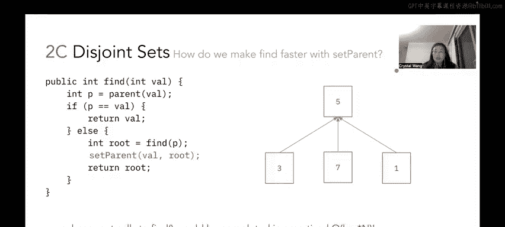

# 06：并查集问题详解


在本节课中，我们将学习并查集数据结构，并通过一个具体问题来理解其工作原理。我们将使用加权快速合并（无路径压缩）的实现方式，逐步执行一系列连接和查找操作，并绘制出对应的树形结构和底层数组表示。最后，我们将探讨不使用加权策略时的最坏情况，以及如何通过路径压缩来优化查找操作。

---

## 问题描述

假设有9个元素，用整数0到8表示。初始时，所有元素互不连接，各自构成独立的集合。我们需要执行一系列 `connect` 和 `find` 操作，并绘制出操作后的并查集树形结构及其底层数组表示。实现方式为**加权快速合并（无路径压缩）**。当两个集合大小相同时，选择较小的整数作为根节点。

### 底层数组表示回顾

底层数组的长度为9，每个索引对应一个节点。数组中的每个元素表示以下两种情况之一：
*   如果值为负数，则表示该节点是所在集合的根，其绝对值代表该集合中的元素数量。
*   如果值为非负数，则表示该节点的父节点索引。

初始时，所有节点都是自己集合的根，因此数组所有位置的值均为 `-1`。

---

## 逐步执行操作

以下是需要执行的操作序列：
1.  `connect(2, 3)`
2.  `connect(1, 2)`
3.  `connect(5, 7)`
4.  `connect(8, 4)`
5.  `connect(7, 2)`
6.  `find(3)`
7.  `connect(0, 6)`
8.  `connect(6, 4)`
9.  `connect(6, 3)`
10. `find(8)`
11. `find(6)`

### 操作详解与数组变化

**1. `connect(2, 3)`**
节点2和3最初都在大小为1的独立集合中。根据规则，选择较小的整数`2`作为根。因此，节点3的父节点变为2。
*   数组变化：`array[3]` 从 `-1` 变为 `2`。`array[2]` 从 `-1` 变为 `-2`（表示以2为根的集合有2个元素）。

**2. `connect(1, 2)`**
节点1所在集合大小为1，节点2所在集合大小为2。根据加权规则，将较小的集合（含1）合并到较大的集合（含2和3）中。因此，节点1的父节点变为2。
*   数组变化：`array[1]` 从 `-1` 变为 `2`。`array[2]` 从 `-2` 变为 `-3`。

**3. `connect(5, 7)`**
节点5和7都在大小为1的集合中。选择较小的整数`5`作为根。
*   数组变化：`array[7]` 从 `-1` 变为 `5`。`array[5]` 从 `-1` 变为 `-2`。

**4. `connect(8, 4)`**
节点8和4都在大小为1的集合中。选择较小的整数`4`作为根。
*   数组变化：`array[8]` 从 `-1` 变为 `4`。`array[4]` 从 `-1` 变为 `-2`。

**5. `connect(7, 2)`**
此操作连接的是节点7和2所在集合的根。首先查找根：节点7的根是5，节点2的根是2。比较集合大小：以5为根的集合大小为2，以2为根的集合大小为3。根据加权规则，将较小的集合（根为5）合并到较大的集合（根为2）中。因此，节点5的父节点变为2。
*   数组变化：`array[5]` 从 `-2` 变为 `2`。`array[2]` 从 `-3` 变为 `-5`。注意，`array[7]` 的值保持为 `5` 不变，因为这不是路径压缩。

**6. `find(3)`**
`find` 操作查找节点所在集合的根。从节点3开始，父节点是2，而节点2的父节点是它自身，所以根是2。
*   结果：`find(3)` 返回 `2`。

**7. `connect(0, 6)`**
节点0和6都在大小为1的集合中。选择较小的整数`0`作为根。
*   数组变化：`array[6]` 从 `-1` 变为 `0`。`array[0]` 从 `-1` 变为 `-2`。

**8. `connect(6, 4)`**
连接节点6和4所在集合的根。节点6的根是0，节点4的根是4。两个集合大小均为2。根据附加规则（大小相同时选较小整数为根），选择0作为根。因此，节点4的父节点变为0。
*   数组变化：`array[4]` 从 `-2` 变为 `0`。`array[0]` 从 `-2` 变为 `-4`。

**9. `connect(6, 3)`**
连接节点6和3所在集合的根。节点6的根是0，节点3的根是2。比较集合大小：以0为根的集合大小为4，以2为根的集合大小为5。将较小的集合（根为0）合并到较大的集合（根为2）中。因此，节点0的父节点变为2。
*   数组变化：`array[0]` 从 `-4` 变为 `2`。`array[2]` 从 `-5` 变为 `-9`。

**10. `find(8)`**
查找节点8的根。路径：8 -> 4 -> 0 -> 2。节点2是根。
*   结果：`find(8)` 返回 `2`。

**11. `find(6)`**
查找节点6的根。路径：6 -> 0 -> 2。节点2是根。
*   结果：`find(6)` 返回 `2`。

### 最终数组状态

所有操作执行完毕后，底层数组如下：
```
索引:  0  1  2  3  4  5  6  7  8
值:    2  2 -9  2  0  2  0  5  4
```
解释：
*   `array[2] = -9`：节点2是根，其集合包含全部9个元素。
*   非负数值表示父节点索引，如 `array[3] = 2` 表示节点3的父节点是2。
*   负数值表示该索引的节点是根，其绝对值表示集合大小。

---

## 最坏情况结构与运行时间分析

上一节我们使用加权快速合并完成了操作。现在，我们考虑一个不使用加权策略的简单并查集实现。

在这种实现中，`connect` 操作可能随意地将一个集合的根连接到另一个集合，而不考虑集合大小。这可能导致树结构退化成一条长链（类似于链表）。

以下是这种最坏情况的一个例子：
假设按顺序连接 `(1,2)`, `(2,3)`, `(3,4)`... 并且总是将新节点作为子节点连接到现有链的末端。最终形成的树将是一条从根到叶子的线性路径。

对于这种退化的结构，`find` 操作在最坏情况下需要遍历从目标节点到根节点的整条路径。如果集合中有 N 个元素，`find` 操作的时间复杂度将是 **O(N)**，即线性时间。这与使用加权策略后近似 **O(log N)** 的复杂度相比，效率要低得多。

---

## 使用路径压缩优化查找

我们之前已经看到了加权快速合并如何优化连接操作。现在，我们探讨如何通过修改 `find` 函数来进一步优化，这种方法称为**路径压缩**。

路径压缩的核心思想是：在 `find` 操作寻找某个节点的根时，顺便将该节点（以及沿途经过的节点）直接指向根节点。这样可以扁平化树结构，使得后续对同一节点或沿途节点的 `find` 操作更快。

假设我们有一个 `setParent(int val, int newParent)` 函数，可以将 `val` 的父节点设置为 `newParent`。我们需要修改 `find` 函数，最多添加一行代码来实现路径压缩。

修改思路如下：
在递归或循环找到根节点 `root` 之后，在返回 `root` 之前，将当前节点 `val` 的父节点直接设置为 `root`。

伪代码示例（递归版）：
```java
public int find(int val) {
    if (parent[val] < 0) {
        return val; // val 就是根
    }
    int root = find(parent[val]); // 递归查找根
    parent[val] = root; // 路径压缩：将当前节点的父节点直接设为根
    return root;
}
```
添加的关键一行是 `parent[val] = root;`。这行代码确保了在查找路径上的节点在下次查找时能直接跳转到根。

通过结合**加权快速合并**（优化 `connect`）和**路径压缩**（优化 `find`），并查集操作的均摊时间复杂度可以变得极快，接近常数时间（具体为 O(α(n))，其中 α 是反阿克曼函数，增长极其缓慢）。

---

## 总结

本节课中我们一起学习了并查集数据结构的核心操作。
1.  我们使用**加权快速合并（无路径压缩）** 逐步执行了连接和查找操作，绘制了树形结构并跟踪了底层数组的变化。
2.  我们分析了在不使用加权策略时，树结构可能退化成链表，导致 `find` 操作的最坏时间复杂度为 **O(N)**。
3.  我们介绍了**路径压缩**技术，通过在 `find` 操作中增加一行代码，将沿途节点直接链接到根，可以大幅优化后续查找的效率。结合加权策略，能获得近乎常数的均摊运行时间。



理解并查集的这些优化策略，对于设计高效算法至关重要。