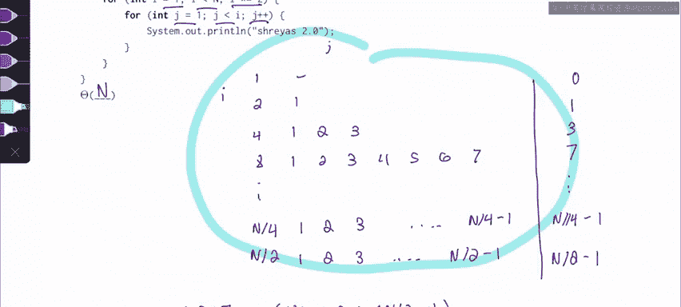

# 26：渐进分析入门 🚀


在本节课中，我们将学习如何分析简单迭代函数的运行时间复杂度。我们将通过两个具体的函数示例，使用表格法来直观地计算其大O表示法。

---

## 函数 F1 的分析

首先，我们分析函数 `F1`。对于迭代的渐进分析，一个有效的方法是绘制一个表格，列出每个循环所做的工作。通常我们只有两层嵌套循环，因此可以将其格式化为一个二维表格。

以下是 `F1` 的代码结构：
```java
for (int i = 1; i < n; i++) {
    for (int j = 1; j < i; j++) {
        // 常数时间操作
    }
}
```

我们可以将 `i` 的值列在左侧，`j` 的值列在内部。`i` 的取值范围是从 `1` 到 `n-1`。对于每一个 `i` 的值，内层循环 `j` 会从 `1` 迭代到 `i-1`。

以下是每个 `i` 值对应的内层循环迭代次数（即工作量）：
*   当 `i = 1` 时，内层循环不执行，工作量为 `0`。
*   当 `i = 2` 时，`j` 从 `1` 迭代到 `1`，工作量为 `1`。
*   当 `i = 3` 时，`j` 从 `1` 迭代到 `2`，工作量为 `2`。
*   ...
*   当 `i = n-1` 时，`j` 从 `1` 迭代到 `n-2`，工作量为 `n-2`。

因此，总工作量是所有这些行的工作量之和：
**总工作量 = 0 + 1 + 2 + ... + (n-2)**

这个求和公式让我们联想到一个已知的求和：`1 + 2 + ... + n` 的结果是 **Θ(n²)**。我们的求和从 `0` 开始，并且缺少最后两项 `(n-1)` 和 `n`，但从渐进分析的角度看，它仍然是 **Θ(n²)**。

所以，函数 `F1` 的时间复杂度是 **Θ(n²)**。

---

## 函数 F2 的分析

上一节我们分析了线性递增的循环，本节中我们来看看指数递增的情况。现在分析函数 `F2`，我们将使用相同的方法：绘制表格，列出每行工作量，然后求和。

以下是 `F2` 的代码结构：
```java
for (int i = 1; i < n; i *= 2) {
    for (int j = 1; j < i; j++) {
        // 常数时间操作
    }
}
```

外层循环的 `i` 值以2的倍数增长：`1, 2, 4, 8, ...`，直到超过 `n` 之前停止（即 `n/2`）。对于每一个 `i` 的值，内层循环 `j` 仍然从 `1` 迭代到 `i-1`。

以下是每个 `i` 值对应的内层循环迭代次数：
*   当 `i = 1` 时，工作量为 `0`。
*   当 `i = 2` 时，工作量为 `1`。
*   当 `i = 4` 时，工作量为 `3`。
*   当 `i = 8` 时，工作量为 `7`。
*   ...
*   当 `i = n/4` 时，工作量为 `n/4 - 1`。
*   当 `i = n/2` 时，工作量为 `n/2 - 1`。

因此，总工作量是：
**总工作量 = 0 + 1 + 3 + 7 + ... + (n/4 - 1) + (n/2 - 1)**

观察这个序列，它近似于一个几何级数：`1, 2, 4, 8, ..., n/2`。在渐进分析中，一个几何级数的和主要由其最大项决定。在这个求和中，最大项是 **n/2**。忽略常数因子后，其时间复杂度为 **Θ(n)**。

所以，函数 `F2` 的时间复杂度是 **Θ(n)**。

---

## 每周考试技巧 💡

对于迭代渐进分析问题，绘制如上所示的表格总是一个好主意。将外层循环变量 `i` 列在左侧，内层循环变量 `j` 的迭代范围列在行内。你只需要计算每行的工作量，然后将其求和，最终结果通常会归结为你所熟悉的两种求和形式之一：**算术级数求和**或**几何级数求和**。

---

## 总结

本节课中我们一起学习了如何使用表格法分析简单迭代函数的时间复杂度。我们通过两个例子实践了这种方法：
1.  对于外层循环线性递增、内层循环与 `i` 相关的嵌套循环，其时间复杂度通常是 **Θ(n²)**。
2.  对于外层循环指数递增（如翻倍）的情况，其时间复杂度通常由最大项决定，例如 **Θ(n)**。



掌握这种方法能帮助你快速而准确地分析大多数基础迭代代码的渐进性能。