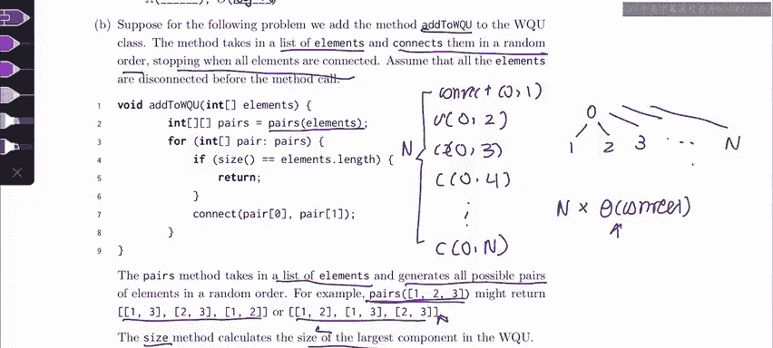
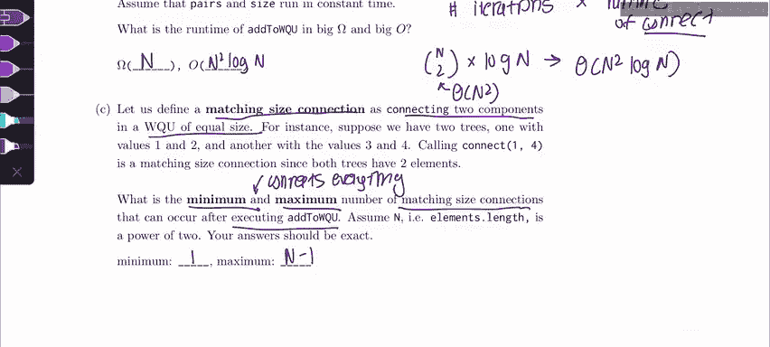

# 28：3 - 带权快速合并的渐进分析 🧮

在本节课中，我们将学习带权快速合并（Weighted Quick Union）数据结构中不同操作的渐进时间复杂度分析。我们将结合本周讨论的两个主题：带权快速合并和渐进分析，通过分析一个具体问题来理解其最佳和最坏情况下的性能。

## 带权快速合并基础

上一节我们介绍了带权快速合并的基本概念，本节中我们来看看其核心操作的时间复杂度。

在带权快速合并（不进行路径压缩）中，树的高度始终是 **O(log n)**，其中 **n** 代表元素的数量。这意味着树的最大高度是元素数量的对数因子。

因此，`isConnected` 和 `connect` 操作的最坏情况运行时间也是 **O(log n)**，因为在最坏情况下，执行这些操作时需要遍历到树的底部。

以下是 `isConnected` 和 `connect` 操作的时间复杂度总结：
*   **最坏情况**：**O(log n)**
*   **最佳情况**：**O(1)**（例如，当所有元素都直接连接到根节点时）

## 分析 `addToWeightedQuickUnion` 方法

现在，我们来分析一个名为 `addToWeightedQuickUnion` 的方法。该方法接收一个元素列表，并以随机顺序连接它们，直到所有元素都连通为止。

方法的核心逻辑如下：
1.  生成所有可能的元素对（顺序随机）。
2.  遍历这些元素对并调用 `connect` 方法。
3.  当最大连通分量的大小等于元素总数时停止。

我们可以假设 `pairs`（生成所有元素对）和 `size`（计算最大分量大小）方法都在常数时间内运行。

### 最佳情况运行时间（Ω）

为了尽快终止循环，我们可能遇到一个非常幸运的情况：所有连接操作都将一个新元素直接连接到同一个根节点（例如元素0）。

在这种情况下，树始终保持高度为1，每次 `connect` 操作都是常数时间 **O(1)**。我们只需要 **n** 次连接（每次添加一个新元素）就能连通所有元素。

因此，最佳情况下的总运行时间是 **n * O(1) = O(n)**，即 **Ω(n)**。

### 最坏情况运行时间（O）

考虑最坏情况：有一个节点（例如节点0）在所有包含它的元素对中都出现在列表的最后。这意味着在最后 **n** 次连接之前，这个节点一直处于孤立状态。

首先，元素对的总数是组合数 **C(n, 2)**，即 **n*(n-1)/2**，其数量级为 **Θ(n²)**。在合并孤立节点之前，我们需要遍历 **n*(n-1)/2 - n** 个元素对。

其次，在最坏情况下，每次 `connect` 操作需要遍历树的高度，即 **O(log n)**。

因此，最坏情况下的总运行时间是元素对数量乘以每次连接的成本：**Θ(n²) * O(log n) = O(n² log n)**。

以下是运行时间总结：
*   **最佳情况（下界）**：**Ω(n)**
*   **最坏情况（上界）**：**O(n² log n)**

## 分析匹配大小连接的数量

接下来，我们分析在执行 `addToWeightedQuickUnion` 后，可能发生的“匹配大小连接”的最小和最大数量。匹配大小连接指的是连接两个大小相等的分量。

### 最小匹配大小连接数

最小数量情况类似于 `addToWeightedQuickUnion` 的最佳情况：我们总是将新元素连接到同一个主树上。

在这种情况下，只有第一次连接（连接两个大小为1的孤立节点）是匹配大小连接。此后的所有连接都是将一个孤立节点（大小为1）连接到一个更大的树上，因此不再是匹配大小连接。

所以，匹配大小连接的最小数量是 **1**。

### 最大匹配大小连接数

为了最大化匹配大小连接的数量，我们应该以“配对”的方式连接元素，使得每次连接都发生在两个大小相同的树上。

这个过程可以描述为：
1.  首先，将所有 **n** 个孤立节点两两配对，产生 **n/2** 次匹配大小连接（大小均为1）。
2.  然后，将这些大小为2的树两两配对，产生 **n/4** 次匹配大小连接。
3.  接着，将大小为4的树两两配对，产生 **n/8** 次匹配大小连接。
4.  以此类推，直到最后将两棵大小为 **n/2** 的树连接起来，产生 **1** 次匹配大小连接。

匹配大小连接的总数是一个等比数列的和：**n/2 + n/4 + n/8 + ... + 1**。

这个等比数列的和等于 **n - 1**。因此，匹配大小连接的最大数量是 **n - 1**。

以下是匹配大小连接数量总结：
*   **最小数量**：**1**
*   **最大数量**：**n - 1**

## 总结与考试技巧 📝

本节课中我们一起学习了带权快速合并操作的渐进分析。我们分析了 `isConnected` 和 `connect` 操作的时间复杂度，深入探讨了 `addToWeightedQuickUnion` 方法在不同场景下的运行时间上界（O）和下界（Ω），并计算了匹配大小连接可能发生的最小和最大次数。

对于此类需要分析特定情况的问题，一个非常有效的技巧是：**绘制具体实例**。就像我们本节课所做的那样，尝试画出每种问题的最佳情况和最坏情况图例。通过具体的例子来思考，而不是停留在抽象概念上，这能极大地帮助你理解和解决考试中的问题。

祝你在 CS 61B 的后续学习中顺利！