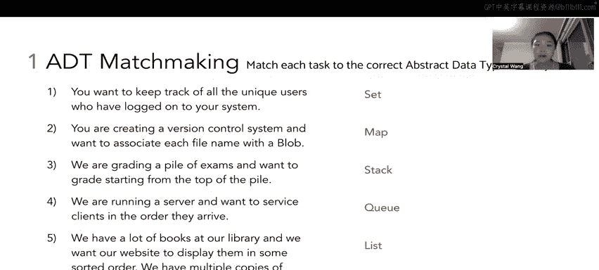

# 30：抽象数据类型匹配 🧩

在本节讨论中，我们将学习如何为不同的任务选择合适的抽象数据类型。我们将分析五个具体场景，并为每个场景匹配最合适的ADT：列表、映射、队列、集合或栈。每个ADT只会被使用一次。

## 场景一：追踪唯一登录用户 👤

我们需要追踪所有登录过系统的**唯一**用户。这里的“唯一”关键词提示我们不应包含重复项。

以下是选择**集合**的原因：
*   集合不允许存储重复元素。
*   即使用户登录、登出、再登录，其用户名在集合中也只会出现一次。
*   这确保了我们的追踪记录只包含不同的用户个体。

## 场景二：版本控制系统中的文件关联 📁

我们正在创建一个版本控制系统，希望将每个文件名与一个“blob”值关联起来。这里的“关联”是关键词。

以下是选择**映射**的原因：
*   映射通过键值对存储数据。
*   我们可以将文件名作为键，将对应的blob值作为其关联的值进行存储。

## 场景三：从顶部开始批改试卷 📚

我们需要批改一堆试卷，并希望从这堆试卷的顶部开始批改。这涉及到元素的添加和移除顺序。

以下是选择**栈**的原因：
*   栈遵循**后进先出**原则。
*   想象一叠纸：最后放上去的纸在顶部，最先放上去的在底部。
*   从顶部开始批改，意味着我们取出最后添加的试卷（顶部）先批改，这正符合栈的操作模式。

## 场景四：按到达顺序服务客户 🏦

我们运行一个服务器，希望按照客户到达的顺序为他们提供服务。“按到达顺序”是此场景的关键。

以下是选择**队列**的原因：
*   队列遵循**先进先出**原则。
*   这就像排队买电影票：先到的人先得到服务，后到的人后得到服务。
*   队列能保证客户按照他们到达的先后顺序被处理。

## 场景五：图书馆网站按排序显示书籍 📖

我们的图书馆有很多书，希望网站在显示时能按某种顺序排列。我们有些书有多个副本，并且希望每个副本都单独列出。

以下是选择**列表**的原因：
*   列表**保持元素的顺序**。无论是添加顺序还是排序后的顺序，列表都能维持。
*   列表**允许重复元素**。这与“多个副本”且“每个都单独列出”的需求完全吻合。
*   相比之下，集合不保证顺序且不允许重复，因此不适合此场景。

---

**总结**：本节课中，我们一起学习了如何根据具体任务的需求来匹配抽象数据类型。我们分析了五个场景，并分别为其选择了最合适的ADT：用**集合**处理唯一性，用**映射**处理关联关系，用**栈**处理后进先出，用**队列**处理先进先出，以及用**列表**处理有序且允许重复的数据集合。理解这些ADT的核心特性是正确应用它们的关键。