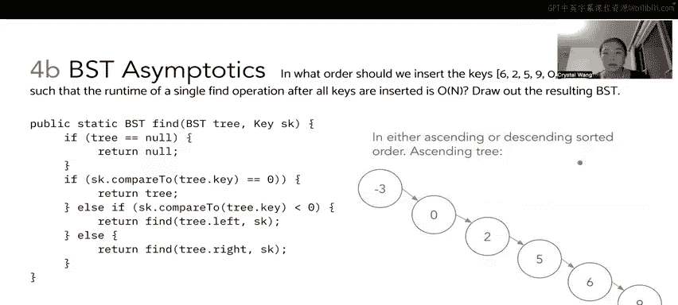

# 33：5 - 二叉搜索树渐近分析与构建


## 概述
在本节课中，我们将要学习二叉搜索树（BST）中`find`操作的运行时间分析，并探讨如何通过特定的插入顺序来构建不同形态的BST，从而影响`find`操作的性能。

---

## 二叉搜索树`find`操作的运行时间分析

上一节我们介绍了BST的基本概念，本节中我们来看看`find`操作在特定BST形态下的运行时间。

`find`是一个递归函数，它接收一个树的根节点和一个键值`S`作为参数。函数在树为空时停止，这意味着已经遍历了整个树。

`find`的工作原理是比较键值`S`与当前树节点的键值。如果`S`等于当前节点的键值，则返回该节点。否则，根据比较结果决定递归搜索左子树或右子树。

**代码描述如下：**
```java
if (tree == null) return null;
if (S == tree.key) return tree;
if (S < tree.key) return find(tree.left, S);
else return find(tree.right, S);
```

对于一个“完全茂密”的BST，其形态近似于一个金字塔，每个非叶子节点都有两个子节点。这种树的层数约为 **log₂(n)**，其中`n`是树中的节点数。

然而，`find`操作的运行时间并非总是**O(log n)**。它可能在找到目标元素时提前停止。例如，如果要查找的键值恰好是根节点的值，那么操作将在常数时间内完成。

因此，`find`操作的最佳情况运行时间下界是常数时间，最坏情况运行时间上界是**O(log n)**时间。最坏情况发生在要查找的键值不在树中，或者是树中的一个叶子节点时，这两种情况都需要遍历从根到叶子的整条路径。

由于下界（常数时间）和上界（对数时间）不同，我们无法用**Θ**记号来描述`find`操作的紧确界。通常，我们使用**O**记号来描述其最坏情况下的运行时间上界。

---

## 构建线性时间`find`操作的BST

理解了`find`操作的运行时间范围后，我们来看看如何构建一个BST，使得`find`操作在最坏情况下需要线性时间。

BST可以是茂密的，也可以是细长的。茂密的BST高度为**O(log n)**，而细长的BST可能导致`find`操作需要线性时间，即需要遍历树中几乎所有的节点才能得出结论。

插入顺序在BST中至关重要，因为所有新节点都是作为叶子节点插入的。为了构建一个细长的树，使得`find`操作在最坏情况下达到**O(n)**，最直接的方法是按照升序或降序的排序顺序插入键值。

以下是构建过程：
首先，对给定的键值`{6, 2, 5, 0, 9, -3}`进行排序，得到`{-3, 0, 2, 5, 6, 9}`。然后按照此升序序列依次插入到空的BST中。

1.  插入`-3`作为根节点。
2.  插入`0`。与`-3`比较，`0 > -3`，因此`0`成为`-3`的右子节点。
3.  插入`2`。与`-3`比较（`2 > -3`），再与`0`比较（`2 > 0`），因此`2`成为`0`的右子节点。
4.  后续插入`5`、`6`、`9`的过程类似，每次新节点都成为前一个节点的右子节点。

最终形成的BST将类似于一个链表。如果此时调用`find(10)`，算法将从根节点开始，依次与每个节点比较并向右移动，直到遍历完所有节点才发现`10`不存在。这就导致了最坏情况下的线性运行时间。

按照键值的升序或降序顺序插入，是构建一个`find`操作具有线性最坏情况运行时间的细长BST的简单方法。

---



## 总结
本节课中我们一起学习了BST中`find`操作的渐近分析。我们了解到，在完全茂密的BST中，`find`的最佳情况是常数时间，最坏情况是对数时间，因此无法用**Θ**记号定义紧确界。此外，我们还学习了通过按排序顺序插入键值来构建细长BST的方法，这种树会导致`find`操作在最坏情况下需要线性时间。理解这些概念有助于我们在实际应用中根据数据特点选择合适的结构或优化策略。