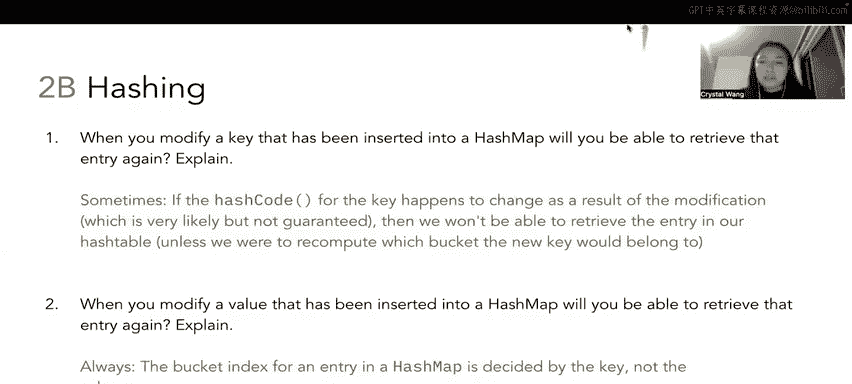

# 39：3 - 哈希函数与哈希映射


在本节课中，我们将学习哈希函数的核心概念，分析不同哈希函数实现的有效性与优劣，并探讨在哈希映射中修改键或值所带来的影响。

---

## 哈希函数：P39：3.1 - 哈希函数有效性分析

上一节我们介绍了哈希的基本概念，本节中我们来看看如何判断一个哈希函数是否有效。一个有效的哈希函数必须满足以下三个条件：
1.  返回值必须是整数。
2.  对同一个对象多次调用，其哈希值必须始终相同（一致性）。
3.  如果两个对象通过 `equals` 方法判断为相等，那么它们必须具有相同的哈希值。

以下是题目中给出的五个哈希函数实现，我们将逐一分析。

### 实现一：返回固定值 `-1`
```java
public int hashCode() {
    return -1;
}
```
*   **有效性**：**有效**。它返回整数 `-1`，对同一对象始终返回相同值，且任意两个相等的整数对象（如 `Integer(5)`）的哈希值都是 `-1`，满足所有条件。
*   **优劣分析**：这是一个**极差**的哈希函数。因为它为所有对象返回相同的哈希值，导致所有元素都被放入同一个桶中，引发大量碰撞，完全丧失了哈希表高效分布数据的优势。

### 实现二：返回 `intValue` 的平方
```java
public int hashCode() {
    return intValue() * intValue();
}
```
*   **有效性**：**有效**。它返回整数，对同一对象结果一致。两个相等的整数（如 `Integer(10)`）会计算出相同的哈希值 `100`。
*   **优劣分析**：**存在缺陷**。该函数会导致**碰撞**，因为互为相反数的整数（如 `5` 和 `-5`）会计算出相同的哈希值（`25`）。虽然碰撞概率相对较低，但并非理想方案。

### 实现三：调用父类（Object）的 `hashCode`
```java
public int hashCode() {
    return super.hashCode();
}
```
*   **有效性**：**无效**。`Object` 类的默认 `hashCode` 通常基于对象的内存地址。虽然它满足前两个条件，但会违反第三条：两个值相等的 `Integer` 对象（如 `new Integer(5)` 和 `new Integer(5)`）是**不同的对象**，位于不同的内存地址，因此会返回不同的哈希值，尽管它们通过 `equals` 比较是相等的。

### 实现四：返回当前时间戳
```java
public int hashCode() {
    return (int) System.currentTimeMillis();
}
```
*   **有效性**：**无效**。它严重违反了**一致性**原则。每次对同一个对象调用此方法，都会因为时间的变化而返回不同的哈希值。

### 实现五：返回 `intValue + 3`
```java
public int hashCode() {
    return intValue() + 3;
}
```
*   **有效性**：**有效**。它返回整数，对同一对象结果一致，且相等的对象哈希值也相等。
*   **优劣分析**：在假设桶数量无限多（无需取模）的理想情况下，这是一个**优秀**的哈希函数。它为每个不同的整数值生成唯一且确定的哈希值，**完全避免了碰撞**。

---

## 哈希映射：P39：3.2 - 修改键值对的影响

理解了哈希函数的原理后，我们来看看在哈希映射的实际使用中，修改已插入的键或值会带来什么后果。

### 问题一：修改键（Key）
**问**：修改一个已插入哈希映射的键后，我们是否还能检索到该条目？
**答**：**有时可以（Sometimes）**。
*   **原因**：检索条目时，哈希映射会计算**当前键**的哈希值来确定查找的桶。如果你修改了键，它的哈希值很可能随之改变，导致后续 `get` 操作去错误的桶中查找，从而找不到原来的值。
*   **“有时”的可能性**：存在一种极小的巧合，即修改后的新键恰好与旧键哈希到**同一个桶**。在这种情况下，你仍然能在那个桶的链表中找到原来的条目。但这完全依赖于运气，并非设计使然。

### 问题二：修改值（Value）
**问**：修改一个已插入哈希映射的值后，我们是否还能检索到该条目？
**答**：**总是可以（Always）**。
*   **原因**：哈希映射在存储和查找时，只依赖于键（Key）的哈希值来确定位置。值（Value）不参与哈希计算。因此，修改值不会影响条目在哈希表中的存储位置。只要使用原来的键进行查找，就能定位到对应的桶和条目，并获取到更新后的值。

---



本节课中我们一起学习了哈希函数有效性的三个核心判定标准，分析了五种具体实现的优劣，并明确了在哈希映射中修改键和修改值所带来的不同影响。记住，一个好的哈希函数应能均匀分布元素以减少碰撞，而在使用哈希映射时，应避免修改作为键的对象，以确保数据可被正确检索。