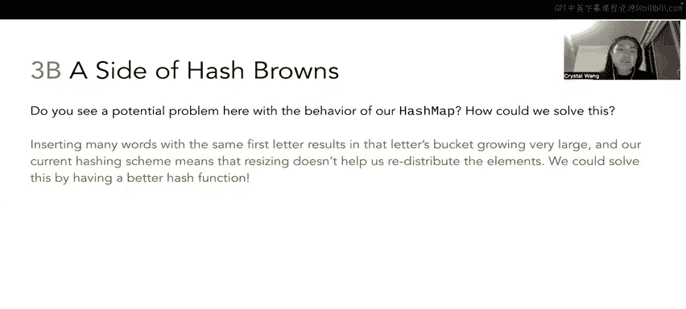

# 4：哈希表操作与扩容详解 🧮

在本节课中，我们将学习哈希表的基本操作，包括插入元素、处理冲突、以及当负载因子达到阈值时如何进行扩容和重哈希。我们将通过一个具体的例子，一步步地绘制出哈希表在多次插入操作后的状态变化。

---

## 概述

我们将操作一个将字符串映射到整数的哈希表。为了简化，初始时哈希表只有4个桶。我们使用一个简单的哈希函数：取字符串的首字母，将其转换为字母表中的位置（A=0, B=1, ..., Z=25）作为哈希值。例如，“Hash browns”的首字母是H，H是字母表中的第7个字母（从0开始计数），因此其哈希值为7。

哈希表使用**外部链接法**处理冲突，即每个桶是一个链表。当负载因子（元素数量 / 桶数量）达到 **3/4** 时，我们将进行扩容，将桶的数量加倍，并对所有现有元素进行重哈希。

---

## 初始状态与第一次插入

初始哈希表有4个桶。我们首先插入键值对 `(“hash browns”, 7)`。

1.  计算键 `“hash browns”` 的哈希值：首字母 `H` 对应整数 `7`。
2.  确定桶索引：`7 mod 4 = 3`。
3.  将条目 `(“hash browns”, 7)` 放入**桶3**。

此时，哈希表中有1个元素，4个桶。负载因子为 **1/4 = 25%**。

---

## 后续插入与冲突处理

上一节我们插入了第一个元素，本节中我们来看看连续插入时如何处理冲突。

以下是接下来的插入操作序列：

*   **插入 `(“dim sum”, ?)`**:
    *   哈希值：首字母 `D` 对应 `3`。
    *   桶索引：`3 mod 4 = 3`。
    *   结果：与 `“hash browns”` 发生冲突，均位于桶3。使用外部链接法，将 `(“dim sum”, ?)` 作为链表节点添加到桶3中 `“hash browns”` 的后面。

*   **插入 `(“escargot”, ?)`**:
    *   哈希值：首字母 `E` 对应 `4`。
    *   桶索引：`4 mod 4 = 0`。
    *   结果：放入**桶0**。

插入这三个元素后，哈希表状态如下：
*   桶0: `(“escargot”, ?)`
*   桶3: `(“hash browns”, 7) -> (“dim sum”, ?)`

元素总数 = 3，桶数量 = 4。负载因子 = **3/4 = 75%**，达到了扩容阈值。

---

## 第一次扩容与重哈希

当负载因子达到3/4时，我们需要扩容。这个过程分为两步：
1.  将桶的数量加倍（从4个变为8个）。
2.  将所有现有元素**重哈希**到新的桶数组中。

为什么需要重哈希？因为元素存放的桶索引是通过 `哈希值 mod 桶数量` 计算的。桶数量改变后，同一个键计算出的新索引可能不同，必须重新放置。

让我们对现有元素进行重哈希：

*   `“escargot”` (哈希值4): `4 mod 8 = 4` -> 移至**新桶4**。
*   `“hash browns”` (哈希值7): `7 mod 8 = 7` -> 移至**新桶7**。
*   `“dim sum”` (哈希值3): `3 mod 8 = 3` -> 留在**新桶3**。

重哈希后，负载因子更新为 **3/8 = 37.5%**。

---

## 继续插入与第二次扩容

扩容后，我们继续插入新的元素。

以下是接下来的插入操作：

*   **插入 `(“brown bananas”, ?)`**:
    *   哈希值：首字母 `B` 对应 `1`。
    *   桶索引：`1 mod 8 = 1` -> 放入**桶1**。

*   **插入 `(“burritos”, 2)`**:
    *   哈希值：首字母 `B` 对应 `1`。
    *   桶索引：`1 mod 8 = 1` -> 与 `“brown bananas”` 冲突，链接到桶1链表的末尾。

*   **插入 `(“buffalo wings”, ?)`**:
    *   哈希值：首字母 `B` 对应 `1`。
    *   桶索引：`1 mod 8 = 1` -> 再次冲突，链接到桶1链表的末尾。

此时，元素总数 = 6，桶数量 = 8。负载因子 = **6/8 = 75%**，再次触发扩容。

我们将桶数量从8加倍到16，并对所有6个元素进行重哈希。计算过程如下：

*   所有以 `B` 开头的键（哈希值1）: `1 mod 16 = 1` -> 仍留在**新桶1**。
*   `“dim sum”` (哈希值3): `3 mod 16 = 3` -> 留在**新桶3**。
*   `“escargot”` (哈希值4): `4 mod 16 = 4` -> 留在**新桶4**。
*   `“hash browns”` (哈希值7): `7 mod 16 = 7` -> 留在**新桶7**。

**注意**：此次扩容后，所有元素的桶索引都没有改变，因为它们的哈希值模16的结果与模8的结果相同。但这只是巧合。

扩容后负载因子为 **6/16 = 37.5%**。

---

## 插入重复键与最终状态

现在，我们在扩容后的哈希表中进行最后两次操作。

*   **插入 `(“bánh mì”, ?)`**:
    *   哈希值：首字母 `B` 对应 `1`。
    *   桶索引：`1 mod 16 = 1` -> 链接到桶1链表的末尾。

*   **插入 `(“burritos”, 10)`**:
    *   哈希值：首字母 `B` 对应 `1`。
    *   桶索引：`1 mod 16 = 1`。
    *   **关键操作**：遍历桶1的链表，发现键 `“burritos”` 已经存在。在哈希表中，键必须是唯一的。因此，我们不会添加新节点，而是**更新**已存在键 `“burritos”` 对应的值，将原来的 `2` 替换为 `10`。

由于最后一次 `put` 操作是更新而非新增，哈希表中的元素数量保持为7个。最终负载因子为 **7/16 = 43.75%**。

最终哈希表状态如下（链表顺序表示插入顺序）：
*   桶1: `(“brown bananas”, ?) -> (“burritos”, 10) -> (“buffalo wings”, ?) -> (“bánh mì”, ?)`
*   桶3: `(“dim sum”, ?)`
*   桶4: `(“escargot”, ?)`
*   桶7: `(“hash browns”, 7)`

---

## 哈希函数的重要性与总结

本节课中我们一起学习了哈希表的插入、冲突解决、扩容和重哈希机制。通过这个例子，我们可以发现一个潜在问题：我们使用的简单哈希函数（仅取首字母）性能很差。

由于只有26个字母，哈希结果只有26种可能。无论我们将桶数组扩容到多大（比如1000个桶），所有元素都只会被散列到前26个桶对应的索引中（即 `0 mod 桶数` 到 `25 mod 桶数`）。这会导致严重的元素聚集，使得许多操作退化为链表上的线性查找，效率低下。

**结论**：一个好的哈希函数对于哈希表的性能至关重要。它应该能将键均匀地分布到整个桶数组中，尽量减少冲突。在实际应用中（如Java的 `String.hashCode()`），会使用更复杂的算法来计算哈希值。

**核心公式与代码概念总结**：
*   **负载因子** = **元素数量 / 桶数量**
*   **桶索引** = **hash(key) % number_of_buckets**
*   **扩容条件**：负载因子 ≥ 阈值（本例为0.75）。
*   **重哈希**：扩容后，对每个元素执行 `new_index = hash(key) % new_number_of_buckets`。
*   **键唯一性**：插入已存在的键时，执行更新操作而非添加。