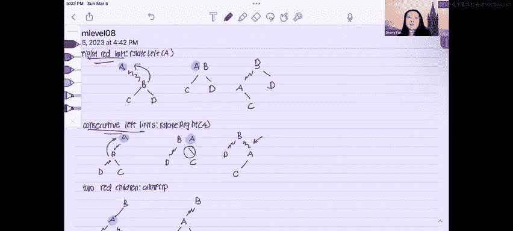

# 08：左倾红黑树插入操作详解 🌳


在本节课中，我们将学习左倾红黑树的插入操作。我们将通过一个具体的例子，逐步演示如何向树中插入新节点，并利用三种基本操作来维护树的平衡性质。最后，我们还会将得到的左倾红黑树转换为对应的2-3树。

左倾红黑树通过三种核心操作来维持其平衡特性：左旋转、右旋转和颜色翻转。在插入新节点后，如果违反了左倾红黑树的规则，我们就需要运用这些操作来修复树的结构。

以下是三种需要修复的违规情况及其对应的操作：

1.  **存在右倾的红链接**：这违反了“所有红链接必须左倾”的规则。修复方法是进行**左旋转**。
    *   **操作**：`rotateLeft(a)`。想象将子节点B向上推，与父节点A形成一个临时节点，然后将A向下推，使其成为B的左子节点。
    *   **结果**：右倾的红链接被转换为左倾。

2.  **存在两个连续的红链接**：这违反了“不能有连续的红链接”的规则。修复方法是进行**右旋转**。
    *   **操作**：`rotateRight(a)`。想象将子节点B和它的左子节点D向上推，形成一个临时节点，然后将A向下推，使其成为B的右子节点。
    *   **结果**：连续的红链接结构被改变。

3.  **一个节点有两个红色的子节点**：这违反了“一个节点不能有两个红子节点”的规则。修复方法是进行**颜色翻转**。
    *   **操作**：`colorFlip(a)`。将节点A的两个红子链接变为黑色，同时将指向A的链接（从A的父节点来）变为红色。
    *   **结果**：红色被向上传递，避免了同一节点的两个红子节点。

掌握了这些基本操作后，我们现在可以开始解决具体的插入问题。

我们将对给定的初始树依次插入数字 7, 6, 2, 8, 8.5。初始树结构如下图所示（图中波浪线代表红链接）：

```
        5 (黑)
       / \
   (红)3   9 (黑)
     /   \
 (黑)1   (黑)4
```

以下是逐步插入和修复的过程：

*   **插入 7**：7 应插入在 5 的右边，9 的左边。插入后没有引发任何违规，树暂时保持平衡。
*   **插入 6**：6 应插入在 5 的右边，9 的左边，7 的左边。插入后，出现了“两个连续的红链接”（6-7 和 7-9）。我们先对节点 7 进行**右旋转**。旋转后，节点 7 有了两个红子节点（6 和 9），因此需要对节点 7 进行**颜色翻转**。颜色翻转后，节点 5 又有了两个红子节点（3 和 7），因此再对节点 5 进行**颜色翻转**。最终，整棵树暂时没有红链接。
*   **插入 2**：2 应插入在 5 的左边，3 的左边，1 的右边。插入后，出现了“右倾的红链接”（1-2）。我们对节点 2 进行**左旋转**，修复此违规。
*   **插入 8**：8 应插入在 9 的左边。插入后没有引发违规。
*   **插入 8.5**：8.5 应插入在 8 的右边，9 的左边。插入后，首先出现“右倾的红链接”（8-8.5），对节点 8 进行**左旋转**。接着出现“两个连续的红链接”（8.5-9 和 9-?），对节点 9 进行**右旋转**。然后节点 8.5 有了两个红子节点，进行**颜色翻转**。最后，节点 7 出现了“右倾的红链接”，对节点 7 进行**左旋转**（这是一个涉及多个节点的大旋转）。

经过所有插入和修复操作后，我们得到最终的左倾红黑树。

上一节我们完成了左倾红黑树的构建，本节中我们来看看如何将其转换为等价的2-3树。

转换规则非常简单：将所有由红链接连接的节点“合并”到同一个2-3树节点中。

根据最终的红黑树结构：
*   节点 7 和 8.5 由红链接连接，它们合并为一个2-3树节点 `[7, 8.5]`。
*   节点 1 和 2 由红链接连接，它们合并为一个2-3树节点 `[1, 2]`。
*   其余黑链接连接的节点各自成为独立的2-3树节点。

按照父子关系组合这些节点，即可绘制出对应的2-3树。



本节课中我们一起学习了左倾红黑树的插入操作。关键在于牢记三种可能的违规情况（右倾红链接、连续红链接、节点有两个红子节点）以及对应的修复方法（左旋转、右旋转、颜色翻转）。通过逐步应用这些操作，我们可以在插入后始终保持树的平衡。最后，我们还学会了如何将左倾红黑树转换为等价的2-3树视图。掌握这些核心概念，你就能应对大多数相关的题目了。