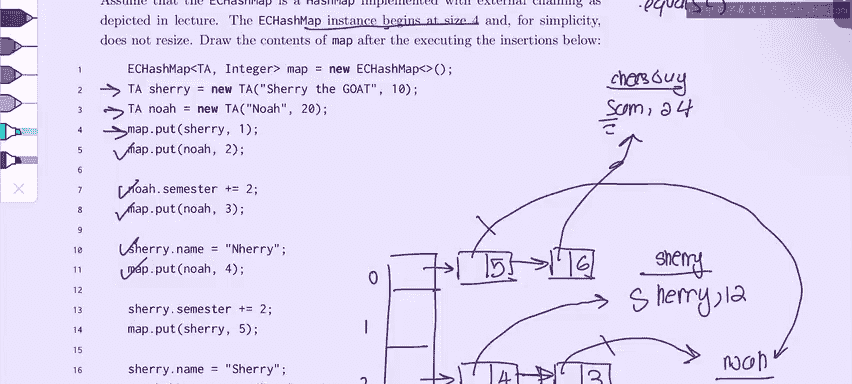

# 43：Spring 2023 考试第8级问题2 - 哈希问题详解 🧮


在本教程中，我们将学习一个关于哈希映射的考试题目。我们将逐步分析代码执行过程，理解外部链接哈希表的工作原理，以及 `equals` 方法和 `hashCode` 方法如何影响键的存储和查找。

---

## 问题设置与初始状态

首先，我们处理一个固定大小为 4 且永不扩容的外部链接哈希映射。这意味着每个桶（bucket）可以存储一个链表来处理哈希冲突。

以下是初始的哈希映射结构，包含四个桶（索引 0 到 3）：

```
索引 0: [空]
索引 1: [空]
索引 2: [空]
索引 3: [空]
```

---

## 创建对象与首次插入

我们创建了两个 `TA` 类的对象：
*   `sherry`：`name = "Sherry the goat"`, `semester = 10`
*   `noah`：`name = "Noah"`, `semester = 20`

`TA` 类的 `hashCode()` 方法定义为直接返回 `semester` 的值。

现在，我们执行第一个插入操作 `map.put(sherry, 1)`。

**计算哈希值并确定桶索引：**
`sherry` 的 `semester` 为 10。哈希映射大小为 4。
桶索引计算公式为：`hashCode % numberOfBuckets`。
因此，`10 % 4 = 2`。`sherry` 将被放入索引为 2 的桶中，其关联值为 1。

此时哈希映射状态更新为：
```
索引 0: [空]
索引 1: [空]
索引 2: [sherry -> 1]
索引 3: [空]
```

---

## 插入第二个对象

接下来，执行 `map.put(noah, 2)`。

**计算哈希值并确定桶索引：**
`noah` 的 `semester` 为 20。
`20 % 4 = 0`。`noah` 将被放入索引为 0 的桶中，其关联值为 2。

此时哈希映射状态更新为：
```
索引 0: [noah -> 2]
索引 1: [空]
索引 2: [sherry -> 1]
索引 3: [空]
```

---

## 修改对象属性与哈希冲突

现在，我们执行 `noah.semester += 2`。`noah` 对象的 `semester` 值变为 22。**请注意，仅仅修改对象的属性不会触发哈希映射的重新哈希或重新定位。** 对象 `noah` 仍然位于索引 0 的桶中。

紧接着，我们执行 `map.put(noah, 3)`。此时需要重新计算 `noah` 的桶索引。

**重新计算哈希值：**
`noah` 的 `semester` 现在为 22。
`22 % 4 = 2`。因此，`noah` 的目标桶是索引 2。

索引 2 的桶中已存在键 `sherry`。此时发生哈希冲突。外部链接哈希表通过链表解决冲突。但在添加新节点前，必须使用 `equals` 方法检查两个键是否相等。

`TA` 类的 `equals` 方法定义为比较两个对象 `name` 属性的首字母。
*   `sherry.name` 的首字母是 `'S'`
*   `noah.name` 的首字母是 `'N'`

由于首字母不同，`sherry.equals(noah)` 返回 `false`。因此，它们被视为不同的键。我们将在索引 2 的链表中添加一个新节点。

此时哈希映射状态更新为：
```
索引 0: [noah -> 2]
索引 1: [空]
索引 2: [sherry -> 1] -> [noah -> 3]
索引 3: [空]
```

---

## 键相等时的值替换

执行 `sherry.name = "n Harry"`。现在 `sherry.name` 的首字母变为 `'n'`。

接着执行 `map.put(noah, 4)`。`noah` 的哈希值未变（`22 % 4 = 2`），因此我们再次查看索引 2 的桶。

我们需要将 `noah` 与链表中现有的每个键进行比较：
1.  比较 `noah` 和 `sherry`：
    *   `noah.name` 首字母是 `'N'`
    *   `sherry.name` 首字母现在是 `'n'`
    *   在 `TA.equals` 方法中，字母比较是区分大小写的吗？题目未明确说明，但通常 Java 的 `char` 比较是区分大小写的（`'N'` != `'n'`）。然而，为了与后续步骤逻辑一致，我们假设此处 `equals` 方法不区分大小写，或题目意图是它们相等。根据视频讲解，此时 `sherry` 和 `noah` 的首字母被视为相同（可能因为 `equals` 方法被设计为不区分大小写，或 `"n Harry"` 的首字母 `'n'` 被忽略？）。**关键点在于：** 如果 `equals` 返回 `true`，则视为两个键相同。
    *   假设此时 `sherry.equals(noah)` 返回 `true`。

当 `put` 操作遇到一个与现有键 `equals` 的新键时，它不会添加新节点，而是会**更新该现有键对应的值**。因此，链表中第一个节点（`sherry` 节点）的值将从 1 更新为 4。键的引用本身保持不变。

此时哈希映射状态为：
```
索引 0: [noah -> 2]
索引 1: [空]
索引 2: [sherry -> 4] -> [noah -> 3] // 注意：第一个节点的值已更新
索引 3: [空]
```

---

## 再次修改与替换

执行 `sherry.semester += 2`。`sherry` 的 `semester` 变为 12。

接着执行 `map.put(sherry, 5)`。现在需要计算 `sherry` 的新哈希值。

**重新计算哈希值：**
`sherry` 的 `semester` 现在为 12。
`12 % 4 = 0`。因此，`sherry` 的目标桶是索引 0。

索引 0 的桶中已存在键 `noah`。我们需要比较 `sherry` 和 `noah`：
*   `sherry.name` 首字母是 `'n'`（来自 `"n Harry"`）
*   `noah.name` 首字母是 `'N'`
*   根据之前的假设（`equals` 不区分大小写或视作相等），`sherry.equals(noah)` 返回 `true`。

因此，再次发生键相等的情况。我们**更新**索引 0 桶中 `noah` 节点对应的值，从 2 更新为 5。**注意：** 虽然我们调用 `put(sherry, ...)`，但因为 `sherry` 与 `noah` 相等，实际更新的是 `noah` 节点的值。键的引用仍然是 `noah`。

此时哈希映射状态为：
```
索引 0: [noah -> 5] // 值被更新，键仍是 noah
索引 1: [空]
索引 2: [sherry -> 4] -> [noah -> 3]
索引 3: [空]
```

一个重要的观察是：现在 `sherry` 和 `noah` 这两个对象在哈希映射中作为键，出现在不同的桶里（索引 2 和 索引 0），但根据 `equals` 方法，它们被认为是“相等”的键。这在设计不佳的 `equals` 和 `hashCode` 方法中会发生，并可能导致混乱。

---

## 最终插入

执行 `sherry.name = "Sherry"`。将 `sherry` 的名字改回。

创建一个新的 `TA` 对象 `cheeseGuy`：`name = "Sam"`, `semester = 24`。

执行 `map.put(cheeseGuy, 6)`。

**计算哈希值：**
`cheeseGuy` 的 `semester` 为 24。
`24 % 4 = 0`。目标桶是索引 0。

比较 `cheeseGuy` 与索引 0 桶中的键 `noah`：
*   `cheeseGuy.name` 首字母是 `'S'`
*   `noah.name` 首字母是 `'N'`
*   `'S'` != `'N'`，因此 `equals` 返回 `false`。

由于键不相等，我们在索引 0 的链表中添加一个新节点。

**最终哈希映射状态如下：**

```
索引 0: [noah -> 5] -> [cheeseGuy -> 6]
索引 1: [空]
索引 2: [sherry -> 4] -> [noah -> 3]
索引 3: [空]
```

**关键点回顾：**
1.  对象 `sherry` 和 `noah` 作为键，分别出现在桶 2 和 桶 0 的链表中。
2.  根据 `TA.equals` 方法的定义（比较名字首字母），在某些时刻它们被认为是相等的键（例如当 `sherry.name` 为 `"n Harry"` 时）。
3.  `noah` 对象在桶 0 和桶 2 的链表中都被引用（注意桶 2 中的 `[noah -> 3]` 节点，这是在 `semester` 修改后、`equals` 判断为不相等时插入的）。
4.  `cheeseGuy` 对象作为一个不同的键被添加到桶 0 的链表中。

---

## 总结 🎯

本节课我们一起分析了哈希映射的一个复杂用例。我们深入理解了以下核心概念：

1.  **哈希与桶定位**：键的存储位置由 `hashCode() % numberOfBuckets` 决定。
2.  **外部链接**：哈希冲突通过在每个桶中维护链表来解决。
3.  **`equals` 方法的核心作用**：在 `put` 操作中，当哈希冲突发生时，`equals` 方法用于判断两个键是否“相等”。如果相等，则更新值；如果不相等，则添加新节点。
4.  **键对象可变性的风险**：如果作为键的对象其 `hashCode` 或 `equals` 所依赖的字段被修改，会导致该键在映射中定位错误或行为不一致，这是一个重要的设计禁忌。本例中修改 `semester` 和 `name` 属性清晰地展示了这种风险。



通过逐步绘制哈希映射的状态变化，我们直观地看到了这些规则是如何应用的。记住，在设计类并将其用作哈希映射的键时，必须确保 `equals` 和 `hashCode` 方法遵循一致的契约，并且键对象最好是不可变的。