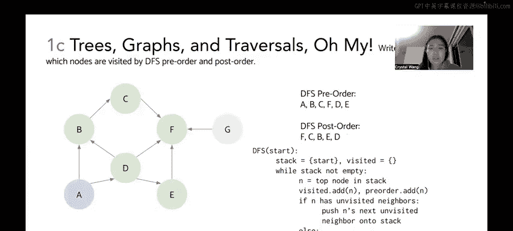

# 09：树、图与遍历


在本节课中，我们将学习二叉搜索树（BST）的四种遍历方式：中序、广度优先、前序和后序遍历。同时，我们也会探讨图的两种表示方法：邻接矩阵和邻接列表，并学习如何在图上执行深度优先搜索（DFS）的前序与后序遍历。

---

## 中序遍历

上一节我们介绍了课程目标，本节中我们来看看中序遍历。中序遍历遵循“左-根-右”的顺序访问二叉树的节点。其核心思想是递归地处理左子树，然后访问根节点，最后递归地处理右子树。

以下是中序遍历的伪代码：
```
inorder(T):
    if T is null:
        return
    inorder(T.left)
    visit(T)
    inorder(T.right)
```

让我们对示例树执行中序遍历。我们从根节点 `10` 开始。

1.  递归进入 `10` 的左子树（节点 `3`）。
2.  递归进入 `3` 的左子树（节点 `1`）。
3.  节点 `1` 没有左孩子，因此访问节点 `1`。
4.  节点 `1` 没有右孩子，返回。
5.  回到节点 `3`，访问节点 `3`。
6.  递归进入 `3` 的右子树（节点 `7`）。
7.  节点 `7` 没有左孩子，因此访问节点 `7`。
8.  节点 `7` 没有右孩子，返回。
9.  回到节点 `10`，访问节点 `10`。
10. 递归进入 `10` 的右子树（节点 `12`）。
11. 递归进入 `12` 的左子树（节点 `11`）。
12. 节点 `11` 没有左孩子，因此访问节点 `11`。
13. 节点 `11` 没有右孩子，返回。
14. 回到节点 `12`，访问节点 `12`。
15. 递归进入 `12` 的右子树（节点 `14`）。
16. 递归进入 `14` 的左子树（节点 `13`）。
17. 节点 `13` 没有左孩子，因此访问节点 `13`。
18. 节点 `13` 没有右孩子，返回。
19. 回到节点 `14`，访问节点 `14`。
20. 递归进入 `14` 的右子树（节点 `15`）。
21. 节点 `15` 没有左孩子，因此访问节点 `15`。
22. 节点 `15` 没有右孩子，返回。遍历结束。

因此，中序遍历的结果序列是：`1, 3, 7, 10, 11, 12, 13, 14, 15`。一个有趣的现象是，对二叉搜索树进行中序遍历，输出的节点值恰好是升序排列的。这是因为BST的性质保证了左子树的所有节点值小于根节点，右子树的所有节点值大于根节点，而中序遍历的顺序恰好先访问左子树，再访问根节点，最后访问右子树。

---

## 广度优先遍历

理解了中序遍历后，我们来看看广度优先遍历。广度优先遍历（BFS）按层级访问树的节点，从根节点开始，逐层向下。它使用队列（先进先出）数据结构来辅助实现。

以下是BFS的伪代码：
```
BFS(start):
    queue = new Queue()
    queue.enqueue(start)
    while queue is not empty:
        node = queue.dequeue()
        visit(node)
        for each neighbor in node.unvisited_neighbors:
            queue.enqueue(neighbor)
```

让我们对同一棵树执行BFS，从根节点 `10` 开始。

1.  初始队列：`[10]`。
2.  出队 `10` 并访问。将其邻居 `3` 和 `12` 入队。队列：`[3, 12]`。
3.  出队 `3` 并访问。将其邻居 `1` 和 `7` 入队。队列：`[12, 1, 7]`。
4.  出队 `12` 并访问。将其邻居 `11` 和 `14` 入队。队列：`[1, 7, 11, 14]`。
5.  出队 `1` 并访问。它没有孩子，不添加新节点。队列：`[7, 11, 14]`。
6.  出队 `7` 并访问。它没有孩子。队列：`[11, 14]`。
7.  出队 `11` 并访问。它没有孩子。队列：`[14]`。
8.  出队 `14` 并访问。将其邻居 `13` 和 `15` 入队。队列：`[13, 15]`。
9.  出队 `13` 并访问。它没有孩子。队列：`[15]`。
10. 出队 `15` 并访问。它没有孩子。队列为空，遍历结束。

因此，广度优先遍历的结果序列是：`10, 3, 12, 1, 7, 11, 14, 13, 15`。

---

## 前序遍历与后序遍历

接下来，我们快速浏览前序和后序遍历。这两种遍历方式可以推广到更一般的图结构，但在树上同样适用。

前序遍历遵循“根-左-右”的顺序。

以下是前序遍历的伪代码：
```
preorder(T):
    if T is null:
        return
    visit(T)
    preorder(T.left)
    preorder(T.right)
```

对示例树执行前序遍历：
1.  访问根节点 `10`。
2.  递归处理左子树（以 `3` 为根）：访问 `3`，然后访问 `3` 的左孩子 `1`，再访问 `3` 的右孩子 `7`。序列目前为：`10, 3, 1, 7`。
3.  递归处理右子树（以 `12` 为根）：访问 `12`，然后访问 `12` 的左孩子 `11`。
4.  接着处理 `12` 的右子树（以 `14` 为根）：访问 `14`，然后访问 `14` 的左孩子 `13`，再访问 `14` 的右孩子 `15`。

最终前序遍历序列为：`10, 3, 1, 7, 12, 11, 14, 13, 15`。

后序遍历遵循“左-右-根”的顺序。

以下是后序遍历的伪代码：
```
postorder(T):
    if T is null:
        return
    postorder(T.left)
    postorder(T.right)
    visit(T)
```

对示例树执行后序遍历：
1.  递归处理左子树（以 `3` 为根）：先访问 `1`，然后访问 `7`，最后访问 `3`。序列目前为：`1, 7, 3`。
2.  递归处理右子树（以 `12` 为根）：先处理 `12` 的左子树（`11`），访问 `11`。
3.  再处理 `12` 的右子树（以 `14` 为根）：先访问 `13`，然后访问 `15`，最后访问 `14`。序列新增：`11, 13, 15, 14`。
4.  最后访问 `12`。
5.  回到整棵树的根，访问 `10`。

最终后序遍历序列为：`1, 7, 3, 11, 13, 15, 14, 12, 10`。

后序遍历的核心思想是：在处理一个节点之前，必须先完全处理它的所有子节点。

---

## 图的表示：邻接矩阵与邻接列表

现在，我们将目光从树转向更一般的图。图的表示方法主要有两种：邻接矩阵和邻接列表。我们以一个包含节点 A 到 G 的有向图为例。

邻接矩阵是一个二维表格，行和列都代表图中的节点。如果存在从行节点指向列节点的有向边，则在对应位置标记为 `1`（或打勾），否则为 `0`。

以下是构建邻接矩阵的步骤：
*   行 A：有边指向 B 和 D。在 (A,B) 和 (A,D) 位置标记。
*   行 B：有边指向 C。在 (B,C) 位置标记。
*   行 C：有边指向 F。在 (C,F) 位置标记。
*   行 D：有边指向 B, E, F。在 (D,B), (D,E), (D,F) 位置标记。
*   行 E：有边指向 F。在 (E,F) 位置标记。
*   行 F：没有出边。该行全为0。
*   行 G：有边指向 F。在 (G,F) 位置标记。

邻接列表则是一种更节省空间的方式，它为每个节点维护一个列表，记录该节点直接指向的所有邻居节点。

以下是邻接列表的表示：
*   A -> [B, D]
*   B -> [C]
*   C -> [F]
*   D -> [B, E, F]
*   E -> [F]
*   F -> []
*   G -> [F]

---

## 图的深度优先遍历

最后，我们学习在图上执行深度优先搜索，并区分前序和后序访问顺序。我们使用栈（后进先出）来实现DFS，并规定按字母顺序处理邻居。

以下是结合了前序和后序记录的DFS算法核心步骤：
```
DFS(start):
    stack.push(start)
    while stack is not empty:
        node = stack.peek() // 查看栈顶元素但不弹出
        if node is not visited:
            mark node as visited
            add node to preorder_list // 入栈时记录前序
        if node has an unvisited neighbor:
            push the next unvisited neighbor onto stack
        else:
            stack.pop() // 弹出栈顶
            add node to postorder_list // 出栈时记录后序
```

我们从节点 A 开始执行这个算法。

以下是详细的访问过程：
1.  A 入栈，标记为已访问，加入前序列表。栈：[A]。前序：[A]。
2.  A 有未访问邻居 B 和 D（按字母顺序选 B）。B 入栈，标记，加入前序。栈：[A, B]。前序：[A, B]。
3.  B 有未访问邻居 C。C 入栈，标记，加入前序。栈：[A, B, C]。前序：[A, B, C]。
4.  C 有未访问邻居 F。F 入栈，标记，加入前序。栈：[A, B, C, F]。前序：[A, B, C, F]。
5.  F 没有未访问邻居。F 出栈，加入后序列表。栈：[A, B, C]。后序：[F]。
6.  C 没有其他未访问邻居。C 出栈，加入后序列表。栈：[A, B]。后序：[F, C]。
7.  B 没有其他未访问邻居。B 出栈，加入后序列表。栈：[A]。后序：[F, C, B]。
8.  A 还有未访问邻居 D。D 入栈，标记，加入前序。栈：[A, D]。前序：[A, B, C, F, D]。
9.  D 有未访问邻居 E。E 入栈，标记，加入前序。栈：[A, D, E]。前序：[A, B, C, F, D, E]。
10. E 的邻居 F 已访问，无其他未访问邻居。E 出栈，加入后序列表。栈：[A, D]。后序：[F, C, B, E]。
11. D 的所有邻居（B, E, F）均已访问。D 出栈，加入后序列表。栈：[A]。后序：[F, C, B, E, D]。
12. A 的所有邻居（B, D）均已访问。A 出栈，加入后序列表。栈：[]。后序：[F, C, B, E, D, A]。

最终结果：
*   DFS 前序序列（节点入栈时记录）：`A, B, C, F, D, E`
*   DFS 后序序列（节点出栈时记录）：`F, C, B, E, D, A`

需要注意的是，节点 G 从 A 出发不可达，因此在此次遍历中未被访问。如果算法允许从未访问节点重新启动DFS，那么 G 将被单独遍历。

---



本节课中我们一起学习了二叉搜索树的四种遍历方式（中序、广度优先、前序、后序），掌握了图的两种表示法（邻接矩阵和邻接列表），并通过一个详细的例子理解了如何在图上执行深度优先搜索并得到其前序和后序遍历序列。理解这些遍历的顺序和实现机制是学习图论算法的重要基础。